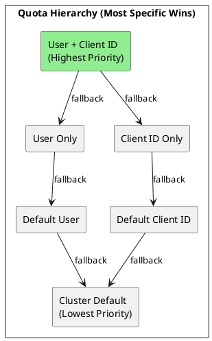
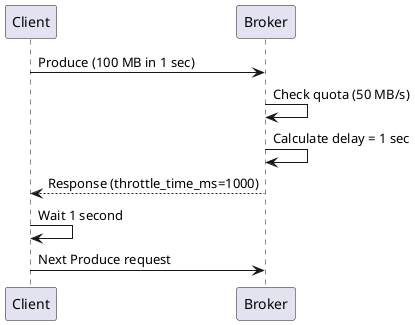

# Quotas Configuration

Quotas limit resource consumption by Kafka clients. They prevent individual clients from monopolizing cluster resources and enable fair resource sharing across applications.

---

## Quota Types

| Quota Type | Metric | Unit | Purpose |
|------------|--------|------|---------|
| `producer_byte_rate` | Producer throughput | bytes/sec | Limit write bandwidth |
| `consumer_byte_rate` | Consumer throughput | bytes/sec | Limit read bandwidth |
| `request_percentage` | Request handler time | % of capacity | Limit CPU usage |
| `controller_mutation_rate` | Metadata mutations | mutations/sec | Limit control plane load |

---

## Quota Entities

Quotas can be applied to different entity combinations:



### Entity Types

| Entity | Description | Example |
|--------|-------------|---------|
| User | Authenticated principal | `User:alice` |
| Client ID | Client identifier string | `producer-app-1` |
| User + Client ID | Specific user with specific client | `User:alice` + `producer-1` |
| Default | Applies to all users/clients | `<default>` |

---

## Managing Quotas

### Setting Producer Quotas

```bash
# Quota for specific user
kafka-configs.sh --bootstrap-server kafka:9092 \
  --alter \
  --add-config 'producer_byte_rate=10485760' \
  --entity-type users \
  --entity-name producer-user

# Quota for specific client ID
kafka-configs.sh --bootstrap-server kafka:9092 \
  --alter \
  --add-config 'producer_byte_rate=5242880' \
  --entity-type clients \
  --entity-name my-producer-app

# Quota for user + client ID combination
kafka-configs.sh --bootstrap-server kafka:9092 \
  --alter \
  --add-config 'producer_byte_rate=20971520' \
  --entity-type users \
  --entity-name producer-user \
  --entity-type clients \
  --entity-name high-priority-producer
```

### Setting Consumer Quotas

```bash
# Consumer quota for user
kafka-configs.sh --bootstrap-server kafka:9092 \
  --alter \
  --add-config 'consumer_byte_rate=52428800' \
  --entity-type users \
  --entity-name consumer-user

# Consumer quota for client ID
kafka-configs.sh --bootstrap-server kafka:9092 \
  --alter \
  --add-config 'consumer_byte_rate=26214400' \
  --entity-type clients \
  --entity-name my-consumer-app
```

### Setting Request Quotas

```bash
# Limit CPU usage to 50% of one I/O thread
kafka-configs.sh --bootstrap-server kafka:9092 \
  --alter \
  --add-config 'request_percentage=50' \
  --entity-type users \
  --entity-name batch-processor
```

### Setting Default Quotas

```bash
# Default quota for all users
kafka-configs.sh --bootstrap-server kafka:9092 \
  --alter \
  --add-config 'producer_byte_rate=10485760,consumer_byte_rate=52428800' \
  --entity-type users \
  --entity-default

# Default quota for all client IDs
kafka-configs.sh --bootstrap-server kafka:9092 \
  --alter \
  --add-config 'producer_byte_rate=5242880' \
  --entity-type clients \
  --entity-default
```

---

## Viewing Quotas

```bash
# View quota for specific user
kafka-configs.sh --bootstrap-server kafka:9092 \
  --describe \
  --entity-type users \
  --entity-name producer-user

# View quota for specific client
kafka-configs.sh --bootstrap-server kafka:9092 \
  --describe \
  --entity-type clients \
  --entity-name my-producer-app

# View all user quotas
kafka-configs.sh --bootstrap-server kafka:9092 \
  --describe \
  --entity-type users

# View default quotas
kafka-configs.sh --bootstrap-server kafka:9092 \
  --describe \
  --entity-type users \
  --entity-default
```

---

## Removing Quotas

```bash
# Remove specific quota
kafka-configs.sh --bootstrap-server kafka:9092 \
  --alter \
  --delete-config 'producer_byte_rate' \
  --entity-type users \
  --entity-name producer-user

# Remove all quotas for entity
kafka-configs.sh --bootstrap-server kafka:9092 \
  --alter \
  --delete-config 'producer_byte_rate,consumer_byte_rate,request_percentage' \
  --entity-type users \
  --entity-name producer-user
```

---

## Quota Resolution

When multiple quotas apply, the most specific quota takes precedence:

### Resolution Order

1. **User + Client ID** - Most specific
2. **User only**
3. **Client ID only**
4. **Default User** (`--entity-default`)
5. **Default Client ID** (`--entity-default`)
6. **No quota** - Unlimited

### Example Resolution

```
User: alice, Client ID: producer-1

Quota sources:
1. User:alice + Client:producer-1 → 20 MB/s (APPLIED)
2. User:alice → 10 MB/s
3. Client:producer-1 → 5 MB/s
4. Default User → 1 MB/s
5. Default Client → 1 MB/s

Result: 20 MB/s (most specific match wins)
```

---

## Broker Configuration

### Quota Windows

```properties
# Broker configuration for quota enforcement
quota.window.num=11
quota.window.size.seconds=1
```

| Setting | Default | Description |
|---------|---------|-------------|
| `quota.window.num` | 11 | Number of samples for rate calculation |
| `quota.window.size.seconds` | 1 | Duration of each sample window |

### Controller Mutation Quotas

```properties
# Limit metadata mutations per second
controller.quota.window.num=11
controller.quota.window.size.seconds=1
```

```bash
# Set controller mutation quota
kafka-configs.sh --bootstrap-server kafka:9092 \
  --alter \
  --add-config 'controller_mutation_rate=10' \
  --entity-type users \
  --entity-name admin-user
```

---

## Throttling Behavior

### How Throttling Works

When a client exceeds its quota:

1. Broker calculates delay based on excess usage
2. Response includes `throttle_time_ms`
3. Client pauses before next request
4. Metrics track throttling events



### Throttling Metrics

| Metric | Description |
|--------|-------------|
| `produce-throttle-time` | Producer throttle time (ms) |
| `fetch-throttle-time` | Consumer throttle time (ms) |
| `request-time` | Total request time including throttle |

---

## Common Quota Patterns

### Multi-Tenant Cluster

```bash
# Tenant A: High priority
kafka-configs.sh --bootstrap-server kafka:9092 \
  --alter \
  --add-config 'producer_byte_rate=104857600,consumer_byte_rate=209715200' \
  --entity-type users \
  --entity-name tenant-a

# Tenant B: Standard
kafka-configs.sh --bootstrap-server kafka:9092 \
  --alter \
  --add-config 'producer_byte_rate=52428800,consumer_byte_rate=104857600' \
  --entity-type users \
  --entity-name tenant-b

# Tenant C: Basic
kafka-configs.sh --bootstrap-server kafka:9092 \
  --alter \
  --add-config 'producer_byte_rate=10485760,consumer_byte_rate=20971520' \
  --entity-type users \
  --entity-name tenant-c
```

### Application Tiers

```bash
# Critical applications - high quota
kafka-configs.sh --bootstrap-server kafka:9092 \
  --alter \
  --add-config 'producer_byte_rate=104857600' \
  --entity-type clients \
  --entity-name 'critical-*'

# Batch jobs - limited quota
kafka-configs.sh --bootstrap-server kafka:9092 \
  --alter \
  --add-config 'producer_byte_rate=10485760,request_percentage=25' \
  --entity-type clients \
  --entity-name 'batch-*'

# Default for unknown applications
kafka-configs.sh --bootstrap-server kafka:9092 \
  --alter \
  --add-config 'producer_byte_rate=5242880,consumer_byte_rate=10485760' \
  --entity-type clients \
  --entity-default
```

### Protecting Control Plane

```bash
# Limit admin operations
kafka-configs.sh --bootstrap-server kafka:9092 \
  --alter \
  --add-config 'controller_mutation_rate=50' \
  --entity-type users \
  --entity-name admin-user

# Limit automation tools
kafka-configs.sh --bootstrap-server kafka:9092 \
  --alter \
  --add-config 'controller_mutation_rate=10' \
  --entity-type users \
  --entity-name ci-cd-user
```

---

## Quota Sizing Guidelines

### Producer Quotas

| Workload | Suggested Quota | Rationale |
|----------|-----------------|-----------|
| High-priority | 100 MB/s | Real-time applications |
| Standard | 50 MB/s | Normal production traffic |
| Batch | 10-20 MB/s | Background processing |
| Development | 5 MB/s | Non-production |

### Consumer Quotas

| Workload | Suggested Quota | Rationale |
|----------|-----------------|-----------|
| High-priority | 200 MB/s | Real-time consumers |
| Standard | 100 MB/s | Normal consumption |
| Analytics | 50 MB/s | Batch analytics |
| Monitoring | 10 MB/s | Metrics collection |

### Request Quotas

| Application Type | Suggested % | Rationale |
|------------------|-------------|-----------|
| Critical | 100% | No throttling |
| Standard | 50-75% | Fair share |
| Batch | 25% | Background priority |
| Development | 10% | Limited resources |

---

## Monitoring Quotas

### JMX Metrics

```
# Per-user metrics
kafka.server:type=Fetch,user=([-.\w]+),client-id=([-.\w]+)
kafka.server:type=Produce,user=([-.\w]+),client-id=([-.\w]+)
kafka.server:type=Request,user=([-.\w]+),client-id=([-.\w]+)

# Throttle metrics
kafka.server:type=FetchThrottleTime,user=([-.\w]+),client-id=([-.\w]+)
kafka.server:type=ProduceThrottleTime,user=([-.\w]+),client-id=([-.\w]+)
kafka.server:type=RequestThrottleTime,user=([-.\w]+),client-id=([-.\w]+)
```

### Key Metrics to Monitor

| Metric | Alert Threshold | Description |
|--------|-----------------|-------------|
| `byte-rate` | > 90% of quota | Approaching limit |
| `throttle-time` | > 1000 ms | Significant throttling |
| `request-percentage` | > 90% | CPU quota approaching limit |

### Grafana Query Example

```promql
# Producer throttle rate by user
rate(kafka_server_produce_throttle_time_total{user!=""}[5m])

# Consumer byte rate vs quota
kafka_server_fetch_byte_rate / kafka_server_fetch_byte_rate_quota
```

---

## Troubleshooting

### Common Issues

| Issue | Symptom | Solution |
|-------|---------|----------|
| Unexpected throttling | Client receives throttle response | Check quota resolution, verify applied quota |
| Quota not applied | No throttling despite high traffic | Verify entity names match exactly |
| Wrong quota precedence | Different quota than expected | Check all entity combinations |

### Debugging Quotas

```bash
# List all quotas for troubleshooting
kafka-configs.sh --bootstrap-server kafka:9092 \
  --describe \
  --entity-type users

kafka-configs.sh --bootstrap-server kafka:9092 \
  --describe \
  --entity-type clients

kafka-configs.sh --bootstrap-server kafka:9092 \
  --describe \
  --entity-type users \
  --entity-default

kafka-configs.sh --bootstrap-server kafka:9092 \
  --describe \
  --entity-type clients \
  --entity-default
```

### Client-Side Debugging

```java
// Check producer metrics for throttling
Metric throttleTime = producer.metrics().get(
    new MetricName("produce-throttle-time-avg", "producer-metrics", ...)
);
```

---

## Related Documentation

- [Configuration Overview](index.md) - Configuration guide
- [Broker Configuration](broker.md) - Broker settings
- [ACL Configuration](acl.md) - Access control
- [Monitoring](../monitoring/index.md) - Metrics and alerting
- [Performance](../performance/index.md) - Performance tuning