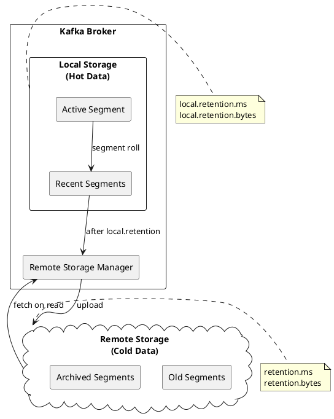

# Tiered Storage Configuration

Tiered storage (KIP-405) enables Kafka to offload log segments to remote storage systems, enabling cost-effective long-term retention while maintaining local storage for recent data.

!!! note "Version Requirement"
    Tiered storage is an early access feature in Apache Kafka 3.6+. Production readiness varies by release.

---

## Architecture Overview



### Storage Tiers

| Tier | Storage | Retention | Access Pattern |
|------|---------|-----------|----------------|
| **Local (Hot)** | Broker disk | `local.retention.ms` | Frequent reads |
| **Remote (Cold)** | Object storage | `retention.ms` | Infrequent reads |

---

## Enabling Tiered Storage

### Broker Configuration

```properties
# server.properties

# Enable tiered storage
remote.log.storage.system.enable=true

# Remote storage manager plugin (implementation-specific)
remote.log.storage.manager.class.name=com.example.kafka.remote.RemoteStorageManager
remote.log.storage.manager.class.path=/opt/kafka/plugins/tiered-storage

# Remote log metadata manager
remote.log.metadata.manager.class.name=org.apache.kafka.server.log.remote.metadata.storage.TopicBasedRemoteLogMetadataManager

# Metadata topic configuration
remote.log.metadata.topic.num.partitions=50
remote.log.metadata.topic.replication.factor=3

# Reader and copier threads
remote.log.reader.threads=10
remote.log.copier.threads=10
```

### Topic Configuration

```bash
# Enable tiered storage for topic
kafka-configs.sh --bootstrap-server kafka:9092 \
  --entity-type topics \
  --entity-name events \
  --alter \
  --add-config remote.storage.enable=true

# Configure local retention (hot tier)
kafka-configs.sh --bootstrap-server kafka:9092 \
  --entity-type topics \
  --entity-name events \
  --alter \
  --add-config local.retention.ms=86400000  # 1 day local

# Configure total retention (including remote)
kafka-configs.sh --bootstrap-server kafka:9092 \
  --entity-type topics \
  --entity-name events \
  --alter \
  --add-config retention.ms=2592000000  # 30 days total
```

---

## Remote Storage Backends

!!! warning "Plugin required"
    Apache Kafka does not ship an object store implementation. You must install a remote storage manager plugin and use its class name and config keys.

### Amazon S3 (Vendor Plugin Example)

```properties
# S3 Remote Storage Manager configuration
remote.log.storage.manager.class.name=io.confluent.kafka.tiered.storage.s3.S3RemoteStorageManager

# S3 bucket
remote.log.storage.s3.bucket.name=my-kafka-tiered-storage
remote.log.storage.s3.region=us-east-1

# Authentication (use IAM roles when possible)
remote.log.storage.s3.credentials.provider.class=com.amazonaws.auth.DefaultAWSCredentialsProviderChain

# Or explicit credentials (not recommended)
# remote.log.storage.s3.access.key=AKIAXXXXXXXX
# remote.log.storage.s3.secret.key=XXXXXXXX

# S3 settings
remote.log.storage.s3.endpoint.override=  # For S3-compatible storage
remote.log.storage.s3.path.style.access.enabled=false
```

### Google Cloud Storage (Vendor Plugin Example)

```properties
# GCS Remote Storage Manager configuration
remote.log.storage.manager.class.name=io.confluent.kafka.tiered.storage.gcs.GCSRemoteStorageManager

# GCS bucket
remote.log.storage.gcs.bucket.name=my-kafka-tiered-storage
remote.log.storage.gcs.project.id=my-project

# Authentication
remote.log.storage.gcs.credentials.path=/etc/kafka/gcs-credentials.json
```

### Azure Blob Storage (Vendor Plugin Example)

```properties
# Azure Blob Remote Storage Manager configuration
remote.log.storage.manager.class.name=io.confluent.kafka.tiered.storage.azure.AzureBlobRemoteStorageManager

# Azure container
remote.log.storage.azure.container.name=kafka-tiered-storage
remote.log.storage.azure.account.name=mystorageaccount

# Authentication
remote.log.storage.azure.account.key=XXXXX
# Or use managed identity
remote.log.storage.azure.use.managed.identity=true
```

---

## Topic-Level Configuration

### Retention Settings

| Setting | Description |
|---------|-------------|
| `remote.storage.enable` | Enable tiered storage for topic |
| `local.retention.ms` | Time to retain locally before tiering |
| `local.retention.bytes` | Size to retain locally per partition |
| `retention.ms` | Total retention (local + remote) |
| `retention.bytes` | Total size retention per partition |

### Example Configurations

**High-Volume Event Stream:**
```bash
# 6 hours local, 90 days total
kafka-configs.sh --bootstrap-server kafka:9092 \
  --entity-type topics \
  --entity-name events \
  --alter \
  --add-config remote.storage.enable=true,\
local.retention.ms=21600000,\
retention.ms=7776000000
```

**Audit Log (Long Retention):**
```bash
# 1 day local, 7 years total
kafka-configs.sh --bootstrap-server kafka:9092 \
  --entity-type topics \
  --entity-name audit-log \
  --alter \
  --add-config remote.storage.enable=true,\
local.retention.ms=86400000,\
retention.ms=220752000000
```

**Size-Based Tiering:**
```bash
# 10GB local, 1TB total per partition
kafka-configs.sh --bootstrap-server kafka:9092 \
  --entity-type topics \
  --entity-name large-events \
  --alter \
  --add-config remote.storage.enable=true,\
local.retention.bytes=10737418240,\
retention.bytes=1099511627776
```

---

## Metadata Management

Tiered storage maintains metadata about remote segments in an internal Kafka topic.

### Metadata Topic Configuration

```properties
# Metadata topic settings
remote.log.metadata.topic.num.partitions=50
remote.log.metadata.topic.replication.factor=3
remote.log.metadata.topic.retention.ms=-1

# Metadata manager settings
remote.log.metadata.manager.listener.name=INTERNAL
remote.log.metadata.custom.metadata.max.bytes=1024
```

### Metadata Operations

```properties
# Metadata initialization timeout
remote.log.metadata.manager.impl.prefix=rlmm.config.
rlmm.config.remote.log.metadata.topic.replication.factor=3

# Metadata consumption settings
remote.log.metadata.consume.wait.ms=120000
```

---

## Performance Tuning

### Thread Configuration

```properties
# Segment upload threads (per broker)
remote.log.copier.threads=10

# Segment download threads (for consumer reads)
remote.log.reader.threads=10

# Expiration threads (deleting expired remote segments)
remote.log.manager.expiration.threads=10

# Task queue size
remote.log.manager.task.queue.max.size=100

# Retry settings
remote.log.manager.task.retry.backoff.ms=100
remote.log.manager.task.retry.max.attempts=5
```

### Upload Settings

```properties
# Minimum segment age before upload
remote.log.copy.segment.age.threshold.ms=30000

# Interval between upload checks
remote.log.manager.copier.task.interval.ms=30000

# Upload batch size
remote.log.segment.copy.max.batch.size=100
```

### Read Settings

```properties
# Prefetch for remote reads
remote.log.reader.fetch.max.bytes=52428800

# Cache for remote segments (optional, implementation-specific)
remote.log.storage.cache.size.bytes=1073741824
remote.log.storage.cache.dir=/var/kafka/remote-cache
```

---

## Monitoring

### Key Metrics

| Metric | Description |
|--------|-------------|
| `RemoteLogManager.RemoteCopyLagBytes` | Bytes pending upload |
| `RemoteLogManager.RemoteCopyLagSegments` | Segments pending upload |
| `RemoteLogManager.RemoteReadRequestsPerSec` | Remote read rate |
| `RemoteLogManager.RemoteReadBytesPerSec` | Remote read throughput |
| `RemoteLogManager.RemoteCopyBytesPerSec` | Upload throughput |
| `RemoteLogManager.RemoteDeleteLagBytes` | Bytes pending deletion |

### JMX Beans

```
kafka.log.remote:type=RemoteLogManager,name=*
kafka.log.remote:type=RemoteStorageManager,name=*
kafka.log.remote:type=RemoteLogMetadataManager,name=*
```

### Alerting Thresholds

| Metric | Warning | Critical |
|--------|---------|----------|
| `RemoteCopyLagBytes` | > 1GB | > 10GB |
| `RemoteCopyLagSegments` | > 10 | > 100 |
| `RemoteReadRequestsPerSec` | Baseline +50% | Baseline +100% |

---

## Operational Considerations

### Storage Costs

| Storage Type | Cost Factor | Access Cost |
|--------------|-------------|-------------|
| Local SSD | High $/GB | None |
| S3 Standard | Low $/GB | Per request |
| S3 Infrequent Access | Lower $/GB | Higher per request |
| S3 Glacier | Lowest $/GB | High + retrieval time |

### Migration Strategy

1. **Enable on new topics first** - Test with non-critical workloads
2. **Gradual rollout** - Enable per topic, monitor impact
3. **Adjust local retention** - Start conservative, reduce gradually
4. **Monitor consumer latency** - Remote reads add latency

### Limitations

| Limitation | Description |
|------------|-------------|
| Compacted topics | Not supported with tiered storage |
| Consumer lag | Remote reads increase fetch latency |
| Transactions | Transactional data must complete before tiering |
| Partition reassignment | Remote segments must be considered |

---

## Troubleshooting

### Common Issues

| Issue | Cause | Solution |
|-------|-------|----------|
| High copy lag | Slow uploads | Increase copier threads |
| Failed uploads | Network/permission issues | Check remote storage connectivity |
| Slow remote reads | High consumer lag | Add read threads, consider caching |
| Metadata issues | Metadata topic problems | Check replication, monitor topic |

### Diagnostic Commands

```bash
# Check remote log manager status
kafka-log-dirs.sh --bootstrap-server kafka:9092 \
  --describe \
  --topic-list events

# List remote segments (implementation-specific)
# Check remote storage directly for segment inventory
```

### Log Analysis

```bash
# Check for tiered storage errors
grep -i "remote" /var/log/kafka/server.log | grep -i "error"

# Check upload progress
grep -i "RemoteLogManager" /var/log/kafka/server.log
```

---

## Related Documentation

- [Configuration Overview](index.md) - Configuration guide
- [Broker Configuration](broker.md) - Broker settings
- [Topic Configuration](topic.md) - Topic settings
- [Performance](../performance/index.md) - Performance tuning
- [Cloud Deployments](../../cloud/index.md) - Cloud storage integration
