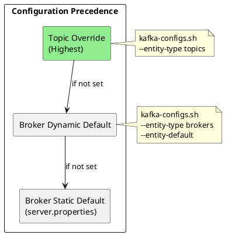
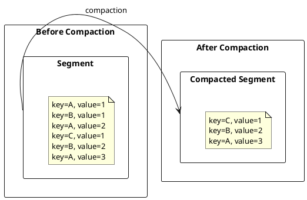

# Topic Configuration

Topic configuration controls per-topic behavior for retention, compaction, compression, and storage. Topic-level settings override broker defaults.

---

## Configuration Hierarchy

Topic configuration follows a precedence hierarchy:



---

## Managing Topic Configuration

### Create Topic with Configuration

```bash
kafka-topics.sh --bootstrap-server kafka:9092 \
  --create \
  --topic events \
  --partitions 12 \
  --replication-factor 3 \
  --config retention.ms=86400000 \
  --config cleanup.policy=delete \
  --config compression.type=lz4 \
  --config min.insync.replicas=2
```

### Modify Topic Configuration

```bash
# Add or update configuration
kafka-configs.sh --bootstrap-server kafka:9092 \
  --entity-type topics \
  --entity-name events \
  --alter \
  --add-config retention.ms=172800000,max.message.bytes=10485760

# Remove configuration (revert to default)
kafka-configs.sh --bootstrap-server kafka:9092 \
  --entity-type topics \
  --entity-name events \
  --alter \
  --delete-config retention.ms
```

### View Topic Configuration

```bash
# Show all topic configurations
kafka-configs.sh --bootstrap-server kafka:9092 \
  --entity-type topics \
  --entity-name events \
  --describe

# Show topic details including configuration
kafka-topics.sh --bootstrap-server kafka:9092 \
  --describe \
  --topic events
```

---

## Retention Configuration

### Time-Based Retention

```bash
# Retain messages for 24 hours
kafka-configs.sh --bootstrap-server kafka:9092 \
  --entity-type topics \
  --entity-name events \
  --alter \
  --add-config retention.ms=86400000
```

| Setting | Default | Description |
|---------|---------|-------------|
| `retention.ms` | 604800000 (7 days) | Time to retain messages |
| `retention.bytes` | -1 (unlimited) | Size limit per partition |
| `segment.ms` | 604800000 (7 days) | Time before rolling segment |

### Size-Based Retention

```bash
# Retain 10GB per partition
kafka-configs.sh --bootstrap-server kafka:9092 \
  --entity-type topics \
  --entity-name events \
  --alter \
  --add-config retention.bytes=10737418240
```

!!! note "Size Retention Behavior"
    `retention.bytes` applies per partition, not per topic. A topic with 12 partitions and `retention.bytes=10GB` can retain up to 120GB total.

### Combined Retention

When both time and size limits are set, messages are deleted when **either** limit is exceeded:

```bash
# Delete when older than 7 days OR when partition exceeds 50GB
kafka-configs.sh --bootstrap-server kafka:9092 \
  --entity-type topics \
  --entity-name events \
  --alter \
  --add-config retention.ms=604800000,retention.bytes=53687091200
```

---

## Cleanup Policies

### Delete Policy

```bash
kafka-configs.sh --bootstrap-server kafka:9092 \
  --entity-type topics \
  --entity-name events \
  --alter \
  --add-config cleanup.policy=delete
```

Segments are deleted when:
- Segment age exceeds `retention.ms`
- Partition size exceeds `retention.bytes`
- Segment is closed (newer segment exists)

### Compact Policy

Log compaction retains the latest value for each key:

```bash
kafka-configs.sh --bootstrap-server kafka:9092 \
  --entity-type topics \
  --entity-name user-profiles \
  --alter \
  --add-config cleanup.policy=compact
```



#### Compaction Settings

| Setting | Default | Description |
|---------|---------|-------------|
| `min.cleanable.dirty.ratio` | 0.5 | Minimum dirty/total ratio to trigger |
| `min.compaction.lag.ms` | 0 | Minimum age before compacting |
| `max.compaction.lag.ms` | MAX_LONG | Maximum age before forced compaction |
| `delete.retention.ms` | 86400000 | Time to retain tombstones |
| `segment.ms` | 604800000 | Time before rolling active segment |

```bash
# Configure compaction behavior
kafka-configs.sh --bootstrap-server kafka:9092 \
  --entity-type topics \
  --entity-name user-profiles \
  --alter \
  --add-config min.cleanable.dirty.ratio=0.3,\
min.compaction.lag.ms=3600000,\
delete.retention.ms=86400000
```

### Compact + Delete Policy

Combines compaction with time-based deletion:

```bash
kafka-configs.sh --bootstrap-server kafka:9092 \
  --entity-type topics \
  --entity-name changelog \
  --alter \
  --add-config cleanup.policy=compact,delete
```

With this policy:
- Records are compacted (latest value per key retained)
- Compacted segments are deleted after `retention.ms`

---

## Compression

### Topic-Level Compression

```bash
kafka-configs.sh --bootstrap-server kafka:9092 \
  --entity-type topics \
  --entity-name events \
  --alter \
  --add-config compression.type=zstd
```

| Value | Description |
|-------|-------------|
| `producer` | Use producer's compression (default) |
| `uncompressed` | Store uncompressed |
| `gzip` | GZIP compression |
| `snappy` | Snappy compression |
| `lz4` | LZ4 compression |
| `zstd` | Zstandard compression |

### Compression Behavior

| `compression.type` | Producer Compression | Stored As |
|--------------------|---------------------|-----------|
| `producer` | Any | Producer's choice |
| `lz4` | `none` | LZ4 (broker compresses) |
| `lz4` | `gzip` | LZ4 (broker recompresses) |
| `uncompressed` | `lz4` | Uncompressed (broker decompresses) |

!!! tip "Performance Consideration"
    Setting topic compression different from producer compression causes broker CPU overhead for recompression. Let producer control compression when possible (`compression.type=producer`).

---

## Message Size

```bash
kafka-configs.sh --bootstrap-server kafka:9092 \
  --entity-type topics \
  --entity-name large-events \
  --alter \
  --add-config max.message.bytes=10485760
```

| Setting | Default | Description |
|---------|---------|-------------|
| `max.message.bytes` | 1048588 (~1MB) | Maximum record batch size |
| `message.timestamp.type` | CreateTime | CreateTime or LogAppendTime |
| `message.timestamp.difference.max.ms` | MAX_LONG | Max timestamp deviation |

!!! warning "Coordinated Size Limits"
    Increasing `max.message.bytes` requires coordinating with:
    - Producer: `max.request.size`
    - Consumer: `max.partition.fetch.bytes`
    - Broker: `message.max.bytes`, `replica.fetch.max.bytes`

---

## Replication

### ISR Configuration

```bash
kafka-configs.sh --bootstrap-server kafka:9092 \
  --entity-type topics \
  --entity-name critical-events \
  --alter \
  --add-config min.insync.replicas=2
```

| Setting | Default | Description |
|---------|---------|-------------|
| `min.insync.replicas` | 1 | Minimum replicas for acks=all |
| `unclean.leader.election.enable` | false | Allow out-of-sync leader |

### Durability Patterns

| Replication Factor | min.insync.replicas | Tolerates |
|:------------------:|:-------------------:|-----------|
| 3 | 1 | 2 broker failures (data risk) |
| 3 | 2 | 1 broker failure (safe) |
| 5 | 3 | 2 broker failures (safe) |

!!! danger "min.insync.replicas=1"
    With `min.insync.replicas=1`, a single replica can acknowledge writes. If that replica fails before replication, data is lost even with `acks=all`.

---

## Segment Configuration

```bash
kafka-configs.sh --bootstrap-server kafka:9092 \
  --entity-type topics \
  --entity-name events \
  --alter \
  --add-config segment.bytes=536870912,segment.ms=3600000
```

| Setting | Default | Description |
|---------|---------|-------------|
| `segment.bytes` | 1073741824 (1GB) | Segment file size |
| `segment.ms` | 604800000 (7 days) | Time before rolling |
| `segment.index.bytes` | 10485760 | Index file size |
| `segment.jitter.ms` | 0 | Random jitter for segment rolling |

### Index Settings

| Setting | Default | Description |
|---------|---------|-------------|
| `index.interval.bytes` | 4096 | Bytes between index entries |
| `flush.messages` | MAX_LONG | Messages before fsync |
| `flush.ms` | MAX_LONG | Time before fsync |

!!! note "Segment Rolling"
    Active segments are not eligible for deletion or compaction. Smaller segments enable faster cleanup but increase file handle usage.

---

## Timestamps

```bash
kafka-configs.sh --bootstrap-server kafka:9092 \
  --entity-type topics \
  --entity-name events \
  --alter \
  --add-config message.timestamp.type=LogAppendTime
```

| Value | Description |
|-------|-------------|
| `CreateTime` | Producer-set timestamp (default) |
| `LogAppendTime` | Broker-set timestamp on append |

### Timestamp Validation

```bash
# Reject messages with timestamps too far from broker time
kafka-configs.sh --bootstrap-server kafka:9092 \
  --entity-type topics \
  --entity-name events \
  --alter \
  --add-config message.timestamp.difference.max.ms=86400000
```

---

## Follower Replication

```bash
kafka-configs.sh --bootstrap-server kafka:9092 \
  --entity-type topics \
  --entity-name events \
  --alter \
  --add-config follower.replication.throttled.replicas=0:1,0:2,1:1,1:2
```

| Setting | Description |
|---------|-------------|
| `follower.replication.throttled.replicas` | Replicas subject to replication throttle |
| `leader.replication.throttled.replicas` | Leaders subject to replication throttle |

Throttling is used during partition reassignment to limit network impact.

---

## Configuration Reference

### All Topic Settings

| Setting | Default | Description |
|---------|---------|-------------|
| `cleanup.policy` | delete | delete, compact, or both |
| `compression.type` | producer | Compression algorithm |
| `delete.retention.ms` | 86400000 | Tombstone retention |
| `file.delete.delay.ms` | 60000 | Delay before file deletion |
| `flush.messages` | MAX_LONG | Messages before fsync |
| `flush.ms` | MAX_LONG | Time before fsync |
| `index.interval.bytes` | 4096 | Index interval |
| `max.compaction.lag.ms` | MAX_LONG | Max time before compaction |
| `max.message.bytes` | 1048588 | Maximum message size |
| `message.timestamp.type` | CreateTime | Timestamp type |
| `message.timestamp.difference.max.ms` | MAX_LONG | Max timestamp difference |
| `min.cleanable.dirty.ratio` | 0.5 | Compaction trigger ratio |
| `min.compaction.lag.ms` | 0 | Min time before compaction |
| `min.insync.replicas` | 1 | Minimum ISR |
| `preallocate` | false | Preallocate segment files |
| `retention.bytes` | -1 | Size retention per partition |
| `retention.ms` | 604800000 | Time retention |
| `segment.bytes` | 1073741824 | Segment size |
| `segment.index.bytes` | 10485760 | Index file size |
| `segment.jitter.ms` | 0 | Segment roll jitter |
| `segment.ms` | 604800000 | Segment roll time |
| `unclean.leader.election.enable` | false | Allow unclean election |

---

## Related Documentation

- [Configuration Overview](index.md) - Configuration guide
- [Broker Configuration](broker.md) - Broker settings
- [CLI Tools](../cli-tools/index.md) - kafka-topics and kafka-configs
- [Concepts: Topics](../../concepts/topics/index.md) - Topic concepts