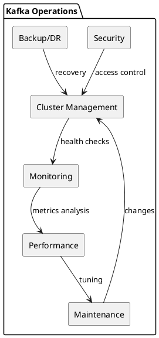
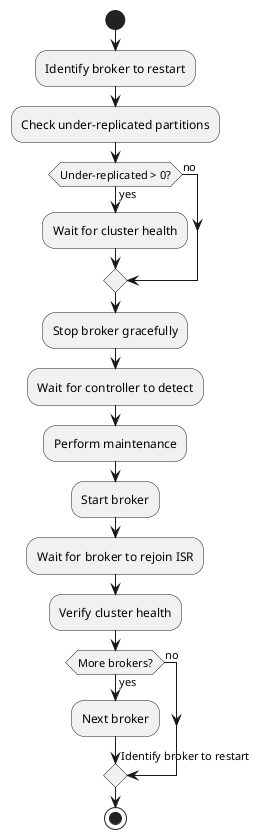
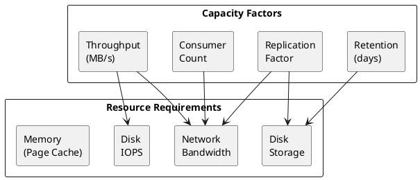

# Kafka Operations

Operational procedures for managing Apache Kafka clusters in production environments.

---

## Operations Overview

Kafka operations encompass cluster management, monitoring, performance optimization, and maintenance activities required to run Kafka reliably at scale.



### Operations Categories

| Category | Activities |
|----------|------------|
| **Cluster Management** | Broker lifecycle, partition management, configuration |
| **Monitoring** | Metrics collection, alerting, dashboards |
| **Performance** | Tuning, capacity planning, benchmarking |
| **Maintenance** | Upgrades, rolling restarts, log management |
| **Security** | Authentication, authorization, encryption |
| **Backup/DR** | Replication, disaster recovery, data migration |

---

## Cluster Management

### Broker Operations

| Operation | Command/Procedure |
|-----------|-------------------|
| **Start broker** | `kafka-server-start.sh config/server.properties` |
| **Stop broker** | `kafka-server-stop.sh` or graceful shutdown |
| **Check broker status** | `kafka-broker-api-versions.sh --bootstrap-server host:9092` |
| **List brokers** | `kafka-metadata.sh --snapshot /path/to/metadata --command "brokers"` (KRaft) |

### Adding a Broker

1. Configure new broker with unique `broker.id`
2. Start broker—it joins cluster automatically
3. Reassign partitions to include new broker:

```bash
# Generate reassignment plan
kafka-reassign-partitions.sh --bootstrap-server kafka:9092 \
  --topics-to-move-json-file topics.json \
  --broker-list "1,2,3,4" \
  --generate

# Execute reassignment
kafka-reassign-partitions.sh --bootstrap-server kafka:9092 \
  --reassignment-json-file reassignment.json \
  --execute

# Verify progress
kafka-reassign-partitions.sh --bootstrap-server kafka:9092 \
  --reassignment-json-file reassignment.json \
  --verify
```

### Removing a Broker

1. Reassign all partitions away from broker
2. Verify no partitions remain on broker
3. Stop broker
4. (KRaft) Unregister broker:

```bash
kafka-metadata.sh --snapshot /path/to/metadata \
  --command "unregister --id 4"
```

### Rolling Restart



**Rolling restart script pattern:**
```bash
for broker in broker1 broker2 broker3; do
  echo "Restarting $broker"

  # Check cluster health
  kafka-topics.sh --bootstrap-server kafka:9092 \
    --describe --under-replicated-partitions

  # Stop broker
  ssh $broker "kafka-server-stop.sh"

  # Wait for controlled shutdown
  sleep 30

  # Start broker
  ssh $broker "kafka-server-start.sh -daemon config/server.properties"

  # Wait for broker to rejoin
  sleep 60

  # Verify ISR
  until kafka-topics.sh --bootstrap-server kafka:9092 \
    --describe --under-replicated-partitions | grep -q "^$"; do
    sleep 10
  done

  echo "$broker restarted successfully"
done
```

→ [Cluster Management Guide](cluster-management/index.md)

---

## CLI Tools

### Essential Commands

| Tool | Purpose |
|------|---------|
| `kafka-topics.sh` | Topic management |
| `kafka-configs.sh` | Configuration management |
| `kafka-consumer-groups.sh` | Consumer group management |
| `kafka-reassign-partitions.sh` | Partition reassignment |
| `kafka-acls.sh` | ACL management |
| `kafka-metadata.sh` | KRaft metadata inspection |
| `kafka-dump-log.sh` | Log segment inspection |

### kafka-topics.sh

```bash
# List topics
kafka-topics.sh --bootstrap-server kafka:9092 --list

# Describe topic
kafka-topics.sh --bootstrap-server kafka:9092 \
  --describe --topic orders

# Create topic
kafka-topics.sh --bootstrap-server kafka:9092 \
  --create --topic orders \
  --partitions 12 --replication-factor 3

# Delete topic
kafka-topics.sh --bootstrap-server kafka:9092 \
  --delete --topic orders

# Find problematic partitions
kafka-topics.sh --bootstrap-server kafka:9092 \
  --describe --under-replicated-partitions

kafka-topics.sh --bootstrap-server kafka:9092 \
  --describe --unavailable-partitions
```

### kafka-consumer-groups.sh

```bash
# List consumer groups
kafka-consumer-groups.sh --bootstrap-server kafka:9092 --list

# Describe group
kafka-consumer-groups.sh --bootstrap-server kafka:9092 \
  --describe --group order-processor

# Reset offsets (requires group to be inactive)
kafka-consumer-groups.sh --bootstrap-server kafka:9092 \
  --group order-processor \
  --topic orders \
  --reset-offsets --to-earliest --execute

# Reset to specific offset
kafka-consumer-groups.sh --bootstrap-server kafka:9092 \
  --group order-processor \
  --topic orders:0 \
  --reset-offsets --to-offset 1000 --execute

# Reset to timestamp
kafka-consumer-groups.sh --bootstrap-server kafka:9092 \
  --group order-processor \
  --all-topics \
  --reset-offsets --to-datetime 2024-01-15T10:00:00.000 --execute
```

### kafka-configs.sh

```bash
# Describe broker config
kafka-configs.sh --bootstrap-server kafka:9092 \
  --entity-type brokers --entity-name 1 --describe

# Alter broker config
kafka-configs.sh --bootstrap-server kafka:9092 \
  --entity-type brokers --entity-name 1 \
  --alter --add-config log.cleaner.threads=4

# Describe topic config
kafka-configs.sh --bootstrap-server kafka:9092 \
  --entity-type topics --entity-name orders --describe

# Alter topic config
kafka-configs.sh --bootstrap-server kafka:9092 \
  --entity-type topics --entity-name orders \
  --alter --add-config retention.ms=86400000
```

→ [CLI Tools Reference](cli-tools/index.md)

---

## Monitoring

### Key Metrics Categories

| Category | Metrics |
|----------|---------|
| **Throughput** | Messages in/out, bytes in/out per broker/topic |
| **Latency** | Request latency (produce, fetch, metadata) |
| **Availability** | Under-replicated partitions, offline partitions |
| **Consumer health** | Consumer lag, commit rate |
| **Resource utilization** | CPU, memory, disk, network |

### Critical Alerts

| Metric | Condition | Severity |
|--------|-----------|----------|
| Under-replicated partitions | > 0 for 5 min | Warning |
| Offline partitions | > 0 | Critical |
| Controller count | ≠ 1 | Critical |
| Consumer lag | Growing continuously | Warning |
| Request queue time | > 100ms | Warning |
| Disk usage | > 80% | Warning |
| Disk usage | > 90% | Critical |

### JMX Metrics

```
# Broker metrics
kafka.server:type=BrokerTopicMetrics,name=MessagesInPerSec
kafka.server:type=BrokerTopicMetrics,name=BytesInPerSec
kafka.server:type=BrokerTopicMetrics,name=BytesOutPerSec

# Request metrics
kafka.network:type=RequestMetrics,name=TotalTimeMs,request=Produce
kafka.network:type=RequestMetrics,name=TotalTimeMs,request=FetchConsumer

# Partition metrics
kafka.server:type=ReplicaManager,name=UnderReplicatedPartitions
kafka.controller:type=KafkaController,name=OfflinePartitionsCount
kafka.controller:type=KafkaController,name=ActiveControllerCount

# Consumer lag (via consumer group command or external tools)
kafka.server:type=FetcherLagMetrics,name=ConsumerLag,clientId=*,topic=*,partition=*
```

→ [Monitoring Guide](monitoring/index.md)

---

## Performance

### Capacity Planning



### Network Bandwidth Calculation

```
Inbound = Producer throughput

Outbound = (Replication factor - 1) × Inbound    # Replication
         + Consumer count × Inbound               # Consumption
         + MirrorMaker × Inbound                  # If applicable
         + Connect × relevant throughput          # If applicable

Total broker bandwidth = Inbound + Outbound
```

**Example:**
- Ingest: 100 MB/s
- Replication factor: 3
- Consumer groups: 5

```
Outbound = (3-1) × 100 + 5 × 100 = 200 + 500 = 700 MB/s
Total per broker = 100 + 700 = 800 MB/s = 6.4 Gbps
```

### Storage Calculation

```
Storage per broker = (Daily ingest × Retention days × RF) / Broker count
                   + Compaction overhead (if applicable)
```

### Tuning Parameters

| Component | Key Parameters |
|-----------|----------------|
| **Broker** | `num.io.threads`, `num.network.threads`, `socket.send.buffer.bytes` |
| **Producer** | `batch.size`, `linger.ms`, `compression.type`, `buffer.memory` |
| **Consumer** | `fetch.min.bytes`, `fetch.max.wait.ms`, `max.poll.records` |
| **OS** | `vm.swappiness=1`, `net.core.rmem_max`, file descriptor limits |
| **JVM** | Heap size, GC settings (G1GC recommended) |

→ [Performance Guide](performance/index.md)

---

## Maintenance

### Routine Tasks

| Task | Frequency | Purpose |
|------|-----------|---------|
| Monitor disk usage | Continuous | Prevent disk full |
| Check under-replicated partitions | Continuous | Detect issues early |
| Review consumer lag | Continuous | Ensure consumers keep up |
| Log rotation | Daily | Manage log files |
| Certificate renewal | Before expiry | Maintain TLS |
| Configuration backup | Weekly | Disaster recovery |

### Upgrade Procedure

1. **Prepare**
   - Review release notes
   - Test in non-production
   - Plan rollback strategy

2. **Rolling Upgrade**
   ```bash
   # For each broker:
   # 1. Stop broker
   # 2. Upgrade binaries
   # 3. Update configuration if needed
   # 4. Start broker
   # 5. Wait for ISR recovery
   # 6. Verify cluster health
   ```

3. **Upgrade Protocol Version** (after all brokers upgraded)
   ```properties
   inter.broker.protocol.version=3.6
   log.message.format.version=3.6
   ```

4. **Verify**
   - Check cluster health
   - Verify producer/consumer functionality
   - Monitor for issues

→ [Maintenance Guide](maintenance/index.md)

---

## Backup and Disaster Recovery

### Backup Strategies

| Strategy | Method | RPO | RTO |
|----------|--------|-----|-----|
| **MirrorMaker 2** | Active replication to DR site | Near-zero | Minutes |
| **Topic backup** | Consume and store to object storage | Hours | Hours |
| **Filesystem backup** | Snapshot log directories | Hours | Hours |
| **Configuration backup** | Export configs and ACLs | N/A | Minutes |

### MirrorMaker 2

```properties
# mm2.properties
clusters=source,target

source.bootstrap.servers=source-kafka:9092
target.bootstrap.servers=target-kafka:9092

source->target.enabled=true
source->target.topics=.*

# Replication settings
replication.factor=3
checkpoints.topic.replication.factor=3
heartbeats.topic.replication.factor=3
offset-syncs.topic.replication.factor=3

# Consumer offset sync
sync.group.offsets.enabled=true
```

### Disaster Recovery Planning

| Consideration | Recommendation |
|---------------|----------------|
| **RPO requirement** | Determines replication lag tolerance |
| **RTO requirement** | Determines failover automation level |
| **Data consistency** | Understand potential message loss during failover |
| **Consumer offset handling** | Plan for offset translation or reset |
| **Testing** | Regular DR drills |

→ [Backup/Restore Guide](backup-restore/index.md)

---

## Troubleshooting

### Common Issues

| Issue | Symptoms | Investigation |
|-------|----------|---------------|
| **Under-replicated partitions** | ISR < RF | Check broker health, network, disk I/O |
| **Consumer lag growing** | Lag increasing | Check consumer health, throughput, processing time |
| **High produce latency** | Slow acks | Check `acks` setting, ISR health, disk I/O |
| **Broker OOM** | Broker crashes | Review heap size, page cache usage |
| **Disk full** | Write failures | Check retention, add storage, rebalance |
| **Connection failures** | Client errors | Check network, authentication, quotas |

### Diagnostic Commands

```bash
# Check cluster health
kafka-topics.sh --bootstrap-server kafka:9092 \
  --describe --under-replicated-partitions

kafka-topics.sh --bootstrap-server kafka:9092 \
  --describe --unavailable-partitions

# Check consumer groups
kafka-consumer-groups.sh --bootstrap-server kafka:9092 \
  --describe --group my-group

# Inspect log segments
kafka-dump-log.sh --files /var/kafka-logs/orders-0/00000000000000000000.log \
  --print-data-log

# Check controller
kafka-metadata.sh --snapshot /var/kafka-logs/__cluster_metadata-0/00000000000000000000.log \
  --command "describe"
```

→ [Troubleshooting Guide](troubleshooting/index.md)

---

## Multi-Tenancy

Operating Kafka as a shared platform for multiple teams or applications requires isolation mechanisms.

### Tenant Isolation Strategies

| Strategy | Mechanism | Isolation Level |
|----------|-----------|-----------------|
| **Topic naming** | Hierarchical prefixes | Logical |
| **Prefix ACLs** | `--resource-pattern-type prefixed` | Access control |
| **Quotas** | Per-user/client-id limits | Resource |
| **Separate clusters** | Physical separation | Complete |

### Topic Naming Convention

Establish hierarchical topic names for tenant isolation:

```
<organization>.<team>.<dataset>.<event-name>
```

Examples:
- `acme.payments.transactions.completed`
- `acme.inventory.stock.updated`

### Enforcing Naming Conventions

| Method | Implementation |
|--------|----------------|
| **Prefix ACLs** | Grant produce/consume only to prefixed topics |
| **CreateTopicPolicy** | Custom policy class to validate topic names |
| **Disable auto-create** | `auto.create.topics.enable=false` |
| **External provisioning** | Topics created only via automation |

```bash
# Grant user access only to their prefix
kafka-acls.sh --bootstrap-server kafka:9092 \
  --add --allow-principal User:team-payments \
  --producer --consumer \
  --resource-pattern-type prefixed \
  --topic acme.payments. \
  --group acme.payments.
```

### Quota Configuration for Tenants

```bash
# Set bandwidth quota for tenant
kafka-configs.sh --bootstrap-server kafka:9092 \
  --entity-type users --entity-name team-payments \
  --alter --add-config 'producer_byte_rate=10485760,consumer_byte_rate=20971520'

# Set request rate quota (% of broker capacity)
kafka-configs.sh --bootstrap-server kafka:9092 \
  --entity-type users --entity-name team-payments \
  --alter --add-config 'request_percentage=10'

# Set controller mutation rate (topic operations/sec)
kafka-configs.sh --bootstrap-server kafka:9092 \
  --entity-type users --entity-name team-payments \
  --alter --add-config 'controller_mutation_rate=5'
```

### Multi-Tenant Monitoring

| Metric | Purpose |
|--------|---------|
| `kafka.server:type=Produce,user=X` | Per-user produce throttling |
| `kafka.server:type=Fetch,user=X` | Per-user fetch throttling |
| `kafka.log:type=Log,name=Size,topic=X` | Per-topic storage usage |
| `kafka.server:type=BrokerTopicMetrics,topic=X` | Per-topic throughput |

---

## Java Version Requirements

### Supported Java Versions

| Java Version | Support Level |
|--------------|---------------|
| **Java 21** | Recommended (current LTS) |
| **Java 17** | Fully supported |
| **Java 11** | Clients and Streams only |

!!! tip "Recommendation"
    Run Kafka with the most recent LTS release for performance, security patches, and support.

### JVM Configuration

Recommended JVM arguments for production brokers:

```bash
-Xmx6g -Xms6g
-XX:MetaspaceSize=96m
-XX:+UseG1GC
-XX:MaxGCPauseMillis=20
-XX:InitiatingHeapOccupancyPercent=35
-XX:G1HeapRegionSize=16M
-XX:MinMetaspaceFreeRatio=50
-XX:MaxMetaspaceFreeRatio=80
-XX:+ExplicitGCInvokesConcurrent
```

### Reference Benchmark

Production cluster performance with above settings:

| Metric | Value |
|--------|-------|
| Brokers | 60 |
| Partitions | 50,000 (RF=2) |
| Messages/sec | 800,000 |
| Inbound | 300 MB/s |
| Outbound | 1+ GB/s |
| GC pause (p90) | ~21ms |
| Young GC frequency | < 1/sec |

---

## Related Documentation

- [CLI Tools](cli-tools/index.md) - Command reference
- [Cluster Management](cluster-management/index.md) - Broker operations
- [Monitoring](monitoring/index.md) - Metrics and alerting
- [Performance](performance/index.md) - Tuning and capacity planning
- [Maintenance](maintenance/index.md) - Upgrades and routine tasks
- [Backup/Restore](backup-restore/index.md) - DR strategies
- [Configuration](configuration/index.md) - Configuration reference
- [Troubleshooting](troubleshooting/index.md) - Problem diagnosis
