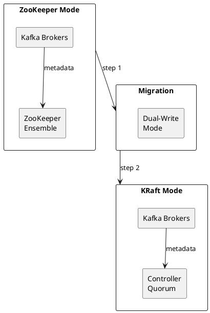
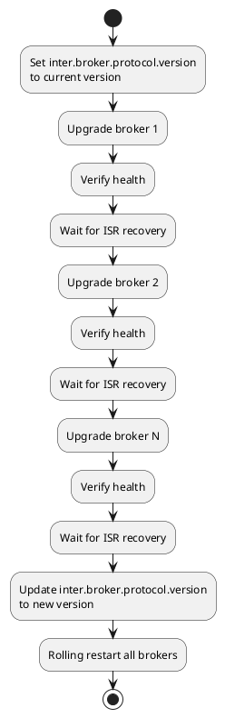
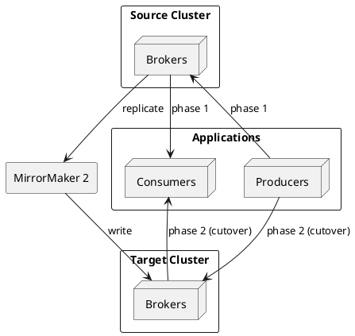
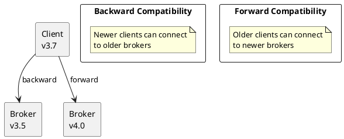

# Kafka Migration

Migration guides for Apache Kafka clusters.

---

## Migration Types

| Migration | Complexity | Downtime |
|-----------|------------|----------|
| Version upgrade | Low-Medium | Zero (rolling) |
| ZooKeeper to KRaft | Medium | Zero (rolling) |
| Cluster migration | High | Depends on approach |
| Cloud migration | High | Depends on approach |

---

## ZooKeeper to KRaft Migration

### Overview



### Migration Steps

**1. Prepare cluster**

```bash
# Verify all brokers are healthy
kafka-broker-api-versions.sh --bootstrap-server kafka:9092

# Check for under-replicated partitions
kafka-topics.sh --bootstrap-server kafka:9092 \
  --describe --under-replicated-partitions
```

**2. Deploy KRaft controllers**

```properties
# controller.properties
process.roles=controller
node.id=100
controller.quorum.voters=100@ctrl1:9093,101@ctrl2:9093,102@ctrl3:9093
listeners=CONTROLLER://0.0.0.0:9093
controller.listener.names=CONTROLLER
```

**3. Enable migration mode on controllers**

```properties
# Add to controller.properties
zookeeper.connect=zk1:2181,zk2:2181,zk3:2181
zookeeper.metadata.migration.enable=true
```

**4. Start migration**

```bash
# Format controller storage
kafka-storage.sh format -t $(kafka-storage.sh random-uuid) \
  -c controller.properties

# Start controllers
kafka-server-start.sh controller.properties
```

**5. Roll brokers to enable migration**

```properties
# Add to server.properties
controller.quorum.voters=100@ctrl1:9093,101@ctrl2:9093,102@ctrl3:9093
controller.listener.names=CONTROLLER
```

**6. Complete migration**

```bash
# Verify migration status
kafka-metadata.sh --snapshot /var/kafka/__cluster_metadata-0/*.log \
  --command "migration-state"

# Disable ZooKeeper on controllers
# Remove: zookeeper.metadata.migration.enable=true
# Restart controllers
```

**7. Remove ZooKeeper dependency from brokers**

```properties
# Remove from server.properties
# zookeeper.connect=...

# Rolling restart brokers
```

---

## Version Upgrades

### Rolling Upgrade Process



### Pre-Upgrade Checklist

- [ ] Review release notes for breaking changes
- [ ] Verify client compatibility
- [ ] Backup configurations
- [ ] Test upgrade in non-production
- [ ] Plan rollback procedure

### Upgrade Commands

```bash
# Set protocol version before upgrade
# server.properties
inter.broker.protocol.version=3.6
log.message.format.version=3.6

# Upgrade each broker
for broker in broker1 broker2 broker3; do
  # Stop
  ssh $broker "sudo systemctl stop kafka"

  # Install new version
  ssh $broker "sudo yum install kafka-3.7"

  # Start
  ssh $broker "sudo systemctl start kafka"

  # Wait for recovery
  sleep 60
  kafka-topics.sh --bootstrap-server kafka:9092 \
    --describe --under-replicated-partitions
done

# Update protocol version
# server.properties
inter.broker.protocol.version=3.7
log.message.format.version=3.7

# Rolling restart
```

---

## Cluster Migration

### Using MirrorMaker 2



### Migration Steps

**1. Set up target cluster**

```bash
# Create topics on target with same configuration
kafka-topics.sh --bootstrap-server target:9092 \
  --create --topic my-topic \
  --partitions 12 --replication-factor 3
```

**2. Deploy MirrorMaker 2**

```properties
# mm2.properties
clusters=source,target
source.bootstrap.servers=source-kafka:9092
target.bootstrap.servers=target-kafka:9092

source->target.enabled=true
source->target.topics=.*

sync.group.offsets.enabled=true
emit.checkpoints.enabled=true
```

**3. Verify replication**

```bash
# Check lag
kafka-consumer-groups.sh --bootstrap-server target:9092 \
  --describe --group mm2-source-target

# Verify data integrity
kafka-console-consumer.sh --bootstrap-server target:9092 \
  --topic my-topic --from-beginning --max-messages 10
```

**4. Migrate consumers**

```bash
# Translate offsets
# Consumers can read checkpoints topic to find equivalent offset
```

**5. Migrate producers**

```bash
# Update bootstrap.servers to target cluster
# Deploy updated configuration
```

**6. Decommission source**

```bash
# Stop MirrorMaker
# Verify no traffic to source
# Decommission source cluster
```

---

## Rollback Procedures

### Version Rollback

```bash
# Stop broker
sudo systemctl stop kafka

# Install previous version
sudo yum downgrade kafka-3.6

# Ensure protocol version matches
# server.properties
inter.broker.protocol.version=3.6

# Start broker
sudo systemctl start kafka
```

### Migration Rollback

```bash
# For ZK to KRaft migration:
# 1. Re-enable ZooKeeper on brokers
# 2. Rolling restart brokers
# 3. Shut down KRaft controllers
# 4. Verify cluster operates with ZooKeeper
```

---

## Version Compatibility

### JDK Compatibility

Kafka components have different JDK support levels across versions.

| Component | Java 11 | Java 17 | Java 21 | Java 23 |
|-----------|:-------:|:-------:|:-------:|:-------:|
| **Kafka Clients** | ✅ | ✅ | ✅ | ✅ |
| **Kafka Streams** | ✅ | ✅ | ✅ | ✅ |
| **Kafka Connect** | ✅ | ✅ | ✅ | ✅ |
| **Kafka Server** | ✅ | ✅ | ✅ | ⚠️ |

Legend: ✅ Supported | ⚠️ Experimental | ❌ Not Supported

!!! note "Java Version Recommendations"
    - Java 17 is recommended for production deployments
    - Java 21 provides improved performance with virtual threads support
    - Java 23 support for the server is experimental

### Client-Broker Compatibility

Kafka maintains bidirectional compatibility between clients and brokers within certain version ranges.



| Scenario | Support | Notes |
|----------|---------|-------|
| New client → Old broker | ✅ Supported | Client auto-negotiates to broker's protocol version |
| Old client → New broker | ✅ Supported | Broker supports older protocol versions |
| Version gap > 2 major | ⚠️ Limited | Test thoroughly; some features may not work |

**Compatibility guarantees:**

- Clients can communicate with brokers of the same or adjacent major versions
- Protocol versioning allows automatic feature negotiation
- Older clients may not access features introduced in newer broker versions

### KRaft Version Compatibility

KRaft clusters have specific version requirements for controllers and brokers.

| Cluster Configuration | Kafka 3.6+ | Kafka 4.0+ |
|----------------------|:----------:|:----------:|
| **Dynamic voters** | ❌ | ✅ |
| **Static voters** | ✅ | ✅ |

**KRaft upgrade considerations:**

- All controllers must run the same Kafka version
- Brokers can be one version behind controllers during rolling upgrades
- `metadata.version` controls enabled features and cannot be downgraded

### Protocol Version Management

The `inter.broker.protocol.version` and `metadata.version` (KRaft) settings control feature availability and upgrade compatibility.

```properties
# ZooKeeper mode
inter.broker.protocol.version=3.6
log.message.format.version=3.6

# KRaft mode - metadata version is set during format
kafka-storage.sh format \
  --release-version 3.7 \
  -t <cluster-id> \
  -c config/kraft/server.properties
```

**Version upgrade sequence:**

1. Upgrade all brokers with current protocol version pinned
2. Verify cluster health after all brokers upgraded
3. Update protocol/metadata version to new version
4. Rolling restart to enable new features

!!! warning "No Downgrade Path"
    Once `metadata.version` is upgraded, it cannot be downgraded. Ensure the upgrade is tested in non-production before proceeding.

### Feature Version Requirements

Certain features require minimum Kafka versions:

| Feature | Minimum Version | Notes |
|---------|-----------------|-------|
| **KRaft (production)** | 3.3 | ZooKeeper still required for some features until 3.5 |
| **KRaft (full feature parity)** | 3.5 | All features available without ZooKeeper |
| **Tiered Storage** | 3.6 | Early access |
| **Share Groups** | 4.0 | KIP-932 |
| **ZooKeeper removal** | 4.0 | ZooKeeper mode deprecated |

---

## Related Documentation

- [Operations](../index.md) - Operational procedures
- [Cluster Management](../cluster-management/index.md) - Cluster operations
- [Architecture](../../architecture/index.md) - System architecture
- [Backup and Restore](../backup-restore/index.md) - DR procedures
