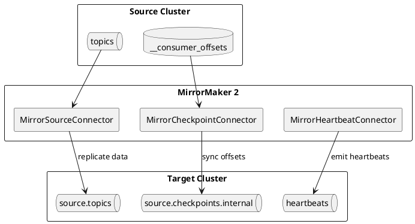
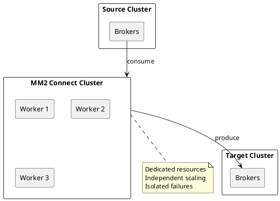
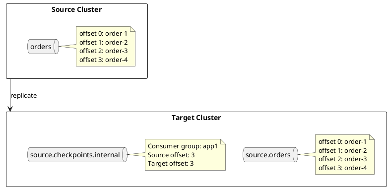
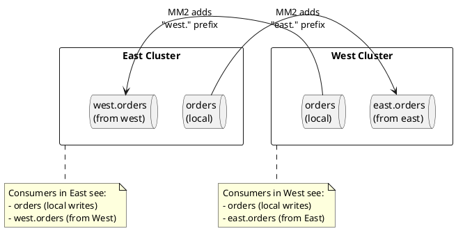

# MirrorMaker 2

MirrorMaker 2 (MM2) is Apache Kafka's tool for replicating data between Kafka clusters. Built on Kafka Connect, it provides topic replication, consumer offset synchronization, and automatic topic configuration mirroring.

---

## What is MirrorMaker 2?

MirrorMaker 2 replaces the legacy MirrorMaker (MM1) with a redesigned architecture based on Kafka Connect. It addresses fundamental limitations of MM1:

| Limitation (MM1) | Solution (MM2) |
|------------------|----------------|
| No offset translation | Checkpoint-based offset synchronization |
| Topic configuration not synced | Automatic config mirroring |
| No ACL replication | ACL synchronization support |
| Manual topic creation | Automatic topic creation |
| Single cluster pair | Multiple cluster topologies |
| Difficult to monitor | Kafka Connect metrics and status |

### MirrorMaker 2 Components

MM2 consists of three Kafka Connect connectors:

| Connector | Purpose |
|-----------|---------|
| **MirrorSourceConnector** | Replicates topic data from source to target cluster |
| **MirrorCheckpointConnector** | Synchronizes consumer group offsets between clusters |
| **MirrorHeartbeatConnector** | Emits heartbeats for replication health monitoring |



---

## Deployment Models

### Dedicated MM2 Cluster

Run MM2 as a standalone Connect cluster dedicated to replication.



**Advantages:**

- Isolated from other Connect workloads
- Independent scaling
- Clear resource allocation

### Embedded in Existing Connect Cluster

Deploy MM2 connectors alongside other connectors.

**Advantages:**

- Simpler infrastructure
- Shared monitoring
- Lower operational overhead

**Disadvantages:**

- Resource contention with other connectors
- Replication affected by other connector issues

### Co-located with Target Cluster

Run MM2 workers on target cluster broker nodes.

**Advantages:**

- Reduced network hops for writes
- Simpler networking

**Disadvantages:**

- Competes for broker resources
- Not recommended for high-volume replication

---

## Configuration Reference

### Cluster Configuration

```properties
# Define clusters
clusters = source, target

# Source cluster connection
source.bootstrap.servers = source-broker-1:9092,source-broker-2:9092,source-broker-3:9092

# Target cluster connection
target.bootstrap.servers = target-broker-1:9092,target-broker-2:9092,target-broker-3:9092

# Security for source cluster (if required)
source.security.protocol = SASL_SSL
source.sasl.mechanism = SCRAM-SHA-512
source.sasl.jaas.config = org.apache.kafka.common.security.scram.ScramLoginModule required \
    username="mm2-user" \
    password="secret";

# Security for target cluster (if required)
target.security.protocol = SASL_SSL
target.sasl.mechanism = SCRAM-SHA-512
target.sasl.jaas.config = org.apache.kafka.common.security.scram.ScramLoginModule required \
    username="mm2-user" \
    password="secret";
```

### Replication Flow Configuration

```properties
# Enable replication from source to target
source->target.enabled = true

# Topics to replicate (regex patterns)
source->target.topics = .*

# Topics to exclude from replication
source->target.topics.exclude = .*[\-\.]internal, .*\.replica, __.*

# Consumer groups to replicate offsets for
source->target.groups = .*

# Groups to exclude
source->target.groups.exclude = console-consumer-.*, connect-.*
```

### Topic Configuration

```properties
# Replication factor for replicated topics
replication.factor = 3

# Replication factor for MM2 internal topics
checkpoints.topic.replication.factor = 3
heartbeats.topic.replication.factor = 3
offset-syncs.topic.replication.factor = 3

# Topic creation settings
refresh.topics.enabled = true
refresh.topics.interval.seconds = 60

# Sync topic configurations
sync.topic.configs.enabled = true
sync.topic.configs.interval.seconds = 60

# Sync topic ACLs (requires ACL access)
sync.topic.acls.enabled = false
```

### Offset Synchronization

```properties
# Enable consumer group offset sync
sync.group.offsets.enabled = true
sync.group.offsets.interval.seconds = 60

# Emit checkpoints for offset translation
emit.checkpoints.enabled = true
emit.checkpoints.interval.seconds = 60

# Emit heartbeats
emit.heartbeats.enabled = true
emit.heartbeats.interval.seconds = 1
```

### Performance Tuning

```properties
# Number of tasks (parallelism)
tasks.max = 10

# Producer settings for replication
producer.buffer.memory = 67108864
producer.batch.size = 524288
producer.linger.ms = 100
producer.compression.type = lz4

# Consumer settings
consumer.fetch.min.bytes = 1048576
consumer.fetch.max.wait.ms = 500
consumer.max.poll.records = 1000

# Offset sync frequency
offset.lag.max = 100
```

### Naming Configuration

```properties
# Replication policy (controls topic naming)
replication.policy.class = org.apache.kafka.connect.mirror.DefaultReplicationPolicy

# Topic separator (default is ".")
replication.policy.separator = .

# Custom replication policy example:
# replication.policy.class = com.example.CustomReplicationPolicy
```

---

## Topic Naming

### Default Naming (DefaultReplicationPolicy)

Replicated topics are prefixed with the source cluster alias:

| Source Cluster | Source Topic | Target Topic |
|----------------|--------------|--------------|
| `east` | `orders` | `east.orders` |
| `west` | `events` | `west.events` |
| `prod` | `user.activity` | `prod.user.activity` |

### Identity Naming (IdentityReplicationPolicy)

Preserves original topic names (use with caution—requires careful loop prevention):

```properties
replication.policy.class = org.apache.kafka.connect.mirror.IdentityReplicationPolicy
```

| Source Topic | Target Topic |
|--------------|--------------|
| `orders` | `orders` |

!!! danger "Loop Prevention Required"
    IdentityReplicationPolicy requires explicit topic filtering to prevent replication loops in bidirectional setups.

### Custom Replication Policy

Implement custom naming logic:

```java
public class CustomReplicationPolicy implements ReplicationPolicy {

    @Override
    public String formatRemoteTopic(String sourceClusterAlias, String topic) {
        // Custom naming: replicated-<source>-<topic>
        return "replicated-" + sourceClusterAlias + "-" + topic;
    }

    @Override
    public String topicSource(String topic) {
        if (topic.startsWith("replicated-")) {
            String[] parts = topic.split("-", 3);
            return parts.length >= 2 ? parts[1] : null;
        }
        return null;
    }

    @Override
    public String upstreamTopic(String topic) {
        if (topic.startsWith("replicated-")) {
            String[] parts = topic.split("-", 3);
            return parts.length >= 3 ? parts[2] : null;
        }
        return null;
    }

    @Override
    public boolean isInternalTopic(String topic) {
        return topic.endsWith(".internal") || topic.startsWith("__");
    }
}
```

---

## Offset Translation

### How Offset Translation Works

Source and target clusters have different offsets for the same logical data. MM2 maintains mappings via checkpoints.



### Checkpoint Format

```json
{
  "consumer_group": "my-consumer-group",
  "topic": "orders",
  "partition": 0,
  "upstream_offset": 1000,
  "downstream_offset": 1000,
  "metadata": ""
}
```

### Translating Offsets During Failover

```bash
# View checkpoints
kafka-console-consumer.sh \
  --bootstrap-server target:9092 \
  --topic source.checkpoints.internal \
  --from-beginning \
  --property print.key=true \
  --property key.separator=": "

# Use RemoteClusterUtils API for programmatic translation
```

```java
// Programmatic offset translation
Map<TopicPartition, OffsetAndMetadata> translatedOffsets =
    RemoteClusterUtils.translateOffsets(
        targetProperties,
        "source",
        consumerGroupId,
        Duration.ofSeconds(30)
    );

// Reset consumer to translated offsets
consumer.commitSync(translatedOffsets);
```

---

## Deployment Procedures

### Initial Deployment

1. **Create MM2 configuration file**

```properties
# mm2.properties
clusters = source, target
source.bootstrap.servers = source:9092
target.bootstrap.servers = target:9092
source->target.enabled = true
source->target.topics = .*
replication.factor = 3
```

2. **Start MirrorMaker 2**

```bash
# Dedicated mode
connect-mirror-maker.sh mm2.properties

# Or as Connect connectors
curl -X POST -H "Content-Type: application/json" \
  --data @mirror-source-connector.json \
  http://connect:8083/connectors
```

3. **Verify replication**

```bash
# Check connector status
curl http://connect:8083/connectors/MirrorSourceConnector/status

# Verify topics created on target
kafka-topics.sh --bootstrap-server target:9092 --list | grep "source\."

# Check replication lag
kafka-consumer-groups.sh --bootstrap-server target:9092 \
  --group connect-MirrorSourceConnector \
  --describe
```

### Adding Topics to Replication

Topics matching the configured patterns are automatically replicated when created. To replicate additional existing topics:

1. Update topic pattern:
```properties
source->target.topics = orders.*,events.*,new-topic-pattern.*
```

2. Restart or reconfigure MM2

3. Verify new topics appear on target

### Removing Topics from Replication

1. Update exclusion pattern:
```properties
source->target.topics.exclude = .*internal,deprecated-topic
```

2. Restart or reconfigure MM2

3. Optionally delete replicated topic from target:
```bash
kafka-topics.sh --bootstrap-server target:9092 \
  --delete --topic source.deprecated-topic
```

---

## Monitoring

### Key Metrics

| Metric | Description | Alert Threshold |
|--------|-------------|-----------------|
| `kafka.connect.mirror.source.connector.record-count` | Records replicated | Sudden drops |
| `kafka.connect.mirror.source.connector.record-age-ms` | Age of last replicated record | > 60000 ms |
| `kafka.connect.mirror.source.connector.replication-latency-ms` | End-to-end replication latency | > 30000 ms |
| `kafka.connect.mirror.source.connector.byte-count` | Bytes replicated | Baseline deviation |
| `kafka.connect.mirror.checkpoint.connector.checkpoint-latency-ms` | Checkpoint sync delay | > 120000 ms |

### Health Checks

```bash
# Connector status
curl -s http://connect:8083/connectors/MirrorSourceConnector/status | jq .

# Task status
curl -s http://connect:8083/connectors/MirrorSourceConnector/tasks/0/status | jq .

# Replication lag
kafka-consumer-groups.sh --bootstrap-server target:9092 \
  --group connect-MirrorSourceConnector \
  --describe

# Heartbeat verification
kafka-console-consumer.sh --bootstrap-server target:9092 \
  --topic heartbeats \
  --from-beginning \
  --max-messages 5
```

### Lag Monitoring Script

```bash
#!/bin/bash
# monitor-mm2-lag.sh

CONNECT_HOST="localhost:8083"
TARGET_BOOTSTRAP="target:9092"

# Check connector status
STATUS=$(curl -s "http://${CONNECT_HOST}/connectors/MirrorSourceConnector/status" | jq -r '.connector.state')
echo "Connector status: ${STATUS}"

# Check consumer group lag
kafka-consumer-groups.sh --bootstrap-server ${TARGET_BOOTSTRAP} \
  --group connect-MirrorSourceConnector \
  --describe 2>/dev/null | \
  awk 'NR>1 {sum += $6} END {print "Total lag: " sum}'
```

---

## Failover Procedures

### Planned Failover

1. **Stop producers to source cluster**

2. **Wait for replication to complete**
```bash
# Check lag is zero
kafka-consumer-groups.sh --bootstrap-server target:9092 \
  --group connect-MirrorSourceConnector \
  --describe
```

3. **Stop MirrorMaker 2**

4. **Translate consumer offsets**
```bash
# For each consumer group
kafka-consumer-groups.sh --bootstrap-server target:9092 \
  --group my-app \
  --reset-offsets \
  --to-offset <translated-offset> \
  --topic source.my-topic \
  --execute
```

5. **Redirect applications to target cluster**

6. **Start consumers on target cluster**

### Unplanned Failover

1. **Detect source cluster failure**

2. **Stop MirrorMaker 2** (prevent split-brain when source recovers)

3. **Assess data loss**
```bash
# Compare last checkpoint with consumer position
kafka-console-consumer.sh --bootstrap-server target:9092 \
  --topic source.checkpoints.internal \
  --from-beginning | tail -n 100
```

4. **Translate offsets using last known checkpoint**

5. **Accept potential data loss** (records between last checkpoint and failure)

6. **Redirect applications**

7. **Start consumers**

### Failback Procedure

1. **Restore source cluster**

2. **Configure reverse replication** (target -> source)

3. **Replicate changes made during outage**

4. **Stop reverse replication**

5. **Redirect applications back to source**

6. **Resume normal replication** (source -> target)

---

## Troubleshooting

### Common Issues

| Issue | Symptoms | Resolution |
|-------|----------|------------|
| **Connector not starting** | FAILED state | Check logs, verify connectivity, check credentials |
| **High replication lag** | Increasing lag metric | Increase tasks.max, tune producer/consumer settings |
| **Topics not replicating** | Missing topics on target | Verify topic pattern matches, check ACLs |
| **Offset sync failing** | Checkpoint connector errors | Verify consumer groups exist, check permissions |
| **Authentication failures** | SASL errors in logs | Verify credentials, check JAAS config |

### Diagnostic Commands

```bash
# View connector logs
docker logs kafka-connect 2>&1 | grep -i mirror

# Check source cluster connectivity
kafka-broker-api-versions.sh --bootstrap-server source:9092

# Verify topic exists on source
kafka-topics.sh --bootstrap-server source:9092 --describe --topic my-topic

# Check target cluster ACLs
kafka-acls.sh --bootstrap-server target:9092 --list

# Test producer to target
echo "test" | kafka-console-producer.sh --bootstrap-server target:9092 --topic test-topic
```

### Performance Issues

```bash
# Check task distribution
curl -s http://connect:8083/connectors/MirrorSourceConnector/tasks | jq .

# Monitor network throughput
iftop -i eth0 -f "port 9092"

# Check producer metrics
curl -s http://connect:8083/connectors/MirrorSourceConnector/tasks/0/status | jq '.trace'
```

---

## Configuration Examples

### Active-Passive DR

```properties
clusters = primary, dr
primary.bootstrap.servers = primary-1:9092,primary-2:9092,primary-3:9092
dr.bootstrap.servers = dr-1:9092,dr-2:9092,dr-3:9092

primary->dr.enabled = true
primary->dr.topics = .*
primary->dr.topics.exclude = .*\.internal, __.*
primary->dr.groups = .*

sync.group.offsets.enabled = true
emit.checkpoints.enabled = true

replication.factor = 3
tasks.max = 10
```

### Active-Active Bidirectional

Active-active replication requires careful provenance configuration to prevent infinite replication loops and enable consumers to distinguish data origins.

#### How Provenance Works

The `DefaultReplicationPolicy` automatically handles provenance by prefixing replicated topics with the source cluster alias:



**Loop Prevention:** MM2 never replicates prefixed topics. `east.orders` in the West cluster is not replicated back to East because it already has the `east.` prefix, indicating it originated from East.

#### Configuration

```properties
clusters = east, west
east.bootstrap.servers = east-1:9092,east-2:9092,east-3:9092
west.bootstrap.servers = west-1:9092,west-2:9092,west-3:9092

# East to West
east->west.enabled = true
east->west.topics = orders, events, users

# West to East
west->east.enabled = true
west->east.topics = orders, events, users

# Use DefaultReplicationPolicy (default) - adds cluster prefix
replication.policy.class = org.apache.kafka.connect.mirror.DefaultReplicationPolicy

# Both directions
sync.group.offsets.enabled = true
emit.checkpoints.enabled = true
emit.heartbeats.enabled = true

replication.factor = 3
tasks.max = 6
```

#### Topic Naming Results

| Cluster | Local Topic | Replicated From | Resulting Topic |
|---------|-------------|-----------------|-----------------|
| East | `orders` | - | `orders` |
| East | - | West | `west.orders` |
| West | `orders` | - | `orders` |
| West | - | East | `east.orders` |

#### Consumer Configuration for Global View

Consumers that need to see all data from both clusters must subscribe to both local and replicated topics:

```java
// Consumer in East cluster wanting all orders globally
consumer.subscribe(Arrays.asList(
    "orders",        // Local East orders
    "west.orders"    // Replicated West orders
));

// Process with origin awareness
for (ConsumerRecord<String, Order> record : records) {
    String origin = record.topic().startsWith("west.") ? "west" : "east";
    processOrder(record.value(), origin);
}
```

#### Conflict Avoidance Strategies

| Strategy | Description | Configuration |
|----------|-------------|---------------|
| **Topic prefixing** | Each DC writes to local topic, reads both | Default behavior |
| **Key partitioning** | Route specific keys to owning DC | Application-level routing |
| **Last-write-wins** | Accept all writes, latest timestamp wins | Application-level merge |

!!! tip "Recommended Pattern"
    Use the default `DefaultReplicationPolicy` with topic prefixing. Have consumers subscribe to both local and prefixed topics. This provides clear provenance with no additional configuration.

### Fan-Out (One to Many)

```properties
clusters = central, region-us, region-eu, region-apac

central.bootstrap.servers = central:9092
region-us.bootstrap.servers = us:9092
region-eu.bootstrap.servers = eu:9092
region-apac.bootstrap.servers = apac:9092

central->region-us.enabled = true
central->region-us.topics = global-.*

central->region-eu.enabled = true
central->region-eu.topics = global-.*

central->region-apac.enabled = true
central->region-apac.topics = global-.*

replication.factor = 3
```

### Aggregation (Many to One)

```properties
clusters = region-us, region-eu, region-apac, central

region-us.bootstrap.servers = us:9092
region-eu.bootstrap.servers = eu:9092
region-apac.bootstrap.servers = apac:9092
central.bootstrap.servers = central:9092

region-us->central.enabled = true
region-us->central.topics = events

region-eu->central.enabled = true
region-eu->central.topics = events

region-apac->central.enabled = true
region-apac->central.topics = events

# Central sees: region-us.events, region-eu.events, region-apac.events
replication.factor = 3
```

---

## Related Documentation

- [Multi-Datacenter Concepts](../../concepts/multi-datacenter/index.md) - Architecture patterns
- [Kafka Connect](../../kafka-connect/index.md) - Connect framework
- [Cluster Management](../cluster-management/index.md) - Operational procedures
- [Monitoring](../monitoring/index.md) - Metrics and alerting