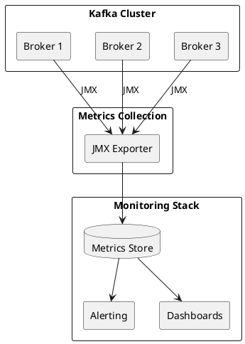

# Kafka Monitoring

Comprehensive monitoring guide for Apache Kafka clusters.

---

## Monitoring Overview



---

## Key Metrics Categories

### Cluster Health

| Metric | Description | Alert Threshold |
|--------|-------------|-----------------|
| `kafka.controller:ActiveControllerCount` | Active controller count | ≠ 1 |
| `kafka.server:UnderReplicatedPartitions` | Under-replicated partitions | > 0 |
| `kafka.controller:OfflinePartitionsCount` | Offline partitions | > 0 |
| `kafka.server:UnderMinIsrPartitionCount` | Below min ISR | > 0 |

### Throughput

| Metric | Description | Notes |
|--------|-------------|-------|
| `kafka.server:MessagesInPerSec` | Messages per second | Per broker/topic |
| `kafka.server:BytesInPerSec` | Bytes in per second | Per broker/topic |
| `kafka.server:BytesOutPerSec` | Bytes out per second | Per broker/topic |
| `kafka.server:TotalProduceRequestsPerSec` | Produce requests | Per broker |
| `kafka.server:TotalFetchRequestsPerSec` | Fetch requests | Per broker |

### Latency

| Metric | Description | Alert Threshold |
|--------|-------------|-----------------|
| `kafka.network:TotalTimeMs,request=Produce` | Produce latency | P99 > 100ms |
| `kafka.network:TotalTimeMs,request=FetchConsumer` | Fetch latency | P99 > 100ms |
| `kafka.network:RequestQueueTimeMs` | Queue time | > 10ms |
| `kafka.network:ResponseQueueTimeMs` | Response queue time | > 10ms |

### Consumer Lag

| Metric | Description | Alert Threshold |
|--------|-------------|-----------------|
| Consumer lag | Records behind | Growing continuously |
| Lag growth rate | Lag increase rate | Positive for extended period |

---

## JMX Configuration

### Enable JMX

```bash
# Broker startup
export KAFKA_JMX_OPTS="-Dcom.sun.management.jmxremote \
  -Dcom.sun.management.jmxremote.authenticate=false \
  -Dcom.sun.management.jmxremote.ssl=false \
  -Dcom.sun.management.jmxremote.port=9999"

bin/kafka-server-start.sh config/server.properties
```

### JMX Exporter

```yaml
# jmx-exporter.yml
lowercaseOutputName: true
lowercaseOutputLabelNames: true

rules:
  # Broker metrics
  - pattern: kafka.server<type=(.+), name=(.+), topic=(.+)><>Count
    name: kafka_server_$1_$2_total
    labels:
      topic: "$3"
    type: COUNTER

  - pattern: kafka.server<type=(.+), name=(.+)><>Count
    name: kafka_server_$1_$2_total
    type: COUNTER

  # Request metrics
  - pattern: kafka.network<type=RequestMetrics, name=(.+), request=(.+)><>Count
    name: kafka_network_request_$1_total
    labels:
      request: "$2"
    type: COUNTER

  - pattern: kafka.network<type=RequestMetrics, name=(.+)Percentile, request=(.+)><>(\d+)thPercentile
    name: kafka_network_request_$1_percentile
    labels:
      request: "$2"
      percentile: "$3"
    type: GAUGE

  # Controller metrics
  - pattern: kafka.controller<type=(.+), name=(.+)><>Value
    name: kafka_controller_$1_$2
    type: GAUGE
```

---

## Critical Alerts

### Immediate Action Required

| Alert | Condition | Action |
|-------|-----------|--------|
| **Offline Partitions** | `OfflinePartitionsCount > 0` | Investigate broker failures |
| **No Controller** | `ActiveControllerCount != 1` | Check controller election |
| **Under Min ISR** | `UnderMinIsrPartitionCount > 0` | Check broker health |

### Warning Level

| Alert | Condition | Action |
|-------|-----------|--------|
| **Under-Replicated** | `UnderReplicatedPartitions > 0` for 5min | Check replication lag |
| **High Produce Latency** | P99 > 100ms | Check disk I/O, network |
| **Consumer Lag Growing** | Lag increasing continuously | Scale consumers |
| **Disk Usage High** | > 80% used | Add storage or adjust retention |

### Sample Alert Rules

```yaml
# alert-rules.yml
groups:
  - name: kafka-critical
    rules:
      - alert: KafkaOfflinePartitions
        expr: kafka_controller_offline_partitions_count > 0
        for: 1m
        labels:
          severity: critical
        annotations:
          summary: "Kafka has offline partitions"

      - alert: KafkaNoActiveController
        expr: kafka_controller_active_controller_count != 1
        for: 1m
        labels:
          severity: critical
        annotations:
          summary: "Kafka cluster has no active controller"

      - alert: KafkaUnderReplicatedPartitions
        expr: kafka_server_replica_manager_under_replicated_partitions > 0
        for: 5m
        labels:
          severity: warning
        annotations:
          summary: "Kafka has under-replicated partitions"

      - alert: KafkaConsumerLagGrowing
        expr: rate(kafka_consumer_group_lag[5m]) > 0
        for: 15m
        labels:
          severity: warning
        annotations:
          summary: "Consumer lag is continuously growing"
```

---

## Consumer Lag Monitoring

### Using kafka-consumer-groups

```bash
# Check lag for all groups
kafka-consumer-groups.sh --bootstrap-server kafka:9092 \
  --describe --all-groups

# Check specific group
kafka-consumer-groups.sh --bootstrap-server kafka:9092 \
  --describe --group my-consumer-group
```

### Output Interpretation

```
GROUP           TOPIC           PARTITION  CURRENT-OFFSET  LOG-END-OFFSET  LAG
my-group        my-topic        0          1000            1050            50
my-group        my-topic        1          2000            2000            0
my-group        my-topic        2          1500            1600            100
```

| Column | Description |
|--------|-------------|
| CURRENT-OFFSET | Consumer's committed offset |
| LOG-END-OFFSET | Latest offset in partition |
| LAG | LOG-END-OFFSET - CURRENT-OFFSET |

---

## Dashboard Panels

### Cluster Overview

| Panel | Metrics |
|-------|---------|
| Active Controller | `kafka_controller_active_controller_count` |
| Online Brokers | Count of responding brokers |
| Offline Partitions | `kafka_controller_offline_partitions_count` |
| Under-Replicated | `kafka_server_replica_manager_under_replicated_partitions` |

### Throughput

| Panel | Metrics |
|-------|---------|
| Messages In/s | `kafka_server_broker_topic_metrics_messages_in_total` rate |
| Bytes In/s | `kafka_server_broker_topic_metrics_bytes_in_total` rate |
| Bytes Out/s | `kafka_server_broker_topic_metrics_bytes_out_total` rate |
| Requests/s | `kafka_network_request_total` rate |

### Latency

| Panel | Metrics |
|-------|---------|
| Produce P99 | `kafka_network_request_total_time_ms{quantile="0.99"}` |
| Fetch P99 | `kafka_network_request_total_time_ms{quantile="0.99"}` |
| Queue Time | `kafka_network_request_queue_time_ms` |

### Resources

| Panel | Metrics |
|-------|---------|
| CPU Usage | Host CPU metrics |
| Memory Usage | Host memory metrics |
| Disk Usage | `kafka_log_size` per partition |
| Network I/O | Host network metrics |

---

## Health Check Script

```bash
#!/bin/bash
# kafka-health-check.sh

BOOTSTRAP_SERVER=${1:-"localhost:9092"}

echo "=== Kafka Health Check ==="

# Check broker connectivity
echo -n "Broker connectivity: "
if kafka-broker-api-versions.sh --bootstrap-server $BOOTSTRAP_SERVER > /dev/null 2>&1; then
    echo "OK"
else
    echo "FAILED"
    exit 1
fi

# Check offline partitions
OFFLINE=$(kafka-topics.sh --bootstrap-server $BOOTSTRAP_SERVER \
    --describe --unavailable-partitions 2>/dev/null | wc -l)
echo "Offline partitions: $OFFLINE"
if [ "$OFFLINE" -gt 0 ]; then
    echo "CRITICAL: Offline partitions detected"
    exit 2
fi

# Check under-replicated partitions
UNDER_REP=$(kafka-topics.sh --bootstrap-server $BOOTSTRAP_SERVER \
    --describe --under-replicated-partitions 2>/dev/null | wc -l)
echo "Under-replicated partitions: $UNDER_REP"
if [ "$UNDER_REP" -gt 0 ]; then
    echo "WARNING: Under-replicated partitions detected"
    exit 1
fi

echo "=== All checks passed ==="
exit 0
```

---

## Replication Metrics

| Metric | Description | Alert Threshold |
|--------|-------------|-----------------|
| `kafka.server:type=ReplicaManager,name=IsrShrinksPerSec` | ISR shrink rate | > 0 during normal operation |
| `kafka.server:type=ReplicaManager,name=IsrExpandsPerSec` | ISR expansion rate | Should follow shrinks |
| `kafka.server:type=ReplicaManager,name=FailedIsrUpdatesPerSec` | Failed ISR update rate | > 0 |
| `kafka.server:type=ReplicaManager,name=LeaderCount` | Leader replicas per broker | Uneven distribution |
| `kafka.server:type=ReplicaManager,name=PartitionCount` | Partitions per broker | Uneven distribution |
| `kafka.server:type=ReplicaManager,name=OfflineReplicaCount` | Offline replicas | > 0 |
| `kafka.server:type=ReplicaFetcherManager,name=MaxLag,clientId=Replica` | Max follower lag | Proportional to batch size |

---

## Request Processing Metrics

### Request Time Breakdown

| Metric | Description | Notes |
|--------|-------------|-------|
| `kafka.network:type=RequestMetrics,name=TotalTimeMs` | Total request time | Sum of all phases |
| `kafka.network:type=RequestMetrics,name=RequestQueueTimeMs` | Time waiting in request queue | High values indicate overload |
| `kafka.network:type=RequestMetrics,name=LocalTimeMs` | Time processing at leader | Disk I/O bound |
| `kafka.network:type=RequestMetrics,name=RemoteTimeMs` | Time waiting for followers | Non-zero with acks=all |
| `kafka.network:type=RequestMetrics,name=ResponseQueueTimeMs` | Time in response queue | Network thread saturation |
| `kafka.network:type=RequestMetrics,name=ResponseSendTimeMs` | Time sending response | Network bandwidth |

### Request Handler Utilization

| Metric | Description | Alert Threshold |
|--------|-------------|-----------------|
| `kafka.network:type=SocketServer,name=NetworkProcessorAvgIdlePercent` | Network thread idle ratio | < 0.3 |
| `kafka.server:type=KafkaRequestHandlerPool,name=RequestHandlerAvgIdlePercent` | Request handler idle ratio | < 0.3 |
| `kafka.network:type=RequestChannel,name=RequestQueueSize` | Pending requests | Growing continuously |

### Purgatory Metrics

Purgatory holds requests waiting for conditions to be met (e.g., acks from replicas).

| Metric | Description | Notes |
|--------|-------------|-------|
| `kafka.server:type=DelayedOperationPurgatory,name=PurgatorySize,delayedOperation=Produce` | Pending produce requests | Non-zero with acks=-1 |
| `kafka.server:type=DelayedOperationPurgatory,name=PurgatorySize,delayedOperation=Fetch` | Pending fetch requests | Depends on fetch.wait.max.ms |

---

## Log and Storage Metrics

| Metric | Description | Notes |
|--------|-------------|-------|
| `kafka.log:type=LogFlushStats,name=LogFlushRateAndTimeMs` | Log flush rate and time | Disk performance indicator |
| `kafka.log:type=LogManager,name=OfflineLogDirectoryCount` | Offline log directories | Should be 0 |
| `kafka.log:type=Log,name=Size,topic=X,partition=Y` | Partition size in bytes | Per-partition storage |
| `kafka.log:type=Log,name=NumLogSegments,topic=X,partition=Y` | Segment count per partition | Segment management |
| `kafka.log:type=Log,name=LogStartOffset,topic=X,partition=Y` | First available offset | Retention tracking |
| `kafka.log:type=Log,name=LogEndOffset,topic=X,partition=Y` | Latest offset | Progress tracking |

---

## Controller Metrics

| Metric | Description | Alert Threshold |
|--------|-------------|-----------------|
| `kafka.controller:type=ControllerStats,name=LeaderElectionRateAndTimeMs` | Leader election rate | Non-zero during failures |
| `kafka.controller:type=ControllerStats,name=UncleanLeaderElectionsPerSec` | Unclean elections | > 0 (potential data loss) |
| `kafka.controller:type=KafkaController,name=TopicsToDeleteCount` | Pending topic deletions | Should decrease |
| `kafka.controller:type=KafkaController,name=ReplicasToDeleteCount` | Pending replica deletions | Should decrease |
| `kafka.controller:type=ControllerEventManager,name=EventQueueSize` | Controller event queue | Growing continuously |
| `kafka.controller:type=ControllerEventManager,name=EventQueueTimeMs` | Event wait time | High latency |

---

## KRaft Monitoring

KRaft clusters expose Raft consensus metrics on both controllers and brokers.

### Quorum State Metrics

| Metric | Description | Notes |
|--------|-------------|-------|
| `kafka.server:type=raft-metrics,name=current-state` | Node state | leader, follower, candidate, observer |
| `kafka.server:type=raft-metrics,name=current-leader` | Current leader ID | -1 indicates unknown |
| `kafka.server:type=raft-metrics,name=current-epoch` | Current quorum epoch | Increments on elections |
| `kafka.server:type=raft-metrics,name=high-watermark` | Committed log offset | -1 if unknown |
| `kafka.server:type=raft-metrics,name=log-end-offset` | End of Raft log | Replication progress |

### Quorum Performance Metrics

| Metric | Description | Alert Threshold |
|--------|-------------|-----------------|
| `kafka.server:type=raft-metrics,name=commit-latency-avg` | Average commit latency | Increasing trend |
| `kafka.server:type=raft-metrics,name=commit-latency-max` | Maximum commit latency | Spikes |
| `kafka.server:type=raft-metrics,name=election-latency-avg` | Average election time | Extended elections |
| `kafka.server:type=raft-metrics,name=fetch-records-rate` | Record fetch rate | Replication throughput |
| `kafka.server:type=raft-metrics,name=append-records-rate` | Record append rate | Write throughput |

---

## Group Coordinator Monitoring

The group coordinator manages consumer group membership and offset storage.

### Partition State Metrics

| Metric | Description | Notes |
|--------|-------------|-------|
| `kafka.server:type=group-coordinator-metrics,name=num-partitions,state=loading` | Loading partitions | Should be transient |
| `kafka.server:type=group-coordinator-metrics,name=num-partitions,state=active` | Active partitions | Normal operation |
| `kafka.server:type=group-coordinator-metrics,name=num-partitions,state=failed` | Failed partitions | Should be 0 |

### Consumer Group State Metrics

| Metric | Description | Notes |
|--------|-------------|-------|
| `kafka.server:type=group-coordinator-metrics,name=consumer-group-count,state=stable` | Stable groups | Normal state |
| `kafka.server:type=group-coordinator-metrics,name=consumer-group-count,state=empty` | Empty groups | No active members |
| `kafka.server:type=group-coordinator-metrics,name=consumer-group-count,state=assigning` | Groups assigning partitions | Rebalance in progress |
| `kafka.server:type=group-coordinator-metrics,name=consumer-group-count,state=reconciling` | Groups reconciling | Incremental rebalance |
| `kafka.server:type=group-coordinator-metrics,name=consumer-group-rebalance-rate` | Rebalance frequency | High rate indicates instability |

### Offset Management Metrics

| Metric | Description | Notes |
|--------|-------------|-------|
| `kafka.server:type=group-coordinator-metrics,name=offset-commit-rate` | Offset commit rate | Consumer activity |
| `kafka.server:type=group-coordinator-metrics,name=offset-expiration-rate` | Offset expiration rate | Inactive consumers |
| `kafka.server:type=GroupMetadataManager,name=NumOffsets` | Total committed offsets | Storage overhead |
| `kafka.server:type=GroupMetadataManager,name=NumGroups` | Total consumer groups | Group management |

---

## Tiered Storage Monitoring

For clusters with tiered storage enabled, monitor remote storage operations.

### Remote Storage Throughput

| Metric | Description | Notes |
|--------|-------------|-------|
| `kafka.server:type=BrokerTopicMetrics,name=RemoteFetchBytesPerSec` | Bytes read from remote | Cold read volume |
| `kafka.server:type=BrokerTopicMetrics,name=RemoteFetchRequestsPerSec` | Remote fetch requests | Cold read frequency |
| `kafka.server:type=BrokerTopicMetrics,name=RemoteCopyBytesPerSec` | Bytes copied to remote | Upload throughput |
| `kafka.server:type=BrokerTopicMetrics,name=RemoteCopyRequestsPerSec` | Copy requests to remote | Upload frequency |
| `kafka.server:type=BrokerTopicMetrics,name=RemoteDeleteRequestsPerSec` | Delete requests | Retention cleanup |

### Remote Storage Lag

| Metric | Description | Alert Threshold |
|--------|-------------|-----------------|
| `kafka.server:type=BrokerTopicMetrics,name=RemoteCopyLagBytes` | Bytes pending upload | Growing continuously |
| `kafka.server:type=BrokerTopicMetrics,name=RemoteCopyLagSegments` | Segments pending upload | > configured threshold |
| `kafka.server:type=BrokerTopicMetrics,name=RemoteDeleteLagBytes` | Bytes pending deletion | Growing continuously |
| `kafka.server:type=BrokerTopicMetrics,name=RemoteDeleteLagSegments` | Segments pending deletion | > configured threshold |

### Remote Storage Errors

| Metric | Description | Alert Threshold |
|--------|-------------|-----------------|
| `kafka.server:type=BrokerTopicMetrics,name=RemoteFetchErrorsPerSec` | Remote read errors | > 0 |
| `kafka.server:type=BrokerTopicMetrics,name=RemoteCopyErrorsPerSec` | Remote write errors | > 0 |
| `kafka.server:type=BrokerTopicMetrics,name=RemoteDeleteErrorsPerSec` | Remote delete errors | > 0 |

### Remote Storage Thread Pool

| Metric | Description | Alert Threshold |
|--------|-------------|-----------------|
| `org.apache.kafka.storage.internals.log:type=RemoteStorageThreadPool,name=RemoteLogReaderTaskQueueSize` | Read task queue | Growing continuously |
| `org.apache.kafka.storage.internals.log:type=RemoteStorageThreadPool,name=RemoteLogReaderAvgIdlePercent` | Read thread utilization | < 0.3 |
| `kafka.log.remote:type=RemoteLogManager,name=RemoteLogManagerTasksAvgIdlePercent` | Copy thread utilization | < 0.3 |

---

## Producer Client Metrics

Client-side metrics for monitoring producer applications.

### Throughput Metrics

| Metric | Description | Notes |
|--------|-------------|-------|
| `kafka.producer:type=producer-metrics,name=record-send-rate` | Records sent per second | Production rate |
| `kafka.producer:type=producer-metrics,name=byte-rate` | Bytes sent per second | Bandwidth usage |
| `kafka.producer:type=producer-metrics,name=compression-rate-avg` | Compression ratio | < 1.0 indicates compression |
| `kafka.producer:type=producer-metrics,name=record-size-avg` | Average record size | Sizing validation |

### Latency Metrics

| Metric | Description | Alert Threshold |
|--------|-------------|-----------------|
| `kafka.producer:type=producer-metrics,name=request-latency-avg` | Average request latency | Increasing trend |
| `kafka.producer:type=producer-metrics,name=request-latency-max` | Maximum request latency | Spikes |
| `kafka.producer:type=producer-metrics,name=record-queue-time-avg` | Time in buffer | High indicates backpressure |
| `kafka.producer:type=producer-metrics,name=produce-throttle-time-avg` | Throttle time | > 0 indicates quota hit |

### Buffer Metrics

| Metric | Description | Alert Threshold |
|--------|-------------|-----------------|
| `kafka.producer:type=producer-metrics,name=buffer-available-bytes` | Available buffer space | Approaching 0 |
| `kafka.producer:type=producer-metrics,name=buffer-total-bytes` | Total buffer size | Configuration reference |
| `kafka.producer:type=producer-metrics,name=bufferpool-wait-ratio` | Time waiting for buffer | > 0 indicates memory pressure |
| `kafka.producer:type=producer-metrics,name=batch-size-avg` | Average batch size | Tuning indicator |

### Error Metrics

| Metric | Description | Alert Threshold |
|--------|-------------|-----------------|
| `kafka.producer:type=producer-metrics,name=record-error-rate` | Record error rate | > 0 |
| `kafka.producer:type=producer-metrics,name=record-retry-rate` | Record retry rate | High rate |

---

## Consumer Client Metrics

Client-side metrics for monitoring consumer applications.

### Throughput Metrics

| Metric | Description | Notes |
|--------|-------------|-------|
| `kafka.consumer:type=consumer-fetch-manager-metrics,name=records-consumed-rate` | Records consumed per second | Consumption rate |
| `kafka.consumer:type=consumer-fetch-manager-metrics,name=bytes-consumed-rate` | Bytes consumed per second | Bandwidth usage |
| `kafka.consumer:type=consumer-fetch-manager-metrics,name=fetch-rate` | Fetch request rate | Request frequency |
| `kafka.consumer:type=consumer-fetch-manager-metrics,name=records-per-request-avg` | Records per fetch | Efficiency indicator |

### Lag Metrics

| Metric | Description | Alert Threshold |
|--------|-------------|-----------------|
| `kafka.consumer:type=consumer-fetch-manager-metrics,name=records-lag-max` | Maximum partition lag | Growing continuously |
| `kafka.consumer:type=consumer-fetch-manager-metrics,name=records-lag,partition=X` | Per-partition lag | Above threshold |
| `kafka.consumer:type=consumer-fetch-manager-metrics,name=records-lead-min` | Minimum lead (distance to start) | Approaching 0 |

### Rebalance Metrics

| Metric | Description | Alert Threshold |
|--------|-------------|-----------------|
| `kafka.consumer:type=consumer-coordinator-metrics,name=rebalance-total` | Total rebalances | High count |
| `kafka.consumer:type=consumer-coordinator-metrics,name=rebalance-rate-per-hour` | Rebalance frequency | > 1-2 per hour |
| `kafka.consumer:type=consumer-coordinator-metrics,name=rebalance-latency-avg` | Average rebalance time | > configured session timeout |
| `kafka.consumer:type=consumer-coordinator-metrics,name=assigned-partitions` | Assigned partition count | Uneven distribution |

### Heartbeat Metrics

| Metric | Description | Alert Threshold |
|--------|-------------|-----------------|
| `kafka.consumer:type=consumer-coordinator-metrics,name=heartbeat-rate` | Heartbeats per second | Below expected rate |
| `kafka.consumer:type=consumer-coordinator-metrics,name=heartbeat-response-time-max` | Max heartbeat response time | Approaching session timeout |
| `kafka.consumer:type=consumer-coordinator-metrics,name=last-heartbeat-seconds-ago` | Time since last heartbeat | Approaching session timeout |

### Commit Metrics

| Metric | Description | Notes |
|--------|-------------|-------|
| `kafka.consumer:type=consumer-coordinator-metrics,name=commit-rate` | Commit rate | Commit frequency |
| `kafka.consumer:type=consumer-coordinator-metrics,name=commit-latency-avg` | Average commit latency | Performance indicator |

---

## Kafka Streams Metrics

For Kafka Streams applications, monitor stream processing performance.

### Thread Metrics

| Metric | Description | Notes |
|--------|-------------|-------|
| `kafka.streams:type=stream-thread-metrics,name=state` | Thread state | RUNNING, PARTITIONS_ASSIGNED, etc. |
| `kafka.streams:type=stream-thread-metrics,name=commit-rate` | Commits per second | Processing frequency |
| `kafka.streams:type=stream-thread-metrics,name=poll-rate` | Polls per second | Input rate |
| `kafka.streams:type=stream-thread-metrics,name=process-rate` | Records processed per second | Processing throughput |

### Processing Latency

| Metric | Description | Alert Threshold |
|--------|-------------|-----------------|
| `kafka.streams:type=stream-thread-metrics,name=process-latency-avg` | Average processing time | Increasing trend |
| `kafka.streams:type=stream-thread-metrics,name=commit-latency-avg` | Average commit time | High latency |
| `kafka.streams:type=stream-thread-metrics,name=poll-latency-avg` | Average poll time | High latency |
| `kafka.streams:type=stream-thread-metrics,name=punctuate-latency-avg` | Average punctuate time | High latency |

### Task Metrics

| Metric | Description | Notes |
|--------|-------------|-------|
| `kafka.streams:type=stream-thread-metrics,name=task-created-rate` | Task creation rate | Rebalance activity |
| `kafka.streams:type=stream-thread-metrics,name=task-closed-rate` | Task close rate | Rebalance activity |
| `kafka.streams:type=stream-task-metrics,name=process-rate` | Per-task processing rate | Task-level throughput |
| `kafka.streams:type=stream-task-metrics,name=dropped-records-rate` | Dropped record rate | Data loss indicator |

### State Store Metrics

| Metric | Description | Notes |
|--------|-------------|-------|
| `kafka.streams:type=stream-state-metrics,name=put-rate` | State store write rate | Write throughput |
| `kafka.streams:type=stream-state-metrics,name=get-rate` | State store read rate | Read throughput |
| `kafka.streams:type=stream-state-metrics,name=flush-rate` | State store flush rate | Persistence frequency |
| `kafka.streams:type=stream-state-metrics,name=restore-rate` | State restoration rate | Recovery progress |

---

## Quota Metrics

Monitor client quota enforcement.

| Metric | Description | Notes |
|--------|-------------|-------|
| `kafka.server:type=Produce,user=X,client-id=Y,name=throttle-time` | Producer throttle time | > 0 indicates quota exceeded |
| `kafka.server:type=Fetch,user=X,client-id=Y,name=throttle-time` | Consumer throttle time | > 0 indicates quota exceeded |
| `kafka.server:type=Request,user=X,client-id=Y,name=throttle-time` | Request throttle time | > 0 indicates quota exceeded |

---

## Security Metrics

Monitor authentication and authorization.

| Metric | Description | Alert Threshold |
|--------|-------------|-----------------|
| `kafka.server:type=socket-server-metrics,name=successful-authentication-rate` | Successful auth rate | Reference baseline |
| `kafka.server:type=socket-server-metrics,name=failed-authentication-rate` | Failed auth rate | > 0 |
| `kafka.network:type=SocketServer,name=ExpiredConnectionsKilledCount` | Connections killed (auth expiry) | > 0 with re-auth enabled |

---

## Related Documentation

- [Operations](../index.md) - Operations overview
- [CLI Tools](../cli-tools/index.md) - Command reference
- [Troubleshooting](../../troubleshooting/index.md) - Problem diagnosis
- [Performance](../performance/index.md) - Performance tuning