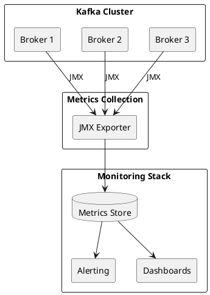

# Kafka Monitoring

Comprehensive monitoring guide for Apache Kafka clusters.

---

## Monitoring Overview



---

## Key Metrics Categories

### Cluster Health

| Metric | Description | Alert Threshold |
|--------|-------------|-----------------|
| `kafka.controller:ActiveControllerCount` | Active controller count | ≠ 1 |
| `kafka.server:UnderReplicatedPartitions` | Under-replicated partitions | > 0 |
| `kafka.controller:OfflinePartitionsCount` | Offline partitions | > 0 |
| `kafka.server:UnderMinIsrPartitionCount` | Below min ISR | > 0 |

### Throughput

| Metric | Description | Notes |
|--------|-------------|-------|
| `kafka.server:MessagesInPerSec` | Messages per second | Per broker/topic |
| `kafka.server:BytesInPerSec` | Bytes in per second | Per broker/topic |
| `kafka.server:BytesOutPerSec` | Bytes out per second | Per broker/topic |
| `kafka.server:TotalProduceRequestsPerSec` | Produce requests | Per broker |
| `kafka.server:TotalFetchRequestsPerSec` | Fetch requests | Per broker |

### Latency

| Metric | Description | Alert Threshold |
|--------|-------------|-----------------|
| `kafka.network:TotalTimeMs,request=Produce` | Produce latency | P99 > 100ms |
| `kafka.network:TotalTimeMs,request=FetchConsumer` | Fetch latency | P99 > 100ms |
| `kafka.network:RequestQueueTimeMs` | Queue time | > 10ms |
| `kafka.network:ResponseQueueTimeMs` | Response queue time | > 10ms |

### Consumer Lag

| Metric | Description | Alert Threshold |
|--------|-------------|-----------------|
| Consumer lag | Records behind | Growing continuously |
| Lag growth rate | Lag increase rate | Positive for extended period |

---

## JMX Configuration

### Enable JMX

```bash
# Broker startup
export KAFKA_JMX_OPTS="-Dcom.sun.management.jmxremote \
  -Dcom.sun.management.jmxremote.authenticate=false \
  -Dcom.sun.management.jmxremote.ssl=false \
  -Dcom.sun.management.jmxremote.port=9999"

bin/kafka-server-start.sh config/server.properties
```

### JMX Exporter

```yaml
# jmx-exporter.yml
lowercaseOutputName: true
lowercaseOutputLabelNames: true

rules:
  # Broker metrics
  - pattern: kafka.server<type=(.+), name=(.+), topic=(.+)><>Count
    name: kafka_server_$1_$2_total
    labels:
      topic: "$3"
    type: COUNTER

  - pattern: kafka.server<type=(.+), name=(.+)><>Count
    name: kafka_server_$1_$2_total
    type: COUNTER

  # Request metrics
  - pattern: kafka.network<type=RequestMetrics, name=(.+), request=(.+)><>Count
    name: kafka_network_request_$1_total
    labels:
      request: "$2"
    type: COUNTER

  - pattern: kafka.network<type=RequestMetrics, name=(.+)Percentile, request=(.+)><>(\d+)thPercentile
    name: kafka_network_request_$1_percentile
    labels:
      request: "$2"
      percentile: "$3"
    type: GAUGE

  # Controller metrics
  - pattern: kafka.controller<type=(.+), name=(.+)><>Value
    name: kafka_controller_$1_$2
    type: GAUGE
```

---

## Critical Alerts

### Immediate Action Required

| Alert | Condition | Action |
|-------|-----------|--------|
| **Offline Partitions** | `OfflinePartitionsCount > 0` | Investigate broker failures |
| **No Controller** | `ActiveControllerCount != 1` | Check controller election |
| **Under Min ISR** | `UnderMinIsrPartitionCount > 0` | Check broker health |

### Warning Level

| Alert | Condition | Action |
|-------|-----------|--------|
| **Under-Replicated** | `UnderReplicatedPartitions > 0` for 5min | Check replication lag |
| **High Produce Latency** | P99 > 100ms | Check disk I/O, network |
| **Consumer Lag Growing** | Lag increasing continuously | Scale consumers |
| **Disk Usage High** | > 80% used | Add storage or adjust retention |

### Sample Alert Rules

```yaml
# alert-rules.yml
groups:
  - name: kafka-critical
    rules:
      - alert: KafkaOfflinePartitions
        expr: kafka_controller_offline_partitions_count > 0
        for: 1m
        labels:
          severity: critical
        annotations:
          summary: "Kafka has offline partitions"

      - alert: KafkaNoActiveController
        expr: kafka_controller_active_controller_count != 1
        for: 1m
        labels:
          severity: critical
        annotations:
          summary: "Kafka cluster has no active controller"

      - alert: KafkaUnderReplicatedPartitions
        expr: kafka_server_replica_manager_under_replicated_partitions > 0
        for: 5m
        labels:
          severity: warning
        annotations:
          summary: "Kafka has under-replicated partitions"

      - alert: KafkaConsumerLagGrowing
        expr: rate(kafka_consumer_group_lag[5m]) > 0
        for: 15m
        labels:
          severity: warning
        annotations:
          summary: "Consumer lag is continuously growing"
```

---

## Consumer Lag Monitoring

### Using kafka-consumer-groups

```bash
# Check lag for all groups
kafka-consumer-groups.sh --bootstrap-server kafka:9092 \
  --describe --all-groups

# Check specific group
kafka-consumer-groups.sh --bootstrap-server kafka:9092 \
  --describe --group my-consumer-group
```

### Output Interpretation

```
GROUP           TOPIC           PARTITION  CURRENT-OFFSET  LOG-END-OFFSET  LAG
my-group        my-topic        0          1000            1050            50
my-group        my-topic        1          2000            2000            0
my-group        my-topic        2          1500            1600            100
```

| Column | Description |
|--------|-------------|
| CURRENT-OFFSET | Consumer's committed offset |
| LOG-END-OFFSET | Latest offset in partition |
| LAG | LOG-END-OFFSET - CURRENT-OFFSET |

---

## Dashboard Panels

### Cluster Overview

| Panel | Metrics |
|-------|---------|
| Active Controller | `kafka_controller_active_controller_count` |
| Online Brokers | Count of responding brokers |
| Offline Partitions | `kafka_controller_offline_partitions_count` |
| Under-Replicated | `kafka_server_replica_manager_under_replicated_partitions` |

### Throughput

| Panel | Metrics |
|-------|---------|
| Messages In/s | `kafka_server_broker_topic_metrics_messages_in_total` rate |
| Bytes In/s | `kafka_server_broker_topic_metrics_bytes_in_total` rate |
| Bytes Out/s | `kafka_server_broker_topic_metrics_bytes_out_total` rate |
| Requests/s | `kafka_network_request_total` rate |

### Latency

| Panel | Metrics |
|-------|---------|
| Produce P99 | `kafka_network_request_total_time_ms{quantile="0.99"}` |
| Fetch P99 | `kafka_network_request_total_time_ms{quantile="0.99"}` |
| Queue Time | `kafka_network_request_queue_time_ms` |

### Resources

| Panel | Metrics |
|-------|---------|
| CPU Usage | Host CPU metrics |
| Memory Usage | Host memory metrics |
| Disk Usage | `kafka_log_size` per partition |
| Network I/O | Host network metrics |

---

## Health Check Script

```bash
#!/bin/bash
# kafka-health-check.sh

BOOTSTRAP_SERVER=${1:-"localhost:9092"}

echo "=== Kafka Health Check ==="

# Check broker connectivity
echo -n "Broker connectivity: "
if kafka-broker-api-versions.sh --bootstrap-server $BOOTSTRAP_SERVER > /dev/null 2>&1; then
    echo "OK"
else
    echo "FAILED"
    exit 1
fi

# Check offline partitions
OFFLINE=$(kafka-topics.sh --bootstrap-server $BOOTSTRAP_SERVER \
    --describe --unavailable-partitions 2>/dev/null | wc -l)
echo "Offline partitions: $OFFLINE"
if [ "$OFFLINE" -gt 0 ]; then
    echo "CRITICAL: Offline partitions detected"
    exit 2
fi

# Check under-replicated partitions
UNDER_REP=$(kafka-topics.sh --bootstrap-server $BOOTSTRAP_SERVER \
    --describe --under-replicated-partitions 2>/dev/null | wc -l)
echo "Under-replicated partitions: $UNDER_REP"
if [ "$UNDER_REP" -gt 0 ]; then
    echo "WARNING: Under-replicated partitions detected"
    exit 1
fi

echo "=== All checks passed ==="
exit 0
```

---

## Related Documentation

- [Operations](../index.md) - Operations overview
- [CLI Tools](../cli-tools/index.md) - Command reference
- [Troubleshooting](../../troubleshooting/index.md) - Problem diagnosis
- [Performance](../performance/index.md) - Performance tuning
