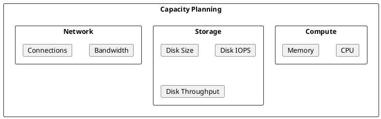

# Kafka Capacity Planning

Sizing guidelines and capacity planning for Apache Kafka clusters.

---

## Capacity Dimensions



---

## Requirements Gathering

### Key Questions

| Question | Impact |
|----------|--------|
| Peak throughput (MB/s)? | Broker count, network |
| Messages per second? | CPU, network threads |
| Average message size? | Network, storage |
| Retention period? | Storage size |
| Replication factor? | Storage, network |
| Consumer count? | Network bandwidth |
| Latency requirements? | Hardware tier |

### Example Scenario

```
Peak produce throughput: 500 MB/s
Average message size: 1 KB
Retention: 7 days
Replication factor: 3
Consumer fanout: 3x (1500 MB/s total reads)
```

---

## Broker Sizing

### CPU Sizing

| Workload | Threads | CPU Cores |
|----------|---------|-----------|
| 100 MB/s | num.io.threads=8 | 4-8 cores |
| 500 MB/s | num.io.threads=16 | 8-16 cores |
| 1+ GB/s | num.io.threads=32+ | 16-32 cores |

**Formula:**
```
Required cores = (network_threads + io_threads + replica_fetchers) × 1.5
```

### Memory Sizing

```
JVM Heap: 6-8 GB (rarely need more)
Page Cache: Remaining RAM

Total RAM = JVM Heap + (hourly_throughput × hours_to_cache)
```

**Example:**
```
Throughput: 500 MB/s = 1.8 TB/hour
Cache 2 hours: 3.6 TB page cache ideal
Practical: 64-128 GB RAM per broker
```

### Broker Count Formula

```
Brokers = max(
  (peak_throughput × replication_factor) / per_broker_throughput,
  total_partitions / max_partitions_per_broker,
  3  # minimum for HA
)
```

**Example:**
```
Peak throughput: 500 MB/s
Replication factor: 3
Per-broker capacity: 300 MB/s
Brokers = (500 × 3) / 300 = 5 brokers

With 6000 partitions:
Brokers = max(5, 6000/4000, 3) = 5 brokers
```

---

## Storage Sizing

### Disk Size Formula

```
Storage per broker =
  (daily_throughput × retention_days × replication_factor) / broker_count
  + 20% overhead
```

**Example:**
```
Daily throughput: 500 MB/s × 86400 = 43.2 TB/day
Retention: 7 days = 302.4 TB
Replication: 3× = 907.2 TB total
5 brokers = 181.4 TB per broker
+ 20% = 218 TB per broker
```

### Disk Performance

| Metric | Calculation |
|--------|-------------|
| IOPS | (partitions × 2) + (connections × 0.5) |
| Throughput | peak_throughput × (1 + replication_factor) |

**Example:**
```
3000 partitions, 500 connections
IOPS = (3000 × 2) + (500 × 0.5) = 6250 IOPS

500 MB/s produce, RF=3
Throughput = 500 × (1 + 3) = 2000 MB/s
```

### Disk Type Selection

| Disk Type | Use Case |
|-----------|----------|
| **NVMe SSD** | High throughput, low latency |
| **SSD** | General production |
| **HDD (15K RPM)** | Cost-optimized, cold storage |

---

## Network Sizing

### Bandwidth Formula

```
Network = produce_rate × (replication_factor + consumer_fanout)
```

**Example:**
```
Produce: 500 MB/s
Replication: 500 MB/s × 2 = 1000 MB/s
Consumer fanout: 500 MB/s × 3 = 1500 MB/s
Total: 500 + 1000 + 1500 = 3000 MB/s = 24 Gbps
Per broker (5): 4.8 Gbps → 10 Gbps NICs
```

### Network Threads

```properties
# Network threads per broker
num.network.threads = max(3, peak_connections / 1000)
```

---

## Partition Planning

### Partition Count Guidelines

| Factor | Recommendation |
|--------|----------------|
| Parallelism | partitions ≥ max consumer instances |
| Throughput | ~10 MB/s per partition |
| Overhead | < 4000 partitions per broker |
| Rebalance | Fewer partitions = faster rebalance |

### Formula

```
Partitions = max(
  target_throughput / 10 MB/s,
  max_consumer_instances
)
```

---

## Growth Planning

### Capacity Triggers

| Metric | Threshold | Action |
|--------|-----------|--------|
| CPU utilization | > 70% sustained | Add brokers |
| Disk usage | > 70% | Add storage or reduce retention |
| Network utilization | > 70% | Add brokers |
| Partition count | > 3000/broker | Add brokers |

### Scaling Calculations

```
Current: 5 brokers, 500 MB/s
Growth: 25% per year

Year 1: 625 MB/s → 6 brokers
Year 2: 781 MB/s → 7 brokers
Year 3: 976 MB/s → 8 brokers
```

---

## Reference Configurations

### Small Cluster (< 100 MB/s)

| Component | Specification |
|-----------|---------------|
| Brokers | 3 |
| CPU | 8 cores |
| Memory | 32 GB |
| Disk | 1 TB SSD |
| Network | 10 Gbps |

### Medium Cluster (100-500 MB/s)

| Component | Specification |
|-----------|---------------|
| Brokers | 5-7 |
| CPU | 16 cores |
| Memory | 64 GB |
| Disk | 4 TB SSD |
| Network | 10 Gbps |

### Large Cluster (500+ MB/s)

| Component | Specification |
|-----------|---------------|
| Brokers | 10+ |
| CPU | 32 cores |
| Memory | 128 GB |
| Disk | 10+ TB NVMe |
| Network | 25 Gbps |

---

## Capacity Calculator

### Spreadsheet Template

| Input | Value | Unit |
|-------|-------|------|
| Peak produce throughput | | MB/s |
| Average message size | | bytes |
| Retention period | | days |
| Replication factor | | |
| Consumer fanout | | |
| Target latency | | ms |

| Calculated | Formula | Result |
|------------|---------|--------|
| Daily volume | throughput × 86400 | TB |
| Total storage | daily × retention × RF | TB |
| Network bandwidth | throughput × (RF + fanout) | Gbps |
| Minimum brokers | See formulas above | |

---

## Related Documentation

- [Performance Tuning](../index.md) - Performance optimization
- [Operations Overview](../../index.md) - Operations guide
- [Architecture](../../../architecture/index.md) - System architecture
- [Cloud Deployment](../../../cloud/index.md) - Cloud sizing