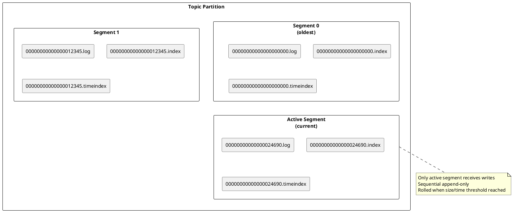
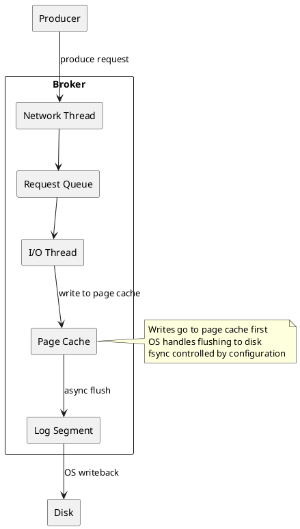
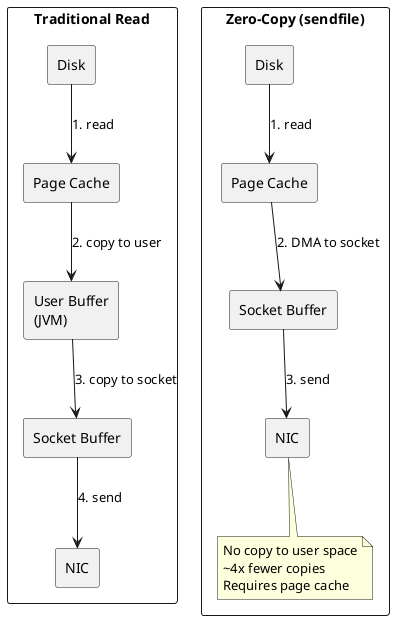
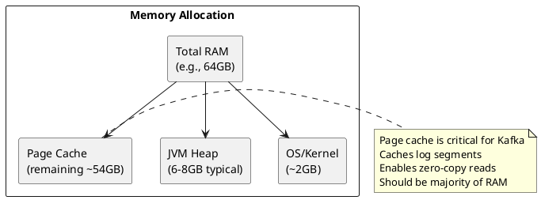
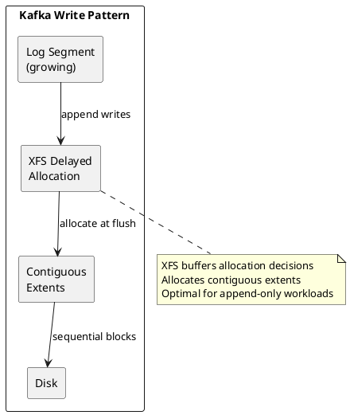
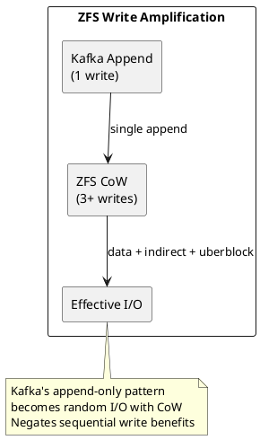
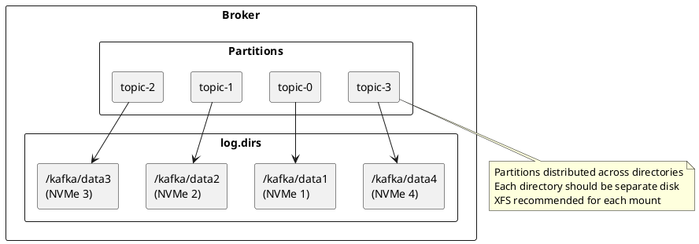

# Filesystem Selection for Kafka

Filesystem choice impacts Kafka's throughput and latency, particularly for high-volume deployments. This guide covers Kafka's I/O architecture, filesystem recommendations, and optimization strategies.

---

## Kafka I/O Architecture

### Log Segment Structure

Kafka stores all data as append-only log segments on disk.



**File types per segment:**

| File | Purpose | I/O Pattern |
|------|---------|-------------|
| `.log` | Message data | Sequential write, sequential/random read |
| `.index` | Offset to position mapping | Sparse writes, memory-mapped reads |
| `.timeindex` | Timestamp to offset mapping | Sparse writes, memory-mapped reads |

### Write Path

Kafka's write path is optimized for sequential I/O.



**Key characteristics:**

- Writes append to active segment only (sequential)
- Data written to OS page cache, not directly to disk
- Configurable fsync behavior (`log.flush.interval.messages`, `log.flush.interval.ms`)
- Default: rely on OS page cache and replication for durability

### Read Path and Zero-Copy

Kafka uses zero-copy (sendfile) for consumer reads, bypassing user space entirely.



**Zero-copy requirements:**

- Data must be in page cache (or will be read from disk)
- Filesystem must support sendfile() - all modern Linux filesystems do
- TLS/SSL disables zero-copy (data must be encrypted in user space)

### Page Cache Dependency

Kafka relies heavily on the OS page cache for performance.



**Page cache sizing:**

| Workload | Recommended Page Cache | Rationale |
|----------|----------------------|-----------|
| **Real-time consumers** | > active data size | Recent data served from cache |
| **Catch-up consumers** | As large as possible | Reduce disk reads for historical data |
| **Mixed workloads** | 50-80% of RAM | Balance between heap and cache |

---

## Filesystem Comparison

### XFS (Recommended)

XFS is the recommended filesystem for Kafka log directories.

**Advantages for Kafka:**

| Feature | Benefit for Kafka |
|---------|-------------------|
| **Allocation groups** | Parallel writes across multiple log directories |
| **Extent-based allocation** | Efficient for large sequential segment files |
| **Delayed allocation** | Better block placement for append workloads |
| **Preallocation** | Reduces fragmentation during segment growth |

**XFS behavior with Kafka workloads:**



### ext4

ext4 is a reasonable alternative, particularly for smaller deployments.

**Comparison with XFS:**

| Aspect | ext4 | XFS |
|--------|------|-----|
| **Sequential writes** | Good | Excellent |
| **Parallel I/O** | Limited (single lock) | Excellent (per-AG) |
| **Large files** | Good (up to 16TB) | Excellent (up to 8EB) |
| **Many directories** | Good | Better (B+ tree dirs) |
| **Extent coalescing** | Good | Better |

**When ext4 is acceptable:**

- Single log directory (no parallelism benefit from XFS)
- Smaller deployments (< 1TB per broker)
- Familiarity and existing tooling

### ZFS (Not Recommended)

ZFS presents similar challenges for Kafka as for Cassandra.

**Issues with Kafka workloads:**

| Challenge | Impact on Kafka |
|-----------|-----------------|
| **Copy-on-write** | Write amplification for append workloads |
| **ARC memory** | Competes with page cache |
| **Checksumming** | CPU overhead (Kafka has CRC32 already) |
| **CoW fragmentation** | Degrades sequential read performance over time |



**If ZFS is required:**

```bash
# Create dataset with Kafka-optimized settings
zfs create -o recordsize=128K \
           -o compression=off \
           -o atime=off \
           -o xattr=sa \
           -o primarycache=metadata \
           -o logbias=throughput \
           tank/kafka

# Limit ARC to leave room for page cache
echo "options zfs zfs_arc_max=4294967296" >> /etc/modprobe.d/zfs.conf  # 4GB
```

### Filesystem Comparison Summary

| Feature | XFS | ext4 | ZFS |
|---------|-----|------|-----|
| **Sequential write** | Excellent | Good | Poor (CoW) |
| **Parallel I/O** | Excellent | Limited | Good |
| **Page cache friendly** | Yes | Yes | Competes (ARC) |
| **Zero-copy support** | Yes | Yes | Yes |
| **Write amplification** | Low | Low | High (2-3x) |
| **Kafka suitability** | Excellent | Good | Poor |

---

## Configuration

### Mount Options

**XFS (recommended):**

```bash
# /etc/fstab
/dev/nvme0n1p1 /kafka/data xfs defaults,noatime,nodiratime 0 2
```

| Option | Purpose |
|--------|---------|
| `noatime` | Disable access time updates (significant for high-throughput) |
| `nodiratime` | Disable directory access time updates |

**ext4:**

```bash
# /etc/fstab
/dev/nvme0n1p1 /kafka/data ext4 defaults,noatime,nodiratime 0 2
```

### Formatting Recommendations

**XFS:**

```bash
# Standard formatting (recommended - uses optimal defaults)
mkfs.xfs -f /dev/nvme0n1p1

# Verify filesystem parameters
xfs_info /dev/nvme0n1p1
```

XFS automatically calculates optimal allocation group count and log size based on device characteristics. Manual tuning is rarely necessary for modern NVMe/SSD storage.

**ext4:**

```bash
# Standard formatting
mkfs.ext4 /dev/nvme0n1p1
```

### Multiple Log Directories

Kafka supports multiple log directories for parallelism and capacity.

```properties
# server.properties
log.dirs=/kafka/data1,/kafka/data2,/kafka/data3,/kafka/data4
```

**Benefits:**

- Distributes I/O across multiple disks
- XFS allocation groups provide additional parallelism per disk
- Partitions distributed round-robin across directories



**Best practices:**

- One filesystem per physical disk (no RAID 0 across directories)
- Use XFS for each mount point
- Equal-sized disks for balanced distribution

---

## Page Cache Optimization

### Kernel Parameters

```bash
# /etc/sysctl.conf

# Dirty page ratios
vm.dirty_ratio = 80              # Max dirty pages before blocking writes
vm.dirty_background_ratio = 5    # Start background writeback

# Alternative: absolute values for large memory systems
# vm.dirty_bytes = 2147483648           # 2GB max dirty
# vm.dirty_background_bytes = 536870912  # 512MB background threshold

# Swappiness
vm.swappiness = 1                # Minimize swapping (0 can cause OOM)

# Page cache pressure
vm.vfs_cache_pressure = 50       # Retain page cache over dentries/inodes
```

**Parameter explanations:**

| Parameter | Recommended | Rationale |
|-----------|-------------|-----------|
| `vm.dirty_ratio` | 80 | Allow large dirty cache before blocking producers |
| `vm.dirty_background_ratio` | 5 | Start flushing early to avoid write stalls |
| `vm.swappiness` | 1 | Keep data in RAM, minimal swap |
| `vm.vfs_cache_pressure` | 50 | Favor page cache retention |

### I/O Scheduler

```bash
# For NVMe/SSD (recommended)
echo none > /sys/block/nvme0n1/queue/scheduler

# For SATA SSD
echo deadline > /sys/block/sda/queue/scheduler

# Persistent configuration (/etc/udev/rules.d/60-kafka.rules)
ACTION=="add|change", KERNEL=="nvme[0-9]*", ATTR{queue/scheduler}="none"
ACTION=="add|change", KERNEL=="sd[a-z]", ATTR{queue/scheduler}="deadline"
```

### Read-Ahead

```bash
# Check current setting
blockdev --getra /dev/nvme0n1

# Set read-ahead (in 512-byte sectors)
# 0 for NVMe (no benefit)
# 256-4096 for HDDs
blockdev --setra 0 /dev/nvme0n1    # NVMe
blockdev --setra 4096 /dev/sda     # HDD (2MB read-ahead)
```

---

## Recommendations

### Decision Matrix

| Deployment | Recommended | Notes |
|------------|-------------|-------|
| **Production (any scale)** | XFS | Best sequential write performance |
| **Small/Dev** | ext4 or XFS | Either acceptable |
| **Multiple disks** | XFS per disk | Leverage allocation group parallelism |
| **Existing ZFS infrastructure** | ZFS with tuning | See ZFS section for required optimizations |

### Configuration Summary

**Optimal Kafka filesystem setup:**

```bash
# Format each disk with XFS
mkfs.xfs -f /dev/nvme0n1
mkfs.xfs -f /dev/nvme1n1

# Mount with optimal options
mount -o noatime,nodiratime /dev/nvme0n1 /kafka/data1
mount -o noatime,nodiratime /dev/nvme1n1 /kafka/data2

# Configure Kafka
# server.properties
log.dirs=/kafka/data1,/kafka/data2
```

**Kernel tuning:**

```bash
# /etc/sysctl.conf
vm.dirty_ratio = 80
vm.dirty_background_ratio = 5
vm.swappiness = 1
vm.vfs_cache_pressure = 50

# Apply
sysctl -p
```

### What to Avoid

| Configuration | Issue |
|---------------|-------|
| **ZFS for production** | Write amplification, ARC competition |
| **RAID 0 across log.dirs** | Single disk failure loses all data |
| **Small page cache** | Increases disk I/O, disables effective zero-copy |
| **High swappiness** | JVM and page cache evicted to swap |
| **atime enabled** | Unnecessary write overhead |

---

## Monitoring

### Filesystem Metrics

```bash
# Disk I/O statistics
iostat -xz 1

# Key metrics:
# - %util: Device utilization (< 80% target)
# - await: Average I/O wait time
# - w/s: Writes per second
```

### Page Cache Statistics

```bash
# Page cache usage
free -h
# Cached column shows page cache size

# Detailed memory info
cat /proc/meminfo | grep -E "Cached|Dirty|Writeback"

# Per-file cache status
vmtouch /kafka/data1/topic-*/*.log
```

### Kafka Log Directory Health

```bash
# Check disk usage per log directory
du -sh /kafka/data*

# Check segment distribution
find /kafka/data* -name "*.log" | wc -l

# Verify XFS health
xfs_info /kafka/data1
xfs_repair -n /dev/nvme0n1  # Dry-run check
```

---

## Summary

| Recommendation | Rationale |
|----------------|-----------|
| Use XFS for all log directories | Optimized for sequential writes, allocation groups enable parallelism |
| Avoid ZFS for production | CoW overhead, ARC competes with page cache |
| Configure multiple log.dirs on separate disks | Distributes I/O, increases throughput |
| Tune page cache parameters | Kafka depends on page cache for performance |
| Use noatime mount option | Eliminates unnecessary metadata writes |
| Leave majority of RAM for page cache | Enables zero-copy, reduces disk I/O |

---

## Related Documentation

- [Performance Overview](index.md) - Complete performance tuning guide
- [Capacity Planning](capacity-planning/index.md) - Sizing recommendations
- [Broker Configuration](../configuration/broker.md) - Broker settings
- [Monitoring](../monitoring/index.md) - Metrics and alerting