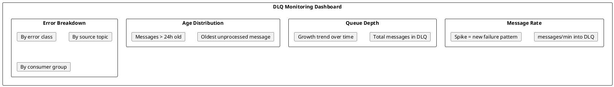
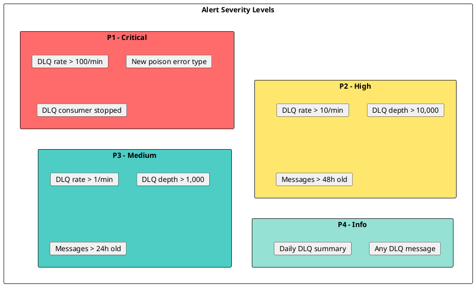
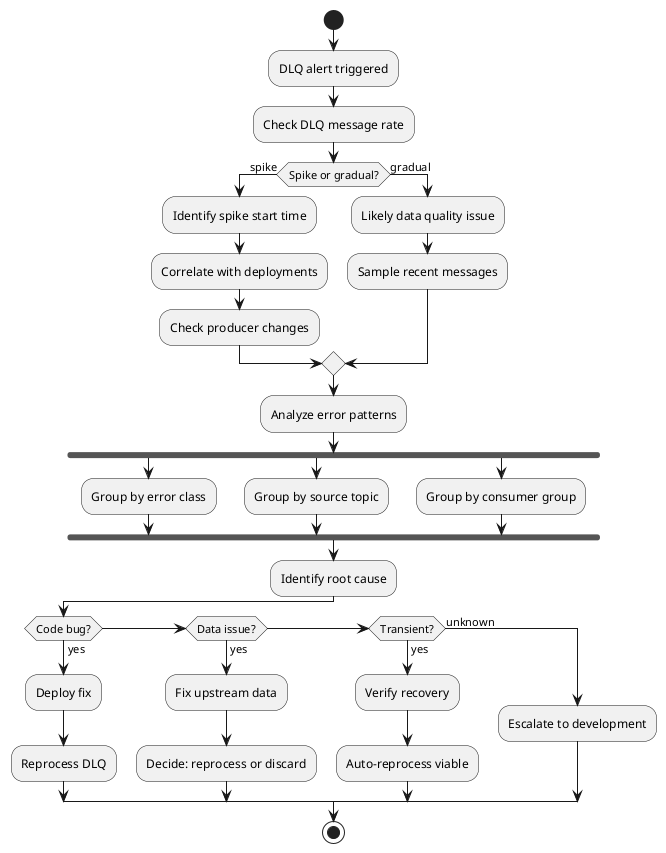
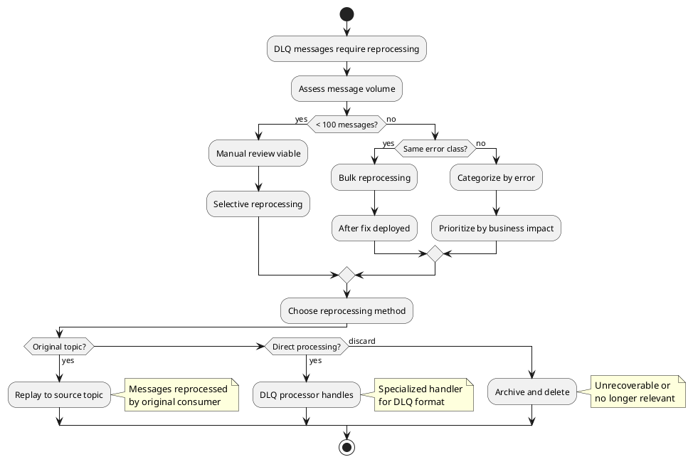
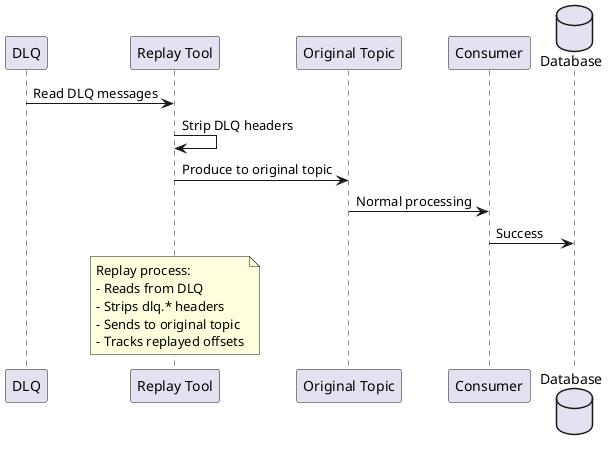
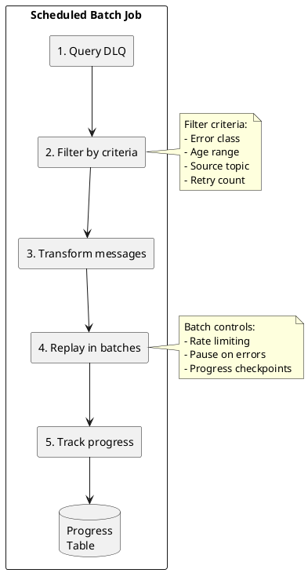
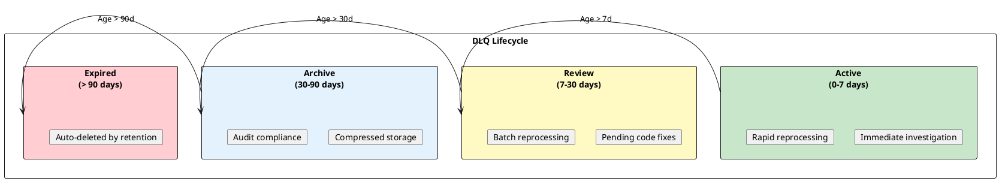
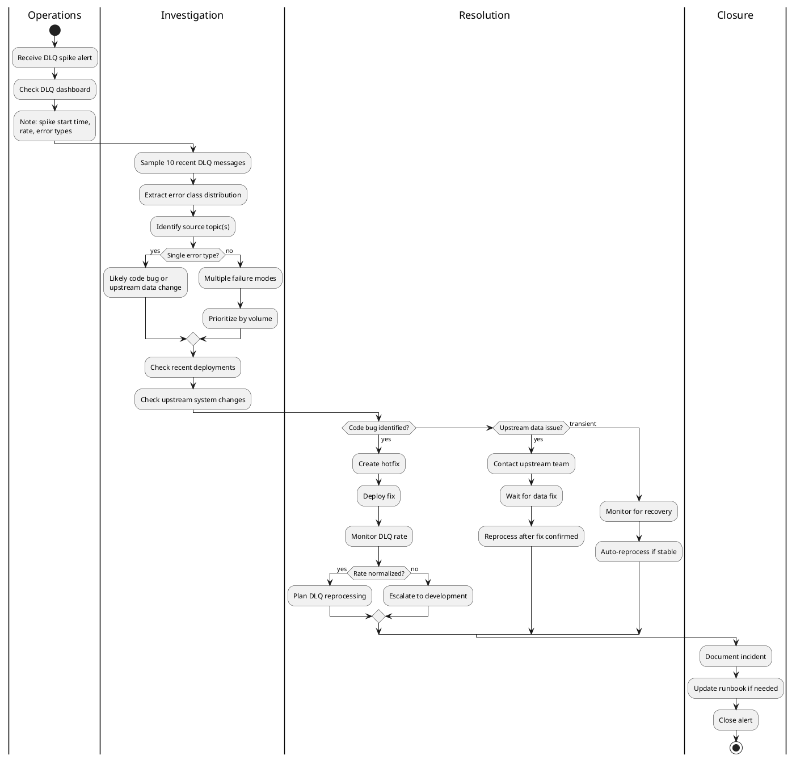

# Operating Dead Letter Queues

This guide covers operational procedures for managing Dead Letter Queues in production Kafka environments. For conceptual background, see [Dead Letter Queue Concepts](../../concepts/dead-letter-queues/index.md). For implementation details, see [Implementing DLQs](../../application-development/error-handling/dead-letter-queues.md).

---

## DLQ Monitoring

### Key Metrics

Monitor DLQ topics for early detection of processing issues.



### Metric Collection

| Metric | Source | Alert Threshold |
|--------|--------|-----------------|
| `dlq.messages.in.rate` | Producer metrics | > 10/min (baseline dependent) |
| `dlq.messages.total` | Consumer lag on DLQ | > 1000 (application dependent) |
| `dlq.oldest.message.age` | Custom consumer | > 24 hours |
| `dlq.error.class.count` | Header aggregation | New error class detected |
| `dlq.source.topic.count` | Header aggregation | Spike from single topic |

### JMX Metrics

```bash
# Get DLQ topic message count
kafka-run-class.sh kafka.tools.JmxTool \
  --object-name 'kafka.server:type=BrokerTopicMetrics,name=MessagesInPerSec,topic=orders.dlq' \
  --jmx-url service:jmx:rmi:///jndi/rmi://broker1:9999/jmxrmi
```

---

## Alerting Strategy

### Alert Tiers



### Alert Rules

Configure alerts based on the severity tiers above. Key alert conditions:

| Alert | Condition | Severity |
|-------|-----------|----------|
| **DLQHighMessageRate** | DLQ ingestion rate > 10 messages/min sustained for 5 minutes | High |
| **DLQDepthCritical** | Unprocessed DLQ messages > 10,000 for 10 minutes | Critical |
| **DLQConsumerStopped** | DLQ processor consumption rate = 0 for 15 minutes | Critical |
| **DLQMessageAgeWarning** | Oldest unprocessed message > 24 hours | Medium |
| **DLQNewErrorType** | Previously unseen error class detected | High |

For AxonOps alerting configuration, see [Setup Alert Rules](../../../../how-to/setup-alert-rules.md).

---

## DLQ Investigation

### Triage Workflow



### Sampling DLQ Messages

```bash
# Read recent DLQ messages with headers
kafka-console-consumer.sh \
  --bootstrap-server broker1:9092 \
  --topic orders.dlq \
  --from-beginning \
  --max-messages 10 \
  --property print.headers=true \
  --property print.timestamp=true \
  --property print.key=true

# Filter by error type (requires header parsing)
kafka-console-consumer.sh \
  --bootstrap-server broker1:9092 \
  --topic orders.dlq \
  --from-beginning \
  --max-messages 100 \
  --property print.headers=true | \
  grep "dlq.error.class.*SerializationException"
```

### Error Analysis Script

```bash
#!/bin/bash
# analyze-dlq.sh - Analyze DLQ error distribution

DLQ_TOPIC=$1
BROKER=$2
SAMPLE_SIZE=${3:-1000}

echo "Analyzing $DLQ_TOPIC (sample: $SAMPLE_SIZE messages)"

# Extract error classes and count
kafka-console-consumer.sh \
  --bootstrap-server $BROKER \
  --topic $DLQ_TOPIC \
  --from-beginning \
  --max-messages $SAMPLE_SIZE \
  --property print.headers=true 2>/dev/null | \
  grep -oP 'dlq\.error\.class:\K[^,]+' | \
  sort | uniq -c | sort -rn

echo ""
echo "Error distribution by source topic:"
kafka-console-consumer.sh \
  --bootstrap-server $BROKER \
  --topic $DLQ_TOPIC \
  --from-beginning \
  --max-messages $SAMPLE_SIZE \
  --property print.headers=true 2>/dev/null | \
  grep -oP 'dlq\.original\.topic:\K[^,]+' | \
  sort | uniq -c | sort -rn
```

---

## Reprocessing Strategies

### Decision Framework



### Method 1: Replay to Original Topic



#### Replay Tool

```bash
#!/bin/bash
# replay-dlq.sh - Replay DLQ messages to original topic

DLQ_TOPIC=$1
BROKER=$2
MAX_MESSAGES=${3:-100}

# Create replay consumer group for tracking
GROUP_ID="dlq-replay-$(date +%s)"

echo "Replaying up to $MAX_MESSAGES messages from $DLQ_TOPIC"
echo "Consumer group: $GROUP_ID"

# Use kafkacat/kcat for replay (preserves headers, allows transformation)
kcat -C -b $BROKER -t $DLQ_TOPIC -G $GROUP_ID -c $MAX_MESSAGES -f '%h\n%k\n%s\n---\n' | \
while IFS= read -r headers && IFS= read -r key && IFS= read -r value && IFS= read -r sep; do
    # Extract original topic from headers
    original_topic=$(echo "$headers" | grep -oP 'dlq\.original\.topic=\K[^,]+')

    if [ -n "$original_topic" ]; then
        # Produce to original topic (without dlq headers)
        echo "$value" | kcat -P -b $BROKER -t "$original_topic" -k "$key"
        echo "Replayed to $original_topic: key=$key"
    fi
done
```

### Method 2: DLQ Processor Service

```java
@Service
public class DLQProcessor {

    @KafkaListener(topics = "orders.dlq", groupId = "dlq-processor")
    public void processDLQ(ConsumerRecord<String, byte[]> record) {
        String errorClass = getHeader(record, "dlq.error.class");
        String originalTopic = getHeader(record, "dlq.original.topic");
        int retryCount = Integer.parseInt(getHeader(record, "dlq.retry.count"));

        DLQAction action = determineAction(errorClass, retryCount);

        switch (action) {
            case REPLAY:
                replayToOriginalTopic(record, originalTopic);
                break;
            case MANUAL_REVIEW:
                storeForManualReview(record);
                break;
            case DISCARD:
                logAndDiscard(record);
                break;
        }
    }

    private DLQAction determineAction(String errorClass, int retryCount) {
        // Deserialization errors: likely need code fix, manual review
        if (errorClass.contains("SerializationException")) {
            return DLQAction.MANUAL_REVIEW;
        }

        // Transient errors that exceeded retry: try replay
        if (errorClass.contains("TimeoutException") && retryCount < 10) {
            return DLQAction.REPLAY;
        }

        // Validation errors: check if data was fixed upstream
        if (errorClass.contains("ValidationException")) {
            return DLQAction.REPLAY;  // Will fail again if not fixed
        }

        return DLQAction.MANUAL_REVIEW;
    }
}
```

### Method 3: Batch Reprocessing Job



---

## Retention and Cleanup

### Retention Policy



### Topic Configuration

```bash
# Set DLQ retention to 30 days
kafka-configs.sh --bootstrap-server broker1:9092 \
  --alter --entity-type topics --entity-name orders.dlq \
  --add-config retention.ms=2592000000

# Set DLQ retention to 90 days for compliance
kafka-configs.sh --bootstrap-server broker1:9092 \
  --alter --entity-type topics --entity-name payments.dlq \
  --add-config retention.ms=7776000000

# Verify configuration
kafka-configs.sh --bootstrap-server broker1:9092 \
  --describe --entity-type topics --entity-name orders.dlq
```

### Archival Process

```bash
#!/bin/bash
# archive-dlq.sh - Archive old DLQ messages to cold storage

DLQ_TOPIC=$1
BROKER=$2
CUTOFF_DAYS=$3
S3_BUCKET=$4

CUTOFF_TS=$(($(date +%s) - ($CUTOFF_DAYS * 86400)))000

echo "Archiving messages older than $CUTOFF_DAYS days from $DLQ_TOPIC"

# Export old messages to file
kafka-console-consumer.sh \
  --bootstrap-server $BROKER \
  --topic $DLQ_TOPIC \
  --from-beginning \
  --property print.timestamp=true \
  --property print.headers=true \
  --property print.key=true \
  --timeout-ms 30000 | \
awk -v cutoff="$CUTOFF_TS" '
  /^CreateTime:/ {
    ts = $2
    if (ts < cutoff) { print; getline; print; getline; print }
  }
' > /tmp/dlq-archive-$(date +%Y%m%d).json

# Compress and upload to S3
gzip /tmp/dlq-archive-$(date +%Y%m%d).json
aws s3 cp /tmp/dlq-archive-$(date +%Y%m%d).json.gz \
  s3://$S3_BUCKET/dlq-archives/$DLQ_TOPIC/

echo "Archived to s3://$S3_BUCKET/dlq-archives/$DLQ_TOPIC/"
```

---

## Incident Response Playbook

### DLQ Spike Runbook



### Quick Commands Reference

```bash
# Check DLQ depth
kafka-consumer-groups.sh --bootstrap-server broker1:9092 \
  --describe --group dlq-processor | grep "orders.dlq"

# Get DLQ message count
kafka-run-class.sh kafka.tools.GetOffsetShell \
  --broker-list broker1:9092 \
  --topic orders.dlq --time -1

# Sample recent errors
kafka-console-consumer.sh --bootstrap-server broker1:9092 \
  --topic orders.dlq --from-beginning --max-messages 5 \
  --property print.headers=true

# Pause DLQ consumer (for investigation)
kafka-consumer-groups.sh --bootstrap-server broker1:9092 \
  --group dlq-processor --topic orders.dlq \
  --reset-offsets --to-current --execute

# Count messages by error type (last 1000)
kafka-console-consumer.sh --bootstrap-server broker1:9092 \
  --topic orders.dlq --from-beginning --max-messages 1000 \
  --property print.headers=true 2>/dev/null | \
  grep -oP 'dlq\.error\.class:\K[^\s,]+' | sort | uniq -c | sort -rn
```

---

## Capacity Planning

### DLQ Sizing Guidelines

| Factor | Consideration |
|--------|---------------|
| **Expected error rate** | 0.1-1% of main topic volume typical |
| **Retention period** | 30-90 days for investigation window |
| **Message size** | Same as source + ~500 bytes headers |
| **Replication factor** | Match or exceed source topic RF |
| **Partition count** | 1-3 sufficient for most DLQs |

### Capacity Formula

```
DLQ Storage = Main Topic Volume × Error Rate × Retention Days × RF

Example:
- Main topic: 100 GB/day
- Error rate: 0.5%
- Retention: 30 days
- RF: 3

DLQ Storage = 100 GB × 0.005 × 30 × 3 = 45 GB
```

---

## Related Documentation

- [Dead Letter Queue Concepts](../../concepts/dead-letter-queues/index.md) - Conceptual overview
- [Implementing DLQs](../../application-development/error-handling/dead-letter-queues.md) - Code patterns
- [Monitoring Overview](../monitoring/index.md) - Kafka monitoring setup
- [Troubleshooting Guide](index.md) - General troubleshooting
