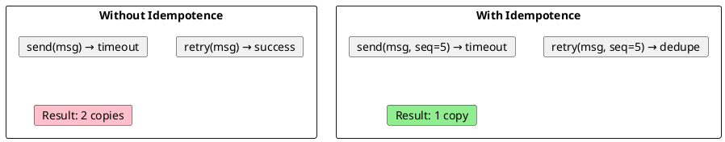

# Kafka Idempotent Producer

The idempotent producer prevents duplicate messages caused by producer retries within a single session. This document covers configuration and usage patterns.

---

## Overview



The idempotent producer assigns sequence numbers to each batch, allowing brokers to detect and reject duplicates.

---

## Configuration

```properties
# Enable idempotent producer (default true in Kafka 3.0+)
enable.idempotence=true
```

When enabled, these settings are enforced:

| Configuration | Required Value | Reason |
|---------------|:--------------:|--------|
| `acks` | `all` | Durability across replicas |
| `retries` | > 0 | Allow retries |
| `max.in.flight.requests.per.connection` | ≤ 5 | Maintain sequence ordering |

---

## How It Works

| Component | Purpose |
|-----------|---------|
| **Producer ID (PID)** | Unique identifier assigned on startup |
| **Sequence Number** | Per-partition counter, incremented per batch |
| **Epoch** | Fences zombie producers |

The broker validates sequences:

| Condition | Result |
|-----------|--------|
| `seq == expected` | Accept, increment expected |
| `seq < expected` | Duplicate, reject |
| `seq > expected` | Gap, reject |

---

## Scope and Limitations

| Covered | Not Covered |
|---------|-------------|
| Retries within session | Producer restart (new PID) |
| Network timeouts | Multiple producer instances |
| Transient broker failures | Application-level retry |

For cross-session or cross-partition atomicity, use [transactions](transactions.md).

---

## Java Example

```java
Properties props = new Properties();
props.put(ProducerConfig.BOOTSTRAP_SERVERS_CONFIG, "kafka:9092");
props.put(ProducerConfig.ENABLE_IDEMPOTENCE_CONFIG, true);
props.put(ProducerConfig.KEY_SERIALIZER_CLASS_CONFIG, StringSerializer.class);
props.put(ProducerConfig.VALUE_SERIALIZER_CLASS_CONFIG, StringSerializer.class);

try (KafkaProducer<String, String> producer = new KafkaProducer<>(props)) {
    for (int i = 0; i < 100; i++) {
        producer.send(new ProducerRecord<>("events", "key-" + i, "value-" + i),
            (metadata, exception) -> {
                if (exception != null) {
                    log.error("Send failed", exception);
                }
            });
    }
}
```

---

## Related Documentation

- [Producer Guide](index.md) - Producer overview
- [Transactions](transactions.md) - Transactional producer
- [Delivery Semantics](../concepts/delivery-semantics/exactly-once.md) - EOS details
- [Protocol APIs](../architecture/client-connections/protocol-apis-transaction.md) - Protocol internals
