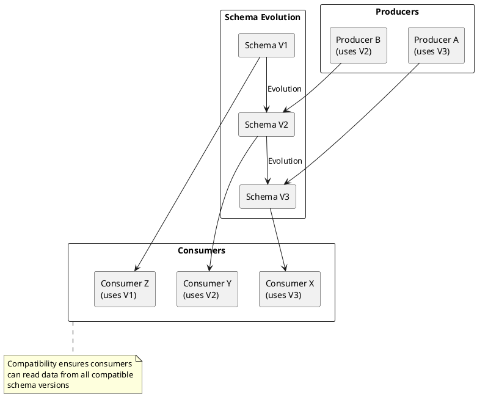

# Schema Compatibility

Schema compatibility rules govern how schemas may evolve while maintaining interoperability between producers and consumers.

---

## Compatibility Overview



---

## Compatibility Modes

| Mode | Description | Use Case |
|------|-------------|----------|
| **BACKWARD** | New schema can read old data | Default. Consumer upgrades first |
| **BACKWARD_TRANSITIVE** | New schema can read all previous versions | Strict backward compatibility |
| **FORWARD** | Old schema can read new data | Producer upgrades first |
| **FORWARD_TRANSITIVE** | All previous schemas can read new data | Strict forward compatibility |
| **FULL** | Both backward and forward compatible | Most restrictive |
| **FULL_TRANSITIVE** | Full compatibility with all versions | Maximum safety |
| **NONE** | No compatibility checking | Development only |

---

## Backward Compatibility

New schema versions must be able to read data written with the previous schema version.

### Allowed Changes

| Change | Backward Compatible | Reason |
|--------|---------------------|--------|
| Add optional field with default | Yes | New consumers ignore unknown defaults |
| Remove field | Yes | New consumers don't need it |
| Change optional to required | No | Old data lacks required field |
| Add required field | No | Old data lacks field |
| Change field type | Usually No | Type mismatch |

### Example: Adding Optional Field

```json
// Schema V1
{
  "type": "record",
  "name": "User",
  "fields": [
    {"name": "id", "type": "string"},
    {"name": "email", "type": "string"}
  ]
}

// Schema V2 (backward compatible)
{
  "type": "record",
  "name": "User",
  "fields": [
    {"name": "id", "type": "string"},
    {"name": "email", "type": "string"},
    {"name": "phone", "type": ["null", "string"], "default": null}
  ]
}
```

### Deployment Order (Backward)

```
1. Upgrade consumers to V2
2. Verify consumers handle V1 and V2 data
3. Upgrade producers to V2
```

---

## Forward Compatibility

Old schema versions must be able to read data written with the new schema version.

### Allowed Changes

| Change | Forward Compatible | Reason |
|--------|---------------------|--------|
| Add field | Yes | Old consumers ignore unknown fields |
| Remove optional field with default | Yes | Old consumers use default |
| Remove required field | No | Old consumers expect field |
| Add required field without default | No | Old consumers can't handle |

### Example: Removing Optional Field

```json
// Schema V1
{
  "type": "record",
  "name": "User",
  "fields": [
    {"name": "id", "type": "string"},
    {"name": "email", "type": "string"},
    {"name": "legacy_field", "type": ["null", "string"], "default": null}
  ]
}

// Schema V2 (forward compatible)
{
  "type": "record",
  "name": "User",
  "fields": [
    {"name": "id", "type": "string"},
    {"name": "email", "type": "string"}
  ]
}
```

### Deployment Order (Forward)

```
1. Upgrade producers to V2
2. Verify old consumers handle V2 data
3. Upgrade consumers to V2
```

---

## Full Compatibility

Both backward and forward compatible. Most restrictive mode.

### Allowed Changes

| Change | Full Compatible |
|--------|-----------------|
| Add optional field with default | Yes |
| Remove optional field with default | Yes |
| Add required field | No |
| Remove required field | No |
| Rename field | No |
| Change field type | No |

### Example: Safe Evolution

```json
// Schema V1
{
  "type": "record",
  "name": "User",
  "fields": [
    {"name": "id", "type": "string"},
    {"name": "email", "type": "string"},
    {"name": "status", "type": ["null", "string"], "default": null}
  ]
}

// Schema V2 (full compatible - added optional field)
{
  "type": "record",
  "name": "User",
  "fields": [
    {"name": "id", "type": "string"},
    {"name": "email", "type": "string"},
    {"name": "status", "type": ["null", "string"], "default": null},
    {"name": "role", "type": ["null", "string"], "default": null}
  ]
}

// Schema V3 (full compatible - removed optional field)
{
  "type": "record",
  "name": "User",
  "fields": [
    {"name": "id", "type": "string"},
    {"name": "email", "type": "string"},
    {"name": "role", "type": ["null", "string"], "default": null}
  ]
}
```

---

## Transitive Compatibility

Transitive modes check compatibility against all previous versions, not just the immediately preceding one.

| Mode | Checks Against |
|------|----------------|
| BACKWARD | V(n-1) only |
| BACKWARD_TRANSITIVE | V1, V2, ..., V(n-1) |
| FORWARD | V(n-1) only |
| FORWARD_TRANSITIVE | V1, V2, ..., V(n-1) |
| FULL | V(n-1) only |
| FULL_TRANSITIVE | V1, V2, ..., V(n-1) |

### When to Use Transitive

- Long-lived data with multiple schema versions
- Consumers may read historical data from any version
- Strict compliance requirements
- Data reprocessing scenarios

---

## Configuring Compatibility

### Global Default

```bash
# Set global default
curl -X PUT http://schema-registry:8081/config \
  -H "Content-Type: application/vnd.schemaregistry.v1+json" \
  -d '{"compatibility": "BACKWARD"}'

# Get global config
curl http://schema-registry:8081/config
```

### Per-Subject Configuration

```bash
# Set subject-specific compatibility
curl -X PUT http://schema-registry:8081/config/users-value \
  -H "Content-Type: application/vnd.schemaregistry.v1+json" \
  -d '{"compatibility": "FULL"}'

# Get subject config
curl http://schema-registry:8081/config/users-value
```

### Test Compatibility

```bash
# Test if schema is compatible
curl -X POST http://schema-registry:8081/compatibility/subjects/users-value/versions/latest \
  -H "Content-Type: application/vnd.schemaregistry.v1+json" \
  -d '{
    "schema": "{\"type\":\"record\",\"name\":\"User\",\"fields\":[{\"name\":\"id\",\"type\":\"string\"}]}"
  }'

# Response
{"is_compatible": true}
```

---

## Schema Evolution Rules by Format

### Avro Evolution Rules

| Change | Backward | Forward | Full |
|--------|----------|---------|------|
| Add field with default | Yes | Yes | Yes |
| Add field without default | No | Yes | No |
| Remove field with default | Yes | Yes | Yes |
| Remove field without default | Yes | No | No |
| Rename field (with alias) | Yes | Yes | Yes |
| Change field type | See below | See below | See below |

**Avro Type Promotions (Allowed):**

| From | To |
|------|-----|
| int | long, float, double |
| long | float, double |
| float | double |
| string | bytes |
| bytes | string |

### Protobuf Evolution Rules

| Change | Safe |
|--------|------|
| Add field | Yes |
| Remove field | Yes (deprecated recommended) |
| Rename field | Yes (field number unchanged) |
| Change field number | No |
| Change field type | No (except compatible types) |
| Change repeated to optional | No |

**Protobuf Best Practices:**

```protobuf
// V1
message User {
  string id = 1;
  string email = 2;
}

// V2 - Safe evolution
message User {
  string id = 1;
  string email = 2;
  string phone = 3;  // New optional field
  reserved 4;        // Reserve for future use
  reserved "legacy_field";  // Reserve removed field name
}
```

### JSON Schema Evolution Rules

| Change | Backward | Forward |
|--------|----------|---------|
| Add optional property | Yes | Yes |
| Add required property | No | Yes |
| Remove property | Yes | No |
| Make required optional | Yes | No |
| Make optional required | No | Yes |
| Narrow type constraint | No | Yes |
| Widen type constraint | Yes | No |

---

## Migration Strategies

### Strategy 1: Dual-Write

Write data in both old and new formats during transition.

```
1. Deploy new schema version
2. Update producers to write both formats
3. Migrate consumers to new format
4. Remove old format writes
```

### Strategy 2: Topic Migration

Create new topic for new schema version.

```
1. Create new topic with new schema
2. Deploy consumers reading both topics
3. Switch producers to new topic
4. Drain old topic
5. Remove old topic consumers
```

### Strategy 3: In-Place Evolution

Evolve schema within same topic (requires compatibility).

```
1. Register compatible schema version
2. Deploy consumers (backward compatible)
3. Deploy producers (forward compatible)
```

---

## Troubleshooting

### Compatibility Check Failures

```bash
# Get detailed compatibility check
curl -X POST http://schema-registry:8081/compatibility/subjects/users-value/versions/latest?verbose=true \
  -H "Content-Type: application/vnd.schemaregistry.v1+json" \
  -d '{"schema": "..."}'
```

### Common Errors

| Error | Cause | Solution |
|-------|-------|----------|
| `Schema being registered is incompatible` | Violates compatibility rules | Modify schema or change compatibility mode |
| `Reader expected field not present in writer` | Missing required field | Add default value to field |
| `Type mismatch` | Incompatible type change | Use union types or new field |

### Debug Schema Differences

```bash
# List all versions
curl http://schema-registry:8081/subjects/users-value/versions

# Compare schemas
# Fetch V1 and V2, compare manually or use schema tools
curl http://schema-registry:8081/subjects/users-value/versions/1
curl http://schema-registry:8081/subjects/users-value/versions/2
```

---

## Related Documentation

- [Schema Registry Overview](../index.md) - Architecture and concepts
- [Schema Formats](../schema-formats/index.md) - Avro, Protobuf, JSON Schema
- [Data Integration](../../concepts/data-integration/index.md) - Integration patterns