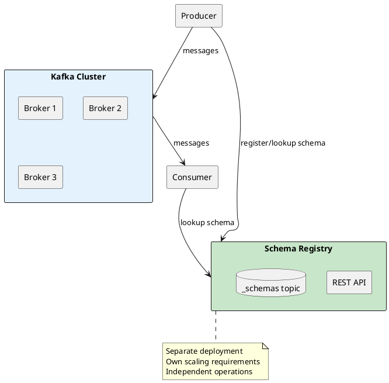
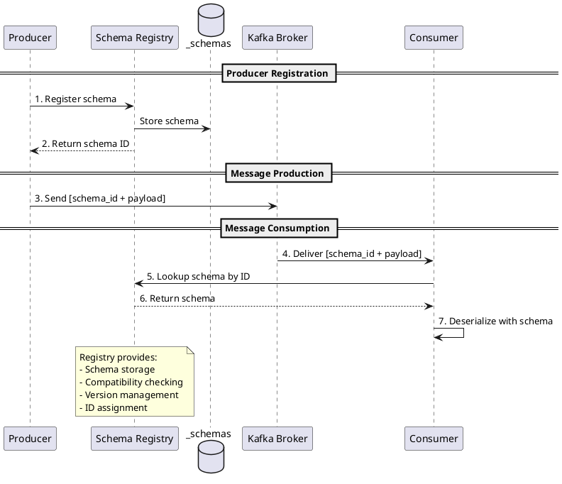
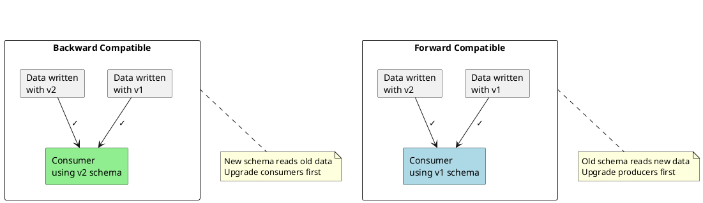

# Schema Registry

Schema Registry provides centralized schema management for Apache Kafka, ensuring data compatibility between producers and consumers.

!!! info "Schema Registry is a Separate Service"
    Schema Registry is **not part of Apache Kafka**. It is a standalone service that runs separately from Kafka brokers and must be deployed, operated, and scaled independently.

---

## What is Schema Registry?

Schema Registry is an external service that stores and manages schemas for Kafka messages. Producers and consumers communicate with Schema Registry via REST API to register, retrieve, and validate schemas, while continuing to read and write data through Kafka brokers.



### Why a Separate Service?

Apache Kafka is designed to be a high-performance, schema-agnostic message broker. Kafka brokers store and deliver bytes without understanding the structure of message content.

| Design Decision | Rationale |
|-----------------|-----------|
| **Broker simplicity** | Brokers focus on storage and delivery, not data validation |
| **Performance** | No parsing or validation overhead in the critical path |
| **Flexibility** | Applications choose their own serialization formats |
| **Independent scaling** | Schema operations scale separately from message throughput |

Schema enforcement happens at the client level—producers serialize with a schema, consumers deserialize with a schema—while the broker remains unaware of message structure. Schema Registry provides the coordination layer that makes this work across distributed applications.

---

## Schema Registry Products

Multiple Schema Registry implementations exist, each with different licensing, features, and deployment models.

### Confluent Schema Registry

The original Schema Registry, created by Confluent (the company founded by Apache Kafka's creators). First released as part of Confluent Platform around 2015.

| Aspect | Details |
|--------|---------|
| **License** | Confluent Community License (source-available, not open source) |
| **Formats** | Avro, Protobuf, JSON Schema |
| **Storage** | Kafka topic (`_schemas`) |
| **Deployment** | Self-managed or Confluent Cloud |
| **Ecosystem** | Largest ecosystem of client libraries, connectors, tools |

Confluent Schema Registry is the de facto standard—most documentation, tutorials, and client libraries assume this implementation.

### Apicurio Registry

Open source registry developed by Red Hat, supporting multiple artifact types beyond Kafka schemas.

| Aspect | Details |
|--------|---------|
| **License** | Apache 2.0 (fully open source) |
| **Formats** | Avro, Protobuf, JSON Schema, OpenAPI, AsyncAPI, GraphQL, WSDL |
| **Storage** | Kafka, PostgreSQL, or SQL Server |
| **Deployment** | Self-managed or Red Hat OpenShift |
| **Ecosystem** | Confluent SerDe compatible mode available |

Apicurio is the choice for organizations requiring open source licensing or needing to manage API specifications alongside Kafka schemas.

### Karapace

Open source drop-in replacement for Confluent Schema Registry, developed by Aiven.

| Aspect | Details |
|--------|---------|
| **License** | Apache 2.0 (fully open source) |
| **Formats** | Avro, Protobuf, JSON Schema |
| **Storage** | Kafka topic |
| **Deployment** | Self-managed or Aiven Cloud |
| **Ecosystem** | API-compatible with Confluent Schema Registry |

Karapace aims for 1:1 compatibility with Confluent Schema Registry API, enabling migration without client changes.

### AWS Glue Schema Registry

Fully managed schema registry integrated with AWS services.

| Aspect | Details |
|--------|---------|
| **License** | Proprietary (AWS managed service) |
| **Formats** | Avro, JSON Schema, Protobuf |
| **Storage** | AWS managed |
| **Deployment** | AWS only (serverless) |
| **Ecosystem** | Integrates with MSK, Kinesis, Lambda, Glue ETL |

AWS Glue Schema Registry is appropriate for AWS-centric architectures using Amazon MSK.

### Azure Schema Registry

Schema registry for Azure Event Hubs, supporting Kafka protocol.

| Aspect | Details |
|--------|---------|
| **License** | Proprietary (Azure managed service) |
| **Formats** | Avro, JSON |
| **Storage** | Azure managed |
| **Deployment** | Azure only |
| **Ecosystem** | Integrates with Event Hubs, Azure Functions |

### Comparison Summary

| Registry | License | Cloud Option | Confluent API Compatible |
|----------|---------|--------------|-------------------------|
| **Confluent** | Community License | Confluent Cloud | ✅ (reference implementation) |
| **Apicurio** | Apache 2.0 | Red Hat OpenShift | ✅ (compatibility mode) |
| **Karapace** | Apache 2.0 | Aiven Cloud | ✅ (drop-in replacement) |
| **AWS Glue** | Proprietary | AWS only | ❌ (AWS SDK required) |
| **Azure** | Proprietary | Azure only | ❌ (Azure SDK required) |

!!! tip "Migration Considerations"
    Karapace and Apicurio offer Confluent API compatibility, enabling migration from Confluent Schema Registry without changing client code. AWS Glue and Azure Schema Registry require AWS/Azure-specific client libraries.

---

## What is a Schema?

A schema is a formal definition of data structure—it specifies the fields, their types, and constraints that data must conform to.

| Aspect | Description |
|--------|-------------|
| **Fields** | Named elements that make up the data (e.g., `id`, `name`, `timestamp`) |
| **Types** | Data type of each field (e.g., string, integer, boolean, array) |
| **Constraints** | Rules fields must follow (e.g., required, nullable, valid range) |
| **Relationships** | How nested structures and references work |

### Schema vs Schemaless

| Approach | Characteristics |
|----------|-----------------|
| **Schema-based** | Structure defined upfront; validated at write time; compatible evolution enforced |
| **Schemaless** | Flexible structure; validated at read time (if at all); evolution is implicit |

Kafka itself is schemaless—brokers store bytes without understanding their structure. Schema Registry adds schema enforcement on top of Kafka.

### Example: User Record Schema

```json
{
  "type": "record",
  "name": "User",
  "fields": [
    {"name": "id", "type": "long"},
    {"name": "name", "type": "string"},
    {"name": "email", "type": ["null", "string"], "default": null},
    {"name": "created_at", "type": {"type": "long", "logicalType": "timestamp-millis"}}
  ]
}
```

This Avro schema specifies:

- `id` must be a 64-bit integer
- `name` must be a string
- `email` is optional (nullable with null default)
- `created_at` is a timestamp represented as milliseconds

Any data that does not conform to this structure is rejected at serialization time.

---

## Schema Management Benefits

Kafka topics are schema-agnostic—the broker stores bytes without understanding their structure. This flexibility becomes problematic when multiple applications produce and consume the same topics.


### Problems Without Schema Management

| Problem | Impact |
|---------|--------|
| **Format inconsistency** | Producers use different field names, types, or structures |
| **Silent breakage** | Schema changes break consumers without warning |
| **No contract enforcement** | Documentation becomes stale; no runtime validation |
| **Difficult evolution** | Cannot safely add or remove fields |
| **Debugging complexity** | Hard to understand data format across systems |

---

## Schema Registry Architecture

Schema Registry is a separate service that stores schemas in a Kafka topic (`_schemas`) and provides a REST API for schema operations.



### Wire Format

Messages produced with Schema Registry include a schema ID prefix:

```
| Magic Byte (1) | Schema ID (4) | Payload (variable) |
|     0x00       |   00 00 00 01 |   [serialized data] |
```

| Component | Size | Description |
|-----------|------|-------------|
| **Magic byte** | 1 byte | Always 0x00 (indicates Schema Registry format) |
| **Schema ID** | 4 bytes | Big-endian integer identifying the schema |
| **Payload** | Variable | Serialized data (Avro, Protobuf, or JSON) |

This format allows consumers to deserialize messages without prior knowledge of the schema—they retrieve the schema from the registry using the embedded ID.

---

## Schema Formats

Schema Registry supports three serialization formats:

### Apache Avro

Avro is the most widely used format with Kafka due to its compact binary encoding and rich schema evolution support.

```json
{
  "type": "record",
  "name": "User",
  "namespace": "com.example",
  "fields": [
    {"name": "id", "type": "long"},
    {"name": "name", "type": "string"},
    {"name": "email", "type": ["null", "string"], "default": null}
  ]
}
```

| Characteristic | Avro |
|----------------|------|
| **Encoding** | Binary (compact) |
| **Schema required** | For both serialization and deserialization |
| **Evolution support** | Excellent (defaults, unions) |
| **Language support** | Java, Python, C#, Go, others |
| **Typical use case** | Data pipelines, Kafka Connect |

### Protocol Buffers (Protobuf)

Protobuf offers efficient binary encoding with strong typing and is popular in gRPC-based systems.

```protobuf
syntax = "proto3";

message User {
  int64 id = 1;
  string name = 2;
  optional string email = 3;
}
```

| Characteristic | Protobuf |
|----------------|----------|
| **Encoding** | Binary (compact) |
| **Schema required** | For both serialization and deserialization |
| **Evolution support** | Good (field numbers, optional) |
| **Language support** | Excellent (official support for many languages) |
| **Typical use case** | Microservices, systems already using gRPC |

### JSON Schema

JSON Schema validates JSON documents and is useful when human readability is required.

```json
{
  "$schema": "http://json-schema.org/draft-07/schema#",
  "type": "object",
  "properties": {
    "id": {"type": "integer"},
    "name": {"type": "string"},
    "email": {"type": "string"}
  },
  "required": ["id", "name"]
}
```

| Characteristic | JSON Schema |
|----------------|-------------|
| **Encoding** | JSON (human-readable) |
| **Schema required** | Only for validation |
| **Evolution support** | Limited |
| **Language support** | Universal (JSON everywhere) |
| **Typical use case** | APIs, debugging, human inspection |

### Format Comparison

| Aspect | Avro | Protobuf | JSON Schema |
|--------|:----:|:--------:|:-----------:|
| **Message size** | Small | Small | Large |
| **Serialization speed** | Fast | Fast | Moderate |
| **Human readable** | No | No | Yes |
| **Schema evolution** | Excellent | Good | Limited |
| **Kafka ecosystem support** | Excellent | Good | Good |

→ [Schema Formats Guide](schema-formats/index.md)

---

## Compatibility

Schema Registry enforces compatibility rules when schemas evolve. Compatibility ensures that schema changes do not break existing producers or consumers.



### Compatibility Modes

| Mode | Rule | Upgrade Order |
|------|------|---------------|
| **BACKWARD** | New schema can read data written with old schema | Consumers first |
| **BACKWARD_TRANSITIVE** | New schema can read data from all previous versions | Consumers first |
| **FORWARD** | Old schema can read data written with new schema | Producers first |
| **FORWARD_TRANSITIVE** | All previous schemas can read new data | Producers first |
| **FULL** | Both backward and forward compatible | Any order |
| **FULL_TRANSITIVE** | Full compatibility with all versions | Any order |
| **NONE** | No compatibility checking | Not recommended |

### Safe Schema Changes

| Change Type | BACKWARD | FORWARD | FULL |
|-------------|:--------:|:-------:|:----:|
| Add optional field with default | ✅ | ❌ | ❌ |
| Remove optional field with default | ❌ | ✅ | ❌ |
| Add required field | ❌ | ❌ | ❌ |
| Remove required field | ❌ | ❌ | ❌ |
| Add optional field (Avro union with null) | ✅ | ✅ | ✅ |
| Remove optional field (Avro union with null) | ✅ | ✅ | ✅ |

→ [Compatibility Guide](compatibility/index.md)

---

## Subjects and Naming

Schemas are organized into subjects. The subject naming strategy determines how schemas are associated with topics.

### Naming Strategies

| Strategy | Subject Name | Use Case |
|----------|--------------|----------|
| **TopicNameStrategy** | `<topic>-key`, `<topic>-value` | One schema per topic (default) |
| **RecordNameStrategy** | `<record-namespace>.<record-name>` | Multiple record types per topic |
| **TopicRecordNameStrategy** | `<topic>-<record-namespace>.<record-name>` | Multiple types with topic isolation |

### TopicNameStrategy (Default)

```
Topic: orders
Key subject: orders-key
Value subject: orders-value
```

Most deployments use TopicNameStrategy—each topic has one schema for keys and one for values.

### RecordNameStrategy

```
Topic: events
Records: com.example.OrderCreated, com.example.OrderShipped
Subjects: com.example.OrderCreated, com.example.OrderShipped
```

RecordNameStrategy allows multiple record types in a single topic, useful for event sourcing where different event types share a topic.

---

## Schema Evolution

Schema evolution allows schemas to change over time while maintaining compatibility with existing data.


### Evolution Best Practices

| Practice | Rationale |
|----------|-----------|
| **Use optional fields** | Allow safe addition and removal |
| **Provide defaults** | Enable backward compatibility |
| **Never change field types** | Type changes break compatibility |
| **Never reuse field names** | Previous data may have different semantics |
| **Add to end of records** | Maintains wire compatibility |
| **Use aliases for renaming** | Provides backward compatibility for renamed fields |

→ [Schema Evolution Guide](schema-evolution.md)

---

## Configuration

### Producer Configuration

```properties
# Schema Registry URL
schema.registry.url=http://schema-registry:8081

# Key serializer (for Avro keys)
key.serializer=io.confluent.kafka.serializers.KafkaAvroSerializer

# Value serializer (for Avro values)
value.serializer=io.confluent.kafka.serializers.KafkaAvroSerializer

# Auto-register schemas (default: true)
auto.register.schemas=true

# Use latest schema version (default: false)
use.latest.version=false
```

### Consumer Configuration

```properties
# Schema Registry URL
schema.registry.url=http://schema-registry:8081

# Key deserializer
key.deserializer=io.confluent.kafka.deserializers.KafkaAvroDeserializer

# Value deserializer
value.deserializer=io.confluent.kafka.deserializers.KafkaAvroDeserializer

# Return specific record type (vs GenericRecord)
specific.avro.reader=true
```

### Schema Registry Server

Key server configurations:

| Property | Default | Description |
|----------|---------|-------------|
| `kafkastore.bootstrap.servers` | - | Kafka bootstrap servers for `_schemas` topic |
| `kafkastore.topic` | `_schemas` | Topic for schema storage |
| `kafkastore.topic.replication.factor` | 3 | Replication factor for schemas topic |
| `compatibility.level` | `BACKWARD` | Default compatibility mode |
| `mode.mutability` | `true` | Allow changing compatibility mode |

---

## REST API

Schema Registry provides a REST API for schema operations.

### Register a Schema

```bash
curl -X POST \
  -H "Content-Type: application/vnd.schemaregistry.v1+json" \
  --data '{"schema": "{\"type\":\"record\",\"name\":\"User\",\"fields\":[{\"name\":\"id\",\"type\":\"long\"},{\"name\":\"name\",\"type\":\"string\"}]}"}' \
  http://schema-registry:8081/subjects/users-value/versions
```

Response:
```json
{"id": 1}
```

### Get Latest Schema

```bash
curl http://schema-registry:8081/subjects/users-value/versions/latest
```

### Check Compatibility

```bash
curl -X POST \
  -H "Content-Type: application/vnd.schemaregistry.v1+json" \
  --data '{"schema": "{...}"}' \
  http://schema-registry:8081/compatibility/subjects/users-value/versions/latest
```

### Common Endpoints

| Endpoint | Method | Description |
|----------|--------|-------------|
| `/subjects` | GET | List all subjects |
| `/subjects/{subject}/versions` | GET | List versions for subject |
| `/subjects/{subject}/versions` | POST | Register new schema |
| `/subjects/{subject}/versions/{version}` | GET | Get specific version |
| `/schemas/ids/{id}` | GET | Get schema by global ID |
| `/config` | GET/PUT | Global compatibility config |
| `/config/{subject}` | GET/PUT | Subject-level compatibility |

---

## High Availability

For production deployments, Schema Registry should be deployed with high availability.


### Deployment Recommendations

| Aspect | Recommendation |
|--------|----------------|
| **Instance count** | Minimum 2, typically 3 for high availability |
| **Leader election** | Uses Kafka consumer group protocol |
| **Read scaling** | Add replicas for read throughput |
| **Write scaling** | Single primary (not horizontally scalable for writes) |
| **Schemas topic** | Replication factor ≥ 3, min.insync.replicas = 2 |

---

## Related Documentation

- [Why Schemas](why-schemas.md) - Detailed motivation for schema management
- [Schema Formats](schema-formats/index.md) - Avro, Protobuf, JSON Schema guides
- [Compatibility](compatibility/index.md) - Compatibility rules and evolution
- [Schema Evolution](schema-evolution.md) - Safe schema evolution practices
- [Operations](operations.md) - Operating Schema Registry in production
