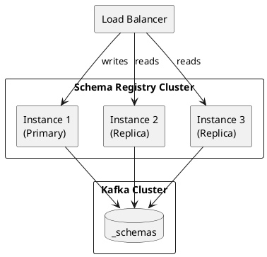

# Schema Registry Operations

Operational procedures for running Schema Registry in production environments.

---

## Deployment

### Single Node

For development and testing:

```bash
# Start Schema Registry
schema-registry-start /etc/schema-registry/schema-registry.properties
```

**Configuration:**
```properties
# schema-registry.properties
listeners=http://0.0.0.0:8081
kafkastore.bootstrap.servers=kafka1:9092,kafka2:9092,kafka3:9092
kafkastore.topic=_schemas
debug=false
```

### High Availability

For production, deploy multiple instances:



**Configuration:**
```properties
# All instances share configuration
listeners=http://0.0.0.0:8081
kafkastore.bootstrap.servers=kafka1:9092,kafka2:9092,kafka3:9092
kafkastore.topic=_schemas
kafkastore.topic.replication.factor=3

# Leader election
master.eligibility=true
```

### Docker Deployment

```yaml
version: '3.8'
services:
  schema-registry:
    image: confluentinc/cp-schema-registry:7.5.0
    hostname: schema-registry
    ports:
      - "8081:8081"
    environment:
      SCHEMA_REGISTRY_HOST_NAME: schema-registry
      SCHEMA_REGISTRY_KAFKASTORE_BOOTSTRAP_SERVERS: kafka1:9092,kafka2:9092,kafka3:9092
      SCHEMA_REGISTRY_LISTENERS: http://0.0.0.0:8081
      SCHEMA_REGISTRY_KAFKASTORE_TOPIC_REPLICATION_FACTOR: 3
    healthcheck:
      test: ["CMD", "curl", "-f", "http://localhost:8081/"]
      interval: 30s
      timeout: 10s
      retries: 5
```

---

## Configuration

### Essential Settings

| Property | Default | Description |
|----------|---------|-------------|
| `listeners` | `http://0.0.0.0:8081` | REST API listeners |
| `kafkastore.bootstrap.servers` | Required | Kafka bootstrap servers |
| `kafkastore.topic` | `_schemas` | Schema storage topic |
| `kafkastore.topic.replication.factor` | 3 | Replication factor |
| `schema.compatibility.level` | `BACKWARD` | Default compatibility |

### Security

**SSL/TLS:**
```properties
listeners=https://0.0.0.0:8081
ssl.keystore.location=/path/to/keystore.jks
ssl.keystore.password=password
ssl.key.password=password
ssl.truststore.location=/path/to/truststore.jks
ssl.truststore.password=password
```

**Authentication:**
```properties
authentication.method=BASIC
authentication.realm=SchemaRegistry
authentication.roles=admin,developer,readonly
```

**Kafka Security:**
```properties
kafkastore.security.protocol=SASL_SSL
kafkastore.sasl.mechanism=PLAIN
kafkastore.sasl.jaas.config=org.apache.kafka.common.security.plain.PlainLoginModule required username="user" password="password";
```

---

## Monitoring

### Health Check

```bash
# Basic health check
curl http://schema-registry:8081/

# Response
{"mode": "READWRITE"}
```

### Key Metrics

| Metric | Description | Alert Threshold |
|--------|-------------|-----------------|
| `kafka.schema.registry:type=master-slave-role` | Leadership status | Change events |
| `kafka.schema.registry:type=jersey-metrics` | API request metrics | Error rate > 1% |
| `kafka.schema.registry:type=json-schema-provider-metrics` | Schema operations | Latency > 100ms |

### JMX Monitoring

Enable JMX:
```bash
export SCHEMA_REGISTRY_JMX_OPTS="-Dcom.sun.management.jmxremote \
  -Dcom.sun.management.jmxremote.port=9999 \
  -Dcom.sun.management.jmxremote.authenticate=false \
  -Dcom.sun.management.jmxremote.ssl=false"
```

### Prometheus Metrics

```yaml
# prometheus.yml
scrape_configs:
  - job_name: 'schema-registry'
    static_configs:
      - targets: ['schema-registry:8081']
    metrics_path: /metrics
```

---

## Backup and Recovery

### Backup Strategies

**Topic-Based Backup:**

The `_schemas` topic contains all schema data. Backup using MirrorMaker or topic replication:

```bash
# Export schemas topic
kafka-console-consumer.sh \
  --bootstrap-server kafka:9092 \
  --topic _schemas \
  --from-beginning \
  --property print.key=true \
  --property print.value=true > schemas-backup.txt
```

**API-Based Backup:**

```bash
#!/bin/bash
# backup-schemas.sh

REGISTRY_URL="http://schema-registry:8081"
BACKUP_DIR="./schema-backup"

mkdir -p $BACKUP_DIR

# Get all subjects
SUBJECTS=$(curl -s $REGISTRY_URL/subjects | jq -r '.[]')

for SUBJECT in $SUBJECTS; do
  # Get all versions
  VERSIONS=$(curl -s "$REGISTRY_URL/subjects/$SUBJECT/versions" | jq -r '.[]')

  for VERSION in $VERSIONS; do
    # Export each version
    curl -s "$REGISTRY_URL/subjects/$SUBJECT/versions/$VERSION" \
      > "$BACKUP_DIR/${SUBJECT}_v${VERSION}.json"
  done
done

echo "Backup complete: $(ls $BACKUP_DIR | wc -l) schemas"
```

### Recovery

**Restore from API Backup:**

```bash
#!/bin/bash
# restore-schemas.sh

REGISTRY_URL="http://schema-registry:8081"
BACKUP_DIR="./schema-backup"

for FILE in $BACKUP_DIR/*.json; do
  SUBJECT=$(basename $FILE | sed 's/_v[0-9]*\.json//')

  SCHEMA=$(cat $FILE | jq '.schema')

  curl -X POST \
    -H "Content-Type: application/vnd.schemaregistry.v1+json" \
    --data "{\"schema\": $SCHEMA}" \
    "$REGISTRY_URL/subjects/$SUBJECT/versions"
done
```

---

## Administration

### Subject Management

```bash
# List subjects
curl http://schema-registry:8081/subjects

# Delete subject (soft)
curl -X DELETE http://schema-registry:8081/subjects/my-subject

# Delete subject (hard)
curl -X DELETE "http://schema-registry:8081/subjects/my-subject?permanent=true"
```

### Compatibility Management

```bash
# Get global compatibility
curl http://schema-registry:8081/config

# Set global compatibility
curl -X PUT \
  -H "Content-Type: application/vnd.schemaregistry.v1+json" \
  --data '{"compatibility": "BACKWARD"}' \
  http://schema-registry:8081/config

# Set subject compatibility
curl -X PUT \
  -H "Content-Type: application/vnd.schemaregistry.v1+json" \
  --data '{"compatibility": "FULL"}' \
  http://schema-registry:8081/config/my-subject
```

### Mode Management

```bash
# Get mode
curl http://schema-registry:8081/mode

# Set read-only mode
curl -X PUT \
  -H "Content-Type: application/vnd.schemaregistry.v1+json" \
  --data '{"mode": "READONLY"}' \
  http://schema-registry:8081/mode
```

| Mode | Description |
|------|-------------|
| `READWRITE` | Normal operation |
| `READONLY` | Maintenance mode, no writes |
| `IMPORT` | Allow ID specification during restore |

---

## Troubleshooting

### Common Issues

| Issue | Cause | Solution |
|-------|-------|----------|
| 409 Conflict | Incompatible schema | Check compatibility, update schema |
| 503 Service Unavailable | No leader elected | Check Kafka connectivity |
| 404 Not Found | Subject doesn't exist | Verify subject name |
| Connection refused | Registry not running | Check process, ports |

### Debugging

**Enable Debug Logging:**
```properties
debug=true
```

**Check Leader Status:**
```bash
curl http://schema-registry:8081/v1/metadata/id
```

**Verify Kafka Connectivity:**
```bash
# Check _schemas topic
kafka-topics.sh --bootstrap-server kafka:9092 --describe --topic _schemas

# Check consumer group
kafka-consumer-groups.sh --bootstrap-server kafka:9092 --describe --group schema-registry
```

### Schema ID Conflicts

If schema IDs conflict after restore:

1. Set mode to IMPORT:
   ```bash
   curl -X PUT \
     -H "Content-Type: application/vnd.schemaregistry.v1+json" \
     --data '{"mode": "IMPORT"}' \
     http://schema-registry:8081/mode
   ```

2. Register with specific ID:
   ```bash
   curl -X POST \
     -H "Content-Type: application/vnd.schemaregistry.v1+json" \
     --data '{"schema": "...", "id": 42}' \
     http://schema-registry:8081/subjects/my-subject/versions
   ```

3. Return to normal mode:
   ```bash
   curl -X PUT \
     -H "Content-Type: application/vnd.schemaregistry.v1+json" \
     --data '{"mode": "READWRITE"}' \
     http://schema-registry:8081/mode
   ```

---

## Performance Tuning

### Caching

Schema Registry caches schemas in memory. For high-throughput environments:

```properties
# Increase cache size
schema.cache.size=10000

# Cache expiry (ms)
schema.cache.expiry.ms=300000
```

### Client Caching

Configure clients to cache schemas locally:

```properties
# Producer/Consumer
schema.registry.cache.capacity=1000
```

### Connection Pooling

```properties
# Kafka store connection pool
kafkastore.init.timeout.ms=60000
kafkastore.timeout.ms=500
```

---

## Capacity Planning

| Metric | Small | Medium | Large |
|--------|:-----:|:------:|:-----:|
| Schemas | < 1,000 | 1,000-10,000 | > 10,000 |
| Requests/sec | < 100 | 100-1,000 | > 1,000 |
| Memory | 1 GB | 2-4 GB | 8+ GB |
| CPU | 1 core | 2-4 cores | 4+ cores |
| Instances | 2 | 3 | 3+ |

---

## Related Documentation

- [Schema Registry Overview](index.md) - Architecture and concepts
- [Schema Evolution](schema-evolution.md) - Safe evolution practices
- [Compatibility](compatibility/index.md) - Compatibility modes
- [Why Schemas](why-schemas.md) - Schema management benefits
