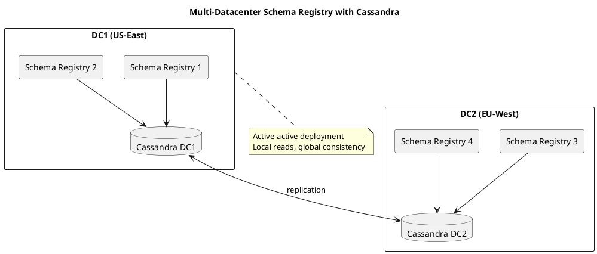
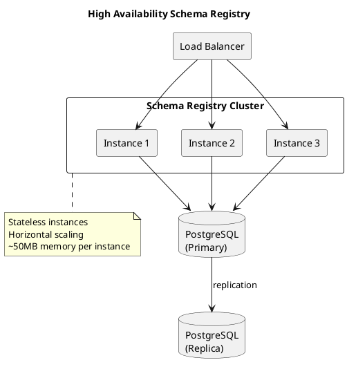

# Schema Registry Operations

Operational procedures for running [AxonOps Schema Registry](https://github.com/axonops/axonops-schema-registry) in production environments.

AxonOps Schema Registry is a high-performance, API-compatible Kafka Schema Registry written in Go. It provides a drop-in replacement for Confluent Schema Registry with enterprise features and flexible storage backends.

---

## Why AxonOps Schema Registry

| Feature | AxonOps | Confluent OSS | Confluent Enterprise |
|---------|:-------:|:-------------:|:--------------------:|
| License | Apache 2.0 | Community | Commercial |
| Language | Go | Java | Java |
| API Compatible | ✅ | N/A | N/A |
| PostgreSQL Backend | ✅ | ❌ | ❌ |
| MySQL Backend | ✅ | ❌ | ❌ |
| Cassandra Backend | ✅ | ❌ | ❌ |
| No Kafka Dependency | ✅ | ❌ | ❌ |
| Basic Auth | ✅ | ❌ | ✅ |
| API Keys | ✅ | ❌ | ✅ |
| LDAP/AD | ✅ | ❌ | ✅ |
| OIDC | ✅ | ❌ | ✅ |
| RBAC | ✅ | ❌ | ✅ |
| Audit Logging | ✅ | ❌ | ✅ |
| Single Binary | ✅ | ❌ | ❌ |
| Memory Footprint | ~50MB | ~500MB+ | ~500MB+ |

---

## Deployment

### Single Node (Development)

For development and testing with in-memory storage:

```bash
# Docker - in-memory storage
docker run -d -p 8081:8081 ghcr.io/axonops/axonops-schema-registry:latest
```

**Verify deployment:**
```bash
curl http://localhost:8081/
# Response: {}
```

### Production with PostgreSQL

PostgreSQL provides a reliable backend for single-datacenter production deployments:

```bash
docker run -d -p 8081:8081 \
  -e STORAGE_TYPE=postgresql \
  -e POSTGRES_HOST=postgres.example.com \
  -e POSTGRES_PORT=5432 \
  -e POSTGRES_USER=schemaregistry \
  -e POSTGRES_PASSWORD=secret \
  -e POSTGRES_DATABASE=schemaregistry \
  -e POSTGRES_SSLMODE=require \
  ghcr.io/axonops/axonops-schema-registry:latest
```

**Configuration file:**
```yaml
# config.yaml
server:
  host: 0.0.0.0
  port: 8081

storage:
  type: postgresql
  postgresql:
    host: postgres.example.com
    port: 5432
    user: schemaregistry
    password: secret
    database: schemaregistry
    sslmode: require
```

### Production with MySQL

```bash
docker run -d -p 8081:8081 \
  -e STORAGE_TYPE=mysql \
  -e MYSQL_HOST=mysql.example.com \
  -e MYSQL_PORT=3306 \
  -e MYSQL_USER=schemaregistry \
  -e MYSQL_PASSWORD=secret \
  -e MYSQL_DATABASE=schemaregistry \
  ghcr.io/axonops/axonops-schema-registry:latest
```

### Multi-Datacenter with Cassandra

For globally distributed deployments, Cassandra provides active-active replication:



**Configuration:**
```yaml
# config.yaml
storage:
  type: cassandra
  cassandra:
    hosts:
      - cassandra1.dc1.example.com
      - cassandra2.dc1.example.com
      - cassandra3.dc1.example.com
    keyspace: schema_registry
    replication_factor: 3
    consistency_level: LOCAL_QUORUM
    username: schemaregistry
    password: secret
```

### High Availability Architecture



### Docker Compose

```yaml
version: '3.8'
services:
  schema-registry:
    image: ghcr.io/axonops/axonops-schema-registry:latest
    hostname: schema-registry
    ports:
      - "8081:8081"
    environment:
      # Storage
      STORAGE_TYPE: postgresql
      POSTGRES_HOST: postgres
      POSTGRES_PORT: 5432
      POSTGRES_USER: schemaregistry
      POSTGRES_PASSWORD: secret
      POSTGRES_DATABASE: schemaregistry

      # Server
      SERVER_HOST: 0.0.0.0
      SERVER_PORT: 8081

      # Compatibility
      COMPATIBILITY_LEVEL: BACKWARD
    healthcheck:
      test: ["CMD", "curl", "-f", "http://localhost:8081/"]
      interval: 30s
      timeout: 10s
      retries: 5
    depends_on:
      - postgres

  postgres:
    image: postgres:16
    environment:
      POSTGRES_USER: schemaregistry
      POSTGRES_PASSWORD: secret
      POSTGRES_DB: schemaregistry
    volumes:
      - postgres_data:/var/lib/postgresql/data

volumes:
  postgres_data:
```

### Kubernetes Deployment

```yaml
apiVersion: apps/v1
kind: Deployment
metadata:
  name: schema-registry
spec:
  replicas: 3
  selector:
    matchLabels:
      app: schema-registry
  template:
    metadata:
      labels:
        app: schema-registry
    spec:
      containers:
        - name: schema-registry
          image: ghcr.io/axonops/axonops-schema-registry:latest
          ports:
            - containerPort: 8081
          env:
            - name: STORAGE_TYPE
              value: postgresql
            - name: POSTGRES_HOST
              value: postgres.database.svc.cluster.local
            - name: POSTGRES_USER
              valueFrom:
                secretKeyRef:
                  name: schema-registry-secrets
                  key: postgres-user
            - name: POSTGRES_PASSWORD
              valueFrom:
                secretKeyRef:
                  name: schema-registry-secrets
                  key: postgres-password
            - name: POSTGRES_DATABASE
              value: schemaregistry
          resources:
            requests:
              memory: "64Mi"
              cpu: "100m"
            limits:
              memory: "128Mi"
              cpu: "500m"
          livenessProbe:
            httpGet:
              path: /
              port: 8081
            initialDelaySeconds: 10
            periodSeconds: 10
          readinessProbe:
            httpGet:
              path: /
              port: 8081
            initialDelaySeconds: 5
            periodSeconds: 5
---
apiVersion: v1
kind: Service
metadata:
  name: schema-registry
spec:
  selector:
    app: schema-registry
  ports:
    - port: 8081
      targetPort: 8081
  type: ClusterIP
```

### Package Installation

**Debian/Ubuntu (APT):**
```bash
# Add repository
curl -fsSL https://packages.axonops.com/gpg.key | sudo gpg --dearmor -o /usr/share/keyrings/axonops-archive-keyring.gpg
echo "deb [signed-by=/usr/share/keyrings/axonops-archive-keyring.gpg] https://packages.axonops.com/apt stable main" | sudo tee /etc/apt/sources.list.d/axonops.list

# Install
sudo apt update
sudo apt install axonops-schema-registry
```

**RHEL/CentOS (YUM):**
```bash
# Add repository
cat << 'EOF' | sudo tee /etc/yum.repos.d/axonops.repo
[axonops]
name=AxonOps Repository
baseurl=https://packages.axonops.com/yum
enabled=1
gpgcheck=1
gpgkey=https://packages.axonops.com/gpg.key
EOF

# Install
sudo yum install axonops-schema-registry
```

---

## Configuration

### Essential Settings

| Property | Environment Variable | Default | Description |
|----------|---------------------|---------|-------------|
| `server.host` | `SERVER_HOST` | `0.0.0.0` | Bind address |
| `server.port` | `SERVER_PORT` | `8081` | Listen port |
| `storage.type` | `STORAGE_TYPE` | `memory` | Backend: `memory`, `postgresql`, `mysql`, `cassandra` |
| `compatibility.level` | `COMPATIBILITY_LEVEL` | `BACKWARD` | Default compatibility |

### Storage Configuration

#### PostgreSQL

```yaml
storage:
  type: postgresql
  postgresql:
    host: localhost
    port: 5432
    user: schemaregistry
    password: secret
    database: schemaregistry
    sslmode: disable  # disable, require, verify-ca, verify-full
    max_connections: 25
    connection_timeout: 30s
```

#### MySQL

```yaml
storage:
  type: mysql
  mysql:
    host: localhost
    port: 3306
    user: schemaregistry
    password: secret
    database: schemaregistry
    tls: false
    max_connections: 25
```

#### Cassandra

```yaml
storage:
  type: cassandra
  cassandra:
    hosts:
      - cassandra1:9042
      - cassandra2:9042
    keyspace: schema_registry
    replication_factor: 3
    consistency_level: LOCAL_QUORUM
    username: schemaregistry
    password: secret
```

### Security Configuration

**TLS/HTTPS:**
```yaml
server:
  tls:
    enabled: true
    cert_file: /etc/schema-registry/tls/server.crt
    key_file: /etc/schema-registry/tls/server.key
    ca_file: /etc/schema-registry/tls/ca.crt  # for mTLS
    client_auth: require  # none, request, require
```

**Basic Authentication:**
```yaml
auth:
  type: basic
  basic:
    users:
      - username: admin
        password: $2a$10$...  # bcrypt hash
        roles: [admin]
      - username: developer
        password: $2a$10$...
        roles: [developer]
```

**API Keys:**
```yaml
auth:
  type: apikey
  apikey:
    keys:
      - key: sk_live_...
        name: production-app
        roles: [developer]
        expires_at: 2025-12-31T23:59:59Z
```

**LDAP/Active Directory:**
```yaml
auth:
  type: ldap
  ldap:
    url: ldaps://ldap.example.com:636
    bind_dn: cn=service,dc=example,dc=com
    bind_password: secret
    base_dn: ou=users,dc=example,dc=com
    user_filter: (uid={0})
    group_filter: (member={0})
    role_mapping:
      cn=schema-admins,ou=groups,dc=example,dc=com: admin
      cn=developers,ou=groups,dc=example,dc=com: developer
```

**OpenID Connect (OIDC):**
```yaml
auth:
  type: oidc
  oidc:
    issuer_url: https://auth.example.com
    client_id: schema-registry
    client_secret: secret
    scopes: [openid, profile, email]
    role_claim: groups
    role_mapping:
      schema-admins: admin
      developers: developer
```

### Role-Based Access Control (RBAC)

```yaml
rbac:
  roles:
    admin:
      permissions:
        - resource: "*"
          actions: ["*"]
    developer:
      permissions:
        - resource: "subjects/*"
          actions: [read, write]
        - resource: "compatibility"
          actions: [read]
    readonly:
      permissions:
        - resource: "subjects/*"
          actions: [read]
        - resource: "schemas/*"
          actions: [read]
```

### Audit Logging

```yaml
audit:
  enabled: true
  log_file: /var/log/schema-registry/audit.log
  include:
    - schema_registered
    - schema_deleted
    - compatibility_changed
    - auth_success
    - auth_failure
```

---

## Monitoring

### Health Check

```bash
# Basic health check
curl http://schema-registry:8081/
# Response: {}

# With authentication
curl -u admin:password http://schema-registry:8081/
```

### Prometheus Metrics

AxonOps Schema Registry exposes Prometheus metrics:

```yaml
# Enable metrics
metrics:
  enabled: true
  path: /metrics
  port: 9090  # separate port, or use main port
```

**Key metrics:**

| Metric | Description |
|--------|-------------|
| `schema_registry_requests_total` | Total API requests by endpoint and status |
| `schema_registry_request_duration_seconds` | Request latency histogram |
| `schema_registry_schemas_total` | Total registered schemas |
| `schema_registry_subjects_total` | Total subjects |
| `schema_registry_storage_operations_total` | Storage backend operations |
| `schema_registry_storage_operation_duration_seconds` | Storage operation latency |

**Prometheus scrape config:**
```yaml
scrape_configs:
  - job_name: 'schema-registry'
    static_configs:
      - targets: ['schema-registry:8081']
    metrics_path: /metrics
```

### Grafana Dashboard

Key panels to include:

- Request rate by endpoint
- Error rate (4xx, 5xx responses)
- Request latency (p50, p95, p99)
- Schema registration rate
- Storage backend health
- Memory and CPU usage

---

## Backup and Recovery

### Database Backup

Since AxonOps Schema Registry uses standard databases, leverage native backup tools:

**PostgreSQL:**
```bash
# Backup
pg_dump -h postgres -U schemaregistry schemaregistry > schemas-backup.sql

# Restore
psql -h postgres -U schemaregistry schemaregistry < schemas-backup.sql
```

**MySQL:**
```bash
# Backup
mysqldump -h mysql -u schemaregistry -p schemaregistry > schemas-backup.sql

# Restore
mysql -h mysql -u schemaregistry -p schemaregistry < schemas-backup.sql
```

**Cassandra:**
```bash
# Backup using nodetool snapshot
nodetool snapshot -t schema_registry_backup schema_registry
```

### API-Based Backup

Export all schemas via REST API:

```bash
#!/bin/bash
# backup-schemas.sh

REGISTRY_URL="http://schema-registry:8081"
BACKUP_DIR="./schema-backup-$(date +%Y%m%d)"

mkdir -p "$BACKUP_DIR"

# Get all subjects
SUBJECTS=$(curl -s "$REGISTRY_URL/subjects" | jq -r '.[]')

for SUBJECT in $SUBJECTS; do
  echo "Backing up: $SUBJECT"

  # Get all versions
  VERSIONS=$(curl -s "$REGISTRY_URL/subjects/$SUBJECT/versions" | jq -r '.[]')

  for VERSION in $VERSIONS; do
    curl -s "$REGISTRY_URL/subjects/$SUBJECT/versions/$VERSION" \
      > "$BACKUP_DIR/${SUBJECT}_v${VERSION}.json"
  done

  # Backup compatibility config
  curl -s "$REGISTRY_URL/config/$SUBJECT" \
    > "$BACKUP_DIR/${SUBJECT}_config.json" 2>/dev/null || true
done

# Backup global config
curl -s "$REGISTRY_URL/config" > "$BACKUP_DIR/_global_config.json"

echo "Backup complete: $(ls "$BACKUP_DIR" | wc -l) files"
```

### Recovery

```bash
#!/bin/bash
# restore-schemas.sh

REGISTRY_URL="http://schema-registry:8081"
BACKUP_DIR="$1"

if [ -z "$BACKUP_DIR" ]; then
  echo "Usage: $0 <backup-directory>"
  exit 1
fi

# Restore global config
if [ -f "$BACKUP_DIR/_global_config.json" ]; then
  COMPAT=$(cat "$BACKUP_DIR/_global_config.json" | jq -r '.compatibilityLevel')
  curl -X PUT \
    -H "Content-Type: application/vnd.schemaregistry.v1+json" \
    -d "{\"compatibility\": \"$COMPAT\"}" \
    "$REGISTRY_URL/config"
fi

# Restore schemas (sorted by version)
for FILE in $(ls "$BACKUP_DIR"/*_v*.json | sort -t'v' -k2 -n); do
  SUBJECT=$(basename "$FILE" | sed 's/_v[0-9]*\.json//')
  SCHEMA=$(cat "$FILE" | jq '.schema')
  SCHEMA_TYPE=$(cat "$FILE" | jq -r '.schemaType // "AVRO"')

  echo "Restoring: $SUBJECT"

  curl -X POST \
    -H "Content-Type: application/vnd.schemaregistry.v1+json" \
    -d "{\"schema\": $SCHEMA, \"schemaType\": \"$SCHEMA_TYPE\"}" \
    "$REGISTRY_URL/subjects/$SUBJECT/versions"
done
```

---

## Administration

### Subject Management

```bash
# List all subjects
curl http://schema-registry:8081/subjects

# Get subject versions
curl http://schema-registry:8081/subjects/my-topic-value/versions

# Get latest schema
curl http://schema-registry:8081/subjects/my-topic-value/versions/latest

# Delete subject (soft delete)
curl -X DELETE http://schema-registry:8081/subjects/my-topic-value

# Delete subject (permanent)
curl -X DELETE "http://schema-registry:8081/subjects/my-topic-value?permanent=true"
```

### Schema Management

```bash
# Register a new schema
curl -X POST \
  -H "Content-Type: application/vnd.schemaregistry.v1+json" \
  -d '{"schema": "{\"type\": \"record\", \"name\": \"User\", \"fields\": [{\"name\": \"id\", \"type\": \"int\"}]}"}' \
  http://schema-registry:8081/subjects/users-value/versions

# Get schema by ID
curl http://schema-registry:8081/schemas/ids/1

# Check schema compatibility
curl -X POST \
  -H "Content-Type: application/vnd.schemaregistry.v1+json" \
  -d '{"schema": "{...}"}' \
  http://schema-registry:8081/compatibility/subjects/users-value/versions/latest
```

### Compatibility Management

```bash
# Get global compatibility level
curl http://schema-registry:8081/config
# Response: {"compatibilityLevel": "BACKWARD"}

# Set global compatibility
curl -X PUT \
  -H "Content-Type: application/vnd.schemaregistry.v1+json" \
  -d '{"compatibility": "FULL"}' \
  http://schema-registry:8081/config

# Set subject-level compatibility
curl -X PUT \
  -H "Content-Type: application/vnd.schemaregistry.v1+json" \
  -d '{"compatibility": "NONE"}' \
  http://schema-registry:8081/config/my-topic-value

# Delete subject-level config (revert to global)
curl -X DELETE http://schema-registry:8081/config/my-topic-value
```

### Mode Management

```bash
# Get current mode
curl http://schema-registry:8081/mode
# Response: {"mode": "READWRITE"}

# Set read-only mode (maintenance)
curl -X PUT \
  -H "Content-Type: application/vnd.schemaregistry.v1+json" \
  -d '{"mode": "READONLY"}' \
  http://schema-registry:8081/mode

# Set import mode (for restore with specific IDs)
curl -X PUT \
  -H "Content-Type: application/vnd.schemaregistry.v1+json" \
  -d '{"mode": "IMPORT"}' \
  http://schema-registry:8081/mode
```

| Mode | Description |
|------|-------------|
| `READWRITE` | Normal operation |
| `READONLY` | Maintenance mode, reject writes |
| `IMPORT` | Allow schema registration with specific IDs |

---

## Troubleshooting

### Common Issues

| Issue | Cause | Solution |
|-------|-------|----------|
| `409 Conflict` | Incompatible schema | Check compatibility mode, review schema changes |
| `401 Unauthorized` | Authentication failure | Verify credentials, check auth configuration |
| `403 Forbidden` | Insufficient permissions | Review RBAC roles and permissions |
| `503 Service Unavailable` | Database connection failure | Check database connectivity and credentials |
| `404 Not Found` | Subject/schema doesn't exist | Verify subject name spelling |

### Debugging

**Enable debug logging:**
```yaml
logging:
  level: debug
  format: json
```

**Check storage connectivity:**
```bash
# PostgreSQL
psql -h postgres -U schemaregistry -d schemaregistry -c "SELECT 1"

# MySQL
mysql -h mysql -u schemaregistry -p -e "SELECT 1"

# Cassandra
cqlsh cassandra -u schemaregistry -p password -e "SELECT * FROM schema_registry.schemas LIMIT 1"
```

**View audit log:**
```bash
tail -f /var/log/schema-registry/audit.log | jq .
```

### Performance Issues

**Symptoms:** High latency, timeouts

**Investigation:**
```bash
# Check metrics
curl http://schema-registry:8081/metrics | grep duration

# Check database performance
# PostgreSQL
SELECT * FROM pg_stat_activity WHERE datname = 'schemaregistry';

# Check connection pool
curl http://schema-registry:8081/metrics | grep connections
```

**Solutions:**

- Increase database connection pool size
- Add read replicas for high read workloads
- Enable schema caching on clients
- Scale horizontally with more instances

---

## Performance Tuning

### Server Configuration

```yaml
server:
  read_timeout: 30s
  write_timeout: 30s
  idle_timeout: 120s
  max_header_bytes: 1048576
```

### Database Connection Pool

```yaml
storage:
  postgresql:
    max_connections: 50
    min_connections: 10
    connection_timeout: 30s
    max_connection_lifetime: 1h
```

### Rate Limiting

```yaml
rate_limit:
  enabled: true
  requests_per_second: 1000
  burst: 100
```

### Client Caching

Configure Kafka clients to cache schemas:

```properties
# Producer/Consumer configuration
schema.registry.url=http://schema-registry:8081
auto.register.schemas=true
schema.cache.capacity=1000
```

---

## Capacity Planning

| Metric | Small | Medium | Large |
|--------|:-----:|:------:|:-----:|
| Schemas | < 1,000 | 1,000-10,000 | > 10,000 |
| Requests/sec | < 100 | 100-1,000 | > 1,000 |
| Memory | 64 MB | 128 MB | 256+ MB |
| CPU | 0.5 core | 1-2 cores | 2+ cores |
| Instances | 1-2 | 2-3 | 3+ |

---

## Related Documentation

- [Schema Registry Overview](index.md) - Architecture and concepts
- [Schema Evolution](schema-evolution.md) - Safe evolution practices
- [Compatibility](compatibility/index.md) - Compatibility modes
- [Why Schemas](why-schemas.md) - Schema management benefits
- [AxonOps Schema Registry GitHub](https://github.com/axonops/axonops-schema-registry)
