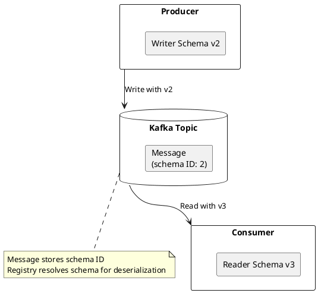
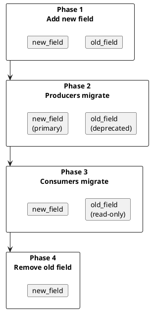

# Schema Evolution

Schema evolution allows schemas to change over time while maintaining compatibility with existing data and applications.

---

## Evolution Concepts

### Writer Schema vs Reader Schema

Schema Registry uses the concepts of writer schema (used when data was written) and reader schema (used when reading data):



### Resolution Rules

When reader and writer schemas differ, serialization frameworks apply resolution rules:

| Scenario | Resolution |
|----------|------------|
| Field in writer, not in reader | Field ignored |
| Field in reader with default, not in writer | Default value used |
| Field in reader without default, not in writer | Error |
| Type mismatch | Error (unless promotable) |

---

## Safe Schema Changes

### Adding Optional Fields

Adding optional fields with defaults is safe for all compatibility modes:

**Avro:**
```json
{
  "type": "record",
  "name": "User",
  "fields": [
    {"name": "id", "type": "long"},
    {"name": "name", "type": "string"},
    {"name": "email", "type": ["null", "string"], "default": null}
  ]
}
```

**Protobuf:**
```protobuf
message User {
  int64 id = 1;
  string name = 2;
  optional string email = 3;  // Added field
}
```

**JSON Schema:**
```json
{
  "type": "object",
  "properties": {
    "id": {"type": "integer"},
    "name": {"type": "string"},
    "email": {"type": "string"}
  },
  "required": ["id", "name"]
}
```

### Removing Optional Fields

Removing optional fields is safe when using FORWARD or FULL compatibility:

```json
// Version 1
{
  "type": "record",
  "name": "User",
  "fields": [
    {"name": "id", "type": "long"},
    {"name": "name", "type": "string"},
    {"name": "nickname", "type": ["null", "string"], "default": null}
  ]
}

// Version 2 (nickname removed)
{
  "type": "record",
  "name": "User",
  "fields": [
    {"name": "id", "type": "long"},
    {"name": "name", "type": "string"}
  ]
}
```

Old consumers (v1) reading new data (v2) will use the default value for `nickname`.

---

## Unsafe Schema Changes

### Adding Required Fields

Adding a required field without a default breaks backward compatibility:

```json
// Version 1
{
  "fields": [
    {"name": "id", "type": "long"}
  ]
}

// Version 2 - INCOMPATIBLE
{
  "fields": [
    {"name": "id", "type": "long"},
    {"name": "created_at", "type": "long"}  // No default!
  ]
}
```

Old data lacks `created_at`, so new consumers cannot deserialize it.

### Changing Field Types

Type changes are incompatible:

```json
// Version 1
{"name": "user_id", "type": "long"}

// Version 2 - INCOMPATIBLE
{"name": "user_id", "type": "string"}
```

### Renaming Fields

Direct field renames are incompatible without aliases:

```json
// Version 1
{"name": "user_name", "type": "string"}

// Version 2 - INCOMPATIBLE (without alias)
{"name": "username", "type": "string"}
```

---

## Evolution Patterns

### Pattern 1: Add with Default, Then Remove Default

For fields that should eventually be required:

```json
// Step 1: Add optional field with default
{"name": "email", "type": ["null", "string"], "default": null}

// Wait for all producers to populate email

// Step 2: Remove default (field still optional)
{"name": "email", "type": ["null", "string"]}

// Wait for all historical data without email to expire

// Step 3: Make required (only if all data has email)
{"name": "email", "type": "string"}
```

### Pattern 2: Deprecation Period

For field removal:



### Pattern 3: Using Aliases

Rename fields safely with Avro aliases:

```json
{
  "type": "record",
  "name": "User",
  "fields": [
    {
      "name": "username",
      "type": "string",
      "aliases": ["user_name", "userName"]
    }
  ]
}
```

Old data with `user_name` will be read into `username`.

### Pattern 4: Union Types for Flexibility

Use union types for fields that may have multiple formats:

```json
{
  "name": "timestamp",
  "type": [
    "null",
    "long",
    {"type": "string", "logicalType": "timestamp-millis"}
  ],
  "default": null
}
```

---

## Compatibility by Mode

### BACKWARD Evolution

New schema must read old data:

| Change | Allowed |
|--------|:-------:|
| Add optional field with default | ✅ |
| Add required field | ❌ |
| Remove field | ✅ |
| Widen type (int → long) | ✅ |
| Narrow type (long → int) | ❌ |

Upgrade order: **Consumers first**, then producers.

### FORWARD Evolution

Old schema must read new data:

| Change | Allowed |
|--------|:-------:|
| Add field | ✅ |
| Remove optional field with default | ✅ |
| Remove required field | ❌ |
| Widen type (int → long) | ❌ |
| Narrow type (long → int) | ✅ |

Upgrade order: **Producers first**, then consumers.

### FULL Evolution

Both backward and forward compatible:

| Change | Allowed |
|--------|:-------:|
| Add optional field with default | ✅ |
| Remove optional field with default | ✅ |
| Add required field | ❌ |
| Remove required field | ❌ |
| Change type | ❌ |

Upgrade order: **Any order**.

---

## Version Management

### Schema Versions

Each schema registration creates a version:

```bash
# List versions
curl http://schema-registry:8081/subjects/users-value/versions
# [1, 2, 3]

# Get specific version
curl http://schema-registry:8081/subjects/users-value/versions/2
```

### Schema IDs

Schema IDs are global and unique across all subjects:

| Schema | Subject | Version | Global ID |
|--------|---------|:-------:|:---------:|
| User v1 | users-value | 1 | 1 |
| Order v1 | orders-value | 1 | 2 |
| User v2 | users-value | 2 | 3 |

### Deleting Schemas

Soft delete removes schema from listing but preserves ID:

```bash
# Soft delete version
curl -X DELETE http://schema-registry:8081/subjects/users-value/versions/2

# Hard delete (after soft delete)
curl -X DELETE http://schema-registry:8081/subjects/users-value/versions/2?permanent=true
```

!!! warning "Schema Deletion"
    Deleting schemas can break consumers holding cached references. Only delete schemas when certain no data exists with that schema ID.

---

## Testing Compatibility

### Before Registration

```bash
# Test compatibility before registering
curl -X POST \
  -H "Content-Type: application/vnd.schemaregistry.v1+json" \
  --data '{"schema": "{...}"}' \
  http://schema-registry:8081/compatibility/subjects/users-value/versions/latest

# Response
{"is_compatible": true}
```

### CI/CD Integration

```bash
#!/bin/bash
# compatibility-check.sh

SCHEMA=$(cat schema.avsc | jq -Rs '.')
RESULT=$(curl -s -X POST \
  -H "Content-Type: application/vnd.schemaregistry.v1+json" \
  --data "{\"schema\": $SCHEMA}" \
  "$SCHEMA_REGISTRY_URL/compatibility/subjects/$SUBJECT/versions/latest")

if echo "$RESULT" | jq -e '.is_compatible == true' > /dev/null; then
  echo "Schema is compatible"
  exit 0
else
  echo "Schema is INCOMPATIBLE"
  echo "$RESULT" | jq '.messages'
  exit 1
fi
```

---

## Best Practices

| Practice | Rationale |
|----------|-----------|
| **Start with BACKWARD** | Most common upgrade pattern (consumers first) |
| **Always provide defaults** | Enables safe field addition |
| **Use optional fields** | Allows both addition and removal |
| **Avoid type changes** | Types should be permanent |
| **Document field semantics** | Prevent misuse across versions |
| **Use semantic versioning** | Track breaking vs non-breaking changes |
| **Test in staging** | Validate compatibility before production |

---

## Related Documentation

- [Schema Registry Overview](index.md) - Architecture and concepts
- [Compatibility](compatibility/index.md) - Compatibility modes
- [Why Schemas](why-schemas.md) - Schema management benefits
- [Operations](operations.md) - Production operations