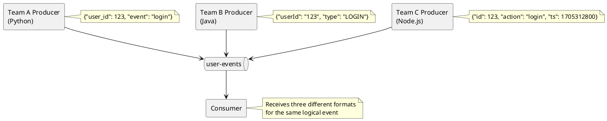
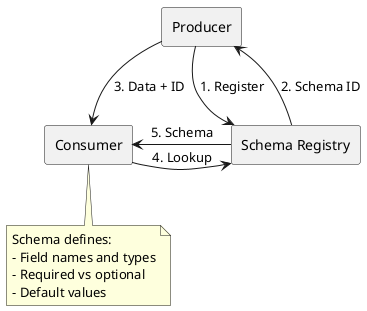

# Schema Management Benefits

This document explains why schema management is essential for production Kafka deployments and the problems that occur without it.

---

## The Schemaless Problem

Kafka brokers treat messages as opaque byte arrays. This design provides flexibility but creates challenges when multiple applications share topics.



### Common Schemaless Problems

| Problem | Description | Impact |
|---------|-------------|--------|
| **Naming inconsistency** | `user_id` vs `userId` vs `id` | Parsing failures, data loss |
| **Type drift** | `123` (int) vs `"123"` (string) | Type coercion errors |
| **Missing fields** | Optional fields omitted | NullPointerException |
| **Breaking changes** | Field renamed without notice | Consumer crashes |
| **Documentation lag** | Schema only in code/docs | Outdated contracts |

---

## Production Failures Without Schemas

### Case 1: Type Change

A producer changes a field type from integer to string:

```python
# Before
{"user_id": 123, "amount": 99.99}

# After
{"user_id": "user-123", "amount": 99.99}
```

**Result:** Downstream consumers expecting integers fail with type errors. No validation catches this before production.

### Case 2: Field Removal

A producer removes a field considered "internal":

```json
// Before
{"order_id": 456, "status": "pending", "internal_ref": "abc"}

// After
{"order_id": 456, "status": "pending"}
```

**Result:** Analytics pipelines depending on `internal_ref` for deduplication begin producing incorrect results.

### Case 3: Silent Format Change

A producer changes date format:

```json
// Before
{"timestamp": "2024-01-15T10:30:00Z"}

// After
{"timestamp": 1705312200000}
```

**Result:** Consumers parsing ISO 8601 strings fail silently or crash.

---

## What Schema Management Provides

### Data Contracts

Schemas define explicit contracts between producers and consumers:



### Compatibility Enforcement

Schema Registry validates that new schemas are compatible with existing ones:

```bash
# Attempt to register incompatible schema
curl -X POST \
  -H "Content-Type: application/vnd.schemaregistry.v1+json" \
  --data '{"schema": "{...incompatible schema...}"}' \
  http://schema-registry:8081/subjects/users-value/versions

# Response (409 Conflict)
{
  "error_code": 409,
  "message": "Schema being registered is incompatible with an earlier schema"
}
```

Incompatible changes are rejected before reaching production.

### Schema Evolution

Schemas can evolve safely with compatibility rules:

| Evolution | Without Schemas | With Schemas |
|-----------|-----------------|--------------|
| Add field | May break consumers | Safe with defaults |
| Remove field | May break consumers | Safe if optional |
| Rename field | Breaks all consumers | Safe with aliases |
| Change type | Silent data corruption | Rejected by registry |

---

## Benefits Summary

### For Producers

| Benefit | Description |
|---------|-------------|
| **Validation** | Malformed messages rejected before sending |
| **Documentation** | Schema serves as living documentation |
| **Evolution path** | Clear rules for safe schema changes |
| **Type safety** | Compile-time checking with generated classes |

### For Consumers

| Benefit | Description |
|---------|-------------|
| **Guaranteed structure** | Know exactly what to expect |
| **Version awareness** | Handle multiple schema versions |
| **Fail-fast** | Incompatible data rejected immediately |
| **Generated code** | Type-safe deserialization |

### For Operations

| Benefit | Description |
|---------|-------------|
| **Change auditing** | Track who changed what, when |
| **Rollback capability** | Revert to previous schema versions |
| **Impact analysis** | Understand downstream effects of changes |
| **Governance** | Enforce organizational data standards |

---

## When Schema Management is Critical

### Must Have

- **Multi-team environments** - Multiple teams producing to shared topics
- **Long-term data storage** - Data read months or years after production
- **Compliance requirements** - Auditing and data governance mandates
- **High-reliability systems** - Cannot tolerate silent data corruption

### Consider

- **Single-team applications** - Even single teams benefit from validation
- **Short-lived data** - Ephemeral data may tolerate format changes
- **Prototyping** - Development speed may outweigh governance

---

## Implementation Cost

| Aspect | Overhead | Mitigation |
|--------|----------|------------|
| **Schema Registry deployment** | Additional infrastructure | Managed services available |
| **Schema definition** | Development time | Generates documentation |
| **Compatibility testing** | CI/CD integration | Automated compatibility checks |
| **Learning curve** | Team training | Strong tooling support |

The overhead is typically justified by:

- Fewer production incidents
- Faster debugging
- Clearer system boundaries
- Reduced coordination overhead

---

## Getting Started

1. **Deploy Schema Registry** alongside Kafka cluster
2. **Define initial schemas** for existing topics
3. **Configure producers** to register schemas
4. **Configure consumers** to fetch schemas
5. **Set compatibility mode** (start with BACKWARD)
6. **Integrate with CI/CD** for compatibility testing

---

## Related Documentation

- [Schema Registry Overview](index.md) - Architecture and concepts
- [Schema Formats](schema-formats/index.md) - Avro, Protobuf, JSON Schema
- [Compatibility](compatibility/index.md) - Compatibility rules
- [Schema Evolution](schema-evolution.md) - Safe evolution practices
