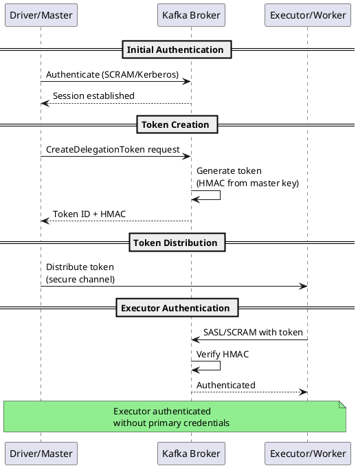
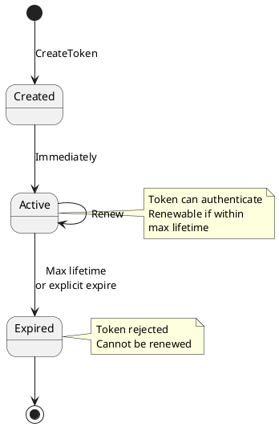

# Delegation Token Authentication

Delegation tokens provide lightweight, short-lived authentication tokens for Kafka. They enable distributed frameworks (Spark, Flink, Kubernetes Jobs) to access Kafka without distributing primary credentials to every executor.

---

## Overview

### When to Use Delegation Tokens

| Use Case | Recommendation |
|----------|----------------|
| Spark/Flink jobs | Recommended |
| Kubernetes batch jobs | Recommended |
| Short-lived processes | Recommended |
| Temporary access grants | Recommended |
| Primary authentication | Use SCRAM/Kerberos |
| Long-running services | Use SCRAM/Kerberos |

### How Delegation Tokens Work



**Key concepts:**

- **Token** - Lightweight credential (token ID + HMAC)
- **Owner** - User who created the token
- **Renewers** - Users allowed to renew the token
- **Master Key** - Broker secret for HMAC generation

### Benefits

| Feature | Benefit |
|---------|---------|
| **No credential distribution** | Primary credentials stay secure |
| **Short-lived** | Limited exposure window |
| **Revocable** | Can be expired immediately |
| **Auditable** | Token operations logged |
| **Delegated identity** | Actions attributed to owner |

### Version Requirements

| Feature | Kafka Version |
|---------|---------------|
| Delegation tokens | 1.1.0+ |
| Token describe API | 2.0.0+ |
| SCRAM + delegation tokens | 1.1.0+ |

---

## Broker Configuration

### Enable Delegation Tokens

```properties
# server.properties

# Enable token authentication
delegation.token.master.key=${DELEGATION_TOKEN_MASTER_KEY}

# Token lifetime settings
delegation.token.max.lifetime.ms=604800000  # 7 days
delegation.token.expiry.time.ms=86400000    # 24 hours
delegation.token.expiry.check.interval.ms=3600000  # 1 hour

# Primary authentication (required for token creation)
sasl.enabled.mechanisms=SCRAM-SHA-512
```

### Configuration Options

| Property | Default | Description |
|----------|---------|-------------|
| `delegation.token.master.key` | None | **Required.** Secret for HMAC generation |
| `delegation.token.max.lifetime.ms` | 604800000 (7d) | Maximum token lifetime |
| `delegation.token.expiry.time.ms` | 86400000 (24h) | Default token expiry |
| `delegation.token.expiry.check.interval.ms` | 3600000 (1h) | Expiry check frequency |

!!! danger "Master Key Security"
    The `delegation.token.master.key` must be:

    - Same across all brokers in the cluster
    - Kept secret (use environment variable)
    - At least 16 characters
    - Changed periodically (invalidates all tokens)

### Full Broker Configuration

```properties
# server.properties

# Listeners
listeners=SASL_SSL://0.0.0.0:9093
advertised.listeners=SASL_SSL://kafka1.example.com:9093
security.inter.broker.protocol=SASL_SSL

# SASL configuration
sasl.enabled.mechanisms=SCRAM-SHA-512
sasl.mechanism.inter.broker.protocol=SCRAM-SHA-512

# Delegation tokens
delegation.token.master.key=${DELEGATION_TOKEN_MASTER_KEY}
delegation.token.max.lifetime.ms=604800000
delegation.token.expiry.time.ms=86400000

# JAAS configuration
listener.name.sasl_ssl.scram-sha-512.sasl.jaas.config=\
  org.apache.kafka.common.security.scram.ScramLoginModule required \
  username="kafka-broker" \
  password="broker-password";

# SSL configuration
ssl.keystore.type=PKCS12
ssl.keystore.location=/etc/kafka/ssl/kafka.keystore.p12
ssl.keystore.password=${KEYSTORE_PASSWORD}
ssl.truststore.type=PKCS12
ssl.truststore.location=/etc/kafka/ssl/kafka.truststore.p12
ssl.truststore.password=${TRUSTSTORE_PASSWORD}
```

---

## Token Management

### Create Token

```bash
# Using primary credentials
kafka-delegation-tokens.sh --bootstrap-server kafka:9093 \
  --command-config admin.properties \
  --create \
  --max-life-time-period 86400000 \
  --renewer-principal User:spark-admin

# Output:
# Token ID: abc123-token-id
# HMAC: Ahsx...base64...==
# Owner: User:admin
# Renewers: [User:spark-admin]
# Token expires at: Thu Jan 15 12:00:00 UTC 2026
```

**admin.properties:**

```properties
security.protocol=SASL_SSL
sasl.mechanism=SCRAM-SHA-512
sasl.jaas.config=org.apache.kafka.common.security.scram.ScramLoginModule required \
  username="admin" \
  password="admin-password";
ssl.truststore.location=/etc/kafka/ssl/client.truststore.p12
ssl.truststore.password=truststore-password
```

### Describe Tokens

```bash
# List all tokens for current user
kafka-delegation-tokens.sh --bootstrap-server kafka:9093 \
  --command-config admin.properties \
  --describe

# Describe specific owner's tokens
kafka-delegation-tokens.sh --bootstrap-server kafka:9093 \
  --command-config admin.properties \
  --describe \
  --owner-principal User:spark-user
```

### Renew Token

```bash
# Renew token (must be owner or renewer)
kafka-delegation-tokens.sh --bootstrap-server kafka:9093 \
  --command-config renewer.properties \
  --renew \
  --hmac "Ahsx...base64...==" \
  --renew-time-period 86400000
```

### Expire Token

```bash
# Immediately expire token
kafka-delegation-tokens.sh --bootstrap-server kafka:9093 \
  --command-config admin.properties \
  --expire \
  --hmac "Ahsx...base64...=="
```

---

## Client Configuration

### Using Delegation Token

**token.properties:**

```properties
security.protocol=SASL_SSL
sasl.mechanism=SCRAM-SHA-512
sasl.jaas.config=org.apache.kafka.common.security.scram.ScramLoginModule required \
  username="abc123-token-id" \
  password="Ahsx...base64-hmac...==" \
  tokenauth="true";
ssl.truststore.location=/etc/kafka/ssl/client.truststore.p12
ssl.truststore.password=truststore-password
```

!!! note "Token as SCRAM Credentials"
    Delegation tokens use SCRAM authentication with:

    - `username` = Token ID
    - `password` = Token HMAC
    - `tokenauth="true"` = Indicates token authentication

### Java Client

```java
Properties props = new Properties();
props.put(ProducerConfig.BOOTSTRAP_SERVERS_CONFIG, "kafka1:9093,kafka2:9093");
props.put(ProducerConfig.KEY_SERIALIZER_CLASS_CONFIG, StringSerializer.class);
props.put(ProducerConfig.VALUE_SERIALIZER_CLASS_CONFIG, StringSerializer.class);

// Token authentication
props.put("security.protocol", "SASL_SSL");
props.put("sasl.mechanism", "SCRAM-SHA-512");
props.put("sasl.jaas.config",
    "org.apache.kafka.common.security.scram.ScramLoginModule required " +
    "username=\"" + tokenId + "\" " +
    "password=\"" + tokenHmac + "\" " +
    "tokenauth=\"true\";");

// TLS configuration
props.put("ssl.truststore.location", "/etc/kafka/ssl/client.truststore.p12");
props.put("ssl.truststore.password", "truststore-password");

KafkaProducer<String, String> producer = new KafkaProducer<>(props);
```

### Python

```python
from confluent_kafka import Producer

config = {
    'bootstrap.servers': 'kafka1:9093,kafka2:9093',
    'security.protocol': 'SASL_SSL',
    'sasl.mechanism': 'SCRAM-SHA-512',
    'sasl.username': token_id,
    'sasl.password': token_hmac,
    'ssl.ca.location': '/etc/kafka/ssl/ca-cert.pem',
}

# Note: confluent-kafka doesn't support tokenauth flag directly
# Token ID/HMAC work as username/password with SCRAM

producer = Producer(config)
```

---

## Apache Spark Integration

### Spark Configuration

```scala
// SparkSession with Kafka delegation tokens
val spark = SparkSession.builder()
  .appName("KafkaTokenExample")
  .config("spark.kafka.security.protocol", "SASL_SSL")
  .config("spark.kafka.sasl.mechanism", "SCRAM-SHA-512")
  .config("spark.kafka.sasl.jaas.config",
    s"""org.apache.kafka.common.security.scram.ScramLoginModule required
       |username="$primaryUser"
       |password="$primaryPassword";""".stripMargin)
  .config("spark.kafka.bootstrap.servers", "kafka1:9093,kafka2:9093")
  // Enable delegation token support
  .config("spark.security.credentials.kafka.enabled", "true")
  .getOrCreate()
```

### Token Obtainer (Spark 2.4+)

Spark automatically obtains and distributes delegation tokens:

```properties
# spark-defaults.conf
spark.security.credentials.kafka.enabled=true
spark.kafka.clusters.default.bootstrap.servers=kafka1:9093,kafka2:9093
spark.kafka.clusters.default.security.protocol=SASL_SSL
spark.kafka.clusters.default.sasl.mechanism=SCRAM-SHA-512
spark.kafka.clusters.default.sasl.jaas.config=org.apache.kafka.common.security.scram.ScramLoginModule required \
  username="spark-user" \
  password="spark-password";
```

### Manual Token Distribution

For custom token management:

```scala
import org.apache.kafka.clients.admin.{AdminClient, AdminClientConfig}
import org.apache.kafka.common.security.token.delegation.DelegationToken

// Driver: Create token
val adminProps = new Properties()
adminProps.put(AdminClientConfig.BOOTSTRAP_SERVERS_CONFIG, "kafka:9093")
// ... SASL/SSL config

val admin = AdminClient.create(adminProps)
val createResult = admin.createDelegationToken()
val token = createResult.delegationToken().get()

// Broadcast to executors
val tokenBroadcast = spark.sparkContext.broadcast(
  (token.tokenInfo().tokenId(), token.hmac())
)

// Executor: Use token
val df = spark.readStream
  .format("kafka")
  .option("kafka.bootstrap.servers", "kafka:9093")
  .option("kafka.security.protocol", "SASL_SSL")
  .option("kafka.sasl.mechanism", "SCRAM-SHA-512")
  .option("kafka.sasl.jaas.config",
    s"""org.apache.kafka.common.security.scram.ScramLoginModule required
       |username="${tokenBroadcast.value._1}"
       |password="${new String(tokenBroadcast.value._2)}"
       |tokenauth="true";""".stripMargin)
  .option("subscribe", "my-topic")
  .load()
```

---

## Apache Flink Integration

### Flink Configuration

```java
// FlinkKafkaConsumer with delegation token
Properties props = new Properties();
props.setProperty("bootstrap.servers", "kafka1:9093,kafka2:9093");
props.setProperty("group.id", "flink-consumer");
props.setProperty("security.protocol", "SASL_SSL");
props.setProperty("sasl.mechanism", "SCRAM-SHA-512");
props.setProperty("sasl.jaas.config",
    "org.apache.kafka.common.security.scram.ScramLoginModule required " +
    "username=\"" + tokenId + "\" " +
    "password=\"" + tokenHmac + "\" " +
    "tokenauth=\"true\";");

FlinkKafkaConsumer<String> consumer = new FlinkKafkaConsumer<>(
    "my-topic",
    new SimpleStringSchema(),
    props
);
```

---

## Kubernetes Integration

### Job with Token

```yaml
apiVersion: batch/v1
kind: Job
metadata:
  name: kafka-processor
spec:
  template:
    spec:
      containers:
        - name: processor
          image: my-processor:latest
          env:
            - name: KAFKA_TOKEN_ID
              valueFrom:
                secretKeyRef:
                  name: kafka-token
                  key: token-id
            - name: KAFKA_TOKEN_HMAC
              valueFrom:
                secretKeyRef:
                  name: kafka-token
                  key: token-hmac
      restartPolicy: Never
```

### Token Creation Job

```yaml
apiVersion: batch/v1
kind: CronJob
metadata:
  name: kafka-token-refresh
spec:
  schedule: "0 0 * * *"  # Daily
  jobTemplate:
    spec:
      template:
        spec:
          containers:
            - name: token-creator
              image: kafka:latest
              command:
                - /bin/bash
                - -c
                - |
                  kafka-delegation-tokens.sh \
                    --bootstrap-server kafka:9093 \
                    --command-config /etc/kafka/admin.properties \
                    --create \
                    --max-life-time-period 172800000 | \
                  # Parse and update Kubernetes secret
                  update-k8s-secret.sh
              volumeMounts:
                - name: admin-config
                  mountPath: /etc/kafka
          volumes:
            - name: admin-config
              secret:
                secretName: kafka-admin-credentials
          restartPolicy: OnFailure
```

---

## Token Lifecycle

### Lifecycle States



### Expiration Behavior

| Event | Behavior |
|-------|----------|
| Token expires | New connections rejected |
| Existing connections | Remain valid until disconnect |
| Renewal attempted | Rejected after expiry |
| Token described | Shows expired status |

### Automatic Renewal

Implement automatic renewal in long-running applications:

```java
public class TokenRenewalService {
    private final AdminClient admin;
    private final byte[] tokenHmac;
    private ScheduledExecutorService scheduler;

    public void startRenewalScheduler() {
        scheduler = Executors.newSingleThreadScheduledExecutor();
        // Renew at 80% of expiry time
        long renewalInterval = (long) (expiryTimeMs * 0.8);

        scheduler.scheduleAtFixedRate(
            this::renewToken,
            renewalInterval,
            renewalInterval,
            TimeUnit.MILLISECONDS
        );
    }

    private void renewToken() {
        try {
            admin.renewDelegationToken(tokenHmac, renewPeriodMs).get();
            log.info("Token renewed successfully");
        } catch (Exception e) {
            log.error("Token renewal failed", e);
        }
    }
}
```

---

## Security Considerations

### Best Practices

| Practice | Description |
|----------|-------------|
| Short expiry | Use minimum needed lifetime |
| Limited renewers | Restrict who can renew tokens |
| Secure distribution | Encrypted channels only |
| Audit token usage | Monitor token operations |
| Rotate master key | Periodically change (invalidates all tokens) |

### Token Storage

```bash
# Never store tokens in:
# - Source code
# - Config files in repositories
# - Logs

# Acceptable storage:
# - Kubernetes Secrets (encrypted at rest)
# - HashiCorp Vault
# - Environment variables (ephemeral)
# - Secure inter-process communication
```

### ACL Considerations

Token holders have the same permissions as the token owner:

```bash
# ACLs apply to the owner, not the token
# If User:admin creates token, token holder has admin's permissions

kafka-acls.sh --bootstrap-server kafka:9093 \
  --command-config admin.properties \
  --add \
  --allow-principal User:spark-user \
  --operation Read \
  --topic spark-input
```

---

## Troubleshooting

### Common Errors

| Error | Cause | Solution |
|-------|-------|----------|
| `DelegationTokenDisabledException` | Master key not set | Configure `delegation.token.master.key` |
| `DelegationTokenExpiredException` | Token expired | Create new token or renew |
| `DelegationTokenNotFoundException` | Invalid token ID | Verify token ID |
| `DelegationTokenOwnerMismatchException` | Wrong owner | Use owner's credentials to manage |

### Debug Token Operations

```properties
# Broker logging
log4j.logger.kafka.server.DelegationTokenManager=DEBUG
log4j.logger.org.apache.kafka.common.security=DEBUG
```

### Verify Token

```bash
# Describe token to check status
kafka-delegation-tokens.sh --bootstrap-server kafka:9093 \
  --command-config admin.properties \
  --describe

# Test authentication with token
kafka-broker-api-versions.sh --bootstrap-server kafka:9093 \
  --command-config token.properties
```

### Check Master Key Consistency

All brokers must have the same master key. Mismatched keys cause:

- Tokens created on one broker fail on others
- Intermittent authentication failures

```bash
# Verify by creating token and authenticating to each broker
for broker in kafka1 kafka2 kafka3; do
  kafka-broker-api-versions.sh --bootstrap-server $broker:9093 \
    --command-config token.properties
done
```

---

## Related Documentation

- [Authentication Overview](index.md) - Mechanism comparison
- [SASL/SCRAM](sasl-scram.md) - Primary authentication for token creation
- [Kerberos](kerberos.md) - Alternative primary authentication
- [Authorization](../authorization/index.md) - ACL configuration