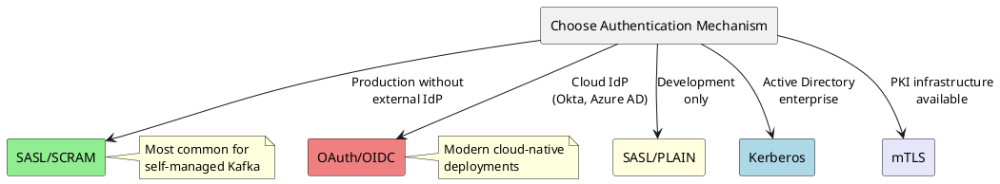
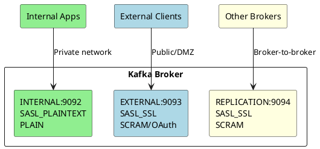

# Kafka Authentication

Authentication verifies the identity of clients connecting to Kafka brokers and brokers communicating with each other. Kafka supports multiple authentication mechanisms to integrate with different security infrastructures.

---

## Authentication Mechanisms

| Mechanism | Protocol | Description | Documentation |
|-----------|----------|-------------|---------------|
| **SASL/SCRAM** | SASL | Salted challenge-response with SHA-256/512 | [SASL/SCRAM Guide](sasl-scram.md) |
| **SASL/PLAIN** | SASL | Simple username/password | [SASL/PLAIN Guide](sasl-plain.md) |
| **SASL/GSSAPI** | SASL | Kerberos authentication | [Kerberos Guide](kerberos.md) |
| **SASL/OAUTHBEARER** | SASL | OAuth 2.0 / OIDC tokens | [OAuth Guide](oauth.md) |
| **mTLS** | SSL/TLS | Mutual TLS certificates | [mTLS Guide](mtls.md) |
| **Delegation Tokens** | SASL | Lightweight token-based auth | [Delegation Tokens](delegation-tokens.md) |

---

## Mechanism Selection Guide

### Decision Matrix

| Requirement | SCRAM | PLAIN | Kerberos | OAuth | mTLS |
|-------------|:-----:|:-----:|:--------:|:-----:|:----:|
| No external infrastructure | ✅ | ✅ | ❌ | ❌ | ✅ |
| Enterprise SSO integration | ❌ | ❌ | ✅ | ✅ | ❌ |
| Cloud-native environments | ✅ | ❌ | ❌ | ✅ | ✅ |
| Certificate-based identity | ❌ | ❌ | ❌ | ❌ | ✅ |
| Password-based auth | ✅ | ✅ | ❌ | ❌ | ❌ |
| Token refresh support | ❌ | ❌ | ✅ | ✅ | ❌ |
| Simple to set up | ✅ | ✅ | ❌ | ⚠️ | ⚠️ |

### Recommended Use Cases



| Environment | Recommended Mechanism | Rationale |
|-------------|----------------------|-----------|
| **Development** | SASL/PLAIN or SASL/SCRAM | Simple setup, no external dependencies |
| **Production (standalone)** | SASL/SCRAM-SHA-512 | Secure, no external infrastructure needed |
| **Enterprise (AD/Kerberos)** | SASL/GSSAPI | Integrates with existing Kerberos KDC |
| **Cloud-native** | SASL/OAUTHBEARER | Integrates with cloud identity providers |
| **PKI environment** | mTLS | Certificate-based, no passwords |
| **Managed Kafka** | Provider-specific | Follow provider recommendations |

---

## Security Protocols

Kafka combines authentication mechanisms with transport security:

| Security Protocol | Authentication | Encryption | Use Case |
|-------------------|----------------|------------|----------|
| `PLAINTEXT` | None | None | Development only |
| `SSL` | mTLS (optional) | TLS | Certificate auth or encryption only |
| `SASL_PLAINTEXT` | SASL | None | Internal networks (not recommended) |
| `SASL_SSL` | SASL | TLS | **Production recommended** |

!!! danger "Never Use PLAINTEXT in Production"
    `PLAINTEXT` and `SASL_PLAINTEXT` transmit data unencrypted. Always use `SSL` or `SASL_SSL` in production.

### Protocol Selection

```properties
# Encryption only (no authentication)
security.protocol=SSL

# SASL authentication with encryption (recommended)
security.protocol=SASL_SSL

# mTLS authentication with encryption
security.protocol=SSL
ssl.client.auth=required
```

---

## Listener Configuration

Kafka supports different authentication mechanisms on different listeners, enabling separate configurations for internal and external traffic.

### Multiple Listeners Example

```properties
# Define listeners
listeners=INTERNAL://0.0.0.0:9092,EXTERNAL://0.0.0.0:9093,REPLICATION://0.0.0.0:9094

# Map listener names to security protocols
listener.security.protocol.map=INTERNAL:SASL_PLAINTEXT,EXTERNAL:SASL_SSL,REPLICATION:SASL_SSL

# Inter-broker communication
inter.broker.listener.name=REPLICATION

# Different mechanisms per listener
listener.name.internal.sasl.enabled.mechanisms=PLAIN
listener.name.external.sasl.enabled.mechanisms=SCRAM-SHA-512,OAUTHBEARER
listener.name.replication.sasl.enabled.mechanisms=SCRAM-SHA-512
```

### Listener Architecture



---

## JAAS Configuration

Java Authentication and Authorization Service (JAAS) provides the authentication framework for SASL mechanisms.

### Configuration Methods

| Method | Scope | Use Case |
|--------|-------|----------|
| **Broker property** | Per-listener, per-mechanism | Recommended for brokers |
| **Static JAAS file** | JVM-wide | Legacy, complex setups |
| **Programmatic** | Per-client | Application code |

### Broker Property (Recommended)

```properties
# Per-listener, per-mechanism JAAS config
listener.name.sasl_ssl.scram-sha-512.sasl.jaas.config=\
  org.apache.kafka.common.security.scram.ScramLoginModule required \
  username="broker" \
  password="broker-secret";
```

### Static JAAS File

```
// kafka_server_jaas.conf
KafkaServer {
  org.apache.kafka.common.security.scram.ScramLoginModule required
  username="broker"
  password="broker-secret";
};
```

```bash
# JVM parameter
-Djava.security.auth.login.config=/etc/kafka/kafka_server_jaas.conf
```

### Client Programmatic

```java
props.put("sasl.jaas.config",
    "org.apache.kafka.common.security.scram.ScramLoginModule required " +
    "username=\"app\" password=\"app-secret\";");
```

See individual mechanism guides for detailed JAAS configuration.

---

## Version Compatibility

| Feature | Kafka Version |
|---------|---------------|
| SASL/PLAIN | 0.9.0+ |
| SASL/SCRAM | 0.10.2+ |
| SASL/GSSAPI | 0.9.0+ |
| SASL/OAUTHBEARER | 2.0.0+ |
| OAUTHBEARER OIDC support | 3.1.0+ |
| Delegation tokens | 1.1.0+ |
| mTLS | 0.9.0+ |
| Re-authentication | 2.2.0+ |
| KRaft SCRAM bootstrap | 3.5.0+ |

---

## Common Configuration

### Connection Timeouts

```properties
# SASL handshake timeout
sasl.login.connect.timeout.ms=10000

# SASL login retry
sasl.login.retry.backoff.ms=100
sasl.login.retry.backoff.max.ms=10000
```

### Re-authentication

Enable periodic re-authentication for long-running connections:

```properties
# Broker: force re-authentication every hour
connections.max.reauth.ms=3600000
```

### DNS Performance

!!! tip "Use FQDNs"
    SASL authentication performs reverse DNS lookups. Use fully qualified domain names in `bootstrap.servers` and `advertised.listeners` to avoid slow handshakes.

---

## Troubleshooting

### Common Issues

| Issue | Symptom | Solution |
|-------|---------|----------|
| **Authentication failed** | `SaslAuthenticationException` | Verify credentials, check JAAS config |
| **Mechanism not enabled** | `UnsupportedSaslMechanismException` | Add mechanism to `sasl.enabled.mechanisms` |
| **SSL handshake failed** | `SSLHandshakeException` | Verify truststore contains broker CA |
| **Principal not found** | Authorization failures | Check principal mapping rules |
| **Slow connections** | High connection latency | Use FQDNs, check DNS resolution |

### Debug Logging

```properties
# Enable SASL debug logging
log4j.logger.org.apache.kafka.common.security=DEBUG

# Enable SSL debug (JVM parameter)
-Djavax.net.debug=ssl:handshake
```

### Verify Configuration

```bash
# Test SASL authentication
kafka-broker-api-versions.sh --bootstrap-server kafka:9093 \
  --command-config client.properties

# List SCRAM users
kafka-configs.sh --bootstrap-server kafka:9092 \
  --describe --entity-type users
```

---

## Related Documentation

- [SASL/SCRAM Authentication](sasl-scram.md) - Password-based authentication
- [SASL/PLAIN Authentication](sasl-plain.md) - Simple username/password
- [Kerberos Authentication](kerberos.md) - Enterprise SSO
- [OAuth Authentication](oauth.md) - Cloud identity providers
- [mTLS Authentication](mtls.md) - Certificate-based authentication
- [Delegation Tokens](delegation-tokens.md) - Lightweight tokens
- [Authorization](../authorization/index.md) - ACL configuration
- [Encryption](../encryption/index.md) - TLS setup
