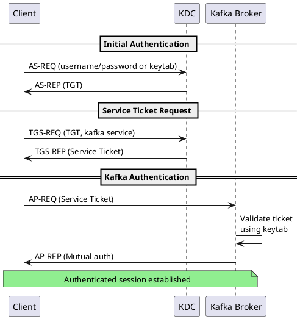

# Kerberos Authentication (SASL/GSSAPI)

Kerberos provides strong authentication through tickets issued by a trusted Key Distribution Center (KDC). It integrates with enterprise identity systems like Active Directory and MIT Kerberos.

---

## Overview

### When to Use Kerberos

| Use Case | Recommendation |
|----------|----------------|
| Active Directory environment | Recommended |
| Enterprise SSO requirements | Recommended |
| Existing Kerberos infrastructure | Recommended |
| Cloud-native / no AD | Consider OAuth |
| Simple deployments | Consider SCRAM |

### Kerberos Benefits

| Feature | Benefit |
|---------|---------|
| **Single Sign-On** | Users authenticate once across services |
| **Centralized identity** | Integrates with Active Directory |
| **Mutual authentication** | Both client and server verified |
| **Time-limited tickets** | Automatic expiration, no password exposure |
| **Delegation** | Services can act on behalf of users |

### Version Requirements

| Feature | Kafka Version |
|---------|---------------|
| SASL/GSSAPI | 0.9.0+ |
| Per-listener GSSAPI config | 1.0.0+ |
| Re-authentication | 2.2.0+ |

---

## Architecture



**Key concepts:**

- **TGT (Ticket Granting Ticket)** - Initial ticket from user authentication
- **Service Ticket** - Ticket for specific service (Kafka)
- **Keytab** - File containing service principal keys (replaces password)
- **Principal** - Unique identity (user or service) in Kerberos realm

---

## Prerequisites

### KDC Requirements

- Functioning Kerberos KDC (Active Directory or MIT Kerberos)
- Network connectivity from Kafka nodes to KDC
- DNS properly configured (Kerberos relies heavily on DNS)
- Time synchronization (NTP) across all nodes

### Service Principals

Create principals for each Kafka broker and client service:

**MIT Kerberos:**

```bash
# Create broker principal
kadmin.local -q "addprinc -randkey kafka/kafka1.example.com@EXAMPLE.COM"
kadmin.local -q "addprinc -randkey kafka/kafka2.example.com@EXAMPLE.COM"
kadmin.local -q "addprinc -randkey kafka/kafka3.example.com@EXAMPLE.COM"

# Create client principal
kadmin.local -q "addprinc -randkey client/app1.example.com@EXAMPLE.COM"

# Export keytabs
kadmin.local -q "xst -k /etc/kafka/kafka1.keytab kafka/kafka1.example.com@EXAMPLE.COM"
kadmin.local -q "xst -k /etc/kafka/kafka2.keytab kafka/kafka2.example.com@EXAMPLE.COM"
kadmin.local -q "xst -k /etc/kafka/kafka3.keytab kafka/kafka3.example.com@EXAMPLE.COM"
kadmin.local -q "xst -k /etc/kafka/client.keytab client/app1.example.com@EXAMPLE.COM"
```

**Active Directory (PowerShell):**

```powershell
# Create service account
New-ADUser -Name "kafka-broker" -UserPrincipalName "kafka/kafka1.example.com@EXAMPLE.COM"

# Set SPN
setspn -A kafka/kafka1.example.com kafka-broker

# Generate keytab
ktpass /out kafka1.keytab /princ kafka/kafka1.example.com@EXAMPLE.COM /mapuser kafka-broker /pass * /crypto AES256-SHA1
```

### Principal Naming Convention

| Component | Principal Format | Example |
|-----------|------------------|---------|
| Broker | `kafka/<hostname>@REALM` | `kafka/kafka1.example.com@EXAMPLE.COM` |
| Client | `<service>/<hostname>@REALM` | `myapp/app1.example.com@EXAMPLE.COM` |
| User | `<username>@REALM` | `alice@EXAMPLE.COM` |

---

## Broker Configuration

### krb5.conf

Configure Kerberos settings on each broker:

**/etc/krb5.conf:**

```ini
[libdefaults]
    default_realm = EXAMPLE.COM
    dns_lookup_realm = false
    dns_lookup_kdc = true
    ticket_lifetime = 24h
    renew_lifetime = 7d
    forwardable = true
    rdns = false
    default_tgs_enctypes = aes256-cts-hmac-sha1-96 aes128-cts-hmac-sha1-96
    default_tkt_enctypes = aes256-cts-hmac-sha1-96 aes128-cts-hmac-sha1-96

[realms]
    EXAMPLE.COM = {
        kdc = kdc1.example.com
        kdc = kdc2.example.com
        admin_server = kdc1.example.com
    }

[domain_realm]
    .example.com = EXAMPLE.COM
    example.com = EXAMPLE.COM
```

### server.properties

```properties
# Listener configuration
listeners=SASL_SSL://0.0.0.0:9093
advertised.listeners=SASL_SSL://kafka1.example.com:9093

# Security protocol
security.inter.broker.protocol=SASL_SSL
sasl.mechanism.inter.broker.protocol=GSSAPI

# Enable Kerberos
sasl.enabled.mechanisms=GSSAPI

# Kerberos service name (must match principal prefix)
sasl.kerberos.service.name=kafka

# JAAS configuration
listener.name.sasl_ssl.gssapi.sasl.jaas.config=\
  com.sun.security.auth.module.Krb5LoginModule required \
  useKeyTab=true \
  storeKey=true \
  keyTab="/etc/kafka/kafka.keytab" \
  principal="kafka/kafka1.example.com@EXAMPLE.COM";
```

### TLS Configuration

```properties
# SSL settings (always use with SASL)
ssl.keystore.type=PKCS12
ssl.keystore.location=/etc/kafka/ssl/kafka.keystore.p12
ssl.keystore.password=${KEYSTORE_PASSWORD}
ssl.key.password=${KEY_PASSWORD}

ssl.truststore.type=PKCS12
ssl.truststore.location=/etc/kafka/ssl/kafka.truststore.p12
ssl.truststore.password=${TRUSTSTORE_PASSWORD}

ssl.enabled.protocols=TLSv1.3,TLSv1.2
ssl.endpoint.identification.algorithm=HTTPS
```

### Static JAAS File (Alternative)

**/etc/kafka/kafka_server_jaas.conf:**

```
KafkaServer {
    com.sun.security.auth.module.Krb5LoginModule required
    useKeyTab=true
    storeKey=true
    keyTab="/etc/kafka/kafka.keytab"
    principal="kafka/kafka1.example.com@EXAMPLE.COM";
};
```

**JVM parameter:**

```bash
-Djava.security.auth.login.config=/etc/kafka/kafka_server_jaas.conf
```

### JVM Kerberos Settings

```bash
# kafka-server-start.sh or environment
export KAFKA_OPTS="-Djava.security.krb5.conf=/etc/krb5.conf \
  -Dsun.security.krb5.debug=false"
```

---

## Principal Mapping

Kafka maps Kerberos principals to internal user names for authorization. Configure mapping rules to extract the appropriate portion:

### Default Mapping

By default, Kafka uses the full principal as the user name:

```
kafka/kafka1.example.com@EXAMPLE.COM -> kafka/kafka1.example.com@EXAMPLE.COM
```

### Custom Mapping Rules

```properties
# Extract primary component only
sasl.kerberos.principal.to.local.rules=\
  RULE:[1:$1@$0](.*@EXAMPLE\.COM)s/@.*//,\
  RULE:[2:$1@$0](.*@EXAMPLE\.COM)s/@.*//,\
  DEFAULT

# Examples:
# alice@EXAMPLE.COM -> alice
# kafka/kafka1.example.com@EXAMPLE.COM -> kafka
```

### Rule Syntax

| Rule Format | Description |
|-------------|-------------|
| `RULE:[n:template](pattern)s/regex/replacement/` | Transform principal |
| `[1:$1@$0]` | Single-component principal (user@REALM) |
| `[2:$1@$0]` | Two-component principal (service/host@REALM) |
| `DEFAULT` | Use principal as-is |

### Common Mapping Configurations

**Extract username only:**

```properties
sasl.kerberos.principal.to.local.rules=\
  RULE:[1:$1@$0](.*@EXAMPLE\.COM)s/@.*//,\
  RULE:[2:$1@$0](.*@EXAMPLE\.COM)s/@.*//,\
  DEFAULT
```

**Preserve service name:**

```properties
sasl.kerberos.principal.to.local.rules=\
  RULE:[2:$1](kafka/.*@EXAMPLE\.COM)s/kafka\///,\
  DEFAULT
```

---

## Client Configuration

### Java Client with Keytab

```java
Properties props = new Properties();
props.put(ProducerConfig.BOOTSTRAP_SERVERS_CONFIG, "kafka1:9093,kafka2:9093");
props.put(ProducerConfig.KEY_SERIALIZER_CLASS_CONFIG, StringSerializer.class);
props.put(ProducerConfig.VALUE_SERIALIZER_CLASS_CONFIG, StringSerializer.class);

// Security configuration
props.put("security.protocol", "SASL_SSL");
props.put("sasl.mechanism", "GSSAPI");
props.put("sasl.kerberos.service.name", "kafka");
props.put("sasl.jaas.config",
    "com.sun.security.auth.module.Krb5LoginModule required " +
    "useKeyTab=true " +
    "storeKey=true " +
    "keyTab=\"/etc/kafka/client.keytab\" " +
    "principal=\"myapp/app1.example.com@EXAMPLE.COM\";");

// TLS configuration
props.put("ssl.truststore.location", "/etc/kafka/ssl/client.truststore.p12");
props.put("ssl.truststore.password", "truststore-password");
props.put("ssl.truststore.type", "PKCS12");

KafkaProducer<String, String> producer = new KafkaProducer<>(props);
```

### Java Client with Ticket Cache

For interactive users with existing Kerberos tickets:

```java
props.put("sasl.jaas.config",
    "com.sun.security.auth.module.Krb5LoginModule required " +
    "useTicketCache=true " +
    "renewTGT=true " +
    "principal=\"alice@EXAMPLE.COM\";");
```

### Spring Boot

**application.yml:**

```yaml
spring:
  kafka:
    bootstrap-servers: kafka1:9093,kafka2:9093
    properties:
      security.protocol: SASL_SSL
      sasl.mechanism: GSSAPI
      sasl.kerberos.service.name: kafka
      sasl.jaas.config: >
        com.sun.security.auth.module.Krb5LoginModule required
        useKeyTab=true
        storeKey=true
        keyTab="${KEYTAB_PATH}"
        principal="${KERBEROS_PRINCIPAL}";
    ssl:
      trust-store-location: classpath:truststore.p12
      trust-store-password: ${TRUSTSTORE_PASSWORD}
      trust-store-type: PKCS12
```

### Python (confluent-kafka)

```python
from confluent_kafka import Producer

config = {
    'bootstrap.servers': 'kafka1:9093,kafka2:9093',
    'security.protocol': 'SASL_SSL',
    'sasl.mechanism': 'GSSAPI',
    'sasl.kerberos.service.name': 'kafka',
    'sasl.kerberos.keytab': '/etc/kafka/client.keytab',
    'sasl.kerberos.principal': 'myapp/app1.example.com@EXAMPLE.COM',
    'ssl.ca.location': '/etc/kafka/ssl/ca-cert.pem',
}

producer = Producer(config)
```

### Command-Line Tools

**client.properties:**

```properties
security.protocol=SASL_SSL
sasl.mechanism=GSSAPI
sasl.kerberos.service.name=kafka
sasl.jaas.config=com.sun.security.auth.module.Krb5LoginModule required \
  useKeyTab=true \
  storeKey=true \
  keyTab="/etc/kafka/client.keytab" \
  principal="admin/admin.example.com@EXAMPLE.COM";
ssl.truststore.location=/etc/kafka/ssl/client.truststore.p12
ssl.truststore.password=truststore-password
```

```bash
# Authenticate with kinit first (for ticket cache)
kinit admin@EXAMPLE.COM

# Then use Kafka tools
kafka-topics.sh --bootstrap-server kafka:9093 \
  --command-config client.properties \
  --list
```

---

## Keytab Management

### Keytab Security

| Best Practice | Description |
|---------------|-------------|
| File permissions | `chmod 400` - owner read only |
| Ownership | Owned by service account user |
| Location | Outside of world-readable directories |
| Backup | Secure backup, encrypted storage |
| Rotation | Regenerate periodically |

```bash
# Secure keytab permissions
chmod 400 /etc/kafka/kafka.keytab
chown kafka:kafka /etc/kafka/kafka.keytab
```

### Verify Keytab

```bash
# List principals in keytab
klist -kt /etc/kafka/kafka.keytab

# Test keytab authentication
kinit -kt /etc/kafka/kafka.keytab kafka/kafka1.example.com@EXAMPLE.COM
klist
```

### Keytab Rotation

1. Generate new keytab with updated keys
2. Deploy to all brokers
3. Rolling restart brokers
4. Update client keytabs
5. Verify authentication

---

## Ticket Renewal

### Broker Ticket Refresh

Configure automatic ticket renewal:

```properties
# Enable ticket renewal
sasl.kerberos.ticket.renew.window.factor=0.8
sasl.kerberos.ticket.renew.jitter=0.05
sasl.kerberos.min.time.before.relogin=60000
```

| Property | Default | Description |
|----------|---------|-------------|
| `ticket.renew.window.factor` | 0.8 | Renew at 80% of ticket lifetime |
| `ticket.renew.jitter` | 0.05 | Random jitter to prevent thundering herd |
| `min.time.before.relogin` | 60000 | Minimum time between re-login attempts |

### Client Re-authentication

Enable periodic re-authentication (Kafka 2.2+):

**Broker:**

```properties
# Force re-authentication every hour
connections.max.reauth.ms=3600000
```

**Client:**

```java
// Client automatically re-authenticates when broker requests
```

---

## Multi-Realm Configuration

### Cross-Realm Trust

For environments with multiple Kerberos realms:

**/etc/krb5.conf:**

```ini
[libdefaults]
    default_realm = CORP.EXAMPLE.COM

[realms]
    CORP.EXAMPLE.COM = {
        kdc = kdc.corp.example.com
        admin_server = kdc.corp.example.com
    }
    PARTNER.COM = {
        kdc = kdc.partner.com
        admin_server = kdc.partner.com
    }

[capaths]
    PARTNER.COM = {
        CORP.EXAMPLE.COM = .
    }
    CORP.EXAMPLE.COM = {
        PARTNER.COM = .
    }
```

### Principal Mapping for Multiple Realms

```properties
sasl.kerberos.principal.to.local.rules=\
  RULE:[1:$1@$0](.*@CORP\.EXAMPLE\.COM)s/@.*//,\
  RULE:[1:$1@$0](.*@PARTNER\.COM)s/@.*//,\
  RULE:[2:$1@$0](.*@CORP\.EXAMPLE\.COM)s/@.*//,\
  RULE:[2:$1@$0](.*@PARTNER\.COM)s/@.*//,\
  DEFAULT
```

---

## Troubleshooting

### Common Errors

| Error | Cause | Solution |
|-------|-------|----------|
| `GSSException: No valid credentials` | Expired ticket or no keytab | Renew ticket or check keytab |
| `Clock skew too great` | Time not synchronized | Configure NTP |
| `Server not found in Kerberos database` | Wrong SPN or missing principal | Verify principal exists |
| `Pre-authentication failed` | Wrong password/keytab | Verify keytab is correct |
| `Cannot find key of appropriate type` | Encryption type mismatch | Check supported enctypes |

### Debug Logging

**Enable Kerberos debug:**

```bash
# JVM parameter
-Dsun.security.krb5.debug=true

# Or environment variable
export KAFKA_OPTS="-Dsun.security.krb5.debug=true"
```

**Kafka security logging:**

```properties
# log4j.properties
log4j.logger.org.apache.kafka.common.security=DEBUG
log4j.logger.org.apache.kafka.common.security.kerberos=TRACE
```

### Diagnostic Commands

```bash
# Check ticket
klist

# Test keytab
kinit -kt /etc/kafka/kafka.keytab kafka/kafka1.example.com@EXAMPLE.COM

# Verify DNS
nslookup kafka1.example.com
host -t SRV _kerberos._tcp.EXAMPLE.COM

# Check time sync
ntpstat

# Test connectivity to KDC
nc -zv kdc.example.com 88
```

### Verify Broker Configuration

```bash
# Test authentication
kafka-broker-api-versions.sh --bootstrap-server kafka:9093 \
  --command-config client.properties

# Check broker logs
grep -i "kerberos\|gssapi\|sasl" /var/log/kafka/server.log | tail -50
```

---

## Active Directory Integration

### Service Account Setup

1. Create a service account in AD
2. Configure Service Principal Name (SPN)
3. Generate keytab

**PowerShell:**

```powershell
# Create service account
$password = ConvertTo-SecureString "ComplexPassword123!" -AsPlainText -Force
New-ADUser -Name "svc-kafka-broker" `
  -SamAccountName "svc-kafka-broker" `
  -UserPrincipalName "kafka/kafka.example.com@EXAMPLE.COM" `
  -AccountPassword $password `
  -Enabled $true `
  -PasswordNeverExpires $true

# Set SPN
setspn -A kafka/kafka1.example.com svc-kafka-broker
setspn -A kafka/kafka2.example.com svc-kafka-broker
setspn -A kafka/kafka3.example.com svc-kafka-broker

# Generate keytab
ktpass /out C:\kafka.keytab `
  /princ kafka/kafka1.example.com@EXAMPLE.COM `
  /mapuser svc-kafka-broker `
  /pass ComplexPassword123! `
  /crypto AES256-SHA1 `
  /ptype KRB5_NT_PRINCIPAL
```

### AD-Specific Settings

```properties
# Use explicit KDC if DNS discovery doesn't work
sasl.kerberos.kinit.cmd=/usr/bin/kinit
```

**/etc/krb5.conf for AD:**

```ini
[libdefaults]
    default_realm = EXAMPLE.COM
    dns_lookup_realm = false
    dns_lookup_kdc = false

[realms]
    EXAMPLE.COM = {
        kdc = dc1.example.com
        kdc = dc2.example.com
        admin_server = dc1.example.com
        default_domain = example.com
    }

[domain_realm]
    .example.com = EXAMPLE.COM
    example.com = EXAMPLE.COM
```

---

## Related Documentation

- [Authentication Overview](index.md) - Mechanism comparison
- [OAuth Authentication](oauth.md) - Cloud identity providers
- [Delegation Tokens](delegation-tokens.md) - Lightweight tokens (with Kerberos)
- [Authorization](../authorization/index.md) - ACL configuration
- [Encryption](../encryption/index.md) - TLS setup
