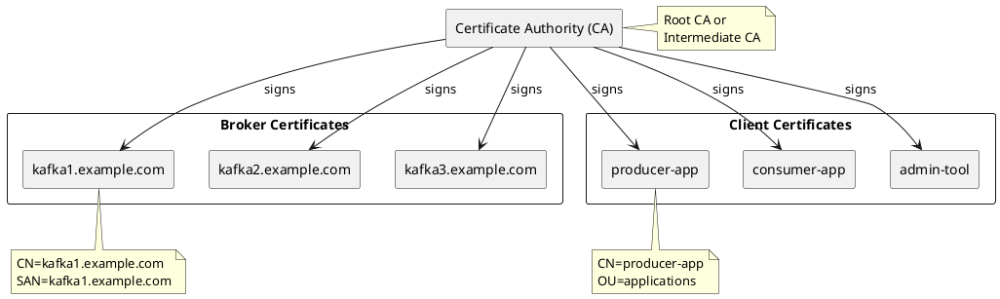

# Mutual TLS Authentication (mTLS)

Mutual TLS (mTLS) provides certificate-based authentication where both clients and brokers present certificates to verify identity. It eliminates passwords entirely, relying on PKI infrastructure for identity management.

---

## Overview

### When to Use mTLS

| Use Case | Recommendation |
|----------|----------------|
| Existing PKI infrastructure | Recommended |
| Zero-trust environments | Recommended |
| Service-to-service auth | Recommended |
| IoT/device authentication | Recommended |
| User authentication | Consider OAuth/SCRAM |
| No PKI available | Consider SCRAM |

### mTLS Benefits

| Feature | Benefit |
|---------|---------|
| **No passwords** | Eliminates credential management |
| **Strong identity** | Cryptographic verification |
| **Certificate lifecycle** | Automated rotation via PKI |
| **Mutual verification** | Both parties authenticated |
| **Network encryption** | Built into TLS handshake |

### mTLS vs Other Mechanisms

| Feature | mTLS | SCRAM | OAuth |
|---------|------|-------|-------|
| Password required | No | Yes | No (tokens) |
| External infrastructure | PKI/CA | None | IdP |
| Credential rotation | Cert renewal | Manual | Token refresh |
| Identity source | Certificate | Broker config | IdP |

### Version Requirements

| Feature | Kafka Version |
|---------|---------------|
| SSL/TLS authentication | 0.9.0+ |
| Per-listener SSL config | 1.0.0+ |
| PEM format support | 2.7.0+ |
| Custom principal builder | 0.10.0+ |

---

## Certificate Architecture



**Certificate requirements:**

| Component | Certificate Purpose | Key Fields |
|-----------|---------------------|------------|
| **CA** | Trust anchor | Root or intermediate CA |
| **Broker** | Server identity | CN or SAN matching hostname |
| **Client** | Client identity | CN identifying application |

---

## Certificate Generation

### Using OpenSSL

**1. Create CA:**

```bash
# Generate CA private key
openssl genrsa -out ca-key.pem 4096

# Create CA certificate
openssl req -new -x509 -days 3650 -key ca-key.pem -out ca-cert.pem \
  -subj "/C=US/ST=CA/L=San Francisco/O=MyOrg/CN=Kafka-CA"
```

**2. Create broker certificate:**

```bash
# Generate broker private key
openssl genrsa -out kafka1-key.pem 2048

# Create certificate signing request (CSR)
openssl req -new -key kafka1-key.pem -out kafka1.csr \
  -subj "/C=US/ST=CA/L=San Francisco/O=MyOrg/CN=kafka1.example.com"

# Create SAN extension file
cat > kafka1-san.ext << EOF
subjectAltName=DNS:kafka1.example.com,DNS:localhost,IP:192.168.1.10
EOF

# Sign certificate with CA
openssl x509 -req -days 365 -in kafka1.csr -CA ca-cert.pem -CAkey ca-key.pem \
  -CAcreateserial -out kafka1-cert.pem -extfile kafka1-san.ext
```

**3. Create client certificate:**

```bash
# Generate client private key
openssl genrsa -out client-key.pem 2048

# Create CSR
openssl req -new -key client-key.pem -out client.csr \
  -subj "/C=US/ST=CA/L=San Francisco/O=MyOrg/OU=Applications/CN=producer-app"

# Sign with CA
openssl x509 -req -days 365 -in client.csr -CA ca-cert.pem -CAkey ca-key.pem \
  -CAcreateserial -out client-cert.pem
```

### Create Keystores (PKCS12)

```bash
# Broker keystore (certificate + private key)
openssl pkcs12 -export -in kafka1-cert.pem -inkey kafka1-key.pem \
  -out kafka1.keystore.p12 -name kafka1 \
  -CAfile ca-cert.pem -caname root -password pass:keystore-password

# Truststore (CA certificate)
keytool -import -file ca-cert.pem -keystore kafka.truststore.p12 \
  -storetype PKCS12 -alias ca -storepass truststore-password -noprompt

# Client keystore
openssl pkcs12 -export -in client-cert.pem -inkey client-key.pem \
  -out client.keystore.p12 -name client \
  -CAfile ca-cert.pem -caname root -password pass:keystore-password
```

### Using cfssl

```bash
# Install cfssl
go install github.com/cloudflare/cfssl/cmd/cfssl@latest
go install github.com/cloudflare/cfssl/cmd/cfssljson@latest

# CA config
cat > ca-config.json << EOF
{
  "signing": {
    "default": {
      "expiry": "8760h"
    },
    "profiles": {
      "server": {
        "usages": ["signing", "key encipherment", "server auth"],
        "expiry": "8760h"
      },
      "client": {
        "usages": ["signing", "key encipherment", "client auth"],
        "expiry": "8760h"
      }
    }
  }
}
EOF

# Generate CA
cfssl gencert -initca ca-csr.json | cfssljson -bare ca

# Generate broker cert
cfssl gencert -ca=ca.pem -ca-key=ca-key.pem -config=ca-config.json \
  -profile=server kafka1-csr.json | cfssljson -bare kafka1

# Generate client cert
cfssl gencert -ca=ca.pem -ca-key=ca-key.pem -config=ca-config.json \
  -profile=client client-csr.json | cfssljson -bare client
```

---

## Broker Configuration

### Basic mTLS Setup

```properties
# server.properties

# Listener using SSL protocol (mTLS)
listeners=SSL://0.0.0.0:9093
advertised.listeners=SSL://kafka1.example.com:9093

# Inter-broker communication
security.inter.broker.protocol=SSL

# Require client certificate authentication
ssl.client.auth=required

# Broker keystore (certificate + private key)
ssl.keystore.type=PKCS12
ssl.keystore.location=/etc/kafka/ssl/kafka.keystore.p12
ssl.keystore.password=${KEYSTORE_PASSWORD}
ssl.key.password=${KEY_PASSWORD}

# Truststore (CA certificates)
ssl.truststore.type=PKCS12
ssl.truststore.location=/etc/kafka/ssl/kafka.truststore.p12
ssl.truststore.password=${TRUSTSTORE_PASSWORD}

# TLS protocol settings
ssl.enabled.protocols=TLSv1.3,TLSv1.2
ssl.endpoint.identification.algorithm=HTTPS
```

### Client Auth Modes

| Value | Behavior |
|-------|----------|
| `required` | Client must present valid certificate |
| `requested` | Client certificate optional |
| `none` | No client certificate requested |

### PEM Format (Kafka 2.7+)

```properties
# Use PEM files directly (no keystore)
ssl.keystore.type=PEM
ssl.keystore.certificate.chain=/etc/kafka/ssl/kafka1-cert.pem
ssl.keystore.key=/etc/kafka/ssl/kafka1-key.pem

ssl.truststore.type=PEM
ssl.truststore.certificates=/etc/kafka/ssl/ca-cert.pem
```

### Multiple Listeners

Configure different authentication per listener:

```properties
# Define listeners
listeners=INTERNAL://0.0.0.0:9092,MTLS://0.0.0.0:9093

# Map to protocols
listener.security.protocol.map=INTERNAL:PLAINTEXT,MTLS:SSL

# mTLS listener requires client cert
listener.name.mtls.ssl.client.auth=required

# Internal listener (trusted network)
listener.name.internal.ssl.client.auth=none
```

---

## Principal Mapping

### Default Principal

By default, the client's Distinguished Name (DN) becomes the Kafka principal:

```
Certificate DN: CN=producer-app,OU=Applications,O=MyOrg
Kafka Principal: User:CN=producer-app,OU=Applications,O=MyOrg
```

### Custom Principal Builder

Extract specific certificate fields:

```properties
# Use Common Name only
ssl.principal.mapping.rules=RULE:^CN=([^,]+).*$/$1/

# Examples:
# CN=producer-app,OU=Applications -> producer-app
# CN=admin,OU=Admins,O=MyOrg -> admin
```

### Multiple Mapping Rules

```properties
ssl.principal.mapping.rules=\
  RULE:^CN=([^,]+),OU=Services.*$/$1/,\
  RULE:^CN=([^,]+),OU=Users.*$/User:$1/,\
  DEFAULT
```

| Rule | Input DN | Output Principal |
|------|----------|------------------|
| Rule 1 | `CN=producer,OU=Services,O=MyOrg` | `producer` |
| Rule 2 | `CN=alice,OU=Users,O=MyOrg` | `User:alice` |
| DEFAULT | `CN=other,OU=Other` | `CN=other,OU=Other` |

### Custom Principal Builder Class

For complex logic, implement a custom builder:

```java
import org.apache.kafka.common.security.auth.KafkaPrincipalBuilder;
import org.apache.kafka.common.security.auth.AuthenticationContext;
import org.apache.kafka.common.security.auth.KafkaPrincipal;
import org.apache.kafka.common.security.auth.SslAuthenticationContext;
import javax.net.ssl.SSLSession;
import java.security.cert.X509Certificate;

public class CustomPrincipalBuilder implements KafkaPrincipalBuilder {

    @Override
    public KafkaPrincipal build(AuthenticationContext context) {
        if (context instanceof SslAuthenticationContext) {
            SSLSession session = ((SslAuthenticationContext) context).session();
            try {
                X509Certificate cert = (X509Certificate) session.getPeerCertificates()[0];
                String cn = extractCN(cert.getSubjectDN().getName());
                return new KafkaPrincipal(KafkaPrincipal.USER_TYPE, cn);
            } catch (Exception e) {
                return KafkaPrincipal.ANONYMOUS;
            }
        }
        return KafkaPrincipal.ANONYMOUS;
    }

    private String extractCN(String dn) {
        // Extract CN from DN
        for (String part : dn.split(",")) {
            if (part.trim().startsWith("CN=")) {
                return part.trim().substring(3);
            }
        }
        return dn;
    }
}
```

```properties
# Register custom builder
principal.builder.class=com.example.CustomPrincipalBuilder
```

---

## Client Configuration

### Java Client

```java
import org.apache.kafka.clients.producer.KafkaProducer;
import org.apache.kafka.clients.producer.ProducerConfig;
import java.util.Properties;

Properties props = new Properties();
props.put(ProducerConfig.BOOTSTRAP_SERVERS_CONFIG, "kafka1:9093,kafka2:9093");
props.put(ProducerConfig.KEY_SERIALIZER_CLASS_CONFIG, StringSerializer.class);
props.put(ProducerConfig.VALUE_SERIALIZER_CLASS_CONFIG, StringSerializer.class);

// SSL/mTLS configuration
props.put("security.protocol", "SSL");

// Client keystore (client certificate + private key)
props.put("ssl.keystore.type", "PKCS12");
props.put("ssl.keystore.location", "/etc/kafka/ssl/client.keystore.p12");
props.put("ssl.keystore.password", "keystore-password");
props.put("ssl.key.password", "key-password");

// Truststore (CA certificate)
props.put("ssl.truststore.type", "PKCS12");
props.put("ssl.truststore.location", "/etc/kafka/ssl/client.truststore.p12");
props.put("ssl.truststore.password", "truststore-password");

// Verify broker hostname
props.put("ssl.endpoint.identification.algorithm", "HTTPS");

KafkaProducer<String, String> producer = new KafkaProducer<>(props);
```

### Spring Boot

**application.yml:**

```yaml
spring:
  kafka:
    bootstrap-servers: kafka1:9093,kafka2:9093
    properties:
      security.protocol: SSL
      ssl.endpoint.identification.algorithm: HTTPS
    ssl:
      key-store-location: classpath:client.keystore.p12
      key-store-password: ${KEYSTORE_PASSWORD}
      key-store-type: PKCS12
      key-password: ${KEY_PASSWORD}
      trust-store-location: classpath:truststore.p12
      trust-store-password: ${TRUSTSTORE_PASSWORD}
      trust-store-type: PKCS12
```

### Python (confluent-kafka)

```python
from confluent_kafka import Producer

config = {
    'bootstrap.servers': 'kafka1:9093,kafka2:9093',
    'security.protocol': 'SSL',

    # Client certificate and key
    'ssl.certificate.location': '/etc/kafka/ssl/client-cert.pem',
    'ssl.key.location': '/etc/kafka/ssl/client-key.pem',
    'ssl.key.password': 'key-password',

    # CA certificate
    'ssl.ca.location': '/etc/kafka/ssl/ca-cert.pem',

    # Verify broker hostname
    'ssl.endpoint.identification.algorithm': 'https',
}

producer = Producer(config)
```

### Go (confluent-kafka-go)

```go
import (
    "github.com/confluentinc/confluent-kafka-go/v2/kafka"
)

producer, err := kafka.NewProducer(&kafka.ConfigMap{
    "bootstrap.servers":                   "kafka1:9093,kafka2:9093",
    "security.protocol":                   "SSL",
    "ssl.certificate.location":            "/etc/kafka/ssl/client-cert.pem",
    "ssl.key.location":                    "/etc/kafka/ssl/client-key.pem",
    "ssl.key.password":                    "key-password",
    "ssl.ca.location":                     "/etc/kafka/ssl/ca-cert.pem",
    "ssl.endpoint.identification.algorithm": "https",
})
```

### Command-Line Tools

**client-ssl.properties:**

```properties
security.protocol=SSL
ssl.keystore.type=PKCS12
ssl.keystore.location=/etc/kafka/ssl/client.keystore.p12
ssl.keystore.password=keystore-password
ssl.key.password=key-password
ssl.truststore.type=PKCS12
ssl.truststore.location=/etc/kafka/ssl/client.truststore.p12
ssl.truststore.password=truststore-password
ssl.endpoint.identification.algorithm=HTTPS
```

```bash
# List topics
kafka-topics.sh --bootstrap-server kafka:9093 \
  --command-config client-ssl.properties \
  --list

# Produce messages
kafka-console-producer.sh --bootstrap-server kafka:9093 \
  --topic my-topic \
  --producer.config client-ssl.properties

# Consume messages
kafka-console-consumer.sh --bootstrap-server kafka:9093 \
  --topic my-topic \
  --consumer.config client-ssl.properties \
  --from-beginning
```

---

## Certificate Rotation

### Broker Certificate Rotation

1. **Generate new certificates** signed by same CA
2. **Update keystore** on each broker
3. **Rolling restart** brokers

```bash
# Verify new certificate before deployment
openssl x509 -in new-kafka1-cert.pem -text -noout

# Update keystore
openssl pkcs12 -export -in new-kafka1-cert.pem -inkey new-kafka1-key.pem \
  -out kafka1.keystore.p12 -name kafka1 \
  -password pass:keystore-password

# Copy to broker and restart
scp kafka1.keystore.p12 kafka1:/etc/kafka/ssl/
ssh kafka1 'systemctl restart kafka'
```

### CA Rotation

Rotating the CA requires more care:

1. **Add new CA** to all truststores (alongside old CA)
2. **Rolling restart** all brokers and clients
3. **Issue new certificates** signed by new CA
4. **Deploy new certificates** with rolling restarts
5. **Remove old CA** from truststores
6. **Final rolling restart**

### Automated Rotation with cert-manager

```yaml
# Kubernetes cert-manager Certificate
apiVersion: cert-manager.io/v1
kind: Certificate
metadata:
  name: kafka-broker
spec:
  secretName: kafka-broker-tls
  issuerRef:
    name: kafka-ca-issuer
    kind: ClusterIssuer
  commonName: kafka1.example.com
  dnsNames:
    - kafka1.example.com
    - kafka1
  duration: 8760h  # 1 year
  renewBefore: 720h  # 30 days
  privateKey:
    algorithm: RSA
    size: 2048
```

---

## Security Best Practices

### Certificate Requirements

| Requirement | Recommendation |
|-------------|----------------|
| Key size | RSA 2048+ or ECDSA P-256+ |
| Validity period | 1 year for services, shorter for rotation |
| SAN extension | Include all hostnames/IPs |
| Key usage | Server auth for brokers, client auth for clients |

### File Security

```bash
# Restrict keystore access
chmod 400 /etc/kafka/ssl/*.keystore.p12
chown kafka:kafka /etc/kafka/ssl/*.keystore.p12

# Private keys
chmod 400 /etc/kafka/ssl/*-key.pem
chown kafka:kafka /etc/kafka/ssl/*-key.pem
```

### Certificate Validation

```properties
# Always verify broker hostname
ssl.endpoint.identification.algorithm=HTTPS

# Use TLS 1.2 or higher
ssl.enabled.protocols=TLSv1.3,TLSv1.2

# Strong cipher suites (example)
ssl.cipher.suites=TLS_AES_256_GCM_SHA384,TLS_CHACHA20_POLY1305_SHA256
```

---

## Troubleshooting

### Common Errors

| Error | Cause | Solution |
|-------|-------|----------|
| `PKIX path building failed` | CA not in truststore | Add CA to truststore |
| `Certificate unknown` | Client cert not trusted | Sign with trusted CA |
| `Hostname verification failed` | SAN doesn't match hostname | Add hostname to SAN |
| `No cipher suites in common` | Protocol/cipher mismatch | Check ssl.enabled.protocols |
| `Keystore password incorrect` | Wrong password | Verify password |

### Debug TLS Handshake

```bash
# JVM debug parameter
-Djavax.net.debug=ssl:handshake

# Or more verbose
-Djavax.net.debug=all
```

### Verify Certificates

```bash
# Check certificate details
openssl x509 -in kafka1-cert.pem -text -noout

# Verify certificate chain
openssl verify -CAfile ca-cert.pem kafka1-cert.pem

# Check keystore contents
keytool -list -v -keystore kafka.keystore.p12 -storepass password

# Test SSL connection
openssl s_client -connect kafka1:9093 -CAfile ca-cert.pem \
  -cert client-cert.pem -key client-key.pem
```

### Check Broker TLS Status

```bash
# Test broker connection
kafka-broker-api-versions.sh --bootstrap-server kafka:9093 \
  --command-config client-ssl.properties

# Check broker logs
grep -i "ssl\|tls\|certificate" /var/log/kafka/server.log | tail -50
```

---

## Combining mTLS with SASL

Use mTLS for transport security and SASL for authentication:

```properties
# Broker: SASL authentication over TLS
listeners=SASL_SSL://0.0.0.0:9093

# Client cert optional (SASL provides auth)
ssl.client.auth=requested

# SASL mechanism
sasl.enabled.mechanisms=SCRAM-SHA-512
```

This provides:

- TLS encryption and optional client certificate verification
- SASL-based identity for authorization

---

## Related Documentation

- [Authentication Overview](index.md) - Mechanism comparison
- [SASL/SCRAM](sasl-scram.md) - Password-based authentication
- [Encryption](../encryption/index.md) - TLS configuration details
- [Authorization](../authorization/index.md) - ACL configuration
