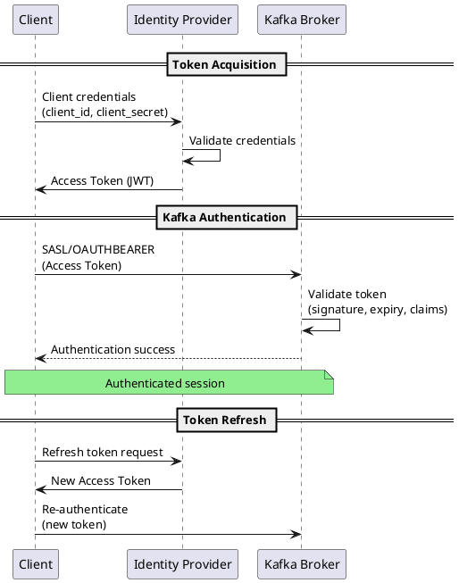

# OAuth/OIDC Authentication (SASL/OAUTHBEARER)

SASL/OAUTHBEARER enables OAuth 2.0 and OpenID Connect (OIDC) authentication for Kafka. It integrates with cloud identity providers like Azure AD, Okta, Auth0, and Keycloak.

---

## Overview

### When to Use OAuth

| Use Case | Recommendation |
|----------|----------------|
| Cloud-native deployments | Recommended |
| Azure AD / Entra ID integration | Recommended |
| Okta / Auth0 / Keycloak | Recommended |
| Microservices architecture | Recommended |
| No existing identity provider | Consider SCRAM |
| On-premises without IdP | Consider Kerberos or SCRAM |

### OAuth Benefits

| Feature | Benefit |
|---------|---------|
| **Token-based** | Short-lived, automatically refreshed |
| **Centralized identity** | Single source of truth |
| **Fine-grained scopes** | Permission control via claims |
| **No password storage** | Tokens from IdP only |
| **Standard protocol** | Broad tooling support |

### Version Requirements

| Feature | Kafka Version |
|---------|---------------|
| SASL/OAUTHBEARER (custom callback) | 2.0.0+ |
| Built-in OIDC support | 3.1.0+ |
| Token refresh without reconnect | 2.2.0+ |

!!! tip "Use Kafka 3.1+ for OIDC"
    Kafka 3.1 introduced built-in OIDC support with `OAuthBearerLoginCallbackHandler`. Earlier versions require custom callback implementation.

---

## OAuth Flow



**Key concepts:**

- **Access Token** - JWT containing identity and claims
- **Client Credentials** - Application identity (client_id/secret)
- **Token Refresh** - Automatic renewal before expiry
- **Claims** - Identity attributes (username, groups, scopes)

---

## Identity Provider Setup

### Azure AD / Entra ID

1. **Register application:**

```
Azure Portal -> Azure Active Directory -> App Registrations -> New Registration

Name: kafka-cluster
Account types: Single tenant
```

2. **Configure API permissions:**

```
API Permissions -> Add permission -> APIs my organization uses
Select your Kafka app -> Add permissions
```

3. **Create client secret:**

```
Certificates & secrets -> New client secret
Note: Copy secret value immediately, shown only once
```

4. **Get endpoints:**

```
Token endpoint: https://login.microsoftonline.com/{tenant-id}/oauth2/v2.0/token
JWKS URI: https://login.microsoftonline.com/{tenant-id}/discovery/v2.0/keys
```

### Okta

1. **Create application:**

```
Applications -> Create App Integration
Sign-in method: OIDC
Application type: Service (Machine-to-Machine)
```

2. **Configure:**

```
Client authentication: Client secret
Grant type: Client Credentials
```

3. **Get endpoints:**

```
Token endpoint: https://{your-domain}.okta.com/oauth2/default/v1/token
JWKS URI: https://{your-domain}.okta.com/oauth2/default/v1/keys
```

### Keycloak

1. **Create client:**

```
Clients -> Create Client
Client ID: kafka-broker
Client authentication: ON
Authentication flow: Service accounts roles
```

2. **Get endpoints:**

```
Token endpoint: https://{keycloak}/realms/{realm}/protocol/openid-connect/token
JWKS URI: https://{keycloak}/realms/{realm}/protocol/openid-connect/certs
```

---

## Broker Configuration (Kafka 3.1+)

### Basic OIDC Setup

```properties
# server.properties

# Listener configuration
listeners=SASL_SSL://0.0.0.0:9093
advertised.listeners=SASL_SSL://kafka1.example.com:9093

# Security protocol
security.inter.broker.protocol=SASL_SSL
sasl.mechanism.inter.broker.protocol=OAUTHBEARER

# Enable OAuth
sasl.enabled.mechanisms=OAUTHBEARER

# OIDC configuration
listener.name.sasl_ssl.oauthbearer.sasl.jaas.config=\
  org.apache.kafka.common.security.oauthbearer.OAuthBearerLoginModule required \
  clientId="kafka-broker" \
  clientSecret="${OAUTH_CLIENT_SECRET}" \
  scope="kafka" ;

# Server callback handler (validates incoming tokens)
listener.name.sasl_ssl.oauthbearer.sasl.server.callback.handler.class=\
  org.apache.kafka.common.security.oauthbearer.secured.OAuthBearerValidatorCallbackHandler

# Login callback handler (obtains tokens for inter-broker)
listener.name.sasl_ssl.oauthbearer.sasl.login.callback.handler.class=\
  org.apache.kafka.common.security.oauthbearer.secured.OAuthBearerLoginCallbackHandler

# OIDC discovery
sasl.oauthbearer.token.endpoint.url=https://login.microsoftonline.com/{tenant}/oauth2/v2.0/token
sasl.oauthbearer.jwks.endpoint.url=https://login.microsoftonline.com/{tenant}/discovery/v2.0/keys

# Expected audience (your Kafka app's client ID)
sasl.oauthbearer.expected.audience=api://kafka-cluster

# Clock skew tolerance (seconds)
sasl.oauthbearer.clock.skew.seconds=30
```

### TLS Configuration

```properties
# SSL settings
ssl.keystore.type=PKCS12
ssl.keystore.location=/etc/kafka/ssl/kafka.keystore.p12
ssl.keystore.password=${KEYSTORE_PASSWORD}
ssl.key.password=${KEY_PASSWORD}

ssl.truststore.type=PKCS12
ssl.truststore.location=/etc/kafka/ssl/kafka.truststore.p12
ssl.truststore.password=${TRUSTSTORE_PASSWORD}

ssl.enabled.protocols=TLSv1.3,TLSv1.2
ssl.endpoint.identification.algorithm=HTTPS
```

### Azure AD Configuration

```properties
# Azure AD specific
listener.name.sasl_ssl.oauthbearer.sasl.jaas.config=\
  org.apache.kafka.common.security.oauthbearer.OAuthBearerLoginModule required \
  clientId="${AZURE_CLIENT_ID}" \
  clientSecret="${AZURE_CLIENT_SECRET}" \
  scope="api://kafka-cluster/.default" ;

sasl.oauthbearer.token.endpoint.url=https://login.microsoftonline.com/${AZURE_TENANT_ID}/oauth2/v2.0/token
sasl.oauthbearer.jwks.endpoint.url=https://login.microsoftonline.com/${AZURE_TENANT_ID}/discovery/v2.0/keys
sasl.oauthbearer.expected.audience=api://kafka-cluster
sasl.oauthbearer.expected.issuer=https://sts.windows.net/${AZURE_TENANT_ID}/
```

### Okta Configuration

```properties
# Okta specific
listener.name.sasl_ssl.oauthbearer.sasl.jaas.config=\
  org.apache.kafka.common.security.oauthbearer.OAuthBearerLoginModule required \
  clientId="${OKTA_CLIENT_ID}" \
  clientSecret="${OKTA_CLIENT_SECRET}" \
  scope="kafka" ;

sasl.oauthbearer.token.endpoint.url=https://${OKTA_DOMAIN}/oauth2/default/v1/token
sasl.oauthbearer.jwks.endpoint.url=https://${OKTA_DOMAIN}/oauth2/default/v1/keys
sasl.oauthbearer.expected.audience=api://default
sasl.oauthbearer.expected.issuer=https://${OKTA_DOMAIN}/oauth2/default
```

### Keycloak Configuration

```properties
# Keycloak specific
listener.name.sasl_ssl.oauthbearer.sasl.jaas.config=\
  org.apache.kafka.common.security.oauthbearer.OAuthBearerLoginModule required \
  clientId="${KEYCLOAK_CLIENT_ID}" \
  clientSecret="${KEYCLOAK_CLIENT_SECRET}" \
  scope="openid kafka" ;

sasl.oauthbearer.token.endpoint.url=https://${KEYCLOAK_HOST}/realms/${REALM}/protocol/openid-connect/token
sasl.oauthbearer.jwks.endpoint.url=https://${KEYCLOAK_HOST}/realms/${REALM}/protocol/openid-connect/certs
sasl.oauthbearer.expected.audience=${KEYCLOAK_CLIENT_ID}
sasl.oauthbearer.expected.issuer=https://${KEYCLOAK_HOST}/realms/${REALM}
```

---

## Principal Extraction

Extract user identity from JWT claims for authorization:

### Claim Mapping

```properties
# Extract principal from specific claim
sasl.oauthbearer.sub.claim.name=preferred_username

# Or use multiple claims
# Default: uses 'sub' claim
```

| Claim | Description | Example |
|-------|-------------|---------|
| `sub` | Subject (default) | UUID or email |
| `preferred_username` | Human-readable username | alice@example.com |
| `email` | Email address | alice@example.com |
| `azp` | Authorized party | client_id |

### Group-Based Authorization

```properties
# Extract groups from token
sasl.oauthbearer.groups.claim.name=groups

# Maps to Kafka principals for ACLs
# Group claim: ["kafka-admins", "kafka-producers"]
# Results in User:alice being member of groups
```

---

## Client Configuration

### Java Client (Kafka 3.1+)

```java
import org.apache.kafka.clients.producer.KafkaProducer;
import org.apache.kafka.clients.producer.ProducerConfig;
import java.util.Properties;

Properties props = new Properties();
props.put(ProducerConfig.BOOTSTRAP_SERVERS_CONFIG, "kafka1:9093,kafka2:9093");
props.put(ProducerConfig.KEY_SERIALIZER_CLASS_CONFIG, StringSerializer.class);
props.put(ProducerConfig.VALUE_SERIALIZER_CLASS_CONFIG, StringSerializer.class);

// Security configuration
props.put("security.protocol", "SASL_SSL");
props.put("sasl.mechanism", "OAUTHBEARER");

// OIDC configuration
props.put("sasl.jaas.config",
    "org.apache.kafka.common.security.oauthbearer.OAuthBearerLoginModule required " +
    "clientId=\"my-application\" " +
    "clientSecret=\"" + System.getenv("OAUTH_CLIENT_SECRET") + "\" " +
    "scope=\"kafka\";");

props.put("sasl.login.callback.handler.class",
    "org.apache.kafka.common.security.oauthbearer.secured.OAuthBearerLoginCallbackHandler");

props.put("sasl.oauthbearer.token.endpoint.url",
    "https://login.microsoftonline.com/{tenant}/oauth2/v2.0/token");

// TLS configuration
props.put("ssl.truststore.location", "/etc/kafka/ssl/client.truststore.p12");
props.put("ssl.truststore.password", "truststore-password");
props.put("ssl.truststore.type", "PKCS12");

KafkaProducer<String, String> producer = new KafkaProducer<>(props);
```

### Spring Boot

**application.yml:**

```yaml
spring:
  kafka:
    bootstrap-servers: kafka1:9093,kafka2:9093
    properties:
      security.protocol: SASL_SSL
      sasl.mechanism: OAUTHBEARER
      sasl.jaas.config: >
        org.apache.kafka.common.security.oauthbearer.OAuthBearerLoginModule required
        clientId="${OAUTH_CLIENT_ID}"
        clientSecret="${OAUTH_CLIENT_SECRET}"
        scope="kafka";
      sasl.login.callback.handler.class: org.apache.kafka.common.security.oauthbearer.secured.OAuthBearerLoginCallbackHandler
      sasl.oauthbearer.token.endpoint.url: ${OAUTH_TOKEN_ENDPOINT}
    ssl:
      trust-store-location: classpath:truststore.p12
      trust-store-password: ${TRUSTSTORE_PASSWORD}
      trust-store-type: PKCS12
```

### Python (confluent-kafka)

```python
from confluent_kafka import Producer
import requests

# Get token from IdP
def get_oauth_token():
    response = requests.post(
        'https://login.microsoftonline.com/{tenant}/oauth2/v2.0/token',
        data={
            'client_id': 'my-application',
            'client_secret': os.environ['OAUTH_CLIENT_SECRET'],
            'grant_type': 'client_credentials',
            'scope': 'api://kafka-cluster/.default'
        }
    )
    return response.json()['access_token']

def oauth_cb(config_str):
    return get_oauth_token(), time.time() + 3600

config = {
    'bootstrap.servers': 'kafka1:9093,kafka2:9093',
    'security.protocol': 'SASL_SSL',
    'sasl.mechanism': 'OAUTHBEARER',
    'oauth_cb': oauth_cb,
    'ssl.ca.location': '/etc/kafka/ssl/ca-cert.pem',
}

producer = Producer(config)
```

### Command-Line Tools

**client.properties:**

```properties
security.protocol=SASL_SSL
sasl.mechanism=OAUTHBEARER
sasl.jaas.config=org.apache.kafka.common.security.oauthbearer.OAuthBearerLoginModule required \
  clientId="admin-tool" \
  clientSecret="${OAUTH_CLIENT_SECRET}" \
  scope="kafka";
sasl.login.callback.handler.class=org.apache.kafka.common.security.oauthbearer.secured.OAuthBearerLoginCallbackHandler
sasl.oauthbearer.token.endpoint.url=https://login.microsoftonline.com/{tenant}/oauth2/v2.0/token
ssl.truststore.location=/etc/kafka/ssl/client.truststore.p12
ssl.truststore.password=truststore-password
```

```bash
kafka-topics.sh --bootstrap-server kafka:9093 \
  --command-config client.properties \
  --list
```

---

## Token Refresh

### Automatic Refresh

Kafka clients automatically refresh tokens before expiry:

```properties
# Client refresh settings
sasl.login.refresh.window.factor=0.8
sasl.login.refresh.window.jitter=0.05
sasl.login.refresh.min.period.seconds=60
sasl.login.refresh.buffer.seconds=5
```

| Property | Default | Description |
|----------|---------|-------------|
| `refresh.window.factor` | 0.8 | Refresh at 80% of token lifetime |
| `refresh.window.jitter` | 0.05 | Random jitter |
| `refresh.min.period.seconds` | 60 | Minimum refresh interval |
| `refresh.buffer.seconds` | 5 | Buffer before expiry |

### Connection Re-authentication

Enable broker-initiated re-authentication (Kafka 2.2+):

**Broker:**

```properties
# Force re-authentication every hour
connections.max.reauth.ms=3600000
```

---

## Custom Callback Handler (Pre-3.1)

For Kafka versions before 3.1 or custom token logic:

### Login Callback (Token Acquisition)

```java
import org.apache.kafka.common.security.oauthbearer.OAuthBearerLoginModule;
import org.apache.kafka.common.security.oauthbearer.OAuthBearerTokenCallback;
import javax.security.auth.callback.*;
import javax.security.auth.login.AppConfigurationEntry;
import java.util.*;

public class CustomOAuthLoginCallbackHandler implements AuthenticateCallbackHandler {

    private String tokenEndpoint;
    private String clientId;
    private String clientSecret;

    @Override
    public void configure(Map<String, ?> configs, String saslMechanism,
                          List<AppConfigurationEntry> jaasConfigEntries) {
        // Extract configuration
        this.tokenEndpoint = (String) configs.get("oauth.token.endpoint");
        this.clientId = (String) configs.get("oauth.client.id");
        this.clientSecret = (String) configs.get("oauth.client.secret");
    }

    @Override
    public void handle(Callback[] callbacks) throws UnsupportedCallbackException {
        for (Callback callback : callbacks) {
            if (callback instanceof OAuthBearerTokenCallback) {
                handleTokenCallback((OAuthBearerTokenCallback) callback);
            } else {
                throw new UnsupportedCallbackException(callback);
            }
        }
    }

    private void handleTokenCallback(OAuthBearerTokenCallback callback) {
        // Fetch token from IdP
        String accessToken = fetchAccessToken();

        // Parse JWT and create token
        OAuthBearerToken token = new OAuthBearerTokenImpl(accessToken);
        callback.token(token);
    }

    private String fetchAccessToken() {
        // HTTP POST to token endpoint
        // Return access_token from response
    }

    @Override
    public void close() {}
}
```

### Validator Callback (Token Validation)

```java
public class CustomOAuthValidatorCallbackHandler implements AuthenticateCallbackHandler {

    private String jwksEndpoint;
    private JWKSet jwkSet;

    @Override
    public void configure(Map<String, ?> configs, String saslMechanism,
                          List<AppConfigurationEntry> jaasConfigEntries) {
        this.jwksEndpoint = (String) configs.get("oauth.jwks.endpoint");
        // Fetch JWKS for signature verification
        this.jwkSet = fetchJWKS();
    }

    @Override
    public void handle(Callback[] callbacks) throws UnsupportedCallbackException {
        for (Callback callback : callbacks) {
            if (callback instanceof OAuthBearerValidatorCallback) {
                handleValidatorCallback((OAuthBearerValidatorCallback) callback);
            } else {
                throw new UnsupportedCallbackException(callback);
            }
        }
    }

    private void handleValidatorCallback(OAuthBearerValidatorCallback callback) {
        String tokenValue = callback.tokenValue();

        // Validate JWT signature using JWKS
        // Validate expiration, audience, issuer
        // Extract claims

        if (isValid(tokenValue)) {
            callback.token(new OAuthBearerTokenImpl(tokenValue));
        } else {
            callback.error("invalid_token", "Token validation failed", null);
        }
    }

    @Override
    public void close() {}
}
```

### Register Custom Handlers

```properties
# Broker
listener.name.sasl_ssl.oauthbearer.sasl.server.callback.handler.class=\
  com.example.CustomOAuthValidatorCallbackHandler
listener.name.sasl_ssl.oauthbearer.sasl.login.callback.handler.class=\
  com.example.CustomOAuthLoginCallbackHandler

# Client
sasl.login.callback.handler.class=com.example.CustomOAuthLoginCallbackHandler
```

---

## Security Best Practices

### Token Security

| Best Practice | Description |
|---------------|-------------|
| Short-lived tokens | Use tokens with 1 hour or less lifetime |
| Secure client secrets | Store in secrets manager, not config files |
| Validate all claims | Audience, issuer, expiration |
| Use TLS | Always SASL_SSL, never SASL_PLAINTEXT |
| Least privilege scopes | Request only needed permissions |

### Client Secret Management

**Environment variables:**

```bash
export OAUTH_CLIENT_SECRET=$(vault kv get -field=secret secret/kafka/oauth)
```

**Kubernetes secrets:**

```yaml
apiVersion: v1
kind: Secret
metadata:
  name: kafka-oauth
type: Opaque
stringData:
  client-secret: your-client-secret
---
apiVersion: apps/v1
kind: Deployment
spec:
  template:
    spec:
      containers:
        - name: kafka
          env:
            - name: OAUTH_CLIENT_SECRET
              valueFrom:
                secretKeyRef:
                  name: kafka-oauth
                  key: client-secret
```

### Network Security

```properties
# HTTPS for all OAuth endpoints
sasl.oauthbearer.token.endpoint.url=https://...
sasl.oauthbearer.jwks.endpoint.url=https://...

# TLS for Kafka
ssl.endpoint.identification.algorithm=HTTPS
```

---

## Troubleshooting

### Common Errors

| Error | Cause | Solution |
|-------|-------|----------|
| `invalid_token` | Expired or malformed token | Check token expiry, IdP config |
| `invalid_client` | Wrong client credentials | Verify client_id/secret |
| `invalid_scope` | Requested scope not granted | Check IdP permission config |
| `Token validation failed` | Signature verification failed | Check JWKS endpoint, clock skew |
| `Connection refused` | Cannot reach IdP | Check network, firewall |

### Debug Logging

**Broker:**

```properties
# log4j.properties
log4j.logger.org.apache.kafka.common.security.oauthbearer=DEBUG
log4j.logger.org.apache.kafka.common.security=DEBUG
```

**Client:**

```java
props.put("sasl.login.connect.timeout.ms", "10000");
// Enable DEBUG logging in log4j/logback
```

### Test Token Acquisition

```bash
# Test token endpoint directly
curl -X POST https://login.microsoftonline.com/{tenant}/oauth2/v2.0/token \
  -d "client_id={client_id}" \
  -d "client_secret={client_secret}" \
  -d "grant_type=client_credentials" \
  -d "scope=api://kafka-cluster/.default"

# Decode JWT
echo $TOKEN | cut -d'.' -f2 | base64 -d | jq .
```

### Verify JWKS Endpoint

```bash
# Fetch JWKS
curl https://login.microsoftonline.com/{tenant}/discovery/v2.0/keys | jq .
```

### Check Clock Synchronization

OAuth tokens are time-sensitive:

```bash
# Check time
date
timedatectl status

# Compare with IdP
curl -I https://login.microsoftonline.com | grep Date
```

---

## Related Documentation

- [Authentication Overview](index.md) - Mechanism comparison
- [SASL/SCRAM](sasl-scram.md) - Password-based authentication
- [Delegation Tokens](delegation-tokens.md) - Lightweight tokens
- [Authorization](../authorization/index.md) - ACL configuration
- [Encryption](../encryption/index.md) - TLS setup
