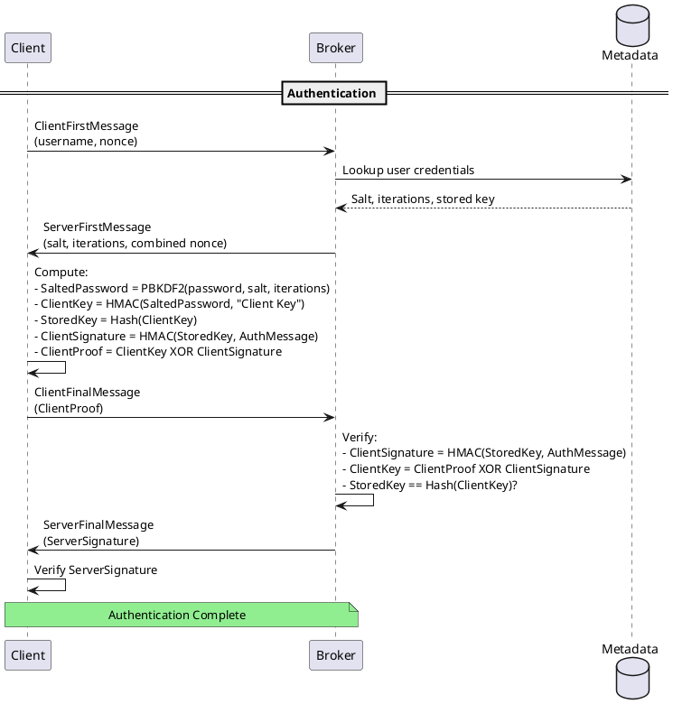

# SASL/SCRAM Authentication

SCRAM (Salted Challenge Response Authentication Mechanism) provides secure password-based authentication for Kafka. It uses salted hashing and challenge-response to protect credentials during authentication without transmitting passwords.

---

## Overview

### Why SCRAM?

| Feature | Benefit |
|---------|---------|
| **Salted hashes** | Passwords stored as salted hashes, not plaintext |
| **Challenge-response** | Password never transmitted over network |
| **No external dependencies** | No KDC, LDAP, or OAuth provider required |
| **Dynamic credentials** | Users can be added/removed at runtime |
| **Wide support** | Available in all Kafka clients |

### Supported Algorithms

| Algorithm | Hash | Security Level | Recommendation |
|-----------|------|----------------|----------------|
| SCRAM-SHA-256 | SHA-256 | Good | Acceptable |
| SCRAM-SHA-512 | SHA-512 | Better | **Recommended** |

!!! tip "Use SCRAM-SHA-512"
    Always prefer SCRAM-SHA-512 over SCRAM-SHA-256 for stronger security.

### Version Requirements

| Feature | Kafka Version |
|---------|---------------|
| SCRAM-SHA-256/512 | 0.10.2+ |
| Dynamic credential updates | 0.10.2+ |
| KRaft SCRAM bootstrap | 3.5.0+ |
| Combined SCRAM + delegation tokens | 1.1.0+ |

---

## How SCRAM Works



**Key security properties:**

- Password is **never transmitted** over the network
- Server stores only **salted hash**, not password
- Both client and server **mutually authenticate**
- **Replay attacks** prevented by nonces

---

## Broker Configuration

### Basic Set up

```properties
# server.properties

# Listener configuration
listeners=SASL_SSL://0.0.0.0:9093
advertised.listeners=SASL_SSL://kafka1.example.com:9093

# Security protocol for inter-broker communication
security.inter.broker.protocol=SASL_SSL
sasl.mechanism.inter.broker.protocol=SCRAM-SHA-512

# Enable SCRAM mechanism
sasl.enabled.mechanisms=SCRAM-SHA-512

# JAAS configuration for inter-broker authentication
listener.name.sasl_ssl.scram-sha-512.sasl.jaas.config=\
  org.apache.kafka.common.security.scram.ScramLoginModule required \
  username="kafka-broker" \
  password="broker-secret-password";
```

### TLS Configuration (Required)

SCRAM must be used with TLS encryption (`SASL_SSL`):

```properties
# SSL/TLS settings
ssl.keystore.type=PKCS12
ssl.keystore.location=/etc/kafka/ssl/kafka.keystore.p12
ssl.keystore.password=${KEYSTORE_PASSWORD}
ssl.key.password=${KEY_PASSWORD}

ssl.truststore.type=PKCS12
ssl.truststore.location=/etc/kafka/ssl/kafka.truststore.p12
ssl.truststore.password=${TRUSTSTORE_PASSWORD}

# Recommended TLS settings
ssl.enabled.protocols=TLSv1.3,TLSv1.2
ssl.endpoint.identification.algorithm=HTTPS
```

!!! danger "Never Use SASL_PLAINTEXT with SCRAM"
    While SCRAM doesn't transmit passwords, `SASL_PLAINTEXT` exposes all data to network sniffing. Always use `SASL_SSL`.

### Multiple Mechanisms

Enable multiple SASL mechanisms on the same listener:

```properties
# Enable both SCRAM and PLAIN (for migration)
sasl.enabled.mechanisms=SCRAM-SHA-512,PLAIN

# SCRAM JAAS config
listener.name.sasl_ssl.scram-sha-512.sasl.jaas.config=\
  org.apache.kafka.common.security.scram.ScramLoginModule required \
  username="kafka-broker" \
  password="broker-password";

# PLAIN JAAS config (for legacy clients)
listener.name.sasl_ssl.plain.sasl.jaas.config=\
  org.apache.kafka.common.security.plain.PlainLoginModule required \
  username="kafka-broker" \
  password="broker-password" \
  user_kafka-broker="broker-password";
```

---

## Credential Management

### ZooKeeper Mode

In ZooKeeper mode, SCRAM credentials are stored in ZooKeeper:

```bash
# Create user
kafka-configs.sh --zookeeper localhost:2181 \
  --alter \
  --add-config 'SCRAM-SHA-512=[password=user-password]' \
  --entity-type users \
  --entity-name my-user

# Create user with custom iterations
kafka-configs.sh --zookeeper localhost:2181 \
  --alter \
  --add-config 'SCRAM-SHA-512=[iterations=16384,password=user-password]' \
  --entity-type users \
  --entity-name my-user

# List users
kafka-configs.sh --zookeeper localhost:2181 \
  --describe \
  --entity-type users

# Delete user
kafka-configs.sh --zookeeper localhost:2181 \
  --alter \
  --delete-config 'SCRAM-SHA-512' \
  --entity-type users \
  --entity-name my-user
```

### KRaft Mode

In KRaft mode, credentials are stored in the metadata log:

```bash
# Create user (using bootstrap server)
kafka-configs.sh --bootstrap-server kafka:9093 \
  --command-config admin.properties \
  --alter \
  --add-config 'SCRAM-SHA-512=[password=user-password]' \
  --entity-type users \
  --entity-name my-user

# List users
kafka-configs.sh --bootstrap-server kafka:9093 \
  --command-config admin.properties \
  --describe \
  --entity-type users

# Describe specific user (shows hash, not password)
kafka-configs.sh --bootstrap-server kafka:9093 \
  --command-config admin.properties \
  --describe \
  --entity-type users \
  --entity-name my-user
```

**admin.properties:**

```properties
security.protocol=SASL_SSL
sasl.mechanism=SCRAM-SHA-512
sasl.jaas.config=org.apache.kafka.common.security.scram.ScramLoginModule required \
  username="admin" \
  password="admin-password";
ssl.truststore.location=/etc/kafka/ssl/client.truststore.p12
ssl.truststore.password=truststore-password
```

### KRaft Bootstrap Credentials

For KRaft clusters, create initial credentials during storage formatting:

```bash
# Format storage with initial SCRAM credentials
kafka-storage.sh format \
  -t $(kafka-storage.sh random-uuid) \
  -c config/kraft/server.properties \
  --add-scram 'SCRAM-SHA-512=[name=admin,password=admin-secret]' \
  --add-scram 'SCRAM-SHA-512=[name=kafka-broker,password=broker-secret]'
```

!!! note "KRaft Bootstrap Requirement"
    In KRaft mode, at least one SCRAM user must exist before brokers can authenticate. Use `--add-scram` during formatting to bootstrap.

### Credential Storage

| Mode | Storage Location | Encryption |
|------|------------------|------------|
| ZooKeeper | `/config/users/{username}` | ZooKeeper ACLs |
| KRaft | Metadata log | Cluster encryption |

**What's stored:**

```json
{
  "SCRAM-SHA-512": {
    "salt": "base64-encoded-salt",
    "stored_key": "base64-encoded-stored-key",
    "server_key": "base64-encoded-server-key",
    "iterations": 4096
  }
}
```

---

## Client Configuration

### Java Client

```java
import org.apache.kafka.clients.producer.KafkaProducer;
import org.apache.kafka.clients.producer.ProducerConfig;
import java.util.Properties;

Properties props = new Properties();
props.put(ProducerConfig.BOOTSTRAP_SERVERS_CONFIG, "kafka1:9093,kafka2:9093");
props.put(ProducerConfig.KEY_SERIALIZER_CLASS_CONFIG, StringSerializer.class);
props.put(ProducerConfig.VALUE_SERIALIZER_CLASS_CONFIG, StringSerializer.class);

// Security configuration
props.put("security.protocol", "SASL_SSL");
props.put("sasl.mechanism", "SCRAM-SHA-512");
props.put("sasl.jaas.config",
    "org.apache.kafka.common.security.scram.ScramLoginModule required " +
    "username=\"my-application\" " +
    "password=\"app-password\";");

// TLS configuration
props.put("ssl.truststore.location", "/etc/kafka/ssl/client.truststore.p12");
props.put("ssl.truststore.password", "truststore-password");
props.put("ssl.truststore.type", "PKCS12");

// Recommended: verify broker hostname
props.put("ssl.endpoint.identification.algorithm", "HTTPS");

KafkaProducer<String, String> producer = new KafkaProducer<>(props);
```

### Spring Boot

**application.yml:**

```yaml
spring:
  kafka:
    bootstrap-servers: kafka1:9093,kafka2:9093
    properties:
      security.protocol: SASL_SSL
      sasl.mechanism: SCRAM-SHA-512
      sasl.jaas.config: >
        org.apache.kafka.common.security.scram.ScramLoginModule required
        username="${KAFKA_USERNAME}"
        password="${KAFKA_PASSWORD}";
    ssl:
      trust-store-location: classpath:truststore.p12
      trust-store-password: ${TRUSTSTORE_PASSWORD}
      trust-store-type: PKCS12
    producer:
      key-serializer: org.apache.kafka.common.serialization.StringSerializer
      value-serializer: org.apache.kafka.common.serialization.StringSerializer
    consumer:
      group-id: my-consumer-group
      key-deserializer: org.apache.kafka.common.serialization.StringDeserializer
      value-deserializer: org.apache.kafka.common.serialization.StringDeserializer
```

### Python (confluent-kafka)

```python
from confluent_kafka import Producer

config = {
    'bootstrap.servers': 'kafka1:9093,kafka2:9093',
    'security.protocol': 'SASL_SSL',
    'sasl.mechanism': 'SCRAM-SHA-512',
    'sasl.username': 'my-application',
    'sasl.password': 'app-password',
    'ssl.ca.location': '/etc/kafka/ssl/ca-cert.pem',
    # or for truststore:
    # 'ssl.truststore.location': '/etc/kafka/ssl/client.truststore.p12',
    # 'ssl.truststore.password': 'truststore-password',
}

producer = Producer(config)
```

### Go (confluent-kafka-go)

```go
import (
    "github.com/confluentinc/confluent-kafka-go/v2/kafka"
)

producer, err := kafka.NewProducer(&kafka.ConfigMap{
    "bootstrap.servers":  "kafka1:9093,kafka2:9093",
    "security.protocol":  "SASL_SSL",
    "sasl.mechanism":     "SCRAM-SHA-512",
    "sasl.username":      "my-application",
    "sasl.password":      "app-password",
    "ssl.ca.location":    "/etc/kafka/ssl/ca-cert.pem",
})
```

### Command-Line Tools

**client.properties:**

```properties
security.protocol=SASL_SSL
sasl.mechanism=SCRAM-SHA-512
sasl.jaas.config=org.apache.kafka.common.security.scram.ScramLoginModule required \
  username="my-user" \
  password="user-password";
ssl.truststore.location=/etc/kafka/ssl/client.truststore.p12
ssl.truststore.password=truststore-password
```

```bash
# Produce messages
kafka-console-producer.sh --bootstrap-server kafka:9093 \
  --topic my-topic \
  --producer.config client.properties

# Consume messages
kafka-console-consumer.sh --bootstrap-server kafka:9093 \
  --topic my-topic \
  --consumer.config client.properties \
  --from-beginning

# List topics
kafka-topics.sh --bootstrap-server kafka:9093 \
  --command-config client.properties \
  --list
```

---

## Security Best Practices

### Password Requirements

| Requirement | Recommendation |
|-------------|----------------|
| **Length** | Minimum 16 characters |
| **Complexity** | Mix of upper/lower/numbers/symbols |
| **Uniqueness** | Different password per user/service |
| **Storage** | Use secrets management (Vault, K8s Secrets) |
| **Rotation** | Rotate regularly (quarterly minimum) |

### Iteration Count

Higher iteration counts increase PBKDF2 computation time, making brute-force attacks harder:

```bash
# Create user with high iteration count
kafka-configs.sh --bootstrap-server kafka:9093 \
  --command-config admin.properties \
  --alter \
  --add-config 'SCRAM-SHA-512=[iterations=16384,password=user-password]' \
  --entity-type users \
  --entity-name my-user
```

| Iterations | Security | Performance Impact |
|------------|----------|-------------------|
| 4096 (default) | Minimum acceptable | Low |
| 8192 | Good | Moderate |
| 16384 | Better | Higher |
| 32768 | High | Significant |

!!! tip "Balance Security and Performance"
    Higher iterations slow down authentication. For high-throughput systems with many connections, balance security needs with performance.

### Credential Rotation

**Rotating user credentials:**

```bash
# Step 1: Update credential (old sessions remain valid)
kafka-configs.sh --bootstrap-server kafka:9093 \
  --command-config admin.properties \
  --alter \
  --add-config 'SCRAM-SHA-512=[password=new-password]' \
  --entity-type users \
  --entity-name my-user

# Step 2: Update client configuration with new password

# Step 3: Restart clients to pick up new credentials
```

**Rotating broker credentials:**

1. Update JAAS configuration on all brokers
2. Rolling restart brokers one at a time
3. Monitor for authentication failures

### Secrets Management

**HashiCorp Vault integration:**

```bash
# Store credentials in Vault
vault kv put secret/kafka/my-user password="user-password"

# Retrieve in application
export KAFKA_PASSWORD=$(vault kv get -field=password secret/kafka/my-user)
```

**Kubernetes Secrets:**

```yaml
apiVersion: v1
kind: Secret
metadata:
  name: kafka-credentials
type: Opaque
stringData:
  username: my-application
  password: app-password
---
apiVersion: apps/v1
kind: Deployment
spec:
  template:
    spec:
      containers:
        - name: app
          env:
            - name: KAFKA_USERNAME
              valueFrom:
                secretKeyRef:
                  name: kafka-credentials
                  key: username
            - name: KAFKA_PASSWORD
              valueFrom:
                secretKeyRef:
                  name: kafka-credentials
                  key: password
```

---

## Troubleshooting

### Common Errors

| Error | Cause | Solution |
|-------|-------|----------|
| `SaslAuthenticationException: Authentication failed` | Wrong username/password | Verify credentials |
| `SaslAuthenticationException: Unknown user` | User doesn't exist | Create user with kafka-configs |
| `UnsupportedSaslMechanismException` | SCRAM not enabled on broker | Add to `sasl.enabled.mechanisms` |
| `IllegalArgumentException: No serviceName` | Missing JAAS config | Check `sasl.jaas.config` |
| `SSLHandshakeException` | TLS configuration issue | Verify truststore |

### Debug Logging

**Client-side:**

```properties
# log4j.properties or logback
log4j.logger.org.apache.kafka.common.security=DEBUG
log4j.logger.org.apache.kafka.common.security.scram=TRACE
```

**Broker-side:**

```properties
# log4j.properties
log4j.logger.org.apache.kafka.common.security=DEBUG
log4j.logger.kafka.server=DEBUG
```

### Verify User Exists

```bash
# List all users
kafka-configs.sh --bootstrap-server kafka:9093 \
  --command-config admin.properties \
  --describe \
  --entity-type users

# Check specific user
kafka-configs.sh --bootstrap-server kafka:9093 \
  --command-config admin.properties \
  --describe \
  --entity-type users \
  --entity-name my-user
```

### Test Authentication

```bash
# Quick connectivity test
kafka-broker-api-versions.sh --bootstrap-server kafka:9093 \
  --command-config client.properties

# If successful, shows broker API versions
# If failed, shows authentication error
```

### Check Broker Logs

```bash
# Look for authentication failures
grep -i "authentication\|sasl\|scram" /var/log/kafka/server.log | tail -50
```

---

## Migration Guide

### From PLAIN to SCRAM

1. **Create SCRAM credentials for all users:**

```bash
kafka-configs.sh --bootstrap-server kafka:9092 \
  --alter \
  --add-config 'SCRAM-SHA-512=[password=user-password]' \
  --entity-type users \
  --entity-name existing-user
```

2. **Enable both mechanisms on brokers:**

```properties
sasl.enabled.mechanisms=PLAIN,SCRAM-SHA-512
```

3. **Rolling restart brokers**

4. **Update clients to use SCRAM:**

```properties
sasl.mechanism=SCRAM-SHA-512
sasl.jaas.config=org.apache.kafka.common.security.scram.ScramLoginModule required \
  username="existing-user" \
  password="user-password";
```

5. **After all clients migrated, remove PLAIN:**

```properties
sasl.enabled.mechanisms=SCRAM-SHA-512
```

### From ZooKeeper to KRaft

SCRAM credentials in ZooKeeper are **not automatically migrated** to KRaft. Manual migration required:

1. Export users from ZooKeeper cluster
2. Create users in KRaft cluster using `kafka-configs.sh`
3. Or bootstrap with `kafka-storage.sh --add-scram`

---

## Related Documentation

- [Authentication Overview](index.md) - Mechanism comparison
- [SASL/PLAIN](sasl-plain.md) - Simple authentication
- [Delegation Tokens](delegation-tokens.md) - Token-based auth
- [Authorization](../authorization/index.md) - ACL configuration
- [Encryption](../encryption/index.md) - TLS setup