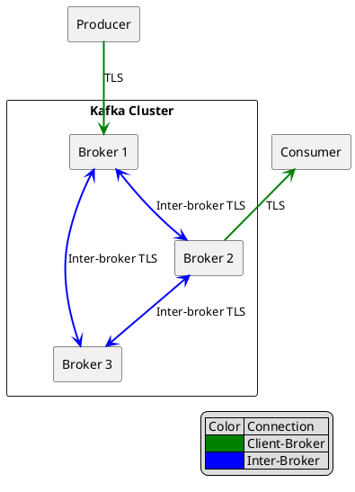

# Kafka Encryption

TLS encryption protects data in transit between Kafka clients and brokers, and between brokers themselves.

---

## Encryption Overview



---

## TLS Configuration

### Broker Configuration

```properties
# server.properties

# SSL listener
listeners=SSL://0.0.0.0:9093
advertised.listeners=SSL://kafka1.example.com:9093

# Inter-broker encryption
security.inter.broker.protocol=SSL

# Keystore (broker identity)
ssl.keystore.location=/etc/kafka/ssl/kafka.keystore.jks
ssl.keystore.password=keystore-password
ssl.key.password=key-password
ssl.keystore.type=JKS

# Truststore (trusted CAs)
ssl.truststore.location=/etc/kafka/ssl/kafka.truststore.jks
ssl.truststore.password=truststore-password
ssl.truststore.type=JKS

# Require client certificates (mTLS)
ssl.client.auth=required

# Protocol versions
ssl.enabled.protocols=TLSv1.3,TLSv1.2

# Cipher suites (TLS 1.3)
ssl.cipher.suites=TLS_AES_256_GCM_SHA384,TLS_AES_128_GCM_SHA256
```

### Client Configuration

```properties
# client.properties
security.protocol=SSL

# Truststore (to verify broker)
ssl.truststore.location=/etc/kafka/ssl/client.truststore.jks
ssl.truststore.password=truststore-password

# Keystore (client identity for mTLS)
ssl.keystore.location=/etc/kafka/ssl/client.keystore.jks
ssl.keystore.password=keystore-password
ssl.key.password=key-password

# Protocol versions
ssl.enabled.protocols=TLSv1.3,TLSv1.2
```

---

## Certificate Generation

### Create Certificate Authority

```bash
# Generate CA private key and certificate
openssl req -new -x509 \
  -keyout ca-key.pem \
  -out ca-cert.pem \
  -days 365 \
  -subj "/CN=Kafka-CA/O=Organization/C=US" \
  -nodes

# Create truststore with CA certificate
keytool -keystore kafka.truststore.jks \
  -alias CARoot \
  -import \
  -file ca-cert.pem \
  -storepass changeit \
  -noprompt
```

### Generate Broker Certificates

```bash
#!/bin/bash
# generate-broker-cert.sh

BROKER_HOST=$1
VALIDITY=365
STOREPASS=changeit

# Generate keystore with key pair
keytool -keystore ${BROKER_HOST}.keystore.jks \
  -alias ${BROKER_HOST} \
  -validity ${VALIDITY} \
  -genkey \
  -keyalg RSA \
  -keysize 2048 \
  -storepass ${STOREPASS} \
  -keypass ${STOREPASS} \
  -dname "CN=${BROKER_HOST},O=Organization,C=US" \
  -ext "SAN=DNS:${BROKER_HOST},DNS:localhost"

# Create certificate signing request
keytool -keystore ${BROKER_HOST}.keystore.jks \
  -alias ${BROKER_HOST} \
  -certreq \
  -file ${BROKER_HOST}.csr \
  -storepass ${STOREPASS}

# Sign certificate with CA
openssl x509 -req \
  -CA ca-cert.pem \
  -CAkey ca-key.pem \
  -in ${BROKER_HOST}.csr \
  -out ${BROKER_HOST}-signed.crt \
  -days ${VALIDITY} \
  -CAcreateserial \
  -extfile <(printf "subjectAltName=DNS:${BROKER_HOST},DNS:localhost")

# Import CA certificate into keystore
keytool -keystore ${BROKER_HOST}.keystore.jks \
  -alias CARoot \
  -import \
  -file ca-cert.pem \
  -storepass ${STOREPASS} \
  -noprompt

# Import signed certificate into keystore
keytool -keystore ${BROKER_HOST}.keystore.jks \
  -alias ${BROKER_HOST} \
  -import \
  -file ${BROKER_HOST}-signed.crt \
  -storepass ${STOREPASS}
```

### Generate Client Certificates

```bash
#!/bin/bash
# generate-client-cert.sh

CLIENT_NAME=$1
VALIDITY=365
STOREPASS=changeit

# Generate keystore
keytool -keystore ${CLIENT_NAME}.keystore.jks \
  -alias ${CLIENT_NAME} \
  -validity ${VALIDITY} \
  -genkey \
  -keyalg RSA \
  -keysize 2048 \
  -storepass ${STOREPASS} \
  -keypass ${STOREPASS} \
  -dname "CN=${CLIENT_NAME},O=Organization,C=US"

# Create CSR
keytool -keystore ${CLIENT_NAME}.keystore.jks \
  -alias ${CLIENT_NAME} \
  -certreq \
  -file ${CLIENT_NAME}.csr \
  -storepass ${STOREPASS}

# Sign with CA
openssl x509 -req \
  -CA ca-cert.pem \
  -CAkey ca-key.pem \
  -in ${CLIENT_NAME}.csr \
  -out ${CLIENT_NAME}-signed.crt \
  -days ${VALIDITY} \
  -CAcreateserial

# Import CA cert
keytool -keystore ${CLIENT_NAME}.keystore.jks \
  -alias CARoot \
  -import \
  -file ca-cert.pem \
  -storepass ${STOREPASS} \
  -noprompt

# Import signed cert
keytool -keystore ${CLIENT_NAME}.keystore.jks \
  -alias ${CLIENT_NAME} \
  -import \
  -file ${CLIENT_NAME}-signed.crt \
  -storepass ${STOREPASS}

# Create truststore for client
cp kafka.truststore.jks ${CLIENT_NAME}.truststore.jks
```

---

## PEM Format (Alternative)

For environments preferring PEM over JKS format.

### Broker Configuration with PEM

```properties
# server.properties

# PEM format certificates
ssl.keystore.type=PEM
ssl.keystore.certificate.chain=/etc/kafka/ssl/kafka-chain.pem
ssl.keystore.key=/etc/kafka/ssl/kafka-key.pem

ssl.truststore.type=PEM
ssl.truststore.certificates=/etc/kafka/ssl/ca-cert.pem
```

### Convert JKS to PEM

```bash
# Export private key
keytool -importkeystore \
  -srckeystore kafka.keystore.jks \
  -destkeystore kafka.p12 \
  -deststoretype PKCS12 \
  -srcstorepass changeit \
  -deststorepass changeit

openssl pkcs12 \
  -in kafka.p12 \
  -nocerts \
  -nodes \
  -out kafka-key.pem \
  -passin pass:changeit

# Export certificate chain
openssl pkcs12 \
  -in kafka.p12 \
  -nokeys \
  -out kafka-chain.pem \
  -passin pass:changeit
```

---

## Multiple Listeners

Configure different security protocols per listener.

```properties
# server.properties

# Multiple listeners with different protocols
listeners=PLAINTEXT://0.0.0.0:9092,SSL://0.0.0.0:9093,SASL_SSL://0.0.0.0:9094
advertised.listeners=PLAINTEXT://kafka1:9092,SSL://kafka1:9093,SASL_SSL://kafka1:9094

# Map listener names to protocols
listener.security.protocol.map=PLAINTEXT:PLAINTEXT,SSL:SSL,SASL_SSL:SASL_SSL

# Inter-broker uses SSL
inter.broker.listener.name=SSL
security.inter.broker.protocol=SSL
```

---

## TLS Versions and Cipher Suites

### Recommended Configuration

| Setting | Recommended Value |
|---------|-------------------|
| `ssl.enabled.protocols` | `TLSv1.3,TLSv1.2` |
| `ssl.protocol` | `TLSv1.3` |

### TLS 1.3 Cipher Suites

```properties
ssl.cipher.suites=TLS_AES_256_GCM_SHA384,TLS_AES_128_GCM_SHA256,TLS_CHACHA20_POLY1305_SHA256
```

### TLS 1.2 Cipher Suites (if TLS 1.3 not available)

```properties
ssl.cipher.suites=TLS_ECDHE_RSA_WITH_AES_256_GCM_SHA384,TLS_ECDHE_RSA_WITH_AES_128_GCM_SHA256
```

!!! warning "Deprecated Protocols"
    TLS 1.0 and TLS 1.1 must not be used in production. These protocols have known vulnerabilities.

---

## Hostname Verification

### Enable Verification

```properties
# Broker (for inter-broker)
ssl.endpoint.identification.algorithm=HTTPS

# Client
ssl.endpoint.identification.algorithm=HTTPS
```

### Certificate SAN Requirements

When hostname verification is enabled, certificates must include Subject Alternative Names (SANs) matching the broker hostnames.

```bash
# Generate cert with SAN
keytool -keystore kafka.keystore.jks \
  -alias kafka \
  -genkey \
  -keyalg RSA \
  -dname "CN=kafka.example.com" \
  -ext "SAN=DNS:kafka1.example.com,DNS:kafka2.example.com,DNS:kafka3.example.com"
```

---

## Certificate Rotation

### Zero-Downtime Rotation

1. **Add new CA to truststores** (before old CA expires):

```bash
# Add new CA to existing truststore
keytool -keystore kafka.truststore.jks \
  -alias NewCARoot \
  -import \
  -file new-ca-cert.pem \
  -storepass changeit \
  -noprompt
```

2. **Deploy updated truststores** to all brokers and clients

3. **Generate new certificates** signed by new CA

4. **Update keystores** with new certificates

5. **Remove old CA** from truststores after transition period

### Dynamic Configuration Update

Kafka 2.7+ supports dynamic SSL configuration updates without restart.

```bash
# Update broker SSL config dynamically
kafka-configs.sh --bootstrap-server kafka:9093 \
  --entity-type brokers \
  --entity-name 1 \
  --alter \
  --add-config 'ssl.keystore.location=/etc/kafka/ssl/new-kafka.keystore.jks'
```

---

## Client Code Examples

### Java Producer with TLS

```java
Properties props = new Properties();
props.put("bootstrap.servers", "kafka:9093");
props.put("security.protocol", "SSL");
props.put("ssl.truststore.location", "/path/to/truststore.jks");
props.put("ssl.truststore.password", "truststore-password");
props.put("ssl.keystore.location", "/path/to/keystore.jks");
props.put("ssl.keystore.password", "keystore-password");
props.put("ssl.key.password", "key-password");
props.put("ssl.endpoint.identification.algorithm", "HTTPS");

props.put("key.serializer", "org.apache.kafka.common.serialization.StringSerializer");
props.put("value.serializer", "org.apache.kafka.common.serialization.StringSerializer");

KafkaProducer<String, String> producer = new KafkaProducer<>(props);
```

### Python Consumer with TLS

```python
from kafka import KafkaConsumer

consumer = KafkaConsumer(
    'my-topic',
    bootstrap_servers=['kafka:9093'],
    security_protocol='SSL',
    ssl_cafile='/path/to/ca-cert.pem',
    ssl_certfile='/path/to/client-cert.pem',
    ssl_keyfile='/path/to/client-key.pem',
    ssl_check_hostname=True
)
```

---

## Troubleshooting

### Common Errors

| Error | Cause | Solution |
|-------|-------|----------|
| `SSL handshake failed` | Certificate mismatch | Verify truststore contains CA |
| `No subject alternative names` | Missing SAN | Regenerate cert with SAN extension |
| `Certificate expired` | Expired certificate | Rotate certificates |
| `Unable to find valid certification path` | Missing CA in truststore | Import CA to truststore |

### Debug SSL

```bash
# Enable SSL debug logging
export KAFKA_OPTS="-Djavax.net.debug=ssl:handshake"

# Test SSL connection
openssl s_client -connect kafka:9093 -CAfile ca-cert.pem
```

### Verify Certificate

```bash
# View keystore contents
keytool -list -v -keystore kafka.keystore.jks -storepass changeit

# Check certificate expiration
keytool -list -v -keystore kafka.keystore.jks -storepass changeit | grep "Valid from"

# Verify certificate chain
openssl verify -CAfile ca-cert.pem kafka-signed.crt
```

---

## Related Documentation

- [Security Overview](../index.md) - Security concepts
- [Authentication](../authentication/index.md) - Authentication mechanisms
- [Authorization](../authorization/index.md) - ACL configuration
