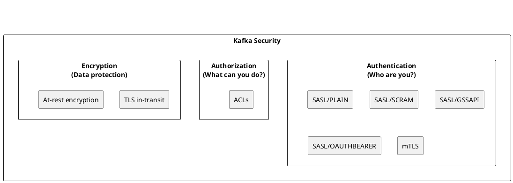
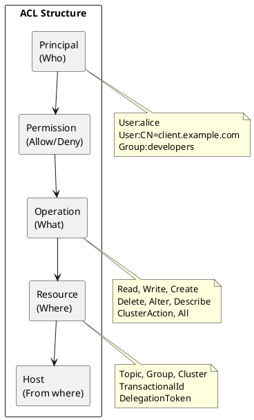
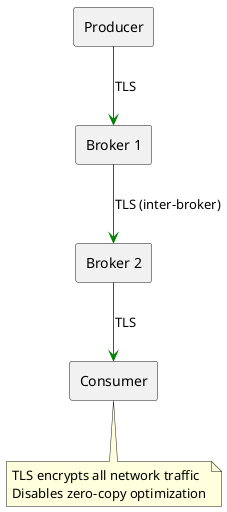
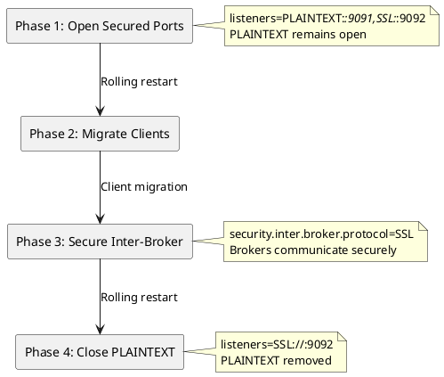

# Kafka Security

Security configuration for Apache Kafka covering authentication, authorization, and encryption.

---

## Security Overview

Kafka security encompasses three core areas:



| Security Layer | Purpose | Mechanisms |
|----------------|---------|------------|
| **Authentication** | Verify client identity | SASL (PLAIN, SCRAM, GSSAPI, OAUTHBEARER), mTLS |
| **Authorization** | Control access to resources | ACLs (Access Control Lists) |
| **Encryption** | Protect data confidentiality | TLS (in-transit), filesystem encryption (at-rest) |

---

## Authentication

### Authentication Mechanisms

| Mechanism | Description | Use Case |
|-----------|-------------|----------|
| **SASL/PLAIN** | Username/password (plaintext) | Development, simple setups |
| **SASL/SCRAM** | Salted Challenge Response | Production without Kerberos |
| **SASL/GSSAPI** | Kerberos authentication | Enterprise environments |
| **SASL/OAUTHBEARER** | OAuth 2.0 tokens | Cloud-native, OAuth infrastructure |
| **mTLS** | Mutual TLS certificates | Certificate-based auth |

### SASL/SCRAM Configuration

SCRAM (Salted Challenge Response Authentication Mechanism) provides secure password-based authentication.

**Broker configuration:**
```properties
# server.properties
listeners=SASL_SSL://0.0.0.0:9093
advertised.listeners=SASL_SSL://kafka1:9093

security.inter.broker.protocol=SASL_SSL
sasl.mechanism.inter.broker.protocol=SCRAM-SHA-512
sasl.enabled.mechanisms=SCRAM-SHA-512

# TLS configuration
ssl.keystore.location=/etc/kafka/ssl/kafka.keystore.jks
ssl.keystore.password=keystore-password
ssl.key.password=key-password
ssl.truststore.location=/etc/kafka/ssl/kafka.truststore.jks
ssl.truststore.password=truststore-password
```

**Create SCRAM credentials:**
```bash
# Create user
kafka-configs.sh --bootstrap-server kafka:9092 \
  --alter \
  --add-config 'SCRAM-SHA-512=[password=user-password]' \
  --entity-type users \
  --entity-name alice

# For inter-broker communication
kafka-configs.sh --bootstrap-server kafka:9092 \
  --alter \
  --add-config 'SCRAM-SHA-512=[password=broker-password]' \
  --entity-type users \
  --entity-name kafka-broker
```

**Client configuration:**
```properties
security.protocol=SASL_SSL
sasl.mechanism=SCRAM-SHA-512
sasl.jaas.config=org.apache.kafka.common.security.scram.ScramLoginModule required \
  username="alice" \
  password="user-password";

ssl.truststore.location=/etc/kafka/ssl/client.truststore.jks
ssl.truststore.password=truststore-password
```

### mTLS Configuration

Mutual TLS authenticates both client and server using certificates.

**Broker configuration:**
```properties
listeners=SSL://0.0.0.0:9093
advertised.listeners=SSL://kafka1:9093

security.inter.broker.protocol=SSL

ssl.keystore.location=/etc/kafka/ssl/kafka.keystore.jks
ssl.keystore.password=keystore-password
ssl.key.password=key-password
ssl.truststore.location=/etc/kafka/ssl/kafka.truststore.jks
ssl.truststore.password=truststore-password

# Require client certificates
ssl.client.auth=required
```

**Client configuration:**
```properties
security.protocol=SSL

ssl.keystore.location=/etc/kafka/ssl/client.keystore.jks
ssl.keystore.password=keystore-password
ssl.key.password=key-password
ssl.truststore.location=/etc/kafka/ssl/client.truststore.jks
ssl.truststore.password=truststore-password
```

### SASL/OAUTHBEARER Configuration

OAuth 2.0 authentication for token-based systems.

**Broker configuration:**
```properties
listeners=SASL_SSL://0.0.0.0:9093
sasl.enabled.mechanisms=OAUTHBEARER

# Custom callback handler for token validation
listener.name.sasl_ssl.oauthbearer.sasl.server.callback.handler.class=\
  org.apache.kafka.common.security.oauthbearer.OAuthBearerValidatorCallbackHandler

# JWKS endpoint for token validation
listener.name.sasl_ssl.oauthbearer.sasl.jaas.config=\
  org.apache.kafka.common.security.oauthbearer.OAuthBearerLoginModule required \
  unsecuredLoginStringClaim_sub="admin";
```

→ [Authentication Guide](authentication/index.md)

---

## Authorization

### ACL Fundamentals

Kafka ACLs define who can perform what operations on which resources.



### ACL Components

| Component | Description | Examples |
|-----------|-------------|----------|
| **Principal** | User or group identity | `User:alice`, `User:CN=client.example.com` |
| **Permission** | Allow or Deny | `ALLOW`, `DENY` |
| **Operation** | Action to perform | `Read`, `Write`, `Create`, `Delete`, `Describe`, `Alter` |
| **Resource** | Kafka resource | `Topic:orders`, `Group:order-processor`, `Cluster:kafka-cluster` |
| **Host** | Source IP | `*`, `192.168.1.100` |

### Managing ACLs

```bash
# Grant producer access to topic
kafka-acls.sh --bootstrap-server kafka:9092 \
  --add \
  --allow-principal User:producer-app \
  --operation Write \
  --operation Describe \
  --topic orders

# Grant consumer access to topic and group
kafka-acls.sh --bootstrap-server kafka:9092 \
  --add \
  --allow-principal User:consumer-app \
  --operation Read \
  --operation Describe \
  --topic orders \
  --group order-processor

# Grant admin access to all topics
kafka-acls.sh --bootstrap-server kafka:9092 \
  --add \
  --allow-principal User:admin \
  --operation All \
  --topic '*'

# List ACLs
kafka-acls.sh --bootstrap-server kafka:9092 --list

# List ACLs for specific topic
kafka-acls.sh --bootstrap-server kafka:9092 \
  --list \
  --topic orders

# Remove ACL
kafka-acls.sh --bootstrap-server kafka:9092 \
  --remove \
  --allow-principal User:producer-app \
  --operation Write \
  --topic orders
```

### Common ACL Patterns

| Use Case | ACLs Required |
|----------|---------------|
| **Producer** | Write, Describe on topic; Create if auto-create enabled |
| **Consumer** | Read, Describe on topic; Read on consumer group |
| **Transactional producer** | Write on topic; Write on transactional ID; Describe on cluster |
| **Kafka Connect** | Read/Write on topics; Read/Write on internal topics; Describe on cluster |
| **Admin** | All on cluster; All on topics |

### Authorizer Configuration

```properties
# server.properties

# Enable ACL authorizer
authorizer.class.name=org.apache.kafka.metadata.authorizer.StandardAuthorizer

# Super users (bypass ACLs)
super.users=User:admin;User:kafka-broker

# Default when no ACL matches (deny recommended for production)
allow.everyone.if.no.acl.found=false
```

→ [Authorization Guide](authorization/index.md)

---

## Encryption

### TLS Configuration

TLS encrypts data in transit between clients and brokers, and between brokers.



### Certificate Generation

```bash
# Generate CA
openssl req -new -x509 -keyout ca-key -out ca-cert -days 365 \
  -subj "/CN=Kafka-CA"

# Generate broker keystore
keytool -keystore kafka.keystore.jks -alias kafka-broker \
  -validity 365 -genkey -keyalg RSA \
  -dname "CN=kafka1.example.com"

# Create CSR
keytool -keystore kafka.keystore.jks -alias kafka-broker \
  -certreq -file kafka-broker.csr

# Sign certificate
openssl x509 -req -CA ca-cert -CAkey ca-key \
  -in kafka-broker.csr -out kafka-broker-signed.crt \
  -days 365 -CAcreateserial

# Import CA and signed cert
keytool -keystore kafka.keystore.jks -alias CARoot \
  -import -file ca-cert
keytool -keystore kafka.keystore.jks -alias kafka-broker \
  -import -file kafka-broker-signed.crt

# Create truststore
keytool -keystore kafka.truststore.jks -alias CARoot \
  -import -file ca-cert
```

### TLS Broker Configuration

```properties
listeners=SSL://0.0.0.0:9093
advertised.listeners=SSL://kafka1.example.com:9093

security.inter.broker.protocol=SSL

ssl.keystore.location=/etc/kafka/ssl/kafka.keystore.jks
ssl.keystore.password=keystore-password
ssl.key.password=key-password
ssl.truststore.location=/etc/kafka/ssl/kafka.truststore.jks
ssl.truststore.password=truststore-password

# TLS protocol versions
ssl.enabled.protocols=TLSv1.3,TLSv1.2
ssl.protocol=TLSv1.3

# Cipher suites (optional - use defaults for TLS 1.3)
ssl.cipher.suites=TLS_AES_256_GCM_SHA384,TLS_AES_128_GCM_SHA256
```

### TLS Performance Impact

!!! warning "TLS Disables Zero-Copy"
    TLS encryption requires data to pass through user space for encryption/decryption, disabling Kafka's zero-copy optimization. This can reduce throughput by 30-50% depending on workload and hardware.

| Aspect | Without TLS | With TLS |
|--------|-------------|----------|
| **Zero-copy** | Enabled | Disabled |
| **CPU usage** | Lower | Higher (encryption overhead) |
| **Throughput** | Higher | 30-50% reduction typical |
| **Latency** | Lower | Slightly higher |

→ [Encryption Guide](encryption/index.md)

---

## Security Best Practices

### Authentication

| Practice | Rationale |
|----------|-----------|
| Use SCRAM-SHA-512 or stronger | Avoid plaintext passwords |
| Rotate credentials regularly | Limit exposure window |
| Use separate credentials per application | Limit blast radius |
| Use mTLS for service-to-service | Certificate-based identity |

### Authorization

| Practice | Rationale |
|----------|-----------|
| Deny by default | Explicit allow only |
| Principle of least privilege | Minimum required access |
| Use groups/roles where possible | Easier management |
| Audit ACL changes | Track access modifications |
| Separate admin credentials | Protect administrative access |

### Encryption

| Practice | Rationale |
|----------|-----------|
| Enable TLS for all listeners | Encrypt all traffic |
| Use TLS 1.3 where possible | Strongest protocol |
| Rotate certificates before expiry | Maintain continuity |
| Use strong cipher suites | Avoid weak encryption |
| Consider at-rest encryption | Protect stored data |

### Operations

| Practice | Rationale |
|----------|-----------|
| Enable audit logging | Track security events |
| Monitor authentication failures | Detect attacks |
| Regular security reviews | Identify misconfigurations |
| Patch regularly | Address vulnerabilities |
| Network segmentation | Limit network exposure |

---

## Listener Configuration

### Multiple Listeners

```properties
# Different security per listener
listeners=PLAINTEXT://0.0.0.0:9092,SSL://0.0.0.0:9093,SASL_SSL://0.0.0.0:9094
advertised.listeners=PLAINTEXT://kafka1:9092,SSL://kafka1:9093,SASL_SSL://kafka1:9094

# Inter-broker uses SASL_SSL
security.inter.broker.protocol=SASL_SSL

# Listener-specific configuration
listener.security.protocol.map=PLAINTEXT:PLAINTEXT,SSL:SSL,SASL_SSL:SASL_SSL

listener.name.sasl_ssl.scram-sha-512.sasl.jaas.config=\
  org.apache.kafka.common.security.scram.ScramLoginModule required \
  username="kafka-broker" \
  password="broker-password";
```

### Internal vs External Listeners

```properties
# Internal (within datacenter) - SASL_PLAINTEXT
# External (from internet) - SASL_SSL
listeners=INTERNAL://0.0.0.0:9092,EXTERNAL://0.0.0.0:9093
advertised.listeners=INTERNAL://kafka1.internal:9092,EXTERNAL://kafka1.example.com:9093
listener.security.protocol.map=INTERNAL:SASL_PLAINTEXT,EXTERNAL:SASL_SSL
inter.broker.listener.name=INTERNAL
```

---

## Enabling Security on a Running Cluster

Security can be incrementally enabled on an existing cluster without downtime through a phased rolling restart approach.

### Migration Phases



### Phase 1: Open Secured Ports

Add secured listener while keeping PLAINTEXT open:

```properties
# server.properties - Phase 1
listeners=PLAINTEXT://0.0.0.0:9091,SSL://0.0.0.0:9092
```

Perform rolling restart of all brokers.

### Phase 2: Migrate Clients

Update client configurations to use the secured port:

```properties
# client.properties
bootstrap.servers=kafka1:9092,kafka2:9092,kafka3:9092
security.protocol=SSL
ssl.truststore.location=/etc/kafka/ssl/client.truststore.jks
ssl.truststore.password=truststore-password
```

Restart clients to pick up new configuration.

### Phase 3: Enable Inter-Broker Security

Configure brokers to use SSL for inter-broker communication:

```properties
# server.properties - Phase 3
listeners=PLAINTEXT://0.0.0.0:9091,SSL://0.0.0.0:9092
security.inter.broker.protocol=SSL
```

Perform rolling restart of all brokers.

### Phase 4: Close PLAINTEXT Port

Remove the insecure listener:

```properties
# server.properties - Phase 4
listeners=SSL://0.0.0.0:9092
security.inter.broker.protocol=SSL
```

Perform final rolling restart.

### Adding SASL to SSL

To add SASL authentication on top of SSL encryption, open an additional `SASL_SSL` port:

**Phase 1:**
```properties
listeners=PLAINTEXT://0.0.0.0:9091,SSL://0.0.0.0:9092,SASL_SSL://0.0.0.0:9093
```

**Phase 2:** Migrate clients to SASL_SSL port (9093)

**Phase 3:**
```properties
listeners=PLAINTEXT://0.0.0.0:9091,SSL://0.0.0.0:9092,SASL_SSL://0.0.0.0:9093
security.inter.broker.protocol=SSL
```

**Phase 4:**
```properties
listeners=SSL://0.0.0.0:9092,SASL_SSL://0.0.0.0:9093
security.inter.broker.protocol=SSL
```

!!! tip "Rolling Restart Best Practices"
    - Stop brokers gracefully using SIGTERM
    - Wait for restarted broker to rejoin ISR before proceeding to next broker
    - Monitor under-replicated partitions during the process
    - Keep PLAINTEXT listener open until all clients have migrated

---

## Related Documentation

- [Authentication](authentication/index.md) - Authentication mechanisms
- [Authorization](authorization/index.md) - ACL configuration
- [Encryption](encryption/index.md) - TLS setup
- [Operations](../operations/index.md) - Security operations
