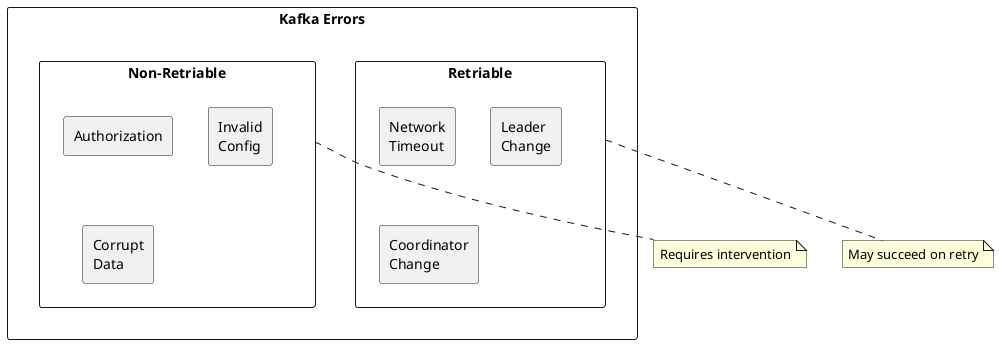

# Kafka Common Errors

Comprehensive reference for Apache Kafka error codes and exceptions.

---

## Error Categories



---

## Producer Errors

### Network and Timeout Errors

| Exception | Retriable | Cause | Resolution |
|-----------|-----------|-------|------------|
| `TimeoutException` | Yes | Request exceeded timeout | Check broker health, increase timeout |
| `NetworkException` | Yes | Network failure | Check connectivity |
| `DisconnectException` | Yes | Connection closed | Check broker status |
| `InterruptException` | No | Thread interrupted | Check application logic |

#### TimeoutException

**Full Message:**
```
org.apache.kafka.common.errors.TimeoutException:
Failed to allocate memory within the configured max blocking time
```

**Causes:**
- Buffer pool exhausted
- Network issues preventing delivery
- Broker overloaded

**Resolution:**
```properties
# Increase timeouts
delivery.timeout.ms=300000
request.timeout.ms=60000

# Increase buffer memory
buffer.memory=67108864

# Adjust max block time
max.block.ms=120000
```

### Leadership Errors

| Exception | Retriable | Cause | Resolution |
|-----------|-----------|-------|------------|
| `NotLeaderOrFollowerException` | Yes | Stale metadata | Refresh metadata |
| `LeaderNotAvailableException` | Yes | No leader elected | Wait for election |
| `NotEnoughReplicasException` | Yes | ISR < min.insync.replicas | Fix broker health |
| `NotEnoughReplicasAfterAppendException` | Yes | ISR shrunk during write | Fix broker health |

#### NotEnoughReplicasException

**Full Message:**
```
org.apache.kafka.common.errors.NotEnoughReplicasException:
Messages are rejected since there are fewer in-sync replicas than required.
```

**Diagnosis:**
```bash
# Check ISR
kafka-topics.sh --bootstrap-server kafka:9092 \
  --describe --topic my-topic

# Check under-replicated partitions
kafka-topics.sh --bootstrap-server kafka:9092 \
  --describe --under-replicated-partitions
```

**Resolution:**
1. Fix unhealthy brokers
2. Temporarily reduce `min.insync.replicas` (reduces durability)

### Message Errors

| Exception | Retriable | Cause | Resolution |
|-----------|-----------|-------|------------|
| `RecordTooLargeException` | No | Message exceeds max size | Reduce message size |
| `InvalidRecordException` | No | Malformed record | Fix producer serialization |
| `RecordBatchTooLargeException` | No | Batch exceeds max size | Reduce batch size |
| `SerializationException` | No | Serialization failed | Fix serializer |

#### RecordTooLargeException

**Full Message:**
```
org.apache.kafka.common.errors.RecordTooLargeException:
The request included a message larger than the max message size the server will accept.
```

**Resolution:**
```properties
# Increase broker limit
message.max.bytes=10485760

# Increase producer limit
max.request.size=10485760

# Or reduce message size / enable compression
compression.type=gzip
```

### Authorization Errors

| Exception | Retriable | Cause | Resolution |
|-----------|-----------|-------|------------|
| `TopicAuthorizationException` | No | No Write ACL on topic | Grant topic Write ACL |
| `ClusterAuthorizationException` | No | No Cluster ACL | Grant cluster ACL |
| `TransactionalIdAuthorizationException` | No | No TransactionalId ACL | Grant transactional-id ACL |

#### TopicAuthorizationException

**Full Message:**
```
org.apache.kafka.common.errors.TopicAuthorizationException:
Not authorized to access topics: [my-topic]
```

**Resolution:**
```bash
kafka-acls.sh --bootstrap-server kafka:9092 \
  --add \
  --allow-principal User:producer-app \
  --operation Write \
  --operation Describe \
  --topic my-topic
```

### Transaction Errors

| Exception | Retriable | Cause | Resolution |
|-----------|-----------|-------|------------|
| `ProducerFencedException` | No | Newer producer instance | Check for duplicate transactional.id |
| `InvalidProducerEpochException` | No | Stale producer epoch | Restart producer |
| `OutOfOrderSequenceException` | No | Sequence number mismatch | Restart producer |
| `InvalidTxnStateException` | No | Invalid transaction state | Restart producer |

#### ProducerFencedException

**Full Message:**
```
org.apache.kafka.common.errors.ProducerFencedException:
Producer with transactional.id ... has been fenced
```

**Causes:**
- Multiple producers with same `transactional.id`
- Producer restarted with higher epoch

**Resolution:**
- Ensure unique `transactional.id` per producer instance
- Allow old producer to be fenced (expected behavior)

---

## Consumer Errors

### Offset Errors

| Exception | Retriable | Cause | Resolution |
|-----------|-----------|-------|------------|
| `OffsetOutOfRangeException` | No | Offset no longer available | Reset offset |
| `NoOffsetForPartitionException` | No | No committed offset | Set `auto.offset.reset` |
| `InvalidOffsetException` | No | Invalid offset value | Check offset logic |

#### OffsetOutOfRangeException

**Full Message:**
```
org.apache.kafka.clients.consumer.OffsetOutOfRangeException:
Offsets out of range with no configured reset policy for partitions: {my-topic-0=1000}
```

**Causes:**
- Offset deleted due to retention
- Consumer offline too long

**Resolution:**
```properties
# Set reset policy
auto.offset.reset=earliest  # or latest

# Or reset manually
kafka-consumer-groups.sh --bootstrap-server kafka:9092 \
  --group my-group \
  --reset-offsets \
  --to-earliest \
  --topic my-topic \
  --execute
```

### Group Errors

| Exception | Retriable | Cause | Resolution |
|-----------|-----------|-------|------------|
| `CommitFailedException` | No | Rebalance during commit | Handle in listener |
| `IllegalGenerationException` | No | Stale generation ID | Rejoin group |
| `RebalanceInProgressException` | Yes | Group rebalancing | Wait for rebalance |
| `FencedInstanceIdException` | No | Static member conflict | Ensure unique instance ID |

#### CommitFailedException

**Full Message:**
```
org.apache.kafka.clients.consumer.CommitFailedException:
Commit cannot be completed since the group has already rebalanced
```

**Causes:**
- Processing took longer than `max.poll.interval.ms`
- Rebalance triggered during processing

**Resolution:**
```java
// Handle in rebalance listener
consumer.subscribe(topics, new ConsumerRebalanceListener() {
    @Override
    public void onPartitionsRevoked(Collection<TopicPartition> partitions) {
        // Commit offsets before revocation
        consumer.commitSync(currentOffsets);
    }

    @Override
    public void onPartitionsAssigned(Collection<TopicPartition> partitions) {
        // Reset state for new partitions
    }
});
```

### Authorization Errors

| Exception | Retriable | Cause | Resolution |
|-----------|-----------|-------|------------|
| `GroupAuthorizationException` | No | No Read ACL on group | Grant group Read ACL |
| `TopicAuthorizationException` | No | No Read ACL on topic | Grant topic Read ACL |

#### GroupAuthorizationException

**Full Message:**
```
org.apache.kafka.common.errors.GroupAuthorizationException:
Not authorized to access group: my-consumer-group
```

**Resolution:**
```bash
kafka-acls.sh --bootstrap-server kafka:9092 \
  --add \
  --allow-principal User:consumer-app \
  --operation Read \
  --group my-consumer-group
```

### Serialization Errors

| Exception | Retriable | Cause | Resolution |
|-----------|-----------|-------|------------|
| `SerializationException` | No | Deserialization failed | Fix deserializer |
| `RecordDeserializationException` | No | Poison pill message | Handle or skip |

#### Handling Poison Pill Messages

```java
// Use error handler deserializer
props.put(ConsumerConfig.VALUE_DESERIALIZER_CLASS_CONFIG,
    ErrorHandlingDeserializer.class);
props.put(ErrorHandlingDeserializer.VALUE_DESERIALIZER_CLASS,
    JsonDeserializer.class);
props.put(ErrorHandlingDeserializer.VALUE_FUNCTION,
    (record, exception) -> {
        log.error("Failed to deserialize: {}", record.value(), exception);
        return null; // or dead-letter queue
    });
```

---

## Broker Errors

### Controller Errors

| Error | Cause | Resolution |
|-------|-------|------------|
| `ControllerMovedException` | Controller failover | Retry request |
| `NotControllerException` | Not the controller | Redirect to controller |

### Storage Errors

| Error | Cause | Resolution |
|-------|-------|------------|
| `KafkaStorageException` | Disk failure | Replace disk |
| `LogDirFailureException` | Log directory failed | Check disk health |
| `CorruptRecordException` | Data corruption | Restore from replica |

#### KafkaStorageException

**Full Message:**
```
org.apache.kafka.common.errors.KafkaStorageException:
Disk error when trying to access log file /var/kafka-logs/my-topic-0
```

**Resolution:**
1. Check disk health: `dmesg | grep -i error`
2. Check filesystem: `fsck`
3. Replace failed disk
4. Reassign partitions if broker is lost

### Configuration Errors

| Error | Cause | Resolution |
|-------|-------|------------|
| `InvalidConfigurationException` | Bad config value | Fix configuration |
| `InvalidReplicationFactorException` | RF > brokers | Reduce RF or add brokers |
| `InvalidPartitionsException` | Invalid partition count | Fix partition number |

---

## Error Codes Reference

### Retriable Errors (may succeed on retry)

| Code | Name | Description |
|------|------|-------------|
| 0 | UNKNOWN_SERVER_ERROR | Unknown error |
| 5 | LEADER_NOT_AVAILABLE | Leader election in progress |
| 6 | NOT_LEADER_OR_FOLLOWER | Metadata stale |
| 7 | REQUEST_TIMED_OUT | Request timeout |
| 8 | BROKER_NOT_AVAILABLE | Broker offline |
| 9 | REPLICA_NOT_AVAILABLE | Replica offline |
| 15 | COORDINATOR_NOT_AVAILABLE | Coordinator loading |
| 16 | NOT_COORDINATOR | Wrong coordinator |
| 19 | NOT_ENOUGH_REPLICAS | ISR too small |
| 20 | NOT_ENOUGH_REPLICAS_AFTER_APPEND | ISR shrunk during write |

### Non-Retriable Errors

| Code | Name | Description |
|------|------|-------------|
| 1 | OFFSET_OUT_OF_RANGE | Offset invalid |
| 2 | CORRUPT_MESSAGE | CRC check failed |
| 3 | UNKNOWN_TOPIC_OR_PARTITION | Topic/partition doesn't exist |
| 10 | MESSAGE_TOO_LARGE | Message exceeds limit |
| 17 | INVALID_TOPIC_EXCEPTION | Invalid topic name |
| 22 | ILLEGAL_GENERATION | Stale generation |
| 25 | UNKNOWN_MEMBER_ID | Member not in group |
| 29 | TOPIC_AUTHORIZATION_FAILED | No topic ACL |
| 30 | GROUP_AUTHORIZATION_FAILED | No group ACL |

---

## Related Documentation

- [Troubleshooting Overview](../index.md) - Troubleshooting guide
- [Log Analysis](../log-analysis/index.md) - Log interpretation
- [Diagnosis](../diagnosis/index.md) - Diagnostic procedures
- [Monitoring](../../operations/monitoring/index.md) - Metrics and alerting
