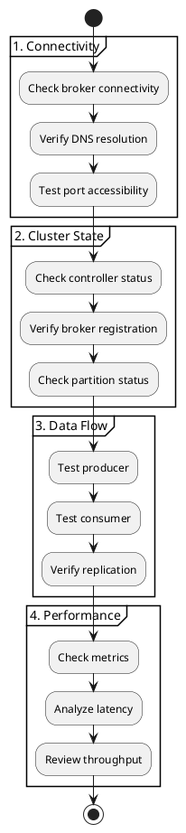

# Kafka Diagnosis

Diagnostic procedures for identifying and isolating Apache Kafka issues.

---

## Diagnostic Workflow



---

## Connectivity Checks

### Basic Connectivity

```bash
# Test TCP connectivity
nc -zv kafka-host 9092

# Test with timeout
timeout 5 bash -c 'cat < /dev/null > /dev/tcp/kafka-host/9092' && echo "OK" || echo "FAILED"

# DNS resolution
dig kafka-host
nslookup kafka-host
```

### Broker API Versions

```bash
# List supported API versions (verifies connectivity and protocol)
kafka-broker-api-versions.sh --bootstrap-server kafka:9092

# Output shows:
# ApiVersion(apiKey=0, minVersion=0, maxVersion=12)  -- Produce
# ApiVersion(apiKey=1, minVersion=0, maxVersion=13)  -- Fetch
# ...
```

### SSL/TLS Connectivity

```bash
# Test SSL handshake
openssl s_client -connect kafka:9093 -CAfile ca-cert.pem

# Verify certificate
openssl s_client -connect kafka:9093 -showcerts

# Check certificate expiry
openssl s_client -connect kafka:9093 2>/dev/null | \
  openssl x509 -noout -dates
```

### SASL Authentication

```bash
# Test with SASL/PLAIN
kafka-broker-api-versions.sh --bootstrap-server kafka:9093 \
  --command-config client.properties

# client.properties:
# security.protocol=SASL_SSL
# sasl.mechanism=PLAIN
# sasl.jaas.config=...
```

---

## Cluster State Verification

### Controller Status

```bash
# KRaft mode - check controller quorum
kafka-metadata.sh --snapshot /var/kafka-logs/__cluster_metadata-0/*.log \
  --command "quorum"

# Check active controller
kafka-metadata.sh --snapshot /var/kafka-logs/__cluster_metadata-0/*.log \
  --command "describe" | grep -i controller
```

### Broker Status

```bash
# List all brokers
kafka-metadata.sh --snapshot /var/kafka-logs/__cluster_metadata-0/*.log \
  --command "brokers"

# Check each broker
for broker in kafka1 kafka2 kafka3; do
  echo -n "$broker: "
  timeout 5 kafka-broker-api-versions.sh --bootstrap-server $broker:9092 \
    > /dev/null 2>&1 && echo "OK" || echo "FAILED"
done
```

### Partition Status

```bash
# Under-replicated partitions
kafka-topics.sh --bootstrap-server kafka:9092 \
  --describe --under-replicated-partitions

# Unavailable partitions
kafka-topics.sh --bootstrap-server kafka:9092 \
  --describe --unavailable-partitions

# Under min-ISR partitions
kafka-topics.sh --bootstrap-server kafka:9092 \
  --describe --under-min-isr-partitions

# Describe specific topic
kafka-topics.sh --bootstrap-server kafka:9092 \
  --describe --topic my-topic
```

### ISR Verification

```bash
# Check ISR for all partitions
kafka-topics.sh --bootstrap-server kafka:9092 --describe | \
  grep -E "Topic:|Leader:|Isr:"

# Monitor ISR changes
watch -n 5 'kafka-topics.sh --bootstrap-server kafka:9092 \
  --describe --under-replicated-partitions'
```

---

## Data Flow Testing

### Producer Test

```bash
# Send test messages
echo "test-message-$(date +%s)" | kafka-console-producer.sh \
  --bootstrap-server kafka:9092 \
  --topic test-topic

# Send with key
kafka-console-producer.sh --bootstrap-server kafka:9092 \
  --topic test-topic \
  --property "parse.key=true" \
  --property "key.separator=:" << EOF
key1:value1
key2:value2
EOF

# Performance test producer
kafka-producer-perf-test.sh \
  --topic test-topic \
  --num-records 10000 \
  --record-size 1024 \
  --throughput -1 \
  --producer-props bootstrap.servers=kafka:9092
```

### Consumer Test

```bash
# Consume from beginning
kafka-console-consumer.sh --bootstrap-server kafka:9092 \
  --topic test-topic \
  --from-beginning \
  --max-messages 10

# Consume with timestamps
kafka-console-consumer.sh --bootstrap-server kafka:9092 \
  --topic test-topic \
  --from-beginning \
  --property print.timestamp=true \
  --property print.key=true

# Performance test consumer
kafka-consumer-perf-test.sh \
  --bootstrap-server kafka:9092 \
  --topic test-topic \
  --messages 10000 \
  --threads 1
```

### End-to-End Latency Test

```bash
# Measure end-to-end latency
kafka-run-class.sh kafka.tools.EndToEndLatency \
  kafka:9092 \
  test-topic \
  10000 \
  all \
  1024
```

### Replication Verification

```bash
# Verify replica lag
kafka-replica-verification.sh \
  --broker-list kafka1:9092,kafka2:9092,kafka3:9092 \
  --topic-white-list ".*"

# Check log end offsets
kafka-run-class.sh kafka.tools.GetOffsetShell \
  --bootstrap-server kafka:9092 \
  --topic my-topic
```

---

## Consumer Group Diagnosis

### Group State

```bash
# List all groups
kafka-consumer-groups.sh --bootstrap-server kafka:9092 --list

# Group details
kafka-consumer-groups.sh --bootstrap-server kafka:9092 \
  --describe --group my-group

# Group state
kafka-consumer-groups.sh --bootstrap-server kafka:9092 \
  --describe --group my-group --state

# Member details
kafka-consumer-groups.sh --bootstrap-server kafka:9092 \
  --describe --group my-group --members --verbose
```

### Consumer Lag Analysis

```bash
# Lag per partition
kafka-consumer-groups.sh --bootstrap-server kafka:9092 \
  --describe --group my-group

# Sample output:
# GROUP      TOPIC     PARTITION  CURRENT-OFFSET  LOG-END-OFFSET  LAG
# my-group   my-topic  0          1000            1050            50
# my-group   my-topic  1          2000            2000            0
```

### Lag Interpretation

| Lag Behavior | Meaning | Action |
|--------------|---------|--------|
| Lag = 0 | Consumer caught up | Normal |
| Lag constant | Keeping pace | Normal |
| Lag growing | Falling behind | Scale consumers |
| Lag very large | Significantly behind | Investigate, reset offset |

---

## Performance Diagnosis

### JMX Metrics Collection

```bash
# Enable JMX
export KAFKA_JMX_OPTS="-Dcom.sun.management.jmxremote \
  -Dcom.sun.management.jmxremote.port=9999 \
  -Dcom.sun.management.jmxremote.authenticate=false \
  -Dcom.sun.management.jmxremote.ssl=false"

# Query metrics with JMX tool
kafka-run-class.sh kafka.tools.JmxTool \
  --jmx-url service:jmx:rmi:///jndi/rmi://localhost:9999/jmxrmi \
  --object-name kafka.server:type=BrokerTopicMetrics,name=MessagesInPerSec
```

### Key Metrics to Check

| Metric | Description | Alert Threshold |
|--------|-------------|-----------------|
| `UnderReplicatedPartitions` | Partitions with missing replicas | > 0 |
| `OfflinePartitionsCount` | Partitions with no leader | > 0 |
| `ActiveControllerCount` | Controllers in cluster | ≠ 1 |
| `RequestQueueSize` | Queued requests | Growing |
| `TotalTimeMs` | Request latency | P99 > 100ms |

### System Resource Checks

```bash
# CPU usage
top -b -n 1 | head -20

# Memory usage
free -m
vmstat 1 5

# Disk I/O
iostat -x 1 5

# Network
netstat -s | grep -i error
ss -s
```

### Disk Space

```bash
# Log directories
kafka-log-dirs.sh --bootstrap-server kafka:9092 \
  --describe --broker-list 0,1,2

# Filesystem usage
df -h /var/kafka-logs

# Directory sizes
du -sh /var/kafka-logs/*
```

---

## Log Segment Verification

### Check Log Integrity

```bash
# Verify log segment
kafka-dump-log.sh \
  --files /var/kafka-logs/my-topic-0/00000000000000000000.log \
  --verify-index-only

# Deep verification
kafka-dump-log.sh \
  --files /var/kafka-logs/my-topic-0/00000000000000000000.log \
  --deep-iteration

# Index sanity check
kafka-dump-log.sh \
  --files /var/kafka-logs/my-topic-0/00000000000000000000.log \
  --index-sanity-check
```

### View Log Contents

```bash
# Print log entries
kafka-dump-log.sh \
  --files /var/kafka-logs/my-topic-0/00000000000000000000.log \
  --print-data-log

# Print specific offset range
kafka-dump-log.sh \
  --files /var/kafka-logs/my-topic-0/00000000000000000000.log \
  --print-data-log \
  --max-message-size 1000
```

---

## Health Check Script

```bash
#!/bin/bash
# kafka-health-check.sh

BOOTSTRAP_SERVER=${1:-"localhost:9092"}
EXIT_CODE=0

echo "=========================================="
echo "Kafka Cluster Health Check"
echo "Timestamp: $(date)"
echo "Bootstrap: $BOOTSTRAP_SERVER"
echo "=========================================="

# Function to check and report
check() {
  local name=$1
  local result=$2
  local expected=$3

  if [ "$result" == "$expected" ]; then
    echo "[OK]   $name: $result"
  else
    echo "[FAIL] $name: $result (expected: $expected)"
    EXIT_CODE=1
  fi
}

# Broker connectivity
echo ""
echo "--- Connectivity ---"
if kafka-broker-api-versions.sh --bootstrap-server $BOOTSTRAP_SERVER > /dev/null 2>&1; then
  echo "[OK]   Broker connectivity"
else
  echo "[FAIL] Broker connectivity"
  EXIT_CODE=2
  exit $EXIT_CODE
fi

# Offline partitions
echo ""
echo "--- Partition Health ---"
OFFLINE=$(kafka-topics.sh --bootstrap-server $BOOTSTRAP_SERVER \
  --describe --unavailable-partitions 2>/dev/null | grep -c "Topic:" || echo "0")
if [ "$OFFLINE" -eq 0 ]; then
  echo "[OK]   Offline partitions: 0"
else
  echo "[CRIT] Offline partitions: $OFFLINE"
  EXIT_CODE=2
fi

# Under-replicated partitions
UNDER_REP=$(kafka-topics.sh --bootstrap-server $BOOTSTRAP_SERVER \
  --describe --under-replicated-partitions 2>/dev/null | grep -c "Topic:" || echo "0")
if [ "$UNDER_REP" -eq 0 ]; then
  echo "[OK]   Under-replicated partitions: 0"
else
  echo "[WARN] Under-replicated partitions: $UNDER_REP"
  [ $EXIT_CODE -eq 0 ] && EXIT_CODE=1
fi

# Under min-ISR partitions
UNDER_ISR=$(kafka-topics.sh --bootstrap-server $BOOTSTRAP_SERVER \
  --describe --under-min-isr-partitions 2>/dev/null | grep -c "Topic:" || echo "0")
if [ "$UNDER_ISR" -eq 0 ]; then
  echo "[OK]   Under-MinISR partitions: 0"
else
  echo "[WARN] Under-MinISR partitions: $UNDER_ISR"
  [ $EXIT_CODE -eq 0 ] && EXIT_CODE=1
fi

# Consumer groups
echo ""
echo "--- Consumer Groups ---"
EMPTY_GROUPS=$(kafka-consumer-groups.sh --bootstrap-server $BOOTSTRAP_SERVER \
  --list --state | grep -c "Empty" || echo "0")
echo "[INFO] Empty consumer groups: $EMPTY_GROUPS"

echo ""
echo "=========================================="
echo "Health check completed with exit code: $EXIT_CODE"
echo "=========================================="

exit $EXIT_CODE
```

---

## Related Documentation

- [Troubleshooting Overview](../index.md) - Troubleshooting guide
- [Common Errors](../common-errors/index.md) - Error reference
- [Log Analysis](../log-analysis/index.md) - Log interpretation
- [CLI Tools](../../operations/cli-tools/index.md) - Command reference