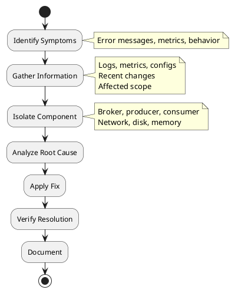

# Kafka Troubleshooting

Diagnostic procedures and solutions for common Apache Kafka issues.

---

## Troubleshooting Methodology



### Information Gathering Checklist

| Category | Information to Collect |
|----------|----------------------|
| **Errors** | Exception messages, error codes |
| **Metrics** | Relevant JMX metrics, lag, throughput |
| **Logs** | Broker logs, client logs |
| **Configuration** | Broker, producer, consumer configs |
| **Recent changes** | Deployments, config changes, scaling |
| **Scope** | All topics/partitions or specific ones |
| **Timeline** | When did issue start, pattern |

---

## Common Issues

### Under-Replicated Partitions

**Symptoms:**
- `UnderReplicatedPartitions` metric > 0
- `kafka-topics.sh --describe --under-replicated-partitions` shows partitions

**Causes:**
| Cause | Investigation |
|-------|---------------|
| **Broker down** | Check broker status, logs |
| **Slow broker** | Check disk I/O, CPU, network |
| **Network issues** | Check connectivity between brokers |
| **Large messages** | Check `replica.fetch.max.bytes` |
| **High load** | Check throughput, add capacity |

**Resolution:**
```bash
# Check which partitions are under-replicated
kafka-topics.sh --bootstrap-server kafka:9092 \
  --describe --under-replicated-partitions

# Check broker status
kafka-broker-api-versions.sh --bootstrap-server kafka1:9092

# Check replica lag
kafka-replica-verification.sh --broker-list kafka1:9092,kafka2:9092 \
  --topic-white-list ".*"
```

### Offline Partitions

**Symptoms:**
- `OfflinePartitionsCount` metric > 0
- Producers fail with `NotLeaderForPartitionException`

**Causes:**
| Cause | Resolution |
|-------|------------|
| **All replicas down** | Restart brokers with replicas |
| **Unclean leader election disabled** | Enable `unclean.leader.election.enable` (data loss risk) or recover broker |
| **Disk failure** | Replace disk, restore from replica |

**Resolution:**
```bash
# Find offline partitions
kafka-topics.sh --bootstrap-server kafka:9092 \
  --describe --unavailable-partitions

# Check replica status
kafka-topics.sh --bootstrap-server kafka:9092 \
  --describe --topic <topic>

# Force leader election (if unclean election is acceptable)
kafka-leader-election.sh --bootstrap-server kafka:9092 \
  --election-type UNCLEAN \
  --topic <topic> --partition <partition>
```

### Consumer Lag

**Symptoms:**
- Consumer lag growing
- Processing falling behind

**Diagnosis:**
```bash
# Check consumer lag
kafka-consumer-groups.sh --bootstrap-server kafka:9092 \
  --describe --group <group>

# Output shows:
# TOPIC  PARTITION  CURRENT-OFFSET  LOG-END-OFFSET  LAG
```

**Causes and Resolutions:**
| Cause | Resolution |
|-------|------------|
| **Slow processing** | Optimize processing logic, add consumers |
| **Too few consumers** | Add consumers (up to partition count) |
| **Rebalancing** | Use cooperative rebalancing, static membership |
| **Large messages** | Increase fetch size, processing capacity |
| **External dependency slow** | Optimize external calls, add buffering |

### Producer Timeouts

**Symptoms:**
- `TimeoutException` in producer
- `delivery.timeout.ms` exceeded

**Causes:**
| Cause | Investigation |
|-------|---------------|
| **Broker unavailable** | Check broker health, connectivity |
| **No leader** | Check partition leadership |
| **ISR too small** | Check ISR, `min.insync.replicas` |
| **Network issues** | Check network latency, packet loss |
| **Overloaded broker** | Check broker metrics, request queue |

**Resolution:**
```bash
# Check broker availability
kafka-broker-api-versions.sh --bootstrap-server kafka:9092

# Check partition leaders
kafka-topics.sh --bootstrap-server kafka:9092 \
  --describe --topic <topic>

# Check request metrics (JMX)
# kafka.network:type=RequestMetrics,name=TotalTimeMs,request=Produce
```

### NotEnoughReplicasException

**Symptoms:**
- Producer fails with `NotEnoughReplicasException`
- `min.insync.replicas` not satisfied

**Cause:** ISR size < `min.insync.replicas`

**Resolution:**
```bash
# Check ISR for topic
kafka-topics.sh --bootstrap-server kafka:9092 \
  --describe --topic <topic>

# Check under-replicated partitions
kafka-topics.sh --bootstrap-server kafka:9092 \
  --describe --under-replicated-partitions

# Resolution options:
# 1. Fix unhealthy brokers to restore ISR
# 2. Temporarily reduce min.insync.replicas (reduces durability)
kafka-configs.sh --bootstrap-server kafka:9092 \
  --entity-type topics --entity-name <topic> \
  --alter --add-config min.insync.replicas=1
```

### Consumer Rebalancing Storm

**Symptoms:**
- Frequent rebalances
- Consumer frequently in `REBALANCING` state
- High latency, processing gaps

**Causes:**
| Cause | Resolution |
|-------|------------|
| **Processing too slow** | Increase `max.poll.interval.ms`, optimize processing |
| **GC pauses** | Tune JVM GC |
| **Heartbeat issues** | Ensure `heartbeat.interval.ms` < `session.timeout.ms` / 3 |
| **Consumer crashes** | Fix consumer stability |
| **Network instability** | Fix network issues |

**Resolution:**
```properties
# Consumer configuration
max.poll.interval.ms=600000      # Increase if processing is slow
session.timeout.ms=45000         # Default
heartbeat.interval.ms=3000       # Should be < session.timeout.ms / 3

# Use cooperative rebalancing
partition.assignment.strategy=org.apache.kafka.clients.consumer.CooperativeStickyAssignor

# Use static membership
group.instance.id=consumer-host-1
```

---

## Log Analysis

### Important Log Patterns

| Pattern | Meaning |
|---------|---------|
| `ERROR` | Error requiring attention |
| `WARN` | Warning, potential issue |
| `Marking partition.*offline` | Partition lost leadership |
| `ISR.*shrunk` | Replica fell out of sync |
| `ISR.*expanded` | Replica rejoined ISR |
| `NotLeaderForPartition` | Leader changed during request |
| `ReplicaFetcherThread.*shutdown` | Replication stopped |
| `Connection to node.*could not be established` | Network connectivity issue |

### Log Locations

| Component | Default Location |
|-----------|-----------------|
| **Broker** | `/var/log/kafka/server.log` or `$KAFKA_HOME/logs/server.log` |
| **Controller** | `/var/log/kafka/controller.log` |
| **State change** | `/var/log/kafka/state-change.log` |
| **Request log** | `/var/log/kafka/kafka-request.log` (if enabled) |

### Enabling Debug Logging

```bash
# Increase log level dynamically
kafka-configs.sh --bootstrap-server kafka:9092 \
  --entity-type broker-loggers \
  --entity-name 1 \
  --alter \
  --add-config kafka.server=DEBUG

# Reset to default
kafka-configs.sh --bootstrap-server kafka:9092 \
  --entity-type broker-loggers \
  --entity-name 1 \
  --alter \
  --delete-config kafka.server
```

---

## Diagnostic Commands

### Cluster Health

```bash
# List brokers
kafka-broker-api-versions.sh --bootstrap-server kafka:9092

# Check cluster metadata (KRaft)
kafka-metadata.sh --snapshot /var/kafka/data/__cluster_metadata-0/00000000000000000000.log \
  --command "describe"

# Check under-replicated partitions
kafka-topics.sh --bootstrap-server kafka:9092 \
  --describe --under-replicated-partitions

# Check offline partitions
kafka-topics.sh --bootstrap-server kafka:9092 \
  --describe --unavailable-partitions
```

### Topic Health

```bash
# Describe topic
kafka-topics.sh --bootstrap-server kafka:9092 \
  --describe --topic <topic>

# Check topic configuration
kafka-configs.sh --bootstrap-server kafka:9092 \
  --entity-type topics --entity-name <topic> --describe

# Verify replica assignment
kafka-topics.sh --bootstrap-server kafka:9092 \
  --describe --topic <topic>
```

### Consumer Health

```bash
# List consumer groups
kafka-consumer-groups.sh --bootstrap-server kafka:9092 --list

# Describe consumer group
kafka-consumer-groups.sh --bootstrap-server kafka:9092 \
  --describe --group <group>

# Check group state
kafka-consumer-groups.sh --bootstrap-server kafka:9092 \
  --describe --group <group> --state

# Check members
kafka-consumer-groups.sh --bootstrap-server kafka:9092 \
  --describe --group <group> --members --verbose
```

### Log Inspection

```bash
# Dump log segment
kafka-dump-log.sh --files /var/kafka-logs/<topic>-<partition>/00000000000000000000.log \
  --print-data-log

# Check log segment metadata
kafka-dump-log.sh --files /var/kafka-logs/<topic>-<partition>/00000000000000000000.log \
  --deep-iteration

# Verify log integrity
kafka-log-dirs.sh --bootstrap-server kafka:9092 \
  --describe --topic-list <topic>
```

---

## Error Reference

### Producer Errors

| Exception | Cause | Resolution |
|-----------|-------|------------|
| `TimeoutException` | Delivery timeout exceeded | Check broker health, network, increase timeout |
| `NotLeaderForPartitionException` | Leader changed | Retry (usually automatic) |
| `NotEnoughReplicasException` | ISR < min.insync.replicas | Fix broker health |
| `RecordTooLargeException` | Message exceeds max size | Increase `max.request.size` or reduce message size |
| `SerializationException` | Serialization failed | Fix serializer configuration |
| `AuthorizationException` | ACL denied access | Grant required ACLs |
| `SaslAuthenticationException` | Authentication failed | Check credentials |

### Consumer Errors

| Exception | Cause | Resolution |
|-----------|-------|------------|
| `CommitFailedException` | Rebalance during commit | Handle in rebalance listener |
| `WakeupException` | wakeup() called | Normal for graceful shutdown |
| `OffsetOutOfRangeException` | Offset no longer available | Reset offset or handle with `auto.offset.reset` |
| `DeserializationException` | Deserialization failed | Fix deserializer, handle poison pills |
| `GroupAuthorizationException` | No access to consumer group | Grant group ACL |
| `TopicAuthorizationException` | No access to topic | Grant topic ACL |

### Broker Errors

| Error | Cause | Resolution |
|-------|-------|------------|
| `OutOfMemoryError` | Heap exhausted | Increase heap, check for leaks |
| `IOException: No space left` | Disk full | Add storage, adjust retention |
| `Too many open files` | File descriptor limit | Increase ulimit |
| `Connection refused` | Broker down or listener misconfigured | Check broker status, listener config |

---

## Performance Issues

### High Latency

**Investigation:**
```bash
# Check request latency (JMX)
# kafka.network:type=RequestMetrics,name=TotalTimeMs,request=Produce
# kafka.network:type=RequestMetrics,name=TotalTimeMs,request=FetchConsumer

# Check request queue
# kafka.network:type=RequestChannel,name=RequestQueueSize
```

**Common causes:**
| Cause | Resolution |
|-------|------------|
| **Slow disk** | Use SSDs, check I/O wait |
| **High CPU** | Add capacity, optimize |
| **Network congestion** | Check bandwidth, optimize |
| **GC pauses** | Tune JVM GC settings |
| **Large batches** | Reduce batch size |

### Low Throughput

**Investigation:**
- Check producer batching (`batch.size`, `linger.ms`)
- Check compression settings
- Check consumer fetch settings
- Check broker I/O capacity

**Common causes:**
| Cause | Resolution |
|-------|------------|
| **Small batches** | Increase `batch.size`, `linger.ms` |
| **No compression** | Enable compression |
| **Small fetch** | Increase `fetch.min.bytes` |
| **Disk I/O bottleneck** | Add disks, use faster storage |
| **Network bottleneck** | Add bandwidth |

---

## Getting Help

### Information to Include

When seeking help, include:

1. **Kafka version**
2. **Error messages** (full stack trace)
3. **Relevant configuration**
4. **Metrics** (throughput, latency, lag)
5. **Cluster size** (brokers, partitions)
6. **Recent changes**
7. **Steps to reproduce**

### Resources

- [Apache Kafka Users Mailing List](https://kafka.apache.org/contact)
- [Apache Kafka JIRA](https://issues.apache.org/jira/projects/KAFKA)
- [Confluent Community](https://confluent.io/community)
- [Stack Overflow - Apache Kafka](https://stackoverflow.com/questions/tagged/apache-kafka)

---

## Related Documentation

- [Common Errors](common-errors/index.md) - Error reference
- [Log Analysis](log-analysis/index.md) - Log interpretation guide
- [Diagnosis](diagnosis/index.md) - Diagnostic procedures
- [Operations](../operations/index.md) - Operational procedures
- [Monitoring](../operations/monitoring/index.md) - Metrics and alerting