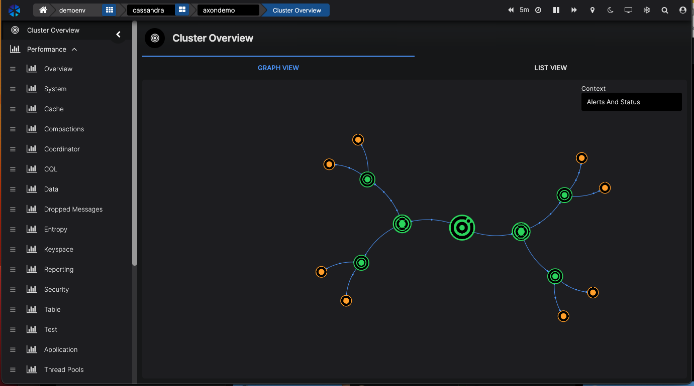
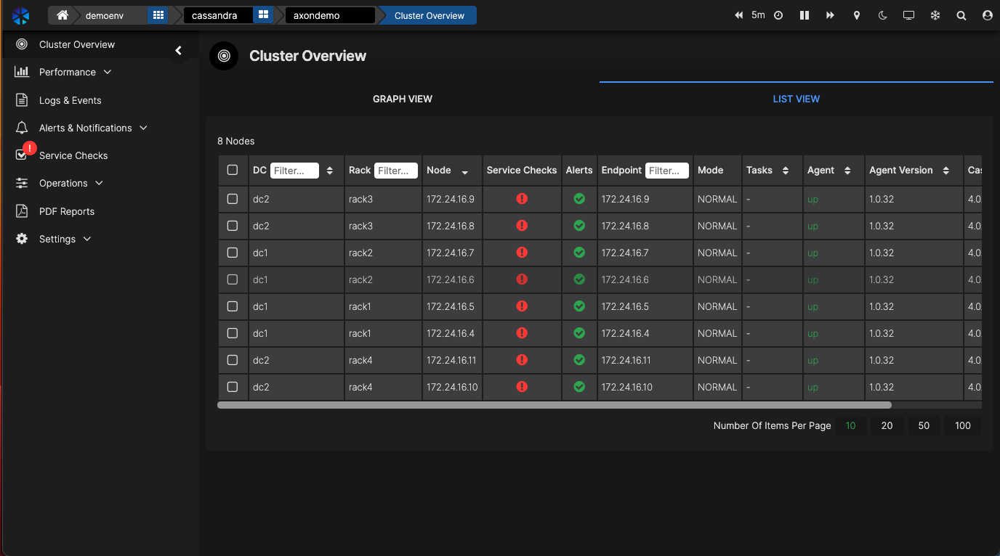
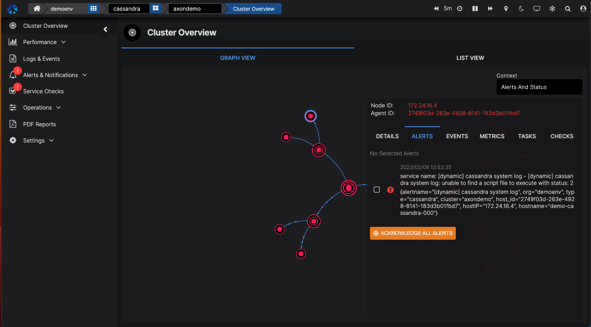
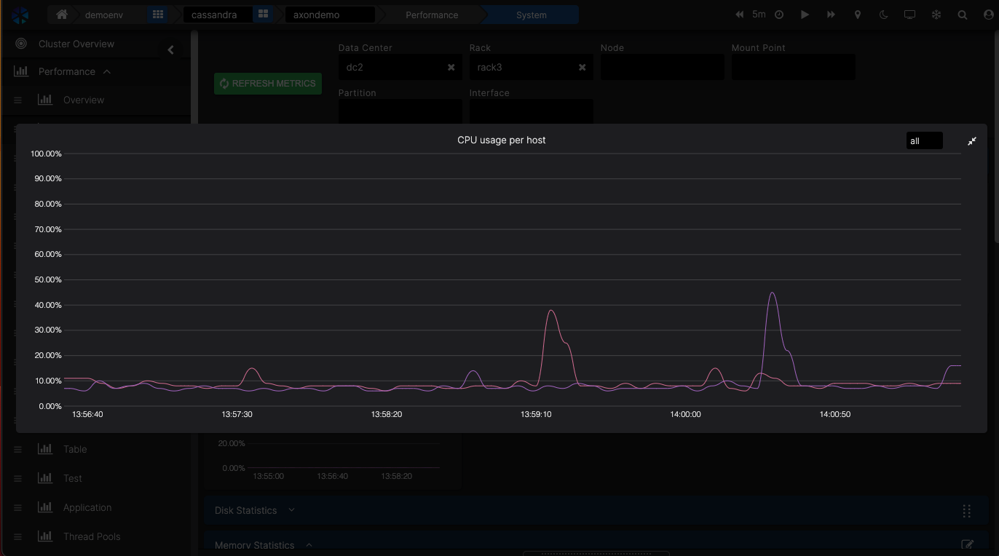
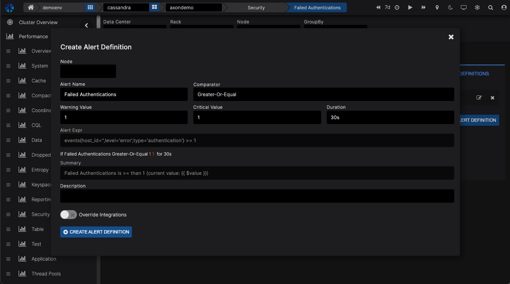
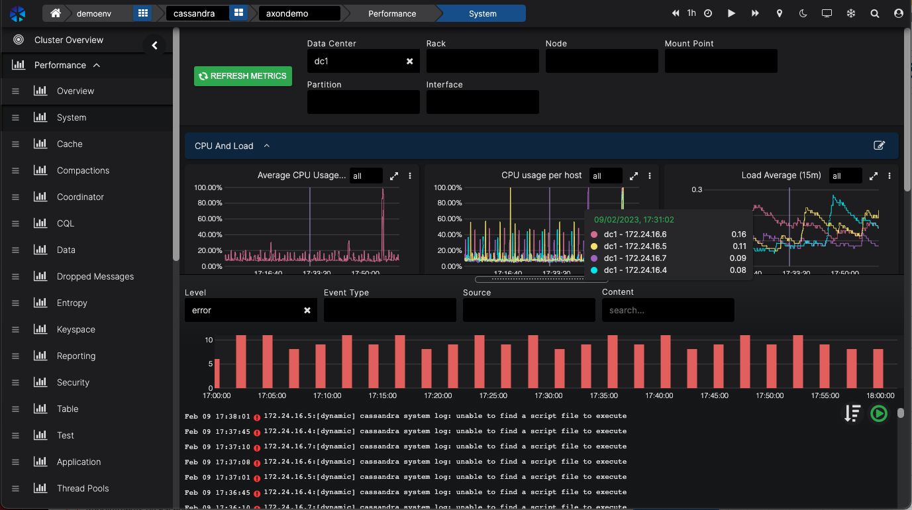

Thank you for your interest in AxonOps, the only tool in the market that provides a single environment to monitor, maintain and backup your Apache Cassandra clusters.

As a Free Edition user you are able to connect up to 6 nodes and enjoy the full functionality of AxonOps.

As a Demo Sandbox user you have access to a realistic representation of a production Cassandra environment consisting of the following:

* Qty of clusters – 1
* Qty of racks – 4
* Qty of DCs – 2
* Qty of nodes – 8
* Nodes per Rack – 2
* Nodes per DC – 4

This is a typical Cassandra set-up providing redundancy across data centers, racks and nodes. It should be noted that AxonOps can scale to 100s of clusters and 1000s of nodes across many data centers.

 

**To get started with the Demo Sandbox:**

Log in at [https://demo.axonops.cloud](https://demo.axonops.cloud)

**To get started with the Free Edition:**

Log in at [https://axonops.com/signin](https://axonops.com/signin)

Input the user name and password provided to you after you selected the Demo Sandbox instant access link or via the Free Edition signup process.

For a Demo Sandbox user you have immediate access to a live Cassandra environment.

For a Free Edition user simply follow the instructions displayed after login to connect your cluster.

If you have any issues or questions please email <a href="mailto:community@axonops.com">community@axonops.com</a>

As mentioned, AxonOps is all about monitoring, maintaining and backup of Apache Cassandra.

This walk-through is intended to help you quickly review the power and ease of use of AxonOps and covers the following areas.

## 1. Monitoring

You will now see the Cluster Overview, a graphic representation of the cluster.

The demo cluster has two data centers, with each DC having two racks, with each rack having two nodes. When hovering over your mouse, you will see the details of each DC, rack and node.

If you prefer a table view, just click on the List view.

For this demo environment, we are also using ChaosMonkey to randomly cause failures in the cluster. If that’s the case at the moment, you’ll see areas of the cluster showing red for errors or orange for warnings.

You can click on the nodes to see the details of each node.

If there is an issue, you’ll see the alerts.

### 1.1. Dashboards

Our experts have carefully crafted all relevant dashboards for you to drill deeper into what’s going on with your cluster. But you can also create your own dashboards or add to existing ones. The dashboards have been built from the ground up to be best described as snappy with great performance and zero lag. The last thing you want when you are woken up in the middle of the night to solve an issue with your Cassandra cluster is to wait for dashboards to load.

You can easily filter your dashboards by DC, rack and node.

AxonOps also allows you to select the timeline you’re looking at. You can stop the dashboard from refreshing by clicking on the pause button (॥) in the top right corner.

The timeline can be selected by either the last 5 minutes, 30 minutes, day, etc., or by entering a date and time range.

If you want to look at it closer, you can enlarge the dashboard by clicking on two arrows in the top right corner of the dashboard.

It’s also possible to zoom in on an event by selecting the timeline on a graph when dragging your mouse over a portion of the timeline.

Switch back to 1hr timeline to see the data coming in again. Click on the time range area on the top of the screen to do this.

### 1.2. Alerts

Alerts can be sent to various platforms that you can set up in the Settings → Integrations menu.

You can easily filter your dashboards by DC, rack and node.

Once the integration has been set up, you can use it for various types of alerts. And the great thing is, you can override certain notifications. For example, if you have a separate team dealing with backups, you can route backup-related alerts to their Slack channel.

In AxonOps we are running Service Checks that you can configure in the Settings menu.

You can add your own checks.
For example, let’s create a simple Shell check echo “Hello”.
Scroll down to click on “ADD NEW SHELL CHECK”.
Enter a name in Check Name – this will identify your script.
Click on the Script bar and enter your desired script. In our case, this is:

echo “Hello world”

But this could be any script you want to run.
Click on X to save the script.

You can enter the parameters for how often you want to run this script and when it times out.

Then click on the green SAVE CHANGES button to save everything.

AxonOps will now start deploying the script to all the nodes and execute accordingly.

NOTE: We made a mapping from the cluster configuration, so you don’t have to use IP addresses, port numbers, etc. Any script you create will work in other DCs, clusters, etc.

NOTE: You can prevent rogue commands in the scripts by maintaining a whitelist of commands in the AxonOps agent configuration.

You can also create your own events. For example, let’s create a security event. If you go to the Security dashboard, you’ll see the Failed Authentication dashboard.

When you click on the three dots in the top right corner of that window and click Edit, you can create an Alert Definition by clicking on the ALERT DEFINITIONS and then the blue ADD NEW ALERT DEFINITION button.

AxonOps already creates the matching Alert Expression for you. The Alert Expressions are Prometheus Query language compatible.
If necessary, change the values for the number of events and duration before a Warning or Error is raised.

Each alert will be sent to the default integration which you can override here too by clicking on the OVERRIDE INTEGRATIONS slider and selecting where you want to send the alerts using your defined integrations.

Click on CREATE ALERT DEFINITION to save the Alert.

### 1.3. Logs

So we’ve been looking at predefined monitoring dashboards and alerts so far. Let’s have a look at the logs.

AxonOps is a great tool to dive deeper into your Cassandra logs to solve an issue with your cluster.

Let’s assume we’re looking at CPU utilisation at the Performance dashboard.

At the bottom of the screen, you can pull up the log files for the selection you are looking at.

Even the filters are applied to the log entries.

You see, how easy it is to zoom in with laser precision on the issue you want to investigate.

You can also look at all the logs and zoom in on the Logs & Events part of the menu.

Now, we have been looking at Monitoring, all the dashboards that give you all the necessary information about your Cassandra cluster. We looked at events & alerts and how they can be integrated with your own messaging system of choice. And we looked at Service Checks and how you can customise these.

Let’s move on to the Maintaining side of Cassandra operations.

## 2. Maintenance

### 2.1. Repairs

AxonOps has a powerful feature called Adaptive Repairs, enabled through the fact AxonOps monitors node throughput and pushes repair operations via a single agent.

This is a unique feature ensuring repair processes do not run when the cluster is busy and accelerates repair processes when there is spare capacity. So when enabled, Adaptive Repair automatically increases and decreases the intensity of repairs depending on the workload of a node. When the node is busy we slow down the repairs so there is no impact on query latencies. And when there is available headroom, we increase the repairs.

That’s all there is to it! Just enable Adaptive Repairs and you’re done. AxonOps will ensure your nodes are always ahead of their repair schedule.

If there are not enough resources available to complete repairs at all (within the GC grace period), we will generate an alert.

Because of the way Adaptive Repairs works, when you do capacity planning for your cluster, you have a reduced need for capacity. You do not need to take into account capacity for these heavy repairs that also run when you need the cluster to perform. With speeding repairs up and down, you can use the headroom on the server and save on

There may be edge cases when you still want to schedule your repairs which can be managed through Scheduled Repair.

### 2.2. Rolling Restarts / Job Scheduler

Being able to schedule Rolling Restarts and automate key tasks such as nodetool commands is available straight from the console.

You can configure how the Rolling Restart is executed in the Settings menu. The number of DCs, racks or nodes in parallel and the script you want to run.

By entering the script you want to execute in the Script field many different commands can be executed through a schedule or immediately, with or without the execution of a Rolling Restart.

Note AxonOps is already populated with Cassandra stop and Cassandra start commands.

You can see how this can save you from running commands on many nodes, wait until they’re running again, and then move on to the next node.

## 3. Backup & Restore

With AxonOps, you can easily schedule and run all the backups you need. We can store the backups locally or remotely on any of the popular cloud providers or just through an SFTP upload.

You can see what backup schedules are running. Under that list, you can create your own backup schedule.
Enter the details of what you want to back up.

When clicking the REMOTE BACKUP tick-box, you can enter the remote location where you want to store the backups.

AxonOps is highly efficient as it detects what data files have changed and only backups the delta changes of the files. It should be noted that implementing a generic backup solution to handle delta changes of Cassandra storage is complex and often not implemented. AxonOps delivers this capability out of the box.

Restoring a backup is simply selecting the backups available and then selecting whether to restore it locally or remotely.

## 4. PDF Reports

One final feature to walk you through is the ability to generate PDF reports.

You can instantly create a PDF report of any dashboard you select. By default, we have a Report dashboard that will be used to generate reports.

Select the dashboard you want to create a report for.

You can filter the report data based on DC, rack, or a few other parameters.

You can select to create a PDF immediately which opens a new window with the PDF.

You can also create a daily, weekly or monthly schedule and have the report automatically sent to an email address being setup at the integrations.

You can test AxonOps for free on one of your own clusters too.

Go to [https://axonops.com/signin](https://axonops.com/signin) to create your own account and connect your cluster.