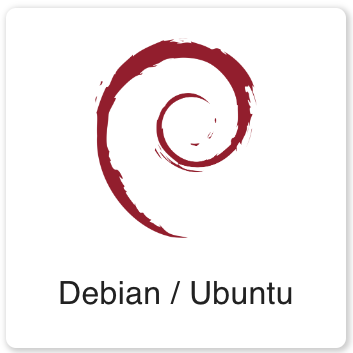
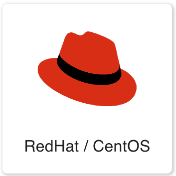
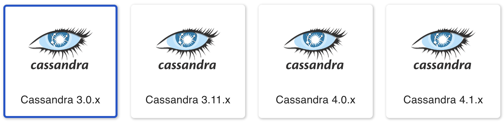

# Axon Agent Setup


## AxonOps Cloud Agent Network Requirements
AxonOps agent connects securely to the following AxonOps Cloud service endpoint;

``` { .bash .no-copy }
https://agents.axonops.cloud
```

The TLS HTTPS connection initiated by the agent is upgraded to a WebSocket connection and thus requires WebSocket support in your corporate infrastructure, such as a secure web proxy service.

If you have a DNS based security policy then you will be required to allow outbound access to the following domain.

``` { .bash .no-copy }
agents.axonops.cloud
```

If you have an IP address based security policy you will be required to open access to the IP address ranges provided in the following links.

``` { .bash .no-copy }
https://agents.axonops.cloud/ips-v4
https://agents.axonops.cloud/ips-v6
```

In order to test your connectivity execute the following command:

``` { .bash .copy }
curl https://agents.axonops.cloud/test.html
```

You should expect the following response:

*AxonOps Agent Test Page*

## Setup the AxonOps repository on your Operating system

Select the correct OS Family. 

{ .skip-lightbox width="180px"} ](http://localhost:8000/get_started/agent_setup/#__tabbed_1_2){ .skip-lightbox width="180px"}

=== "Debian / Ubuntu"
    ```bash
    curl https://packages.axonops.com/apt/repo-signing-key.gpg | sudo apt-key add -
    echo "deb https://packages.axonops.com/apt axonops-apt main" | sudo tee /etc/apt/sources.list.d/axonops-apt.list
    sudo apt-get update
    ```

=== "RedHat / CentOS"
    ```bash
    sudo tee /etc/yum.repos.d/axonops-yum.repo << EOL
    [axonops-yum]
    name=axonops-yum
    baseurl=https://packages.axonops.com/yum/
    enabled=1
    repo_gpgcheck=0
    gpgcheck=0
    EOL
    sudo yum makecache
    ```

## Select the correct Cassandra Version



***NB.*** Please replace the <span> &lt;VERSION&gt; </span>  placeholder in the command below.

=== "Debian / Ubuntu"
    === "Cassandra 3.0"
        ```
        sudo apt-get install axon-cassandra3.0-agent
        ```
    
    === "Cassandra 3.11"
        ```
        sudo apt-get install axon-cassandra3.11-agent
        ```
    
    === "Cassandra 4.0"
        ```
        sudo apt-get install axon-cassandra4.0-agent
        ```

    === "Cassandra 4.1"
        ```
        sudo apt-get install axon-cassandra4.1-agent
        ```

=== "RedHat / CentOS"
    === "Cassandra 3.0"
        ```
        sudo yum install axon-cassandra3.0-agent
        ```
    
    === "Cassandra 3.11"
        ```
        sudo yum install axon-cassandra3.11-agent
        ```
    
    === "Cassandra 4.0"
        ```
        sudo yum install axon-cassandra4.0-agent
        ```

    === "Cassandra 4.1"
        ```
        sudo yum install axon-cassandra4.1-agent
        ```

## 

Once the Agents have been setup please use the [Using AxonOps](/cluster/cluster-overview/) to familiarise yourself with AxonOps UI.