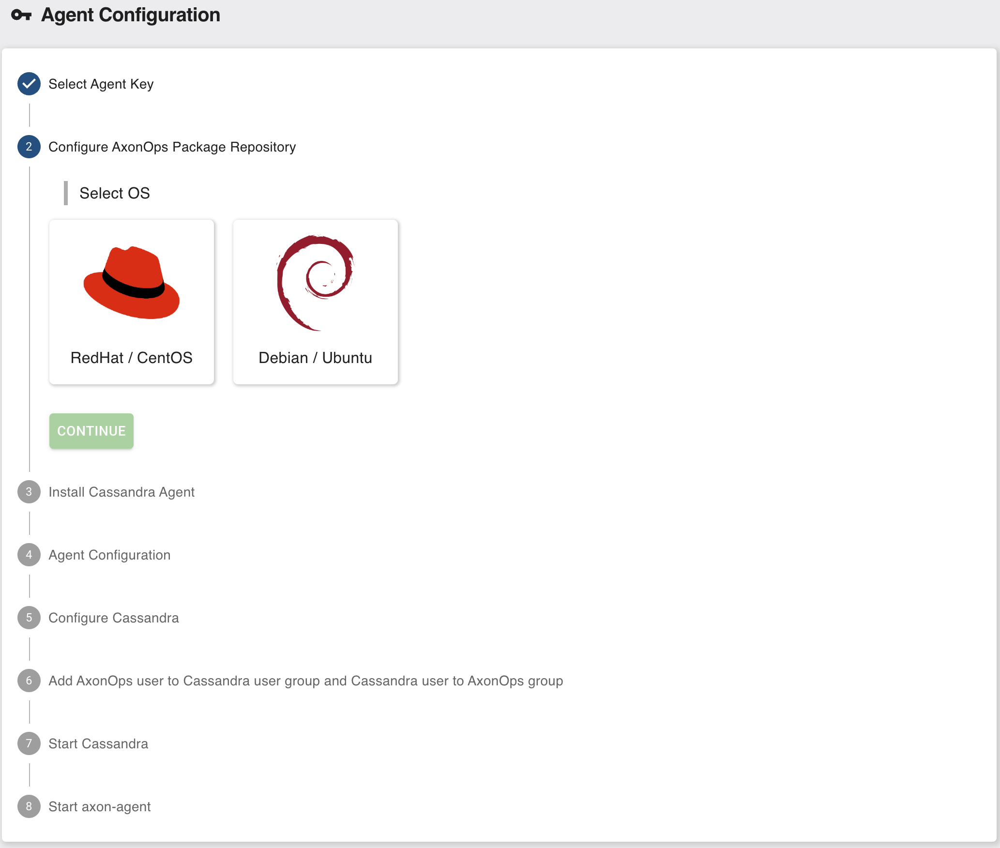

# Axon Agent Setup

On the left menu click 'Agent setup'

From 'Agent setup' click 'Agent configuration' then follow the on-screen steps.

Once the Agents have been setup please use the [Using AxonOps](/cluster/cluster-overview/) to familiarise yourself with AxonOps UI.