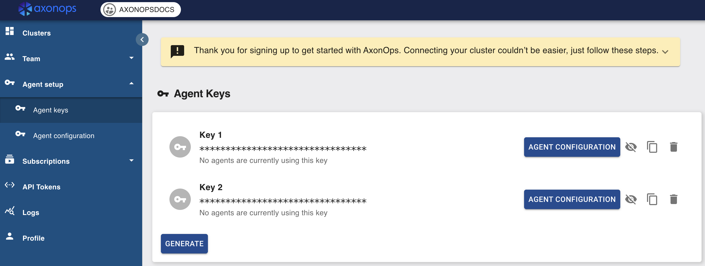

# Axon Agent Setup
<!--  -->

## AxonOps Cloud Agent Network Requirements

AxonOps agent connects securely to the following AxonOps Cloud service endpoint;

``` { .bash .no-copy }
https://agents.axonops.cloud
```

The TLS HTTPS connection initiated by the agent is upgraded to a WebSocket connection and thus requires WebSocket support in your corporate infrastructure, such as a secure web proxy service.

If you have a DNS based security policy then you will be required to allow outbound access to the following domain.

``` { .bash .no-copy }
agents.axonops.cloud
```

If you have an IP address based security policy you will be required to open access to the IP address ranges provided in the following links.

``` { .bash .no-copy }
https://agents.axonops.cloud/ips-v4
https://agents.axonops.cloud/ips-v6
```

In order to test your connectivity execute the following command:

``` { .bash .copy }
curl https://agents.axonops.cloud/test.html
```

You should expect the following response:

*AxonOps Agent Test Page*

## Step 1 - Setup the AxonOps repository and install AxonOps Agent

{!dynamic_pages/axon_agent/os.md!}

## Step 2 - Install Cassandra Agent

{!dynamic_pages/axon_agent/cassandra.md!}

## Step 3 - Agent Configuration

Update and copy the below code snippet into /etc/axonops/axon-agent.yml file.

Please update the **key** and **org** values by logging into [console.axonops.cloud](https://console.axonops.cloud){target="_blank"}

* **Organization(org)** name is next to the logo in the console
* **Agent Keys(key)** found in Agent Setup



If there is a Dedicated NTP server in your Organization please uncomment and update the NTP section. 

```
  axon-server:
      hosts: "agents.axonops.cloud"
  
  axon-agent:
      key: <THIS_IS_A_DUMMY_KEY_PLEASE_UPDATE>
      org: <THIS_IS_A_DUMMY_ORG_NAME_PLEASE_UPDATE>

  # Specify the NTP server IP addresses or hostnames configured for your Cassandra hosts
  # if using Cassandra deployed in Kubernetes or if auto-detection fails.
  # The port defaults to 123 if not specified.
  # NTP:
  #    hosts:
  #        - "x.x.x.x:123"
  # Optionally restrict which commands can be executed by axon-agent.
  # If "true", only scripts placed in scripts_location can be executed by axon-agent.
  # disable_command_exec: false
  # If disable_command_exec is true then axon-agent is only allowed to execute scripts
  # under this path
  # scripts_location: /var/lib/axonops/scripts/
```

Set file permissions on /etc/axonops/axon-agent.yml file by executing the following command

```
sudo chmod 0644 /etc/axonops/axon-agent.yml
```

## Step 4 - Configure Cassandra

{!dynamic_pages/axon_agent/java.md!}

**NB.** Make sure that this configuration will not get overridden by an automation tool.

## Step 5 - Add axonops user to Cassandra user group and Cassandra user to axonops group
```
sudo usermod -aG <your_cassandra_group> axonops
sudo usermod -aG axonops <your_cassandra_user>
```

## Step 6 - Start/Restart Cassandra

To load the Axon java agent and Cassandra config changes please,

* Start the Cassandra service if stopped. 
* Restart the Cassandra service if already running.

## Step 7 - Start axon-agent

```
sudo systemctl start axon-agent
```

Once the Agents have been setup please use the [Using AxonOps](/cluster/cluster-overview/) to familiarise yourself with AxonOps UI.