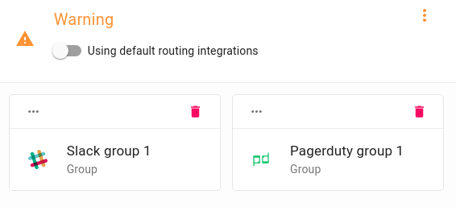

# Setup Backup - Restore Notifications

On the AxonOps application menu, click `Operations -> Backups -> Setup` and select `Notifications` tab. 

## Notification Severities.

!!! info "Notification Severities."

    For each notifications severity   Info     Warning     Error
    you can either use the slider  to use the default routing or use the   icon to customize the notification integrations.
    > Notice:  not available when [default routing][1]   selected

[1]: default-routing.md

!!! infomy 

    

## Customize Notifications.

To customize notifications `click` on  select the integrations that you require and click `Close`.

!!! infomy 

    

     > Noticed: The` Warning Integration` were customized. You can remove these by clicking the .

> If you want to remove [default routing][1] groups from a severity and create custom groups , use the slider bar to remove default routing `click` the  and follow this [steps][2]

> If you do not require any notifications `ensure` the `default routing` is off  and delete any previously created custom notification.

[2]: #notification-severities

!!! infomy 

    

