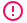
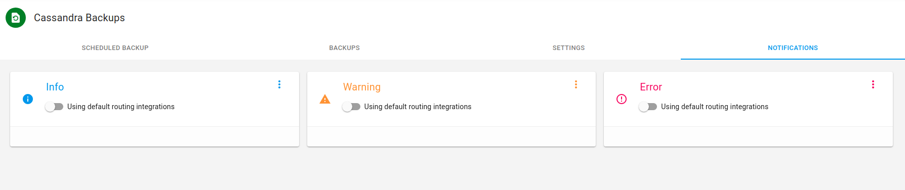

# Setup Backup - Restore Notications

<ol>

    <li>

        

            
On the Axonops application menu, click <code>Operations -> Backups -> Setup </code> and <strong>select</strong>
                <code>Notificationsg</code>tab.

            

                
Notification <code>Severities</code>.

                
For each notifications severity Info
                    Warning
                    Error
                     
                    you can either use the slider 
                    to use <strong>the default routing</strong>
                    or use the  icon to customize the
                    notification integrations. 

                <blockquote>
                    
Notice:  not available when <a
                            href="/how-to/default-routing/">default routing</a>  selected

                </blockquote>
            

            

                

            

        

    </li>
    <li id="step1">

        

            <h5>Customize notifications</h5>
            <ul>
                <li>
                    
To customize notifications <code>click</code> on 
                        select the integrations that you require and click <code>Close</code>.

                </li>

                

                    

                

                <li>
                    
Noticed that the <code>Warning Integration</code> were customized. You can remove
                        these by clicking the .

                    

                </li>

                <blockquote>
                    
If you want to remove <a href="/how-to/default-routing/">default routing</a> groups from a
                        severity and create custom groups , use the slider bar to remove
                        default routing <code>click</code> the 
                        and follow this <a href="#step1">steps</a> 

                </blockquote>
                <blockquote>
                    
If you do not require any notifications <strong>ensure</strong> the <code>default routing</code>
                        is off  and delete
                        any previously created custom notification. 

                </blockquote>
                

                    

                

            </ul>
        

    </li>
    </ul>