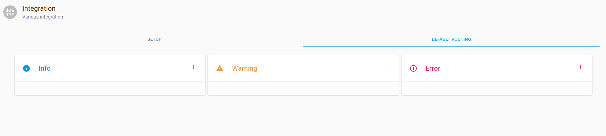
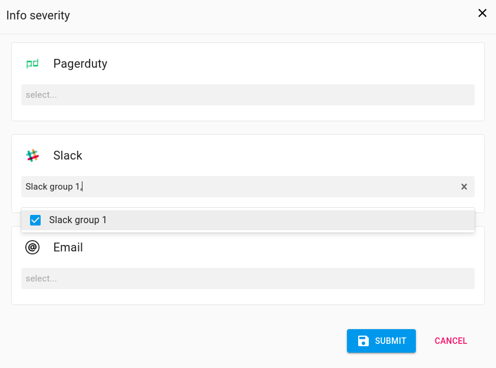
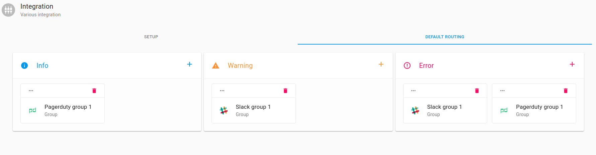
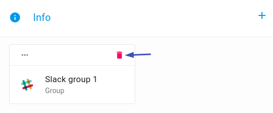

# Setup Default Routing

!!! info "Default Routing." 

    Allows you to set up the channels though which alerts & notifications will be received and the specific groups that will receive the alerts & notifications

###  Setup Default Routing

On the Axonops application menu, select `Alert & Notifications` -> Integration and select` Default Routing` tab.

* Alert & Notification types can be set up

!!! infomy 

       Info
       Warning
       Error
    

####  Info

To Setup Default Routing For    Info click On   

* Select the desired group(s) from the dropdown menu for the desired integrations(s) and  click`    to confirm selections

!!! infomy 

    

The group should now appear in the   Info  Info box on the `Default Routing Tab`

!!! infomy 

    

####  Warning - Error

Repeat these [steps][1] to setup the Default Routing for    Warning
  Error

[1]: #info

### Edit Default Routing

To Edit `Default Routing` click on the   </spa> icon on either       Add or `Remove` existing integrations using the `dropdown` menus.

### Delete Default Routing

To Remove a `group` `click` on the `Delete` icon

!!! infomy 

    

