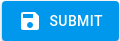

# Set up Default Routing

!!! info "Default Routing"

    Use default routing to set the channels that receive alerts and the groups that receive those alerts.

### Set up default routing

On the AxonOps application menu, select **Alerts & Notifications** > **Integrations** and open the **Default Routing** tab.

* Alert & Notification types can be set up

   Info
   Warning
   Error

#### Info

To set up default routing for  **Info**, click .

* Select the desired group(s) from the dropdown menu for the desired integration(s), then click  to confirm selections.

The group should now appear in the  **Info** box on the **Default Routing** tab.

#### Warning and Error

Repeat these [steps][1] to set up default routing for  **Warning** and  **Error**.

[1]: #info

### Edit Default Routing

To edit **Default Routing**, click  on the **Info**, **Warning**, or **Error** sections. Add or remove existing integrations using the dropdown menus.

### Delete Default Routing

To remove a group, click the **Delete** icon.

