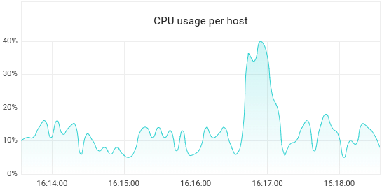
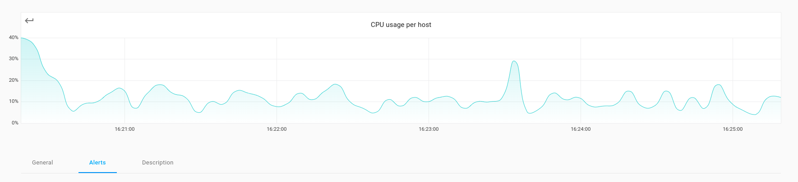
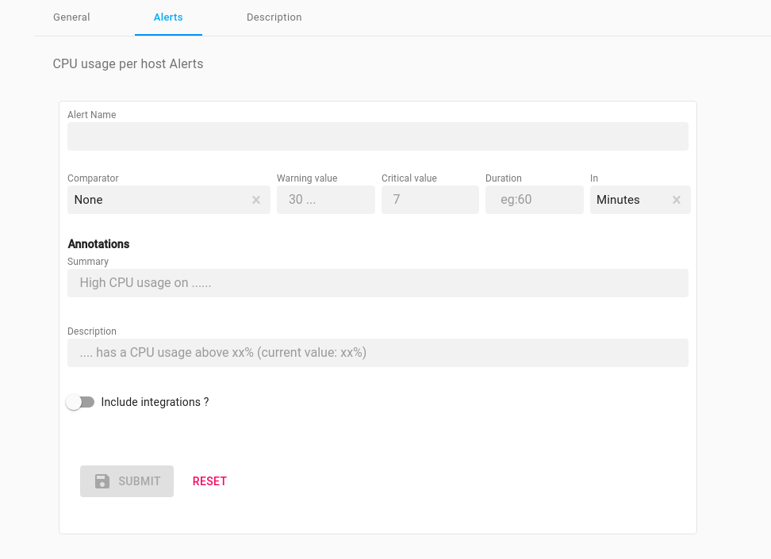
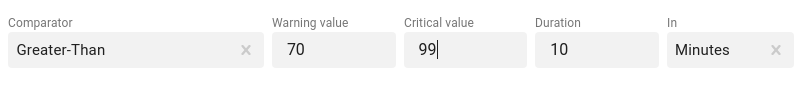
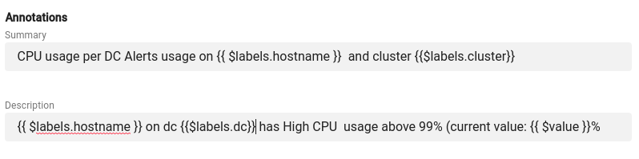
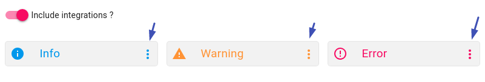

# Setup alert rules

<ol>

    <li>

        

            <h5> Insert Alert Rules credentials</h5>
            
On the Axonops application menu, click <code>Dashboards </code> and <code>select</code> required <strong>Dashboard</strong>.
                <code>eg. System</code>

            
<code>Hover over </code> the desired Chart <title></title> <code>click</code> on the 
                button.

            

                

            

        

    </li>
    <li>

        

            <h5> Complete the fields in form</h5>
            <ul>
                <li>
                    
 Below the chart <code>click</code> on the <code>alert</code> tab.

                </li>
                

                    

                

                <li>
                    
 A form will appear

                </li>
                

                    

                

                <li>
                    
 Complete Alert settings in <code>Comparator</code> <code>Warning value</code>or <code>Critical value</code>
                        or <strong>Both</strong>
                        and the <code>Duration</code> ==> (how often to check) <code>In</code>

                </li>
                

                    

                    

                

                <li>
                    
 <code>Annotations</code> 

                    
In the <code>Summary</code> box you can include <strong>free</strong> text &amp; type one <code>or</code>
                        many of the following <code>$labels</code>

                    

                        <pre>
                        $labels:
                            - cluster
                            - dc
                            - hostname
                            - org
                            - rack
                            - type
                            - keyspace
                        $value:
                          </pre>
                    

                    
In the <code>Description </code> box you can include <strong>free</strong> along with one <code>or</code>
                        many of the above <code>$labels</code> 

                    

                        
Example 

                        
<code>CPU usage per DC Alerts usage on {{ $labels.hostname }}  and cluster {{$labels.cluster}}  
                                    </code>

                    

                    

                        

                    

                </li>

                <li>
                    
Using the slider bar  you can
                        select any <a href="/integrations/overview">Integrations</a> 

                    
Then <code>click</code> on the <code>Info</code>, <code>Warning</code>, <code>Error</code>
                        icons, to select the group(s) of <a href="/integrations/overview">Integrations</a> for the
                        alert.

                    

                        

                        

                    

                    

                        
Not selecting integrations 

                        

                            If you do not select any specific <a href="/integrations/overview">Integrations</a> the
                            Alert will <strong>automatically</strong>
                            follow the <code>Global Dashboard Routing</code> <strong>or</strong> if this
                            has not been <a href="/how-to/setup-dashboards-global-integrations">setup</a> the <a href="/how-to/default-routing">Default
                                Routing </a>Integrations.
                        

                    

                </li>

            </ul>

        

    </li>
    <li>
        

            <h5> Edit - Delete and Aler rule</h5>
            <ul>
                <li>
                    
Edit <code>Alert Rule</code>

                    
On the Axonops application menu, click <code>Alerts &amp; Notifications </code> and <code>click</code>
                        Active.

                    

                    

                        <code>Select</code> the <code>Alert Rules</code> tab and click 
                    

                    

                        

                            

                        

                    

                </li>
                
To Delete An <code>Alert</code> <strong>Either...</strong> 

                <li>
                    
On the Axonops application menu, click <code>Dashboards </code> and <code>select</code> required
                        <strong>Dashboard</strong>.
                        <code>eg. System</code>

                    
<code>Hover over </code> the desired Chart <title></title> <code>click</code> on the 
                        button.

                    
 Below the chart <code>click</code> on the <code>alert</code> tab and <code>click</code> on the
                         of the alert rule you want to
                        remove.
                    

                </li>
                
<strong>Or...</strong> 

                <li>
                    
On the Axonops application menu, click <code>Alerts &amp; Notifications </code> and <code>click</code>
                        Active.

                    

                    

                        <code>Select</code> the <code>Alert Rules</code> tab and click 
                    

                    

                        

                            

                        

                    

                </li>
            </ul>
        

    </li>
</ol>