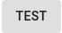
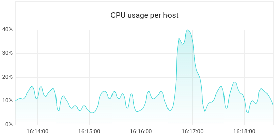
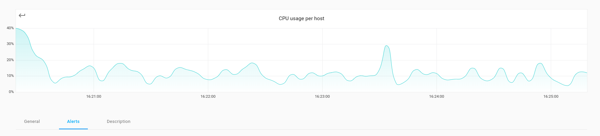
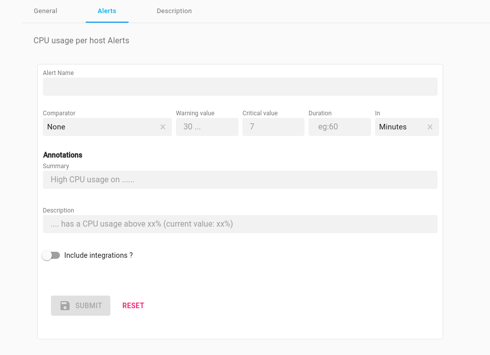
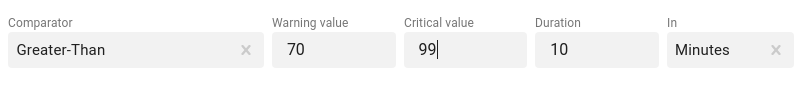
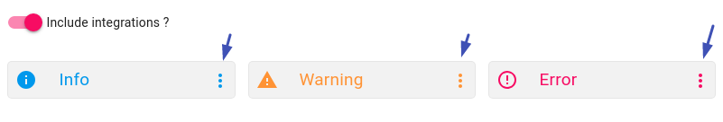
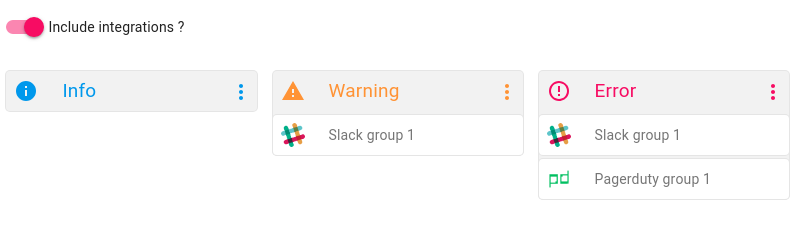
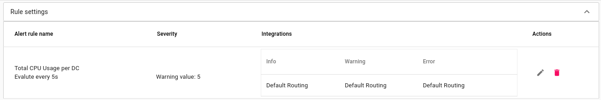
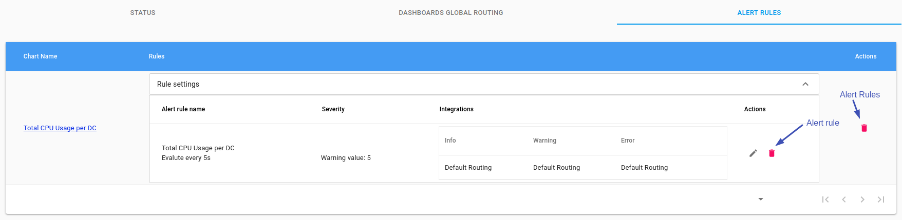

# Setup alert rules


###  Insert Alert Rules Credentials

On the Axonops application menu, click `Dashboards` and `select` required Dashboard. eg. `System`

`Hover over` the desired Chart `click` on the <span class="buttons"> [](../img/testb.png) </span> button.


!!! infomy 

    [](../img/createrule.gif)

###  Complete The Fields In Form

* Below the chart `click` on the `alert` tab.


!!! infomy 

    [](../img/alertform.png)


* A form will appear

!!! infomy 

    [](../img/alertformfields.png)


* Complete Alert settings in `Comparator Warning value` or `Critical value` or Both and the `Duration` ==> (how often to check) In

!!! infomy 

    [](../img/allertfields.png)


####  Annotations

In the `Summary` box you can include free text & type one `or` many of the following `$labels`


``` yaml

$labels:
   - cluster
   - dc
   - hostname
   - org
   - rack
   - type
   - keyspace
$value:

```

In the `Description` box you can include free along with one `or` many of the above  `$labels`

!!! info "Example"

    `CPU usage per DC Alerts usage on {{ $labels.hostname }} and cluster {{$labels.cluster}}`
    

!!! infomy

    
    [](../img/annotations.png)


####  Integrations


* Using the slider bar <span class="buttons"> [](../img/sliderbar.png) </span> you can select any [Integrations][1].

    Then `click` on the `Info`, `Warning`, `Error` icons, to select the group(s) of [Integrations][1] for the alert.

[1]: ../integrations/overview.md


!!! infomy

    [](../img/alertintegrations.png)
    [](../img/alertintegrationswith.png)

    
!!! info "Not selecting integrations"

    If you do not select any specific [Integrations][1] the Alert will automatically follow the `Global Dashboard Routing` or if this has not been setup the[ Default Routing][2] Integrations.


[2]: default-routing.md


### Edit Alert Rule

On the Axonops application menu, click `Alerts & Notifications` and `click` Active. `Select` the `Alert Rules` tab and click <span class="buttons"> [](../img/edit.png) </span>

!!! infomy

    [](../img/editalertrule.png)


### Delete Alert Rule(s)

To Delete An Alert Either...

* On the Axonops application menu, click `Dashboards` and `select` required Dashboard. `eg. System` `Hover over` the desired Chart click on the <span class="buttons"> [](../img/edit.png) </span> button. Below the chart `click` on the `alert` tab and `click` on the <span class="buttons"> [](../img/delbtn.png) </span> of the alert rule you want to remove.

OR...

* On the Axonops application menu, click `Alerts & Notifications` and `click` Active. `Select` the Alert Rules tab and click  <span class="buttons"> [](../img/delbtn.png) </span>


!!! infomy

  [](../img/activealertrules.png)
