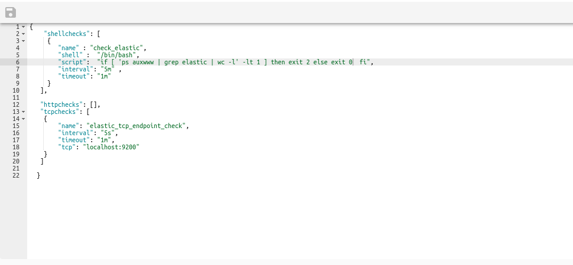

# Setup Healthcheks

<ol>

    <li>

        

            
On the Axonops application menu, click <code>Healthchecks</code> and <strong>select</strong>
                <code>Setup</code>tab.

            

                

            

        

    </li>
    <li>

        <h5>Add HealthCheck Services </h5>
        <ul>

            <li>
                
 <code>Create service(s)</code> 

                
 Below there few examples <code>copy</code> and <code>Paste</code> inside. and click <code>save</code>
                    

            </li>

            

                <pre> {
   "shellchecks": [
    {
        "name" : "check_cassandra_statusbinary",
        "shell" :  "/bin/bash",
        "script":  "/var/lib/cassandra_checks/check_cassandra_statusbinary.sh",
        "interval": "5m" ,
        "timeout": "1m" 
    }
  ],

  "httpchecks": [
    {
        "name" : "cassandra",
        "http" :  "http://localhost:9042",
        "tls_skip_verify":  true,
        "method": "GET" ,
        "interval": "10s" ,
        "timeout": "1m" 
    },
    {
        "name" : "cassandra",
        "http" :  "http://localhost:9916",
        "tls_skip_verify":  true,
        "method": "GET" ,
        "interval": "10s" ,
        "timeout": "1m" 
    }
  ],
  "tcpchecks": [
    {
        "name" : "tcp_cassandra",
        "tcp" :  "http://localhost:9042",
        "interval": "30s" ,
        "timeout": "1m" 
    },
    {
        "name" : "tcp_cassandra",
        "tcp" :  "http://localhost:9200",
        "interval": "5m" ,
        "timeout": "1m" 
    }
  ]
                          
 }
                        </pre>
            

            

                

            

            <li>
                
 <code>delete service(s)</code> 

                
 To Delete a service   <code>copy</code> and <code>Paste</code> inside. and click <code>save</code>
                    

            </li>
            

                    <pre> {
      "shellchecks": [],
      "httpchecks": [],
      "tcpchecks": []
                              
 }
                            </pre>
                

                

                        

                    

        </ul>

    </li>

</ol>