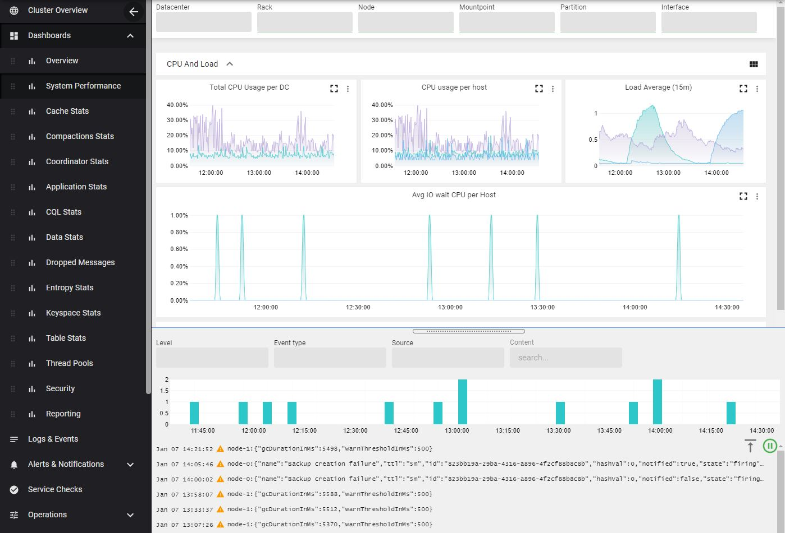
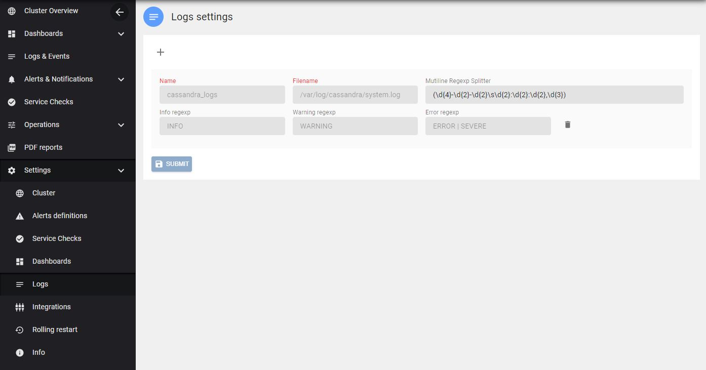

AxonOps dashboards provides a comprehensive set of charts with an embedded view for logs and events. The goal is to correlate metrics with logs/events as you can zoom in the logs histogram or metrics charts to drill down both results. 

Log and event view is located in the bottom part of that page that you can expand/collapse with the horizontal splitter.

The setup for log collection is accessible via ***Settings > logs***

!!! infomy 

**newlineregex** is used by the log collector to handle multilines logs. Default **newlineregex** for Cassandra should be ok unless you've customized it.
