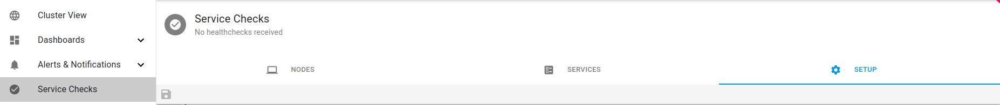
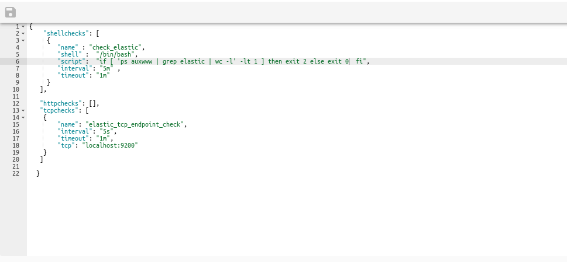

# Setup Service Checks


###  Add Service Checks

On the Axonops application menu, click `Service Checks` and select `Setup` tab.

!!! infomy 

    [](../img/servicecheckssetup.png)


####  Create Services

Below there few examples `copy` and `Paste` inside. and click `save` <span class="buttons"> [](../img/disk.png) </span>


``` jsonld
{
    "shellchecks": [
     {
        "name" : "check_elastic",
        "shell" :  "/bin/bash",
        "script":  "if [ 'ps auxwww | grep elastic | wc -l' -lt 1 ] then exit 2 else exit 0  fi",
        "interval": "5m" ,
        "timeout": "1m" 
     }
   ],
 
   "httpchecks": [],
   "tcpchecks": [
    {
        "name": "elastic_tcp_endpoint_check",
        "interval": "5s",
        "timeout": "1m",
        "tcp": "localhost:9200"
    }
   ]
 
}
               
```

Example:

!!! infomy

    
    [](../img/servicecheckseditor.png)


####  Delete Services

To Delete a service `copy` and `Paste` inside. and `click` save <span class="buttons"> [](../img/disk.png) </span>

``` jsonld
{
    "shellchecks": [],
    "httpchecks": [],
    "tcpchecks": []

}
               
```

Example:

!!! infomy

    
    [](../img/deleteservices.png)

