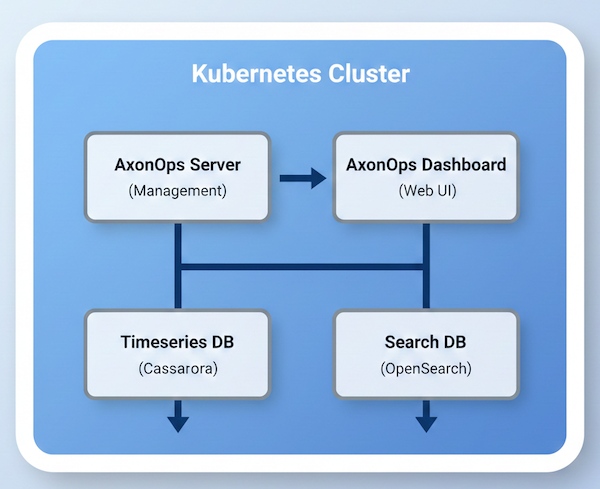

# Running AxonOps on Kubernetes

## Introduction

AxonOps provides comprehensive monitoring and management solutions for Apache Cassandra and Apache Kafka deployments running on Kubernetes. This section provides detailed guides for deploying AxonOps components and integrating them with your Kubernetes-based data infrastructure.

Whether you're running Cassandra for time-series metrics storage, Kafka clusters managed by Strimzi, or other data platforms, AxonOps seamlessly integrates with Kubernetes to provide:

- **Real-time monitoring** of cluster health and performance
- **Automated management** capabilities through the axon-agent
- **Centralized dashboards** for visualization and analysis
- **Native Kubernetes integration** using Helm charts and operators
- **Flexible storage options** including hostPath and persistent volume claims

## Deployment Guides

### [AxonOps Platform Deployment](axonops/index.md)

Complete guide for deploying the core AxonOps platform on Kubernetes, including:

- AxonOps Server - Core management server
- AxonOps Dashboard - Web UI for monitoring and management
- AxonOps Timeseries DB - Cassandra-based metrics storage
- AxonOps Search DB - OpenSearch-based log and event storage
- cert-manager integration for automatic TLS certificate management
- Configuration options for both local (hostPath) and shared storage

[View AxonOps deployment guide →](axonops/index.md)

### [Strimzi Kafka Cluster with AxonOps](strimzi/index.md)

Deploy a production-ready Kafka cluster using the Strimzi operator with integrated AxonOps monitoring:

- KRaft-based Kafka cluster (no ZooKeeper required)
- 3 Controller nodes + 3 Broker nodes architecture
- Local hostPath or shared storage configuration
- axon-agent integration for comprehensive monitoring
- Step-by-step configuration for node pools and persistent volumes

[View Strimzi deployment guide →](strimzi/index.md)

### [K8ssandra Cassandra Cluster with AxonOps](k8ssandra/index.md)

Deploy a production-ready Cassandra cluster using the K8ssandra operator with integrated AxonOps monitoring:

- Cassandra 5.0.6+ with pre-integrated axon-agent
- Multi-datacenter support for high availability
- Configurable resource allocation and JVM tuning
- Persistent storage with custom storage classes
- Automated backup and restore with Medusa integration
- Comprehensive monitoring through AxonOps

[View K8ssandra deployment guide →](k8ssandra/index.md)

## Prerequisites

Before deploying AxonOps on Kubernetes, ensure you have:

1. **Kubernetes cluster** (v1.23 or higher)
2. **kubectl** configured to access your cluster
3. **Helm 3** installed for package management
4. **Storage provisioner** or manual storage setup
5. **Network connectivity** between pods and services

## Architecture Overview

A typical AxonOps deployment on Kubernetes consists of:

- AxonOps Server
- AxonOps Dashboard
- AxonOps Search DB
- AxonOps Timeseries DB

## Getting Started

1. **[Deploy AxonOps Platform](axonops/index.md)** - Start by deploying the core AxonOps infrastructure including the server, dashboard, and backing databases.

2. **Deploy Monitored Services** - Once AxonOps is running, deploy your data platform clusters with integrated monitoring agents:
   - **[Strimzi Kafka Cluster](strimzi/index.md)** - Deploy a KRaft-based Kafka cluster with AxonOps monitoring
   - **[K8ssandra Cassandra Cluster](k8ssandra/index.md)** - Deploy a Cassandra cluster with AxonOps monitoring

3. **Configure and Monitor** - Access the AxonOps dashboard to visualize metrics, manage clusters, and configure alerts.
