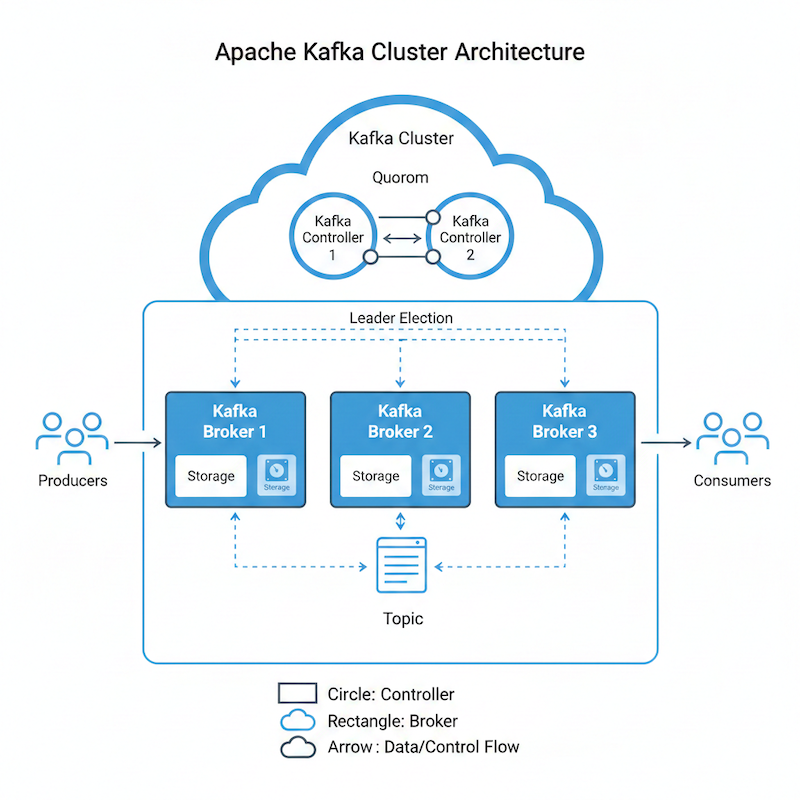

# Strimzi Kafka Cluster with Local Storage and AxonOps Agent

This section explains how to deploy a Strimzi Kafka cluster using local (hostPath) storage with AxonOps monitoring agent integration.

## Components

- **Strimzi** - Kafka operator for Kubernetes
- **cert-manager** (Recommended) - Automatic TLS certificate management

## Overview

This deployment creates a **KRaft-based Kafka cluster** (no ZooKeeper) with:

- 3 Controller nodes
- 3 Broker nodes
- Local hostPath storage
- AxonOps agent for monitoring and management

## Architecture



## Prerequisites

1. **Kubernetes cluster** (v1.23+)
2. **Strimzi Operator** installed in the cluster
3. **AxonOps Server** deployed and accessible
4. **kubectl** configured to access your cluster
5. **Storage directories** created on the target node(s)

## Step 1: Install Strimzi Operator

Install the operator:

```bash
helm repo add strimzi https://strimzi.io/charts
helm install strimzi-kafka-operator \
  strimzi/strimzi-kafka-operator \
  -n strimzi \
  --create-namespace \
  --version 0.49.1 \
  --set watchAnyNamespace=true
```

## Step 2: Setting up the storage

You will need to set up the storage for each of the brokers and controller. If you are using a shared storage such as EBS in AWS the configuration is simpler but if you don't have a storage CSI and you use hostPath you will need to follow the steps below.

Each broker and controller will need to be pinned to the Kubernetes Worker Node that contains its storage. This is required to prevent the pod from starting on a different node which would cause a data loss.

### Step 2.1: Storage Class

If you don't have one already, you should set up a storageClass that permits hostpath deployments. A good example is:

```yaml
apiVersion: storage.k8s.io/v1
kind: StorageClass
metadata:
  name: strimzi-hostpath-manual
provisioner: kubernetes.io/no-provisioner
volumeBindingMode: WaitForFirstConsumer
reclaimPolicy: Retain
```

Save this configuration to a file and apply it with:

```bash
kubectl apply -f sc.yaml
```

### Step 2.2: Broker and Controller Volumes

Now, set up the controller and broker volumes. You will want to create as many volumes as brokers and controllers you're planning to run. The template below shows the required settings. The result, if for example you wanted to set up three brokers and two controllers would be:

- `pv-my-cluster-broker-pool-0`, `pv-my-cluster-broker-pool-1`, `pv-my-cluster-broker-pool-2`
- `pv-my-cluster-controller-pool-0`, `pv-my-cluster-controller-pool-1`

The table below explains the variables you'll need to substitute.

| Variable | Meaning / What To Set | Example Value |
|----------|----------------------|---------------|
| `STRIMZI_CLUSTER_NAME` | Logical name of your Kafka cluster as used in Strimzi resources. Must match the `metadata.name` of your Kafka resource (e.g. `my-cluster`). | `my-cluster` |
| `STRIMZI_ROLE` (with default `broker`) | Role of the node pool this PV belongs to. Recommended values: `broker` or `controller` | `broker`, `controller` |
| `STRIMZI_BROKER_ID` | Numeric ID of the broker (or pool member) this volume is for. Should match the broker ID / index in the broker node pool (e.g. `0`, `1`, `2`). | `0` |
| `STRIMZI_BROKER_DISK_SIZE` (with default `5Gi`) | Size of the volume to advertise to Kubernetes/Strimzi. If unset, defaults to `5Gi`. Use a larger value for more disk. | `20Gi` |
| `STRIMZI_BROKER_NODE` | Kubernetes node hostname where this PV should be bound. Must match `kubernetes.io/hostname` label of the node that has the underlying `/data/strimzi/...` directory. | `k8s-node-1` |

```yaml
apiVersion: v1
kind: PersistentVolume
metadata:
  name: pv-${STRIMZI_CLUSTER_NAME}-${STRIMZI_ROLE}-pool-${STRIMZI_BROKER_ID}
  labels:
    strimzi.io/cluster: ${STRIMZI_CLUSTER_NAME}
    strimzi.io/pool: ${STRIMZI_ROLE}-pool
spec:
  capacity:
    storage: ${STRIMZI_BROKER_DISK_SIZE:-5Gi}
  accessModes:
    - ReadWriteOnce
  volumeMode: Filesystem
  persistentVolumeReclaimPolicy: Retain
  storageClassName: strimzi-hostpath-manual
  hostPath:
    path: /data/strimzi/${STRIMZI_CLUSTER_NAME}/broker-pool-${STRIMZI_BROKER_ID}
    type: Directory
  nodeAffinity:
    required:
      nodeSelectorTerms:
        - matchExpressions:
            - key: kubernetes.io/hostname
              operator: In
              values:
                - ${STRIMZI_BROKER_NODE}
```

## Step 3: Create Controller Node Pools

In Strimzi, **Node Pools** are a way to group and manage Kafka nodes (brokers or controllers) within a single Kafka cluster using different configurations. Instead of treating every node in the cluster as an identical twin, node pools allow you to define distinct sets of nodes with unique hardware, storage, or roles.

:::info
The section under `pod`, the topology constraint, can be removed if you are not using hostPath or have strict requirements to pin brokers or controllers to specific nodes.
:::

The example below creates the nodepool for the controllers.

| Variable | Meaning / What To Set | Example Value |
|----------|----------------------|---------------|
| `STRIMZI_CLUSTER_NAME` | Name of the Kafka cluster managed by Strimzi. Must match the `metadata.name` of your Kafka resource (e.g. in `strimzi-kafka-cluster.yaml`). | `my-cluster` |
| `STRIMZI_NAMESPACE` | Kubernetes namespace where the Strimzi Kafka cluster and node pools are deployed. | `kafka` |
| `STRIMZI_CONTROLLER_REPLICAS` | Number of controller replicas (KRaft controllers) in this node pool. Commonly 3 for quorum; can be 1 for dev. | `3` |
| `STRIMZI_CONTROLLER_STORAGE_SIZE` | Storage size for each controller's persistent volume claim. Must match or be compatible with the PVs you created. | `5Gi` |
| `AXON_AGENT_CLUSTER_NAME` | Display name for this Kafka cluster as it appears in AxonOps (logical ID for grouping metrics). | `my-kafka-cluster` |
| `AXON_AGENT_ORG` | Your AxonOps organization identifier (as configured in your AxonOps account). | `axonops` |
| `AXON_AGENT_TLS_MODE` | Whether the AxonOps agent uses TLS to connect to the AxonOps server. Typically `"false"` for plain TCP, `"true"` when TLS is enabled. | `false` |
| `AXON_AGENT_SERVER_PORT` | Port on which the AxonOps server listens for agent connections. Must match the `agents_port` in `axon-server.yml`. | `1888` |
| `AXON_AGENT_SERVER_HOST` | DNS name / address of the AxonOps server as reachable from the Kafka pods. Typically the Kubernetes service name. | `axon-server-agent.axonops.svc.cluster.local` |

```yaml
apiVersion: kafka.strimzi.io/v1beta2
kind: KafkaNodePool
metadata:
  name: ${STRIMZI_CLUSTER_NAME}-controller
  namespace: ${STRIMZI_NAMESPACE}
  labels:
    strimzi.io/cluster: ${STRIMZI_CLUSTER_NAME}
spec:
  replicas: ${STRIMZI_CONTROLLER_REPLICAS}
  roles: [controller]
  storage:
    type: jbod
    volumes:
      - id: 0
        type: persistent-claim
        size: ${STRIMZI_CONTROLLER_STORAGE_SIZE}
        deleteClaim: false
        kraftMetadata: shared
  template:
    kafkaContainer:
      env:
        - name: KAFKA_NODE_TYPE
          value: kraft-controller
        - name: AXON_AGENT_CLUSTER_NAME
          value: "${AXON_AGENT_CLUSTER_NAME}"
        - name: AXON_AGENT_ORG
          value: "${AXON_AGENT_ORG}"
        - name: AXON_AGENT_TLS_MODE
          value: "${AXON_AGENT_TLS_MODE}"
        - name: AXON_AGENT_SERVER_PORT
          value: "${AXON_AGENT_SERVER_PORT}"
        - name: AXON_AGENT_SERVER_HOST
          value: "${AXON_AGENT_SERVER_HOST}"
```

:::info
If you are using shared storage and you can permit the pods moving to different hosts, it is recommended to use a topology spread configuration to ensure that not all brokers are in the same k8s hosts.
:::

```yaml
template:
  pod:
    topologySpreadConstraints:
      - maxSkew: 1
        topologyKey: "kubernetes.io/hostname"
        whenUnsatisfiable: DoNotSchedule # Or "ScheduleAnyway" if you only have one node
        labelSelector:
          matchLabels:
            strimzi.io/cluster: ${STRIMZI_CLUSTER_NAME}
            strimzi.io/pool-name: ${STRIMZI_CLUSTER_NAME}-controller
```

## Step 4: Kafka Node Pools

This is very similar to the above controller pools. We only need to change the type:

```yaml
apiVersion: kafka.strimzi.io/v1beta2
kind: KafkaNodePool
metadata:
  name: broker-pool
  namespace: ${STRIMZI_NAMESPACE}
  labels:
    strimzi.io/cluster: ${STRIMZI_CLUSTER_NAME}
spec:
  replicas: ${STRIMZI_BROKER_REPLICAS}
  roles: [broker]
  storage:
    type: jbod
    volumes:
      - id: 0
        type: persistent-claim
        size: ${STRIMZI_BROKER_STORAGE_SIZE}
        deleteClaim: false
  template:
    kafkaContainer:
      env:
        - name: KAFKA_NODE_TYPE
          value: kraft-broker
        - name: AXON_AGENT_CLUSTER_NAME
          value: "${AXON_AGENT_CLUSTER_NAME}"
        - name: AXON_AGENT_ORG
          value: "${AXON_AGENT_ORG}"
        - name: AXON_AGENT_TLS_MODE
          value: "${AXON_AGENT_TLS_MODE}"
        - name: AXON_AGENT_SERVER_PORT
          value: "${AXON_AGENT_SERVER_PORT}"
        - name: AXON_AGENT_SERVER_HOST
          value: "${AXON_AGENT_SERVER_HOST}"
```

## Step 5: Create Storage Directories (on target node)

SSH to the target node and create the storage directories:

```bash
# Create directories for controllers
sudo mkdir -p /data/strimzi/my-cluster/controller-{0,1,2}

# Create directories for brokers
sudo mkdir -p /data/strimzi/my-cluster/broker-{0,1,2}
sudo mkdir -p /data/strimzi/my-cluster/broker-pool-{0,1,2}

# Set appropriate permissions
sudo chown -R 1001:0 /data/strimzi
sudo chmod -R 755 /data/strimzi
```

## Step 6: RBAC

Some versions of Strimzi require RBAC configuration. It is recommended you apply this config also:

```yaml
apiVersion: rbac.authorization.k8s.io/v1
kind: ClusterRoleBinding
metadata:
  name: ${STRIMZI_CLUSTER_NAME}-kafka-broker-binding
  labels:
    strimzi.io/cluster: ${STRIMZI_CLUSTER_NAME}
roleRef:
  apiGroup: rbac.authorization.k8s.io
  kind: ClusterRole
  name: strimzi-kafka-broker
subjects:
  - kind: ServiceAccount
    name: ${STRIMZI_CLUSTER_NAME}-kafka
    namespace: ${STRIMZI_NAMESPACE}
```

## Step 7: Cluster

Finally, the cluster configuration. Ensure you have the right values before applying the configuration:

| Variable | Meaning / What To Set | Example Value |
|----------|----------------------|---------------|
| `STRIMZI_CLUSTER_NAME` | Name of the Kafka cluster managed by Strimzi. Must match the `metadata.name` of your Kafka resource (e.g. in `strimzi-kafka-cluster.yaml`). | `my-cluster` |
| `STRIMZI_NAMESPACE` | Kubernetes namespace where the Strimzi Kafka cluster and node pools are deployed. | `kafka` |

```yaml
apiVersion: kafka.strimzi.io/v1beta2
kind: Kafka
metadata:
  name: ${STRIMZI_CLUSTER_NAME}
  namespace: ${STRIMZI_NAMESPACE}
  annotations:
    strimzi.io/node-pools: enabled
    strimzi.io/kraft: enabled
spec:
  kafka:
    version: 4.1.1
    image: ghcr.io/axonops/development/strimzi:0.49.1-4.1.1-2.0.12
    listeners:
      - name: plain
        port: 9092
        type: internal
        tls: false
      - name: tls
        port: 9093
        type: internal
        tls: true
    config:
      offsets.topic.replication.factor: 1
      transaction.state.log.replication.factor: 1
      transaction.state.log.min.isr: 1
      default.replication.factor: 1
      min.insync.replicas: 1
    jvmOptions:
      javaSystemProperties:
        - name: kafka.logs.dir
          value: /var/log/kafka
    logging:
      type: inline
      loggers:
        rootLogger.level: "INFO"
        rootLogger.appenderRefs: "file"
        rootLogger.appenderRef.file.ref: "FILE"

        appender.file.type: "RollingFile"
        appender.file.name: "FILE"
        appender.file.fileName: "${sys:kafka.logs.dir}/server.log"
        appender.file.filePattern: "${sys:kafka.logs.dir}/server.log.%i"
        appender.file.layout.type: "PatternLayout"
        appender.file.layout.pattern: "[%d] %p %m (%c)%n"
        appender.file.policies.type: "Policies"
        appender.file.policies.size.type: "SizeBasedTriggeringPolicy"
        appender.file.policies.size.size: "10MB"
        appender.file.strategy.type: "DefaultRolloverStrategy"
        appender.file.strategy.max: "5"

        logger.netty.name: "axonops.io.netty"
        logger.netty.level: "ERROR"
  entityOperator:
    topicOperator: {}
    userOperator: {}
```

## Step 8: Deploy Resources

Apply the resources in order:

```bash
# 1. Create the namespace (if not exists)
kubectl create namespace kafka

# 2. Create StorageClass
kubectl apply -f strimzi-storageclass.yaml

# 3. Create PersistentVolumes
kubectl apply -f strimzi-controller-volumes.yaml
kubectl apply -f strimzi-broker-volumes.yaml

# 4. Create RBAC
kubectl apply -f strimzi-kafka-rbac.yaml

# 5. Create Node Pools
kubectl apply -f strimzi-controller-pools.yaml
kubectl apply -f strimzi-broker-pools.yaml

# 6. Create Kafka Cluster
kubectl apply -f strimzi-kafka-cluster.yaml
```

Or apply all at once:

```bash
kubectl apply -f strimzi-storageclass.yaml \
              -f strimzi-controller-volumes.yaml \
              -f strimzi-broker-volumes.yaml \
              -f strimzi-kafka-rbac.yaml \
              -f strimzi-node-pools.yaml \
              -f strimzi-kafka-cluster.yaml
```

## Verification

### Check Cluster Status

```bash
# Watch Kafka cluster status
kubectl get kafka -n kafka -w

# Check all pods
kubectl get pods -n kafka

# Check PersistentVolumeClaims
kubectl get pvc -n kafka

# Check PersistentVolumes
kubectl get pv | grep strimzi
```

### Expected Output

When fully deployed, you should see:

```
NAME         DESIRED KAFKA REPLICAS   DESIRED ZK REPLICAS   READY   METADATA STATE
my-cluster                                                  True    KRaft
```

Pods:

```
NAME                                      READY   STATUS
my-cluster-controller-0                   1/1     Running
my-cluster-controller-1                   1/1     Running
my-cluster-controller-2                   1/1     Running
my-cluster-broker-pool-0                  1/1     Running
my-cluster-broker-pool-1                  1/1     Running
my-cluster-broker-pool-2                  1/1     Running
my-cluster-entity-operator-xxxxxxxxx-xxxxx 2/2     Running
```

### Verify AxonOps Connection

Check the Kafka container logs for AxonOps agent connection:

```bash
kubectl logs my-cluster-broker-pool-0 -n kafka -c kafka | grep -i axon
```

## Cluster Configuration Details

### Kafka Settings

| Setting | Value | Description |
|---------|-------|-------------|
| Kafka Version | 4.1.1 | Apache Kafka version |
| Mode | KRaft | No ZooKeeper required |
| Controllers | 3 | Quorum controller replicas |
| Brokers | 3 | Kafka broker replicas |
| Storage | 5Gi per node | Local hostPath storage |

### Listeners

| Name | Port | Type | TLS |
|------|------|------|-----|
| plain | 9092 | internal | No |
| tls | 9093 | internal | Yes |

### Kafka Configuration

```yaml
offsets.topic.replication.factor: 1
transaction.state.log.replication.factor: 1
transaction.state.log.min.isr: 1
default.replication.factor: 1
min.insync.replicas: 1
```

:::warning
These replication settings are suitable for development/testing. For production, increase replication factors to at least 3.
:::

## Troubleshooting

### Pods Stuck in Pending

Check if PersistentVolumeClaims are bound:

```bash
kubectl get pvc -n kafka
kubectl describe pvc <pvc-name> -n kafka
```

Verify PersistentVolumes are available:

```bash
kubectl get pv | grep strimzi
```

Common issues:

- Node hostname mismatch in PV node affinity
- Storage directories not created on the target node
- StorageClass not created

### AxonOps Agent Not Connecting

1. Verify AxonOps server is accessible:

```bash
kubectl run test-connection --rm -it --image=busybox -- \
  nc -zv axon-server-agent.axonops.svc.cluster.local 1888
```

2. Check environment variables are set correctly:

```bash
kubectl exec -n kafka my-cluster-broker-pool-0 -c kafka -- env | grep AXON
```

3. Check Kafka logs for agent errors:

```bash
kubectl logs -n kafka my-cluster-broker-pool-0 -c kafka | grep -i axon
```

### Storage Permission Issues

If pods fail with permission errors:

```bash
# On the target node
sudo chown -R 1001:0 /data/strimzi
sudo chmod -R 755 /data/strimzi
```

## Cleanup

To remove the entire deployment:

```bash
# Delete Kafka resources
kubectl delete kafka my-cluster -n kafka
kubectl delete kafkanodepool my-cluster-controller broker-pool -n kafka

# Delete RBAC
kubectl delete -f strimzi-kafka-rbac.yaml

# Delete PersistentVolumes (data will be retained)
kubectl delete -f strimzi-broker-volumes.yaml
kubectl delete -f strimzi-controller-volumes.yaml

# Delete StorageClass
kubectl delete -f strimzi-storageclass.yaml

# Optionally delete the namespace
kubectl delete namespace kafka
```
