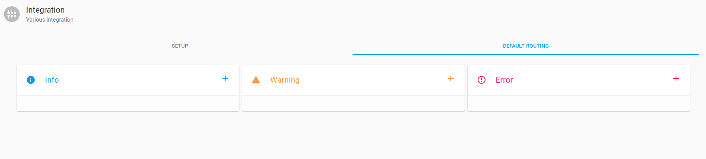
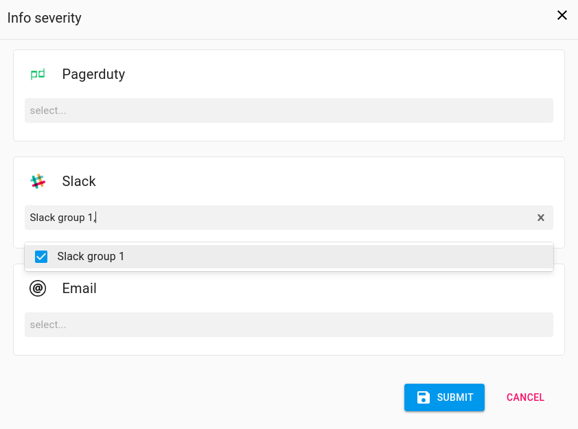
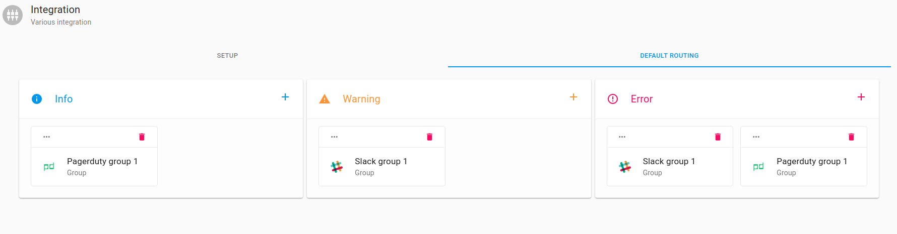

# Setup Default Routing

    
Deafult Routing.

    
Allows you to set up the channels though which alerts &amp; notifications will be received and the specific
        groups that will receive the alerts
        &amp; notifications 

<ol>

    <li>

        

            
On the Axonops application menu, select <code>Alert & Notifications -> Integration </code> and <strong>select</strong>
                <code>Default Routing</code>tab.

            <ul>
                <li>
                    3 Alert &amp; Notification types can be set up
                    
Info
                        Warning
                        Error

                </li>
            </ul>
            

                

            

        

    </li>
    <li id="step1">

        

            <h5>To <strong>setup</strong><strong> Default routing</strong> for info
                <code>click</code> on 
            </h5>
            <ul>
                <li>
                    
Select the desired group(s) from the dropdown menu for the desired integrations(s)

                </li>

                

                    

                

                <li>
                    
 Click 
                        to confirm selections
                    

                    

                        The group should now appear in the 
                        Info box on the <code>Default Routing Tab</code>
                    

                </li>
                <li>
                    Repeat these <a href="#step1">steps</a> to setup the <code>Default Routing </code> for
                     Warning and  Error.

                    

                        

                    

                </li>

                <li>
                    
To Edit <code>Default Routing</code> click on the 
                        
                        icon on either    
                         
                          
                         <code>Add</code> or <code>Remove</code> existing integrations
                         using the <code>dropdown</code> menus.
                    

                  
                </li>
               

                <li>
                    
To Remove a <code>group</code> <code>click</code> on the <code>Delete</code> icon 
                    
                    

                    

                            

                        

                </li>
               
            </ul>

        

    </li>
    </ul>