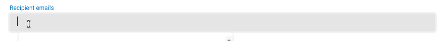
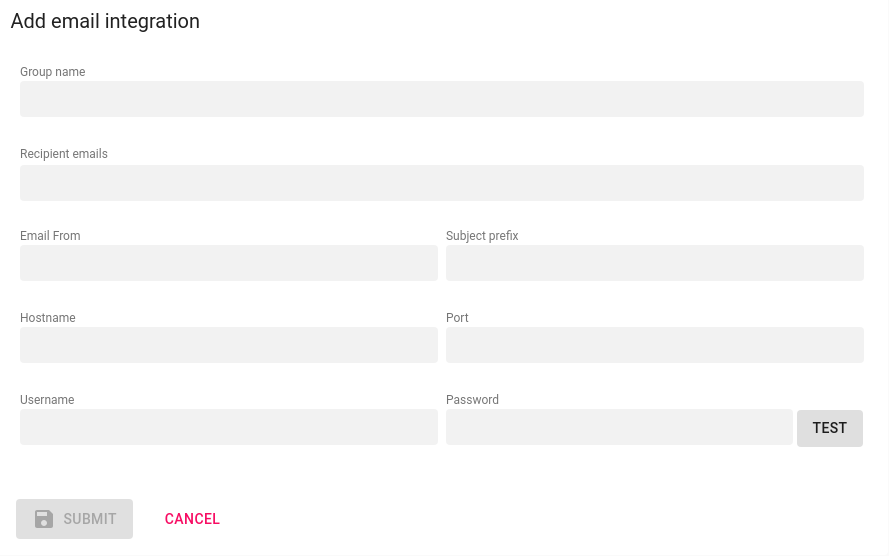
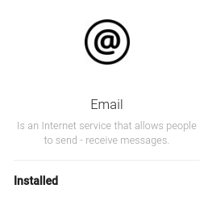
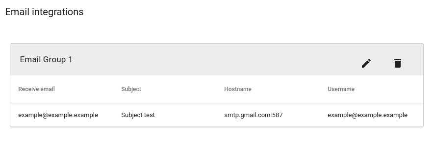
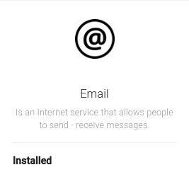

# Setup Email

<ol>

    <li>

        

            <h5> Insert Email credentials</h5>
            
On the Axonops application menu, select <code>Alert & Notifications -> Integration </code>.

            
On the <code>Setup</code> menu, move the cusror over the email icon and <code>click</code> on the <code>Add</code>
                symbol

            

                

            

        

    </li>
    <li>

        

            <h5> Complete the fields in the pop-up form</h5>
            <ul>
                <li>
                    
 Enter the <code>form fields</code> and <code>click</code> 

                </li>
                

                    
Inserting recipient emails

                    
To enter a recipient email, enter the email address followed by either:

                    <ol>
                        <li>
                            
<strong><code>Space</code></strong> : <code>␣</code>. (recommended)

                        </li>
                        <li>
                            
<strong><code>Enter</code> </strong>: <code>"↵"</code>.

                            

                        </li>
                    </ol>
                

                

                    

                

                <li>
                    
 Click 
                        and close the pop-up form, should now read <code>Installed</code>. 

                </li>
                

                    

                    

                

                <li>
                    
To Edit <code>email</code> click on
                    

                    
To Delete <code>email</code> click on 
                    

                </li>
                

                    

                

                <li>
                    
To Remove Emails <code>groups</code> move the cusror over the
                        email icon <code>click</code> on the <code>Delete</code> symbol and <code>Confirm</code>

                </li>
                

                    

                

            </ul>

        

    </li>
    </ul>