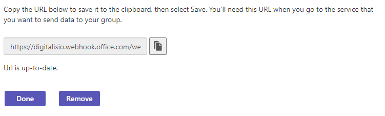
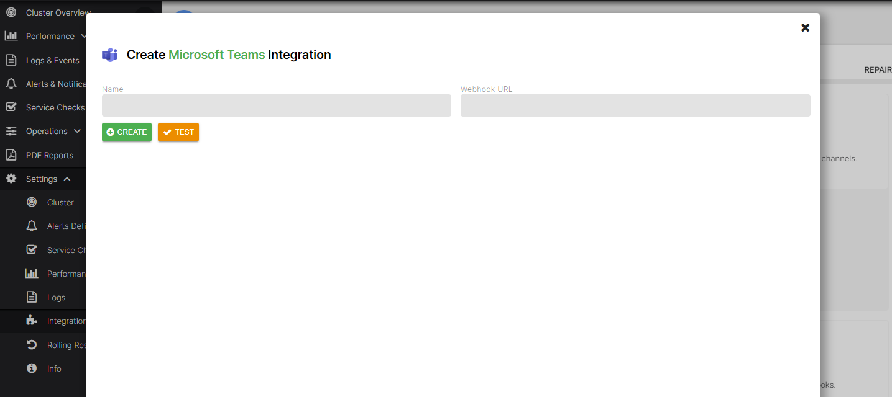

# Set up Microsoft Teams Integration

## Create Microsoft Teams Webhook

On the Microsoft Teams interface, go to `Connectors`.

`Configure` the `Incoming Webhook` connector.

Provide a name and select `Create`.

Copy the URL provided to the clipboard.

## Create the Microsoft Teams Integration on axon-server

On the AxonOps application menu, select `Settings -> Integrations`.

Click on the `Microsoft Teams` area.

Enter a `name`, paste the URL in the `Webhook URL` field, and select `Create`.

