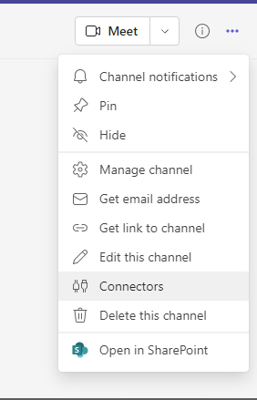
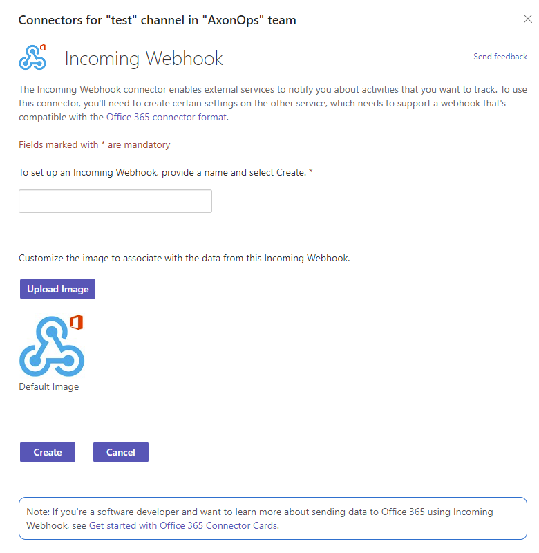

# Setup Microsoft Teams notifications

###  Create Microsoft Teams Webhooks

* On the Microsoft Teams interface, go to `Connectors`
<kbd>

</kbd>

* Click on configure on the `Incoming Webhook` connector
<kbd>

</kbd>

* Provide a name and select `Create`
<kbd>

</kbd>

* Copy the url provided to the clipboard
<kbd>

</kbd>

* On the Axonops application menu, select `Settings -> Integrations`
*  `Click` on the `Microsoft Teams` area.

* Enter a `name` and copy the url in the `Webhook URL` field and select `Create`

