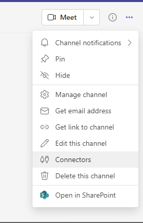
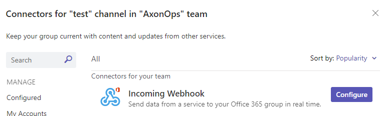
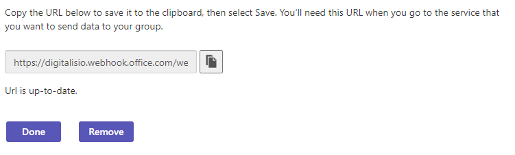
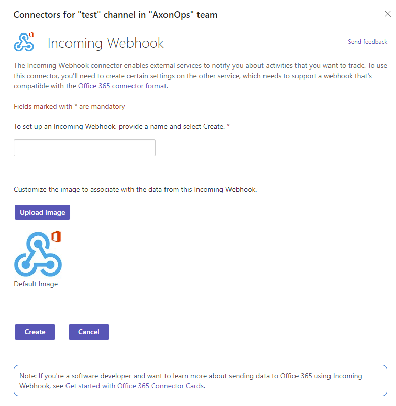
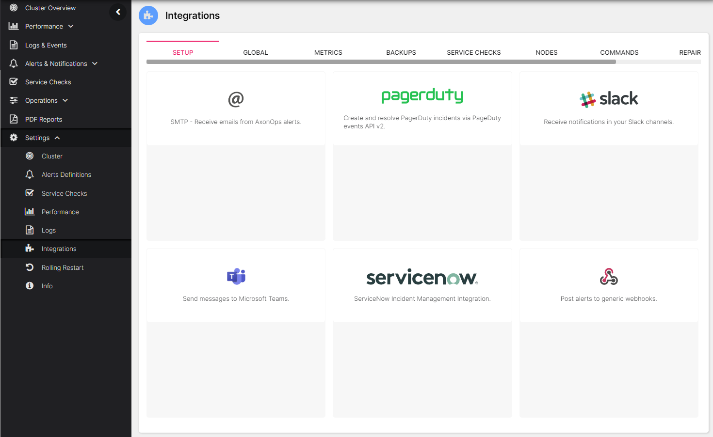
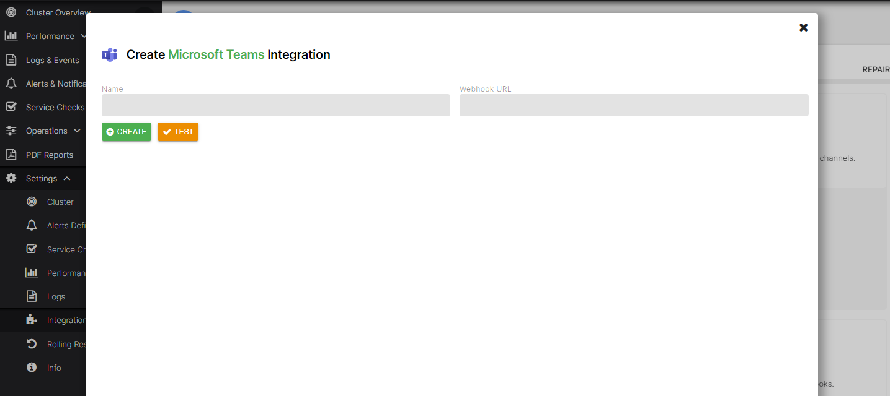

# Setup Microsoft Teams Integration

## Create Microsoft Teams Webhook

###  Create Microsoft Teams Webhooks

* Click on configure on the `Incoming Webhook` connector
<kbd>

</kbd>

* Copy the url provided to the clipboard
<kbd>

</kbd>

* Enter a `name` and copy the url in the `Webhook URL` field and select `Create`

