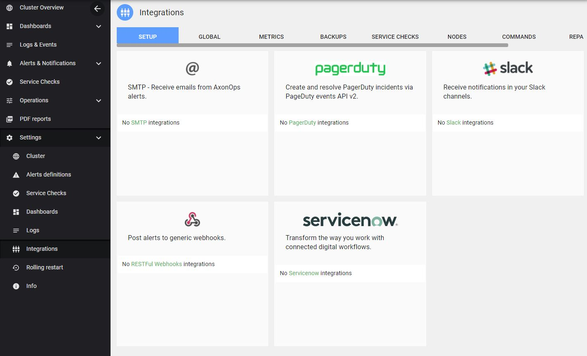
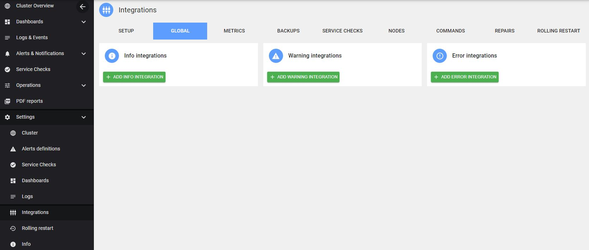

AxonOps provide various integrations for the notifications.

The functionality is accessible via ***Settings > Integrations***

The current integrations are:

* SMTP
* Pagerduty
* Slack
* ServiceNow
* Generic webhooks

!!! infomy 

    

###  Routing
AxonOps provide a rich routing mechanism for the notifications.

The current routing options are:

* Global - this will route all the notifications
* Metrics - notifications about the alerts on metrics
* Backups - notifications about the backups / restore
* Service Checks - notifications about the service checks / healthchecks
* Nodes - notifications raised from the nodes
* Commands - notifications from generic tasks
* Repairs - notifications from Cassandra repairs
* Rolling Restart - notification from the rolling restart feature

Each severity (`info, warning, error`) can be routed independently 

   

    

